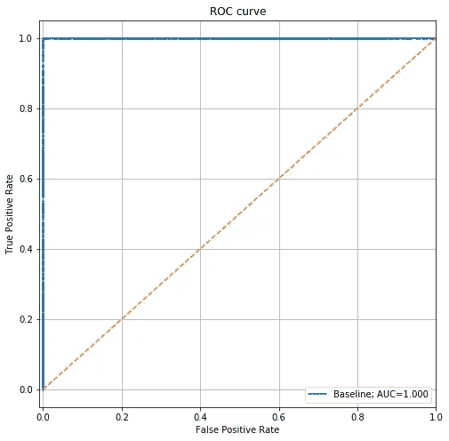
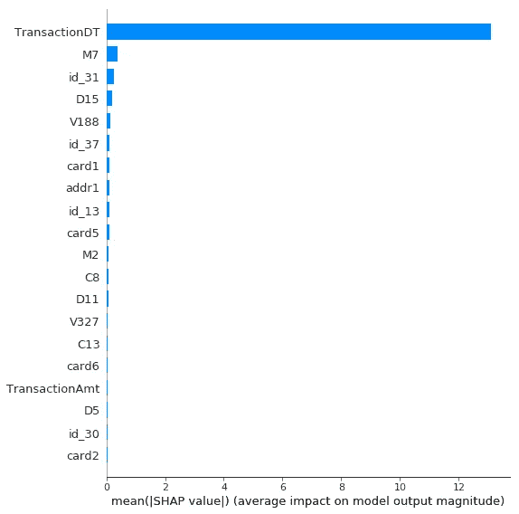
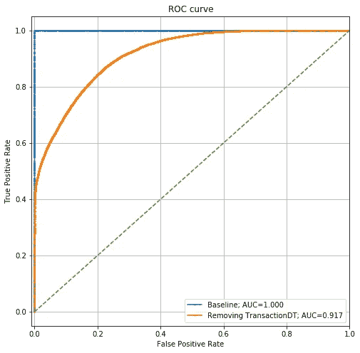
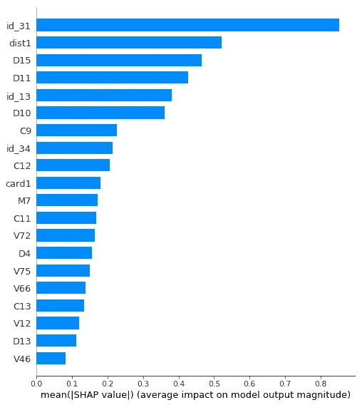
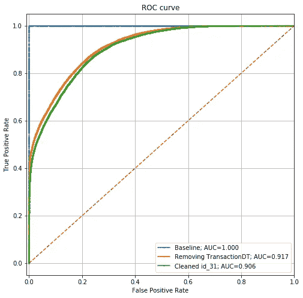

# 对抗验证

> 原文：<https://towardsdatascience.com/adversarial-validation-ca69303543cd?source=collection_archive---------31----------------------->

## 过度拟合的诊断工具


*想和其他学习 ML 的人聊天？加入我们的* [*新 ML 不和谐服务器*](http://discord.gg/xh2chKX) *！*

*本帖原载于*[*blog.zakjost.com*](https://blog.zakjost.com/post/adversarial_validation/)*。去那里可以更好地呈现内联代码。*

# 介绍

如果你在 Kaggle 上研究一些竞争获胜的解决方案，你可能会注意到提到“对抗性验证”([就像这个](https://www.kaggle.com/c/ieee-fraud-detection/discussion/111284))。这是什么？

简而言之，我们构建一个分类器来尝试预测哪些数据行来自训练集，哪些来自测试集。如果两个数据集来自同一个分布，这应该是不可能的。但是，如果在你的训练和测试数据集的特征值中存在系统差异，那么分类器将能够成功地学会区分它们。你能学会区分它们的模型越好，你的问题就越大。

但好消息是，你可以分析学习过的模型来帮助你诊断问题。一旦你理解了问题，你就可以着手解决它。

这篇文章是为了配合我制作的一个 YouTube 视频来解释对抗性验证的直觉。这篇博文介绍了本视频中示例的代码实现，但是足够完整，可以自成一体。你可以在 github 上找到这篇文章的完整代码。

# 学习对抗性验证模型

首先，用一些样板导入语句来避免混淆:

```
import pandas as pd
from catboost import Pool, CatBoostClassifier
```

# 数据准备

对于本教程，我们将使用来自 Kaggle 的 [IEEE-CIS 信用卡欺诈检测数据集](https://www.kaggle.com/c/ieee-fraud-detection/data)。首先，我假设您已经将训练和测试数据加载到 pandas DataFrames 中，并分别将其命名为`df_train`和`df_test`。然后，我们将通过替换丢失的值来进行一些基本的清理。

```
# Replace missing categoricals with "<UNK>"
df_train.loc[:,cat_cols] = df_train[cat_cols].fillna('<UNK>')
df_test.loc[:,cat_cols] = df_test[cat_cols].fillna('<UNK>')

# Replace missing numeric with -999
df_train = df_train.fillna(-999)
df_test = df_test.fillna(-999)
```

对于对抗性验证，我们希望学习一个模型来预测哪些行在训练数据集中，哪些行在测试集中。因此，我们创建一个新的目标列，其中测试样本用`1`标记，训练样本用`0`标记，如下所示:

```
df_train['dataset_label'] = 0
df_test['dataset_label'] = 1
target = 'dataset_label'
```

这是我们将训练一个模型来预测的目标。现在，训练和测试数据集是分开的，每个数据集只有一个目标值标签。如果我们在*这个*训练集上训练一个模型，它会知道一切都是 0。相反，我们希望重组训练和测试数据集，然后创建新的数据集来拟合和评估对抗性验证模型。我定义了一个用于组合、洗牌和重新分割的函数:

```
def create_adversarial_data(df_train, df_test, cols, N_val=50000):
    df_master = pd.concat([df_train[cols], df_test[cols]], axis=0)
    adversarial_val = df_master.sample(N_val, replace=False)
    adversarial_train = df_master[
        ~df_master.index.isin(adversarial_val.index)
    ]
    return adversarial_train, adversarial_val

features = cat_cols + numeric_cols + ['TransactionDT']
all_cols = features + [target]
adversarial_train, adversarial_test = create_adversarial_data(df_train, df_test, all_cols)
```

新数据集`adversarial_train`和`adversarial_test`，包括原始训练集和测试集的混合，目标表示原始数据集。*注:我在特性列表中添加了* `*TransactionDT*` *。其原因将变得显而易见。*

对于建模，我将使用 Catboost。我通过将数据帧放入 Catboost 池对象来完成数据准备。

```
train_data = Pool(
    data=adversarial_train[features],
    label=adversarial_train[target],
    cat_features=cat_cols
)
holdout_data = Pool(
    data=adversarial_test[features],
    label=adversarial_test[target],
    cat_features=cat_cols
)
```

# 建模

这一部分很简单:我们只需实例化一个 Catboost 分类器，并将其应用于我们的数据:

```
params = {
    'iterations': 100,
    'eval_metric': 'AUC',
    'od_type': 'Iter',
    'od_wait': 50,
}

model = CatBoostClassifier(**params)
_ = model.fit(train_data, eval_set=holdout_data)
```

让我们继续在维持数据集上绘制 ROC 曲线:



这是一个完美的模型，这意味着有一个明确的方法来判断任何给定的记录是在训练集还是测试集中。这违反了我们的训练集和测试集是同分布的假设。

# 诊断问题和迭代

为了理解该模型是如何做到这一点的，让我们来看看最重要的特性:



TransactionDT 是最重要的特性。考虑到原始的训练和测试数据集来自不同的时间段(测试集出现在训练集的未来)，这是完全有意义的。该模型刚刚了解到，如果 TransactionDT 大于上一个训练样本，则它在测试集中。

我包含 TransactionDT 只是为了说明这一点——通常不建议将原始日期作为模型特征。但是好消息是这项技术以如此戏剧性的方式找到了它。这种分析将清楚地帮助您识别这样的错误。

让我们排除 TransactionDT，再次运行这个分析。

```
params2 = dict(params)
params2.update({"ignored_features": ['TransactionDT']})
model2 = CatBoostClassifier(**params2)
_ = model2.fit(train_data, eval_set=holdout_data)
```

现在 ROC 曲线看起来像这样:



它仍然是一个相当强的模型，AUC > 0.91，但比以前弱了很多。让我们来看看该模型的功能重要性:



现在，`id_31`是最重要的特性。让我们看一些价值观来理解它是什么。

```
[
    '<UNK>', 'samsung browser 6.2', 'mobile safari 11.0',
    'chrome 62.0', 'chrome 62.0 for android', 'edge 15.0',
    'mobile safari generic', 'chrome 49.0', 'chrome 61.0',
]
```

该列包含软件版本号。显然，这在概念上类似于包含原始日期，因为特定软件版本的第一次出现将对应于其发布日期。

让我们通过从列中删除任何不是字母的字符来解决这个问题:

```
def remove_numbers(df_train, df_test, feature):
    df_train.loc[:, feature] = df_train[feature].str.replace(
        r'[^A-Za-z]', '', regex=True
    ) df_test.loc[:, feature] = df_test[feature].str.replace(
        r'[^A-Za-z]', '', regex=True
    )

remove_numbers(df_train, df_test, 'id_31')
```

现在，我们列的值如下所示:

```
[
    'UNK', 'samsungbrowser', 'mobilesafari',
    'chrome', 'chromeforandroid', 'edge',
    'mobilesafarigeneric', 'safarigeneric',
]
```

让我们使用这个清理后的列来训练一个新的对抗性验证模型:

```
adversarial_train_scrub, adversarial_test_scrub = create_adversarial_data(
    df_train,
    df_test,
    all_cols,
)

train_data_scrub = Pool(
    data=adversarial_train_scrub[features],
    label=adversarial_train_scrub[target],
    cat_features=cat_colsc
)

holdout_data_scrub = Pool(
    data=adversarial_test_scrub[features],
    label=adversarial_test_scrub[target],
    cat_features=cat_colsc
)

model_scrub = CatBoostClassifier(**params2)
_ = model_scrub.fit(train_data_scrub, eval_set=holdout_data_scrub)
```

ROC 图现在看起来像这样:



业绩从 0.917 的 AUC 下降到 0.906。这意味着我们已经使模型更难区分我们的训练和测试数据集，但它仍然非常有能力。

# 结论

当我们天真地将交易日期放入特性集时，对抗性的验证过程有助于清楚地诊断问题。额外的迭代给了我们更多的线索，即包含软件版本信息的列在训练集和测试集之间有明显的差异。

但是流程不能做的是告诉我们如何修复它。我们仍然需要在这里运用我们的创造力。在本例中，我们只是从软件版本信息中删除了所有数字，但这丢弃了潜在的有用信息，并可能最终损害我们的欺诈建模任务，而这正是我们的真正目标。这个想法是*你想删除对预测欺诈不重要的信息，但对分离你的训练和测试集很重要*。

更好的方法可能是找到一个数据集，给出每个软件版本的软件发布日期，然后创建一个“自发布以来的天数”列来替换原始版本号。这可能有助于更好地匹配训练和测试分布，同时还保持软件版本信息编码的预测能力。

# 资源

*   第一名卡格尔解决方案[报道](https://www.kaggle.com/c/ieee-fraud-detection/discussion/111284)
*   对抗验证 [YouTube 视频](https://youtu.be/7cUCDRaIZ7I)
*   GitHub 上的[示例代码](https://github.com/zjost/blog_code/tree/master/adversarial_validation)

*别忘了加入我们的* [*新 ML 不和谐服务器*](http://discord.gg/xh2chKX) *！*

*原载于 https://blog.zakjost.com*[](https://blog.zakjost.com/post/adversarial_validation/)**。**