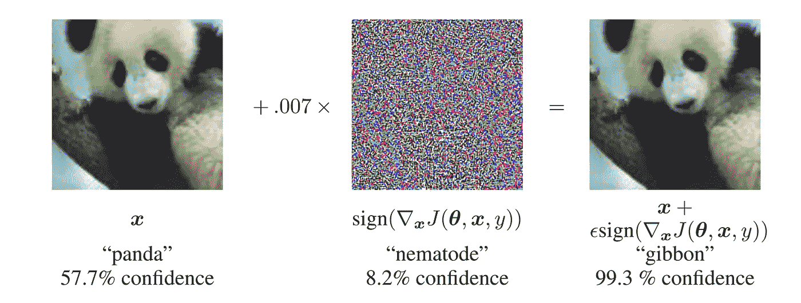
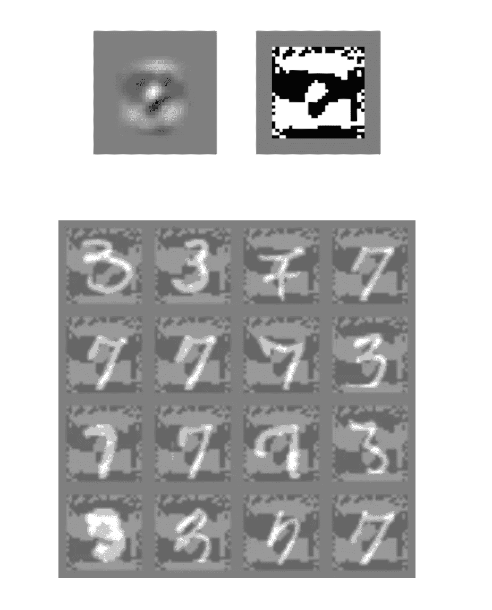
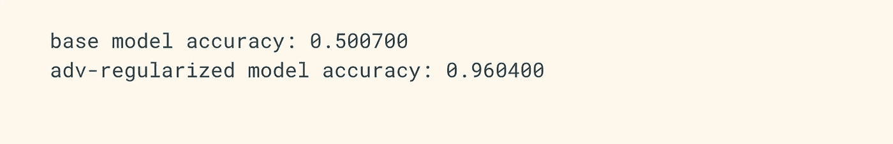
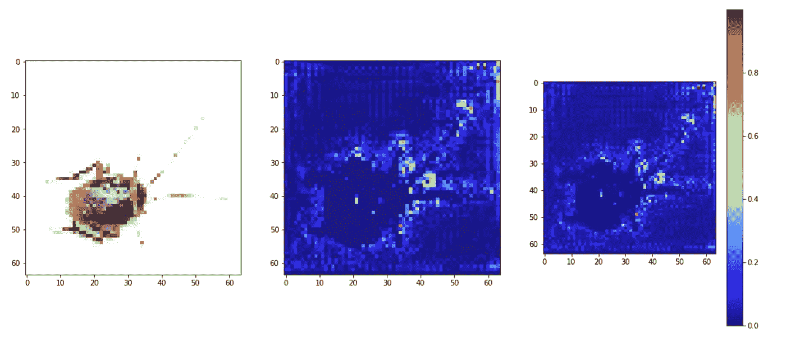
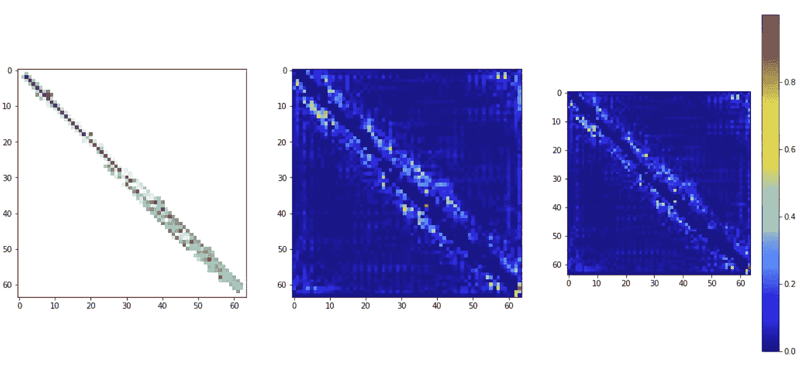
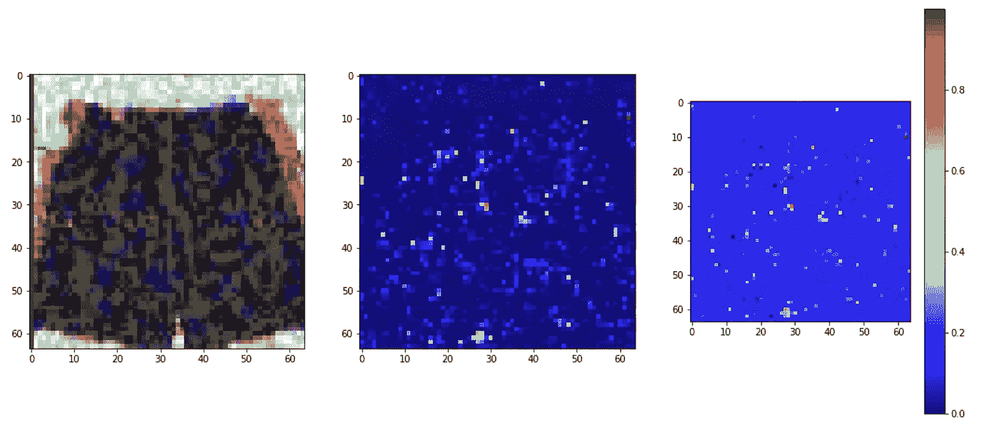
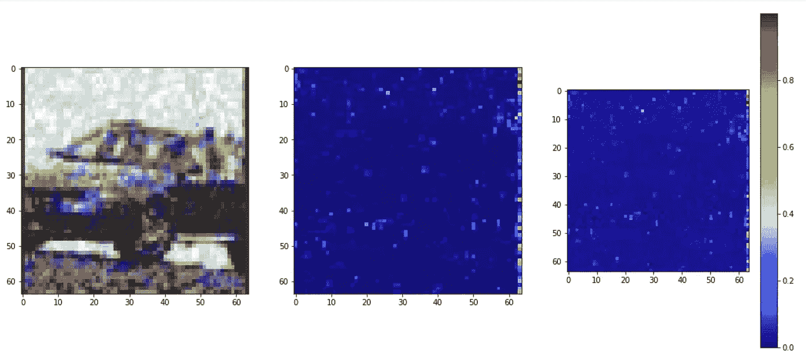

# 用于一般化真实世界应用的对抗训练分类器

> 原文：<https://towardsdatascience.com/adversarially-trained-classifiers-for-generalizable-real-world-applications-92dbcb24f7f3?source=collection_archive---------50----------------------->

*   合著者: [**丹尼尔·申**](https://medium.com/@danielshin_57049)**[**凯文·林立雯**](https://github.com/klinime)**

****

**凯文·Ku 在 [Unsplash](https://unsplash.com?utm_source=medium&utm_medium=referral) 上拍摄的照片**

# **动机:可推广人工智能的目的**

**计算机视觉领域不断要求提高分类器的准确性。各地的研究人员都试图在某个特定的数据集上以微小的差距打破之前的基准。我们认为这一趋势对于推动人类理解的边缘非常重要，但我们也认为还有一个更大的问题尚未得到充分探索——建立一个**可概括的**分类器。**

**那么，什么是广义神经网络呢？为什么概化很重要？既然特异性允许我们对每一项任务保持更高的整体准确性，为什么我们不能每次都对特定的数据集微调我们的神经网络呢？**

****可推广性**指的是机器学习模型对现实世界中可能发生的数据扰动(即背景中的随机对象、图像失真)的抵抗力。对随机性越敏感，就越不具有普适性。当我们部署模型来解决**完全未知数据分布的问题时，提高模型的可推广性可以使模型表现得更好。****

**这非常重要，因为在真实世界的应用中，当最终用户实时向我们提供测试数据时，**我们永远不知道底层数据分布何时会改变**！出于这个原因，推广神经模型的突破可能会转化为多项机器学习任务(如自动驾驶和语音识别)的性能基准的提高。**

**因此，我们小组在这个项目中的目标是创建能够对未知扰动下的未知数据进行分类的神经模型。**

**在本文中，我们将讨论使用**对抗示例**作为训练数据的方法以及如何生成它们。作为奖励，我们还将探索 **CAM 可视化**作为解释最后敌对的错误分类行为的一种方式。**

# **模型设计选择**

**在我们开始设计过程之前，我们考虑了 TensorFlow 2.0 与 Keras 和 PyTorch。最终，我们选择了 TensorFlow 和 Keras，因为它允许更简单的实现和更广泛的预训练模型。我们希望我们的项目最终更加易读和简洁。**

**我们项目中的主要设计选择包括:**

*   **将**数据扩充**与随机翻转、随机裁剪、色彩抖动以及常见的高斯、泊松和椒盐噪声相结合。**
*   **选择 [**MobileNet v2**](https://arxiv.org/abs/1801.04381) 作为基础模型，对预训练模型中的参数数量比率具有非常高的精度(参见优化选择部分)，并为数据集处理的**微型 ImageNet** 选择合理的模型大小。**
*   **结合 [**神经结构化学习(NSL)对抗正则化**](https://www.tensorflow.org/neural_structured_learning/api_docs/python/nsl/keras/AdversarialRegularization) 通过在训练过程中注入对抗损失来提高鲁棒性。**

**我们也考虑过通过替代损失最小化(TRADES) 【张等 2019】实现 [**权衡启发的对抗性防御，但最终没有考虑。**](https://arxiv.org/abs/1901.08573)**

# **对抗性范例生成的先验研究**

**尽管最近用于计算机视觉任务的神经网络已经达到了惊人的精度，但它们仍然极易受到人类察觉不到的微小干扰。**

**此前，研究人员推测这是由于神经网络的**非线性组件**，极化了这些激活(想想爆炸梯度)。然而，在[解释和利用对立的例子](https://arxiv.org/abs/1412.6572)中，作者认为这种脆弱性实际上是由于神经网络的**线性组件**，即在 LSTM 的 ReLU。即使在非线性 sigmoid 函数的情况下，该模型也常常具有线性范围内的大多数值(即当 x 接近 0 时)，进一步支持了这一发现。**

****

**图片由 Goodfellow、Shlens 和 Szegedy 提供**

**在这篇论文中，作者还描述了一种快速的生成对抗性例子的方法，以及我们使用的对抗性训练方法。作者引入了**快速梯度符号方法(FGSM)** 来有效地生成对立的例子:计算关于输入的梯度，然后扰动输入，使得:**

```
input = input + epsilon * sign(gradient)
```

**下面是一个应用于逻辑回归模型的 FGSM 的例子，该模型是在原始论文中对 MNIST 三与七进行训练的。**

****

**图片由 Goodfellow、Shlens 和 Szegedy 提供**

**扰动直接应用于 7，并在 3 上反转，以使模型将 7 错误分类。 **FGSM 可以直接并入损失函数**，间接产生额外的正则化效果。**

**作者定位了更好的最终模型准确性和增加的稳健性。对抗范例错误率的错误率从基础模型的 89.4%降低到 17.9%。**

# **模型设置:培训和验证**

**对于我们的模型，我们只在训练期间使用了一个对抗性的包装器。我们不会在这里包括所有的代码，但是一般的框架应该是这样的。**

```
base = **create_model**('base', dim, 2, len(classe))
adv_model = **nsl**.**keras**.**AdversarialRegularization**(base, config, ...)
adv_model.**compile**(optimizer=keras.optimizer.SGD,...))
```

**有一些对包装器最重要的超参数。它们是**乘数**和**步长**。乘数对正则化有重要影响，步长用于在验证过程中寻找对立的例子。**

```
config = **nsl.configs.make_adv_reg_config**(
    **multiplier**=0.2,
    **adv_step_size**=0.2,
    **adv_grad_norm**='infinity',
)
```

**训练时间过程基本上与其他 Keras 模型相同，但是要确保数据集被转换为字典，而不是元组，因为您将数据提供给包装器，而不是实际的分类器。**

```
def **convert**(image, label):
  **return** {IMAGE_INPUT_NAME: image, LABEL_INPUT_NAME: label}train_data_adv = train_data.**map**(convert)
val_data_adv = val_data.**map**(convert)
```

**在验证过程中，一定要创建一个基本的参考模型，以确保您的对抗性包装器训练有效。您应该会看到，在受干扰的数据上，您的对抗性模型的性能显著提高，而在未受干扰的数据上，您的性能只会略微降低。**

****

**作者提供的图片，对比准确性**

**最后，**在测试和验证期间，记得使用开头**中定义的基本模型。对抗性包装模型应该只在训练时使用，即使您使用标准 Keras API 保存对抗性包装模型的权重，它也只会保存基础模型的权重。因此，请确保始终将权重加载到基础模型中，然后添加包装器，否则会出现不匹配的问题。**

# **优化选择**

**由于以前的经验和论文表明 SGD 更适合 CV 任务，我们使用 SGD 而不是 ADAM。出于同样的原因，我们没有预先决定微调不同层的时期数，而是在训练损失达到稳定状态时转移到更高层。**

**由于我们选择使用 Keras 作为我们的框架，我们还在其他网络架构上测试了相同的训练方法:**

*   **丹塞尼特·雷斯 NeXt**
*   **纳斯网，纳斯网移动**
*   **B6 B4 区 B2 效率网**

**NASNet 由于参数数量太多而容易过度拟合，我们发现 MobileNet V2 表现最好。EfficientNet 是一个势均力敌的竞争者，但我们无法使用它，因为它后来加入了 TensorFlow(它只在 **tf-nightly** 中可用，所以我们几乎每天都有新的技术问题)。**

**我们将跳过选择批量大小和学习速率的过程，因为优化这些的方法在深度学习论文和其他中等帖子中随处可见。我们将简单地指出，它们在培训绩效中发挥了很大的作用，并且在不同的模型中有所不同。**

****

**图片由作者提供，NASNet 过拟合微型图像网络数据集**

# **[额外]可解释的人工智能挑战**

**当前的分类方法要求输入并产生类，而没有对上下文或结果的任何可理解的解释。实际上，这使得深度学习算法成为研究人员和工程师的黑匣子。在这个项目中，我们通过提供我们自己对敌对行为和一般错误分类的解释，解决了**可解释的人工智能挑战**。**

**在接下来的几节中，**显著性**指的是视觉处理环境中特定输入的一些独特特征。基本上，显著性可视化方法允许强调图像上视觉上吸引人的位置，这些位置可能“有助于”神经工作做出特定的分类决策。**

**对于我们应该可视化哪种类型的显著性，有许多选择。一些例子包括使用导向传播的线性激活或噪声生成，但是我们在这里不讨论它们。我们简单地将最后一层改为线性激活，看看哪些像素对分类决策的影响最大。我们使用了 **keras-vis** 模块。这两个显著图分别示出了正梯度和负梯度。**

**我们将在这里注意到，keras-vis 稍微有些过时，可能无法与 TensorFlow 2.0 Keras 的某些版本一起使用。**

****

***作者图片***

**我们的模型能够正确预测蟑螂标签。我们可以看到模型能够很容易地做到这一点，因为最后一层的线性激活最大化清楚地显示了蟑螂的形状。**

****

**作者图片**

**我们的模型没有正确分类这个对象。这可以通过以下事实来解释:微小图像网络通常具有较低的分辨率，导致来自具有相似形状的物体的相似激活。这里的错误分类是**扫帚**(ImageNet 中的 **n02906734)。我们也可以将这归因于我们在训练数据扩充过程中的随机裁剪，我们可能在训练过程中裁剪出了扫帚柄。****

**在下面的注射器示例中，这些图像的激活非常相似，因此我们的模型决定在 **Oboe** 、**注射器**、**扫帚**和**啤酒瓶之间进行选择。**这是前五大预测之一。**

****

**作者图片**

**这个误分类是一个**啤酒瓶(n02823428)** ，合理的猜测吗？**

**我们还可视化了我们生成的一些对抗性训练示例。这些物体对人类来说是可识别的，但对神经网络来说，它们通常被某种类型的**激活无效**所掩盖。在下面的例子中，很明显，这里的激活与之前看到的原始对象形状没有任何相似之处。**

****

**作者图片**

**激活和抑制变得随机和扭曲。**

****

**作者图片**

**激活和抑制是模糊的。**