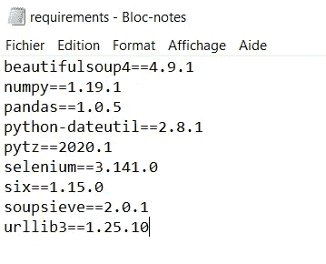
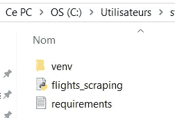

# 正确使用虚拟环境的建议和提示

> 原文：<https://towardsdatascience.com/advice-and-tips-to-properly-work-with-virtual-environments-67bbad9ba5b6?source=collection_archive---------19----------------------->

## 因为虚拟环境能够并且将会让您省心


来源:https://unsplash.com/photos/wl5AypUmamo

2020 年初，我正在使用 Keras/Tensorflow 进行一个学校项目。一切都很顺利。然后，我和我的队友分享了我的代码，这样他也可以开始工作了。然而，出于某种原因，这对他不起作用。

我们花了几个小时想弄明白。最终，我们意识到这个问题是由于我们安装了不同版本的包造成的。一旦我们设法让它全部工作，我决定找到一种方法来避免这个问题再次发生。

这就是虚拟环境的用武之地。

> **如果你已经熟悉虚拟环境，你可以跳到第四部分，在那里我会给出一些建议和技巧来帮助你改进和定制你对虚拟环境的使用。**

## 1.为什么要使用虚拟环境？

随着您对 Python 的掌握越来越好，您将会使用越来越多的包，并且正确处理对早期版本包的依赖性将会越来越困难，因此需要虚拟环境。

可以将虚拟环境想象成一个独立的文件夹，您可以在其中保存特定版本的包，甚至是特定的 Python 版本，而不会影响您的其他项目。

这是一个简单的方法，可以确保你(和其他人)总是运行 Python 脚本而没有依赖问题，也就是说，总是为你的包使用正确的版本。

所有出现的代码都可以直接从 Anaconda 提示符或命令行执行。

## 2.如何创建虚拟环境

超级简单。首先，确保你安装了 virtualenv，创建虚拟环境的库:`pip install virtualenv`。

然后，下面几行代码将为您的项目创建一个新文件夹，并在其中创建/激活一个虚拟环境。

```
> mkdir new_folder        **#create new folder for project**
> cd new_folder           **#set current directory to folder** > virtualenv venv         **#Create a virtual environment called venv**
> cd venv/Scripts         **#Set working directory to venv**
> . activate                **#Activate the environment**
```

从那里，您可以安装您需要的所有软件包及其特定版本:`pip install beautifulsoup4==4.9.1`。

然而，有一个更好的方法可以做到这一点。

## 3.使用 requirements.txt 文件

通过创建一个需求文件，您可以指定您想要在您的虚拟环境中使用的包和版本。下面是它应该是什么样子的一个例子:



然后，在确保文件位于当前工作目录中之后，您可以使用以下代码行安装文件中提到的所有软件包:

```
> pip install -r requirements.txt
```

这很好，但是还有一个更好的方法，我将在下一节中介绍。

## 4.其他有用的提示和技巧

这里有一些提示和技巧，我相信它们会促进甚至改善你对虚拟环境的使用。

1.  **自动创建一个 requirements.txt 文件**

不需要手动创建需求文件，您可以(也应该)做的是将您的 Python 脚本放在虚拟环境中，并编写以下代码行:

```
> pip freeze > requirements.txt
```

这将为您自动创建它。

另一个选择也是使用`pipregs`库。您所要做的就是将 Python 脚本的位置设为当前目录，然后键入`pipregs`。

```
> pip install pipreqs
> pipreqs
```

这将找到您的 Python 脚本，检测所有正在使用的包(和版本),并从中创建 requirements.txt 文件。

**2。用特定的 Python 版本创建虚拟环境**

如果您想让您的脚本在特定的 Python 版本上运行，这是很容易做到的。首先，确保您单独下载了您想要使用的版本。

然后，在创建虚拟环境时，将代码的`virtualenv venv`部分改为这样(例如，如果您想使用 Python 3.7):

```
> virtualenv venv --python=python3.7
```

**3。不要把你的 Python 脚本放在虚拟环境中**

删除虚拟环境最简单的方法是手动删除其文件夹。如果您将 python 脚本和需求文件插入其中，它们将随之被删除，这可能不是您想要做的。

您可能还想为多个项目使用同一个虚拟环境。将一切分开可以避免问题。

最好的办法是将这些文件放在虚拟环境之外，如下所示:



**4。直接从虚拟环境中运行 Python 代码**

如果您想直接从您的虚拟环境中运行您的代码，您只需在您的文件名前添加`python`，就像这样:

```
> python flights_scraping.py
```

我希望这有所帮助。非常感谢你的阅读！