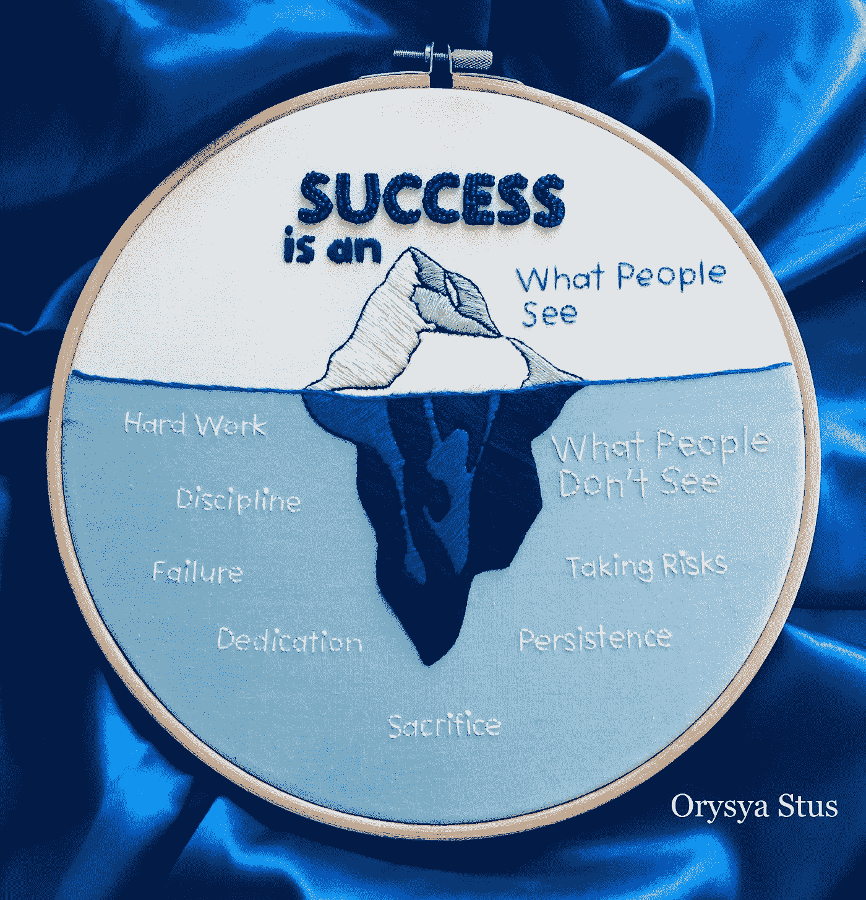
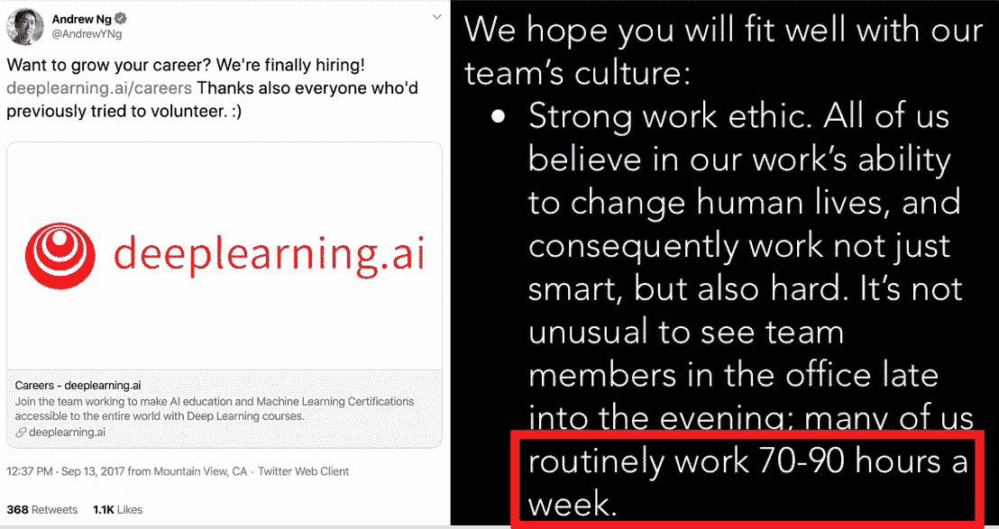
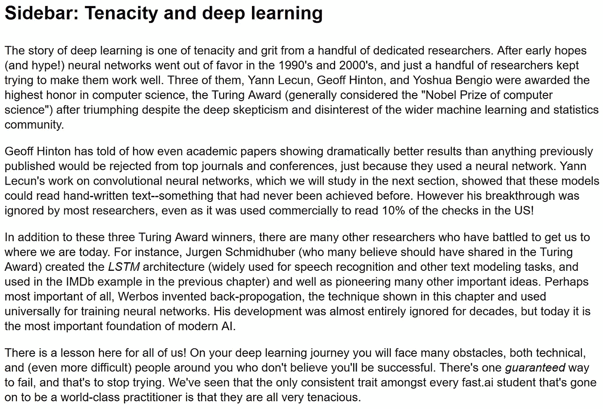
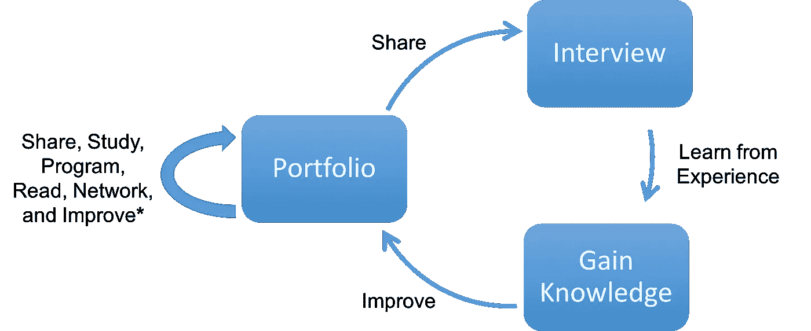

# 对成功的数据科学职业生涯的建议

> 原文：<https://towardsdatascience.com/advice-for-a-successful-data-science-career-7f07b3586171?source=collection_archive---------22----------------------->

[图片](https://www.instagram.com/p/B7q2On8FosG/?utm_source=ig_web_copy_link)作者[奥瑞西娅·斯图思](https://www.instagram.com/orysya.stus.art/)

我之前写过[如何建立数据科学作品集](/how-to-build-a-data-science-portfolio-5f566517c79c)，其中涵盖了**向潜在雇主展示你能做什么的重要性，而不仅仅是告诉他们你能做些什么。**本博客利用 [Orysya Stus](https://www.instagram.com/orysya.stus.art/) 的[成功是冰山图](https://www.instagram.com/p/B7q2On8FosG/?utm_source=ig_web_copy_link)作为框架，展示了人们在感知数据科学成功之旅中的几个方面经常被隐藏起来。这个博客旨在表明，大多数人都不得不付出相当多的努力才能达到现在的位置。他们必须努力工作，有时会经历失败，表现出纪律性，坚持不懈，致力于目标，有时会牺牲或冒险。就这样，让我们开始吧！

## 错误/失败

[发推文](https://twitter.com/beeonaposy/status/1122964504910938121?s=20)作者[凯特琳·胡登](https://twitter.com/beeonaposy)

正如你在上面[凯特琳·哈东](https://twitter.com/beeonaposy)(在线医疗的首席数据科学家)为她的[推特](https://twitter.com/beeonaposy/status/1122964504910938121)创建的 GIF 图中所看到的，人们在日常模型构建中会犯很多技术错误/失败。

> 我们大多数编码或从事数据科学的人经常看到彼此工作的最终产品——而不是我们作为过程的一部分所做的草稿、错误和决策。围绕这些步骤的一点透明度将大有帮助。

Jake VanderPlas 在一条关于开源的推文中似乎呼应了类似的观点，人们通常只看到最终产品而不是过程。

> 在开源中，我们经常看到的是最终产品，而不是过程……这可能会让那些一开始就看到周围完美事物的人感到沮丧。
> 
> 但是我敢打赌，在任何成功的开源项目的光鲜外表背后，都有大量的痛苦、烦恼和自我怀疑。

除了技术故障，还有其他类型的故障，包括你可以穿的类型(日志拒绝，电子邮件拒绝等)。凯特琳·k·柯比(Caitlin k . Kirby)毫不夸张地说出了她的失败/拒绝。在[华盛顿邮报](https://www.washingtonpost.com/lifestyle/2019/10/22/doctoral-student-wore-skirt-made-rejection-letters-defend-her-dissertation/)上有一篇文章详细描述了她的裙子是用她在过去五年里收到的 17 封拒绝信(杂志拒绝、电子邮件拒绝等)手工制作的及膝服装。

[推特](https://twitter.com/kirbycai/status/1181281371127463938)作者[凯特琳·k·科比](https://twitter.com/kirbycai)

顺便说一句，如果你想知道更多软件/数据科学相关的拒绝故事，有一个[完整的拒绝网站](https://rejected.us/)你可以看看，也许会对你有所启发。

## 努力工作/坚韧不拔

[推文](https://twitter.com/AndrewYNg/status/908052152722976768)作者[吴恩达](https://twitter.com/AndrewYNg)

大多数人不得不努力工作才能达到现在的位置。我绝对不是说你必须每周例行工作 70-90 小时，因为这听起来不健康。Rachel Thomas’[帖子](https://medium.com/s/story/techs-long-hours-are-discriminatory-counter-productive-17dc61071ed5)提到了这种态度是如何具有歧视性和适得其反的。

> 我们需要尽可能地摆脱工作时间的长短才是最重要的这种肤浅想法。科技行业对长得离谱的工作时间的痴迷不仅对许多残疾人来说是不可及的，而且对每个人的健康和人际关系都是有害的，但正如奥利维亚·戈德希尔[为*石英在工作*指出的那样，对生产力的研究表明这只是低效的:](https://qz.com/work/1486863/boasting-about-how-many-hours-you-work-is-a-sign-of-failure/)

> 无数研究表明，这根本不是真的。随着工作时间的延长，生产率会急剧下降，一旦人们每周工作 55 个小时，生产率就会完全下降，以至于平均来说，一个人每周工作 70 个小时并不比一个同事少工作 15 个小时。

疯狂的长时间工作在学术界也很常见，正如下面提到的[杰克·范德普拉斯](https://twitter.com/jakevdp)、[推特](https://twitter.com/jakevdp/status/960512085896523777)。

虽然这条推文不是对吴恩达之前推文的评论，但我认为它表明了成功有不同的方式，而不是持续工作。 [Python 数据科学手册](https://jakevdp.github.io/PythonDataScienceHandbook/)的作者似乎做得不错。([发推文](https://twitter.com/jakevdp/status/960512085896523777)发推文[杰克·范德普拉斯](https://twitter.com/jakevdp)

与其努力工作，也许我们应该谈论坚韧或坚持，就像杰瑞米·霍华德的新书和西尔万·古格的新书一样。

来自[推特](https://twitter.com/jeremyphoward/status/1230121675988992005)的内容摘自[杰瑞米·霍华德的](https://twitter.com/jeremyphoward)和[西尔万·古格的](https://twitter.com/guggersylvain)新书

简而言之，我认为最好的方法是:

> 你将面临许多障碍，既有技术上的，也有(甚至更困难的)你周围不相信你会成功的人。有一种方法肯定会失败，那就是停止尝试。

## 坚持

图片来自我的[博客文章](/how-to-build-a-data-science-portfolio-5f566517c79c)

生活中的许多成功都与坚持不懈有关。有很多像 Airbnb 的数据科学家 Kelly Peng 这样的成功人士的故事，他们真的坚持不懈，不断工作和改进。在[她的一篇博文](/how-to-land-a-data-scientist-job-at-your-dream-company-my-journey-to-airbnb-f6a1e99892e8)中，她回顾了自己申请和面试了多少个职位。

> 应用:475
> 
> 电话采访:50 次
> 
> 完成数据科学带回家的挑战:9
> 
> 现场面试:8 次
> 
> 优惠:2
> 
> 花费的时间:6 个月

她明明申请了很多工作，还一直在坚持。在她的文章中，她甚至提到你需要从面试经历中不断学习。

> 记下你被问到的所有面试问题，尤其是那些你没有回答的问题。你可以再次失败，但不要在同一个地方失败。你应该一直学习和提高。

## 纪律/奉献精神

[推特](https://twitter.com/andreas_madsen/status/1208143504540614657?s=20)作者[安德里亚斯·麦德森](https://twitter.com/andreas_madsen)

这篇文章的主题之一是每个人都经历过一些失败。重要的是有些人竭尽全力去实现他们的目标。在 [Andreas Madsen](https://twitter.com/andreas_madsen) 发表的一篇博文[中，他描述了进入 AI(通常是计算机科学系)的顶级博士项目有多难。实际上，他采访的所有教授都告诉他，要进入顶级博士项目，他需要“在顶级 ML 领域发表 1-2 篇论文”。他花了 7 个月的时间在一个没有资金和没有导师的研究项目上工作，以产生可以出版的作品。](https://medium.com/@andreas_madsen/becoming-an-independent-researcher-and-getting-published-in-iclr-with-spotlight-c93ef0b39b8b)

## 牺牲/冒险

图片由[迈克尔·加拉尼克](https://twitter.com/GalarnykMichael)

牺牲和风险可以以多种不同的形式出现。一个风险可能是忽视来自上面的命令。格雷格·林登在亚马逊的时候，他在做几个有趣的项目，尽管他本应该做其他事情。在他的一篇博客文章中，他描述了一个项目:

> 根据你的亚马逊购物车中的商品进行推荐。添加一些东西，看看有什么发现。再加几个，看看有什么变化…我黑出了一个原型。在一个测试网站上，我修改了 Amazon.com 的购物车页面，以推荐您可能喜欢添加到购物车中的其他商品。在我看来相当不错。我开始四处展示。

有一个问题。

> 虽然反应是积极的，但也有一些担忧。特别是，一位营销高级副总裁坚决反对……在这一点上，我被告知我被禁止在这方面做任何进一步的工作。我被告知亚马逊还没有准备好推出这项功能。应该就此打住。
> 
> 相反，我为在线测试准备了这个特性。我相信购物车的推荐。我想衡量销售影响。
> 
> 我听说 SVP 发现我推出一项测试后很生气。但是，即使是高层管理人员，也很难阻止测试。测量很好。反对测试的唯一有力论据是，负面影响可能非常严重，以至于亚马逊无法承受，这一点很难断言。测试开始了。
> 
> 结果很明显。它不仅赢了，而且以如此大的优势赢得了这项功能，以至于没有上线让亚马逊付出了相当大的代价。随着新的紧迫性，购物车建议推出…
> 
> 当时，亚马逊肯定是混乱的，但我怀疑我忽视来自上面的命令是在冒险。尽管亚马逊很好，但它还没有完全接受衡量和辩论的文化。

虽然我不提倡忽视上级的建议，但似乎在某些情况下，冒险对公司和你自己都有好处。

# 结论

[图片](https://www.instagram.com/p/B7q2On8FosG/?utm_source=ig_web_copy_link)作者[奥瑞西娅·斯图思](https://www.instagram.com/orysya.stus.art/)

希望你能从这篇博客中找到一些建议和例子，对你的数据科学之旅有所帮助。请记住，许多来自成功人士的建议都存在生存偏见。总是半信半疑地接受建议或分享经验。如果你有任何问题，对这篇文章有什么想法，或者只是想分享你自己的经历，欢迎在下面的评论中或者通过[推特](https://twitter.com/GalarnykMichael)联系我们。