# AES 加密 256 位

> 原文：<https://towardsdatascience.com/aes-encryption-256-bit-a9ae49cde0b6?source=collection_archive---------16----------------------->

[Bermix 工作室](https://unsplash.com/@bermixstudio?utm_source=medium&utm_medium=referral)在 [Unsplash](https://unsplash.com?utm_source=medium&utm_medium=referral) 拍摄的照片

## 统治它们的加密标准

AES(高级加密标准)是使用最广泛的对称加密算法。AES 应用广泛，包括静态数据加密和安全文件传输协议，如 HTTPS。

AES 是 DES 的继承者。数据加密标准(DES)是 IBM 开发的一种对称加密算法。过去，DES 曾是事实上的加密算法。然而，它使用的是 56 位密钥，随着技术的进步，对它的攻击开始变得更加可信。最终，DES 被认为太不安全而不能继续使用。社区过渡到了三重 DES(直到今天仍然存在)。本质上，三重 DES 是连续执行 3 次的 DES。正如所料，三重 DES 比普通 DES 安全 3 倍。然而，它也慢了 3 倍。

美国政府举办了一场竞赛，想出三重 DES 的替代方案。最终，由两位比利时密码学家文森特·里门和琼·代蒙编写的 **Rijndael，**因其性能和在硬件和软件上的易于实现性，以及其安全级别而被选中。 **Rijndael** 成为美国的**高级加密标准**，最终也成为世界其他地区的标准。

# AES 加密算法

假设鲍勃想给爱丽丝发一条消息。Bob 的未加密消息首先被分解成 128 位的块。然后将给定块中的字节(总共 16 个)组织成 4x4 矩阵。

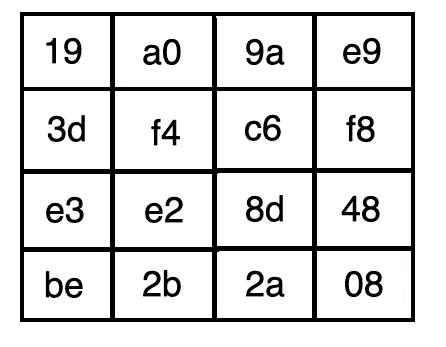

该块通过以下步骤序列总共 x 次，其中 x 取决于密钥的大小。

1.  替代字节
2.  移动行
3.  混合列
4.  添加圆形密钥

## 替代字节

在该步骤中，矩阵中的每个元素被映射到 **Rijndael S-box** 中的相应字节。

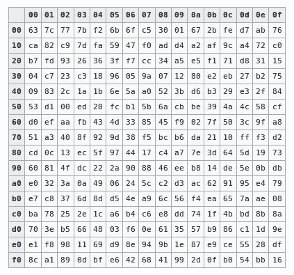

S-Box

例如，左上角的元素被映射到`d4`，因为第一个十六进制是`1`，另一个十六进制是`9`。

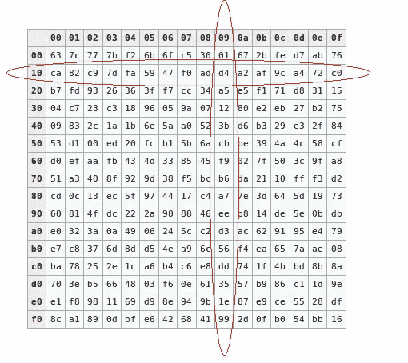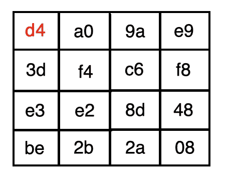

对每个元素重复该过程，我们获得以下矩阵:

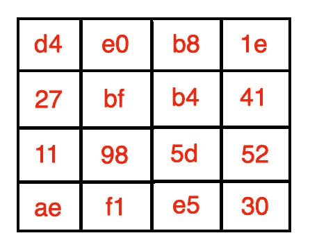

## 移动行

在第二步中，我们将每个元素向左旋转 x 个元素(字节)，其中 x 是行的索引。

*   第 0 行—左移 0 字节(即不移位)

*   第 1 行—左移 1 个字节

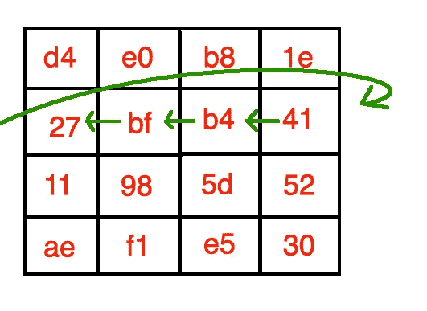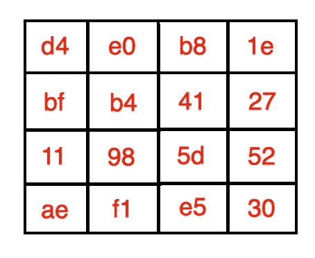

*   第 2 行—左移 2 个字节

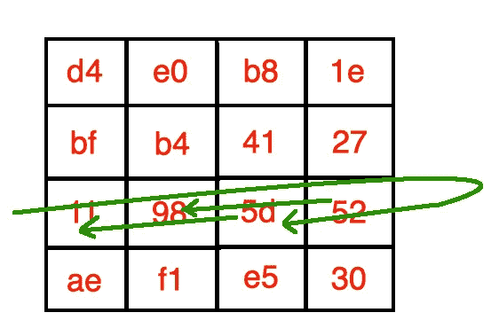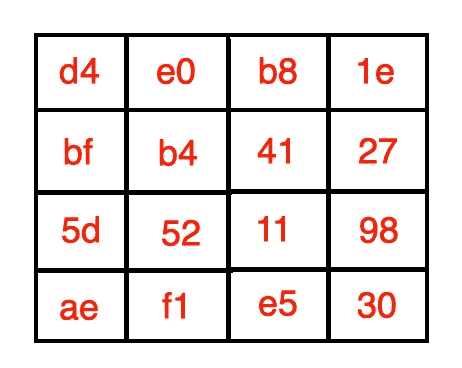

*   第 3 行—左移 3 个字节

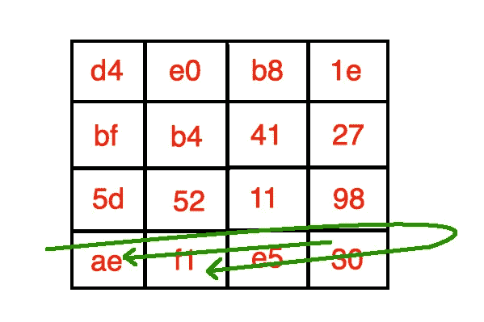

我们以下面的矩阵结束:

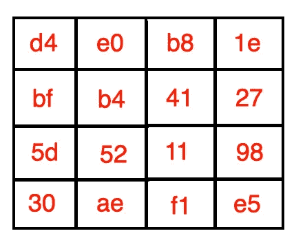

## 混合列

我们将每一列乘以一个预定义的矩阵。

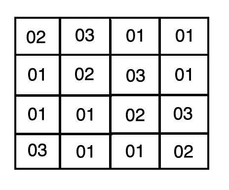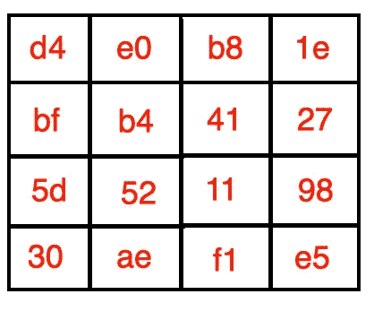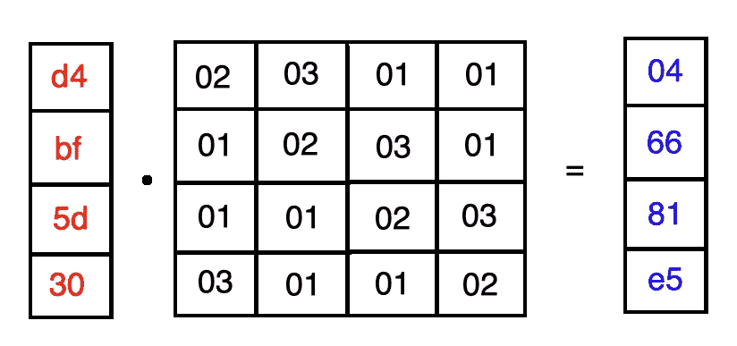

需要注意的是，这不是常规的矩阵乘法。如果任何一项大于 2 的 8 次幂，我们将该多项式除以伽罗瓦不可约多项式:

让我们来看看如何计算`d4`和`02`的乘积。我们首先将每一位转换成二进制算术等价物(多项式形式)。

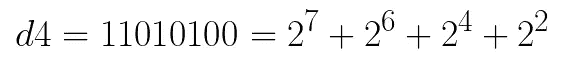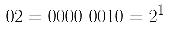

我们将两者相乘。

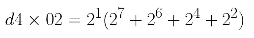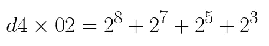

因为乘积大于 2 的 8 次方，所以我们用不可约多项式除它。

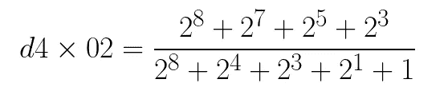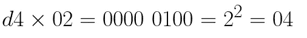

我们对每个元素重复该过程，并获得以下矩阵:

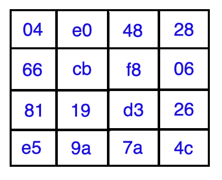

## 添加圆形密钥

在这一步中，我们在前面步骤中获得的矩阵的列和**轮密钥**之间执行按位异或运算。在第一次迭代中，**轮密钥**是密码密钥的前 128 位。

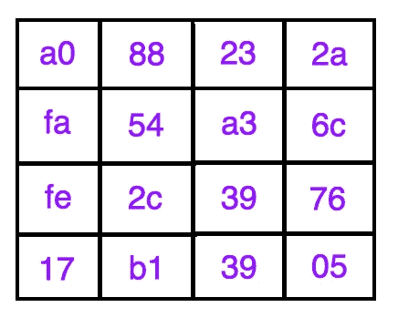

圆形钥匙

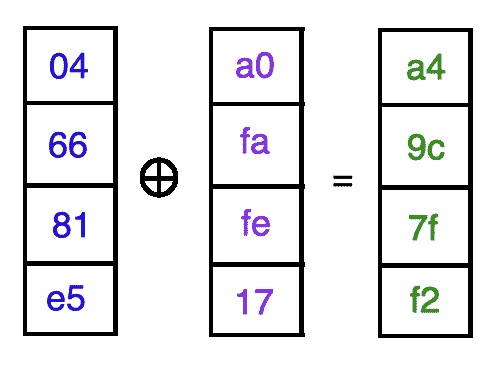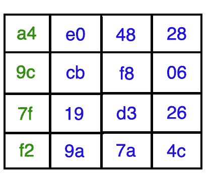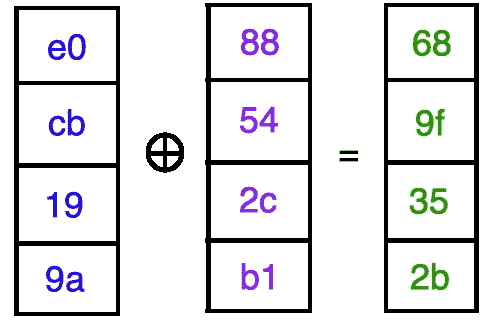

对剩余的列重复该过程，我们得到:

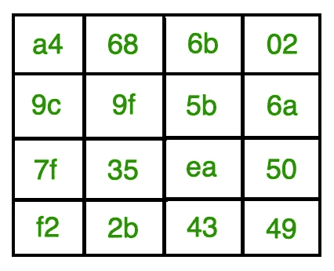

前面的矩阵被用作下一轮的输入，并且该过程本身被重复另外的 x 轮。

***注*** :最后一轮不包括**混合列**步骤。

# AES 密钥表

计算下一轮新密钥的过程称为**密钥表**。正如我们前面提到的，轮数取决于初始密钥的长度。

*   128 位密钥= 10 轮
*   192 位密钥= 12 轮
*   256 位密钥= 14 轮

**注意**:在所有其他方面，算法完全相同。

与 128 位输入模块以状态数组的形式排列的方式相同，该算法以 4 × 4 字节矩阵的形式排列加密密钥的前 16 个字节。下图显示了原始 128 位密钥的四个字被扩展成由 4 x 11 = 44 个字组成的密钥表。加密密钥的前四个字节构成字 w0，接下来的四个字节构成字 w1，依此类推，直到 w3。

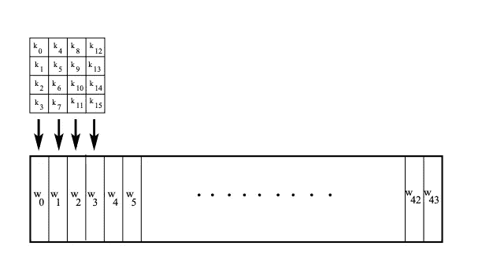

假设我们有第*轮*轮密钥的四个字。

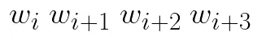

我们需要确定下一轮要用的词。

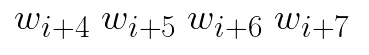

该序列中的第一个字计算如下:

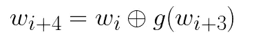

其中功能 ***g*** 由以下三个步骤组成:

*   对 4 字节字执行一个字节的循环旋转。
*   使用 16 × 16 查找表替换字中的每个字节
*   将从上一步中获得的字节与所谓的 ***循环常数*** 进行异或运算。

第*轮的 ***轮常数*** t 表示为***Rcon【j】***。*

*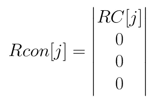*

*在哪里*

*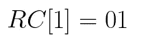**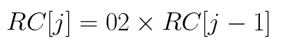*

****注意*** :添加舍入常数破坏了算法中其他步骤可能引入的任何对称性，从而使其更难破解。*

*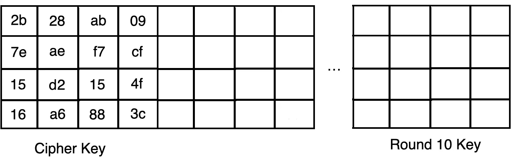*

*第一个操作包括旋转字节。*

*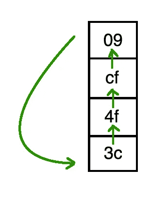**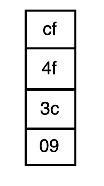*

*然后，我们使用查找表执行字节替换。*

*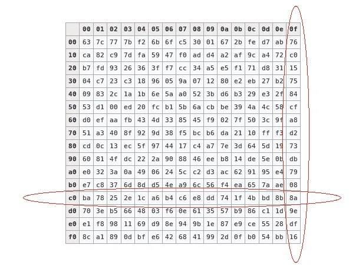**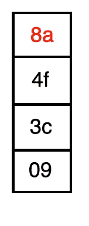*

*替换剩余的字节后，我们得到下面的向量。*

*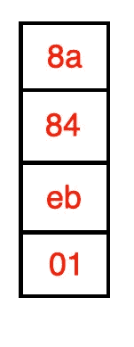*

*最后，我们在向量、第一个单词和***【Rcon[1]***之间执行按位异或运算，以获得新单词。*

***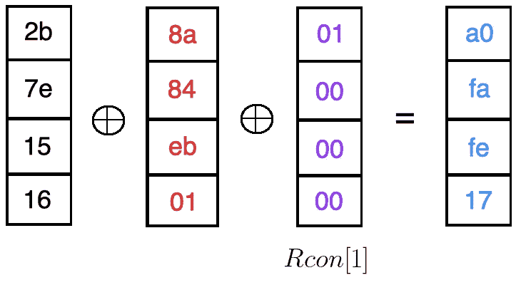**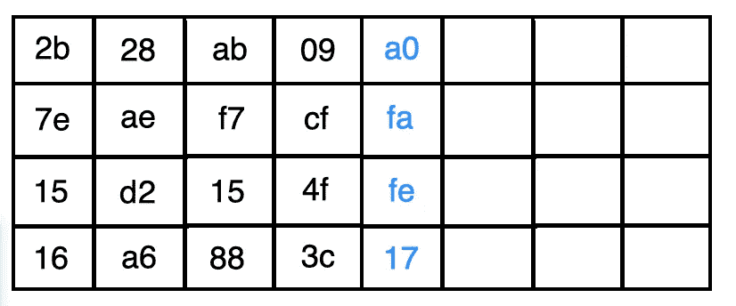*

*然后，我们继续计算**轮密钥**中的剩余单词。*

*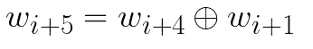**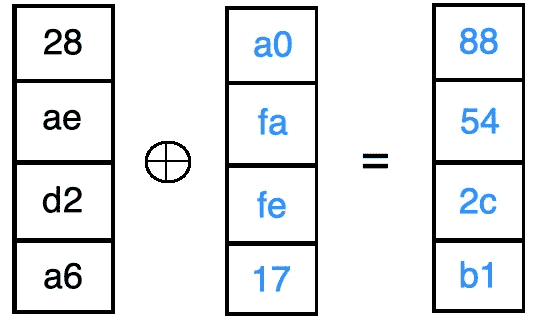**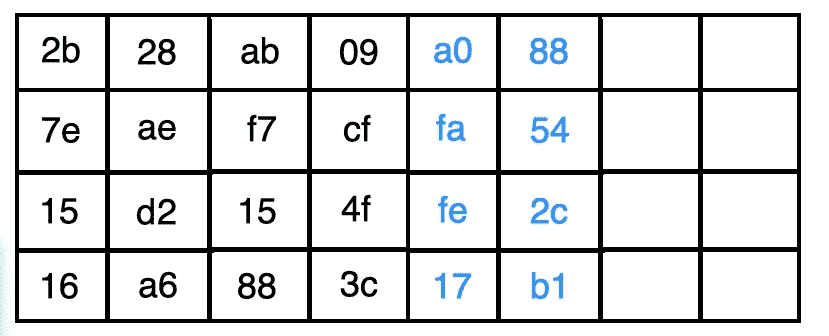**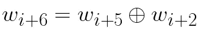**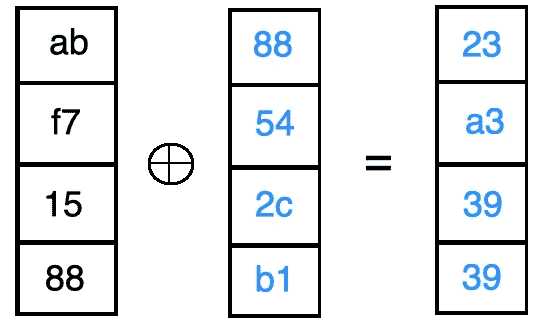**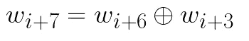**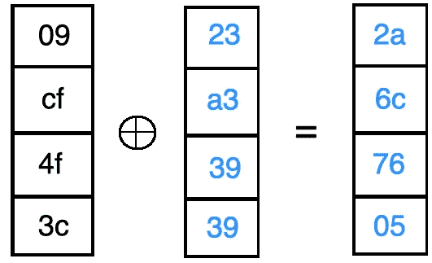**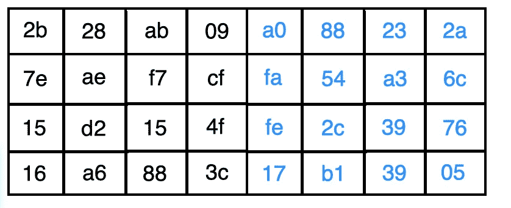*

*新的 4x4 矩阵(轮密钥)用于下一轮的**添加密钥**步骤。*

*10 轮中的每一轮都重复该过程。*

*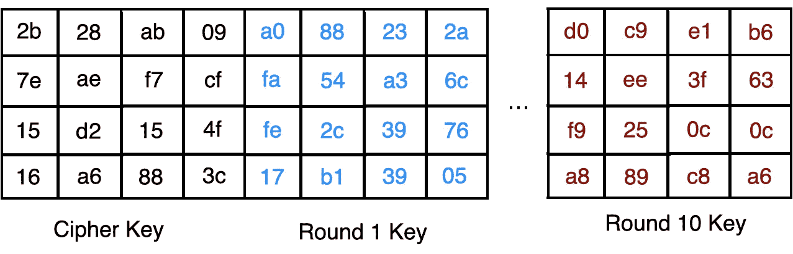*