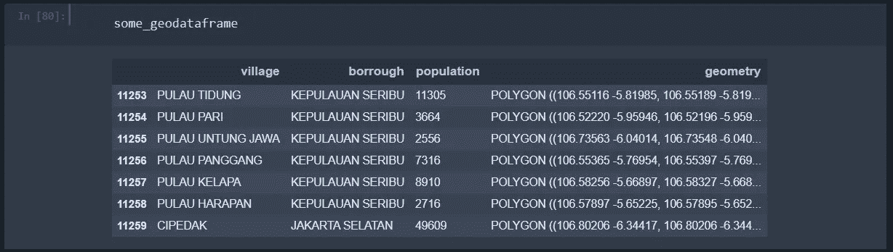
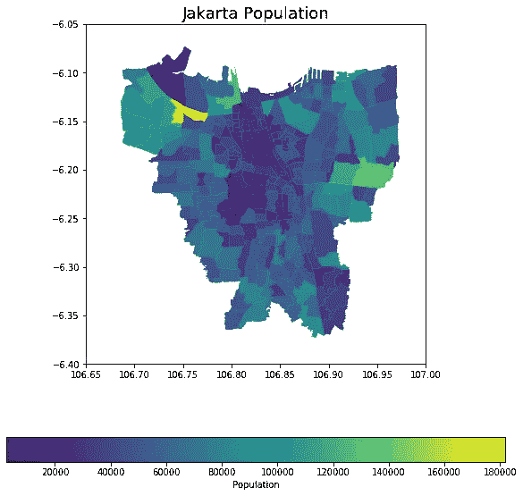
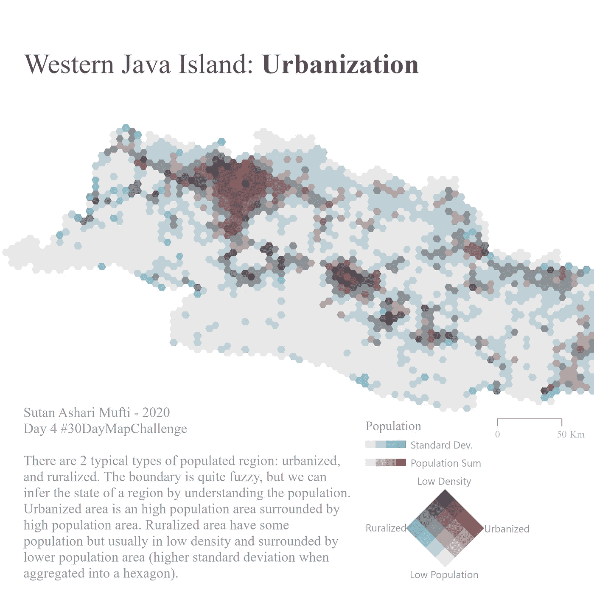
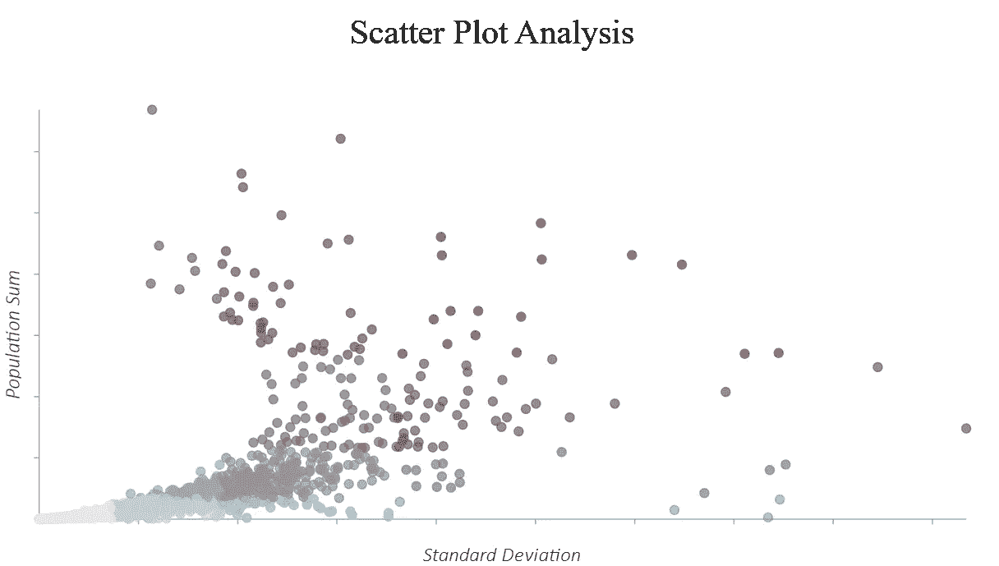

# 美学地图:用于空间数据关联上下文的二元图谱

> 原文：<https://towardsdatascience.com/aesthetic-map-bivariate-choropleth-for-association-context-on-spatial-data-45572aba60da?source=collection_archive---------28----------------------->

## [实践教程](https://towardsdatascience.com/tagged/hands-on-tutorials)

## 你如何观察这两个变量之间的关系？非空间数据的散点图，空间数据的二元线图。

# 介绍

新冠肺炎病例与城市密度相关吗？人口密度与经济总量相关吗？GDRP 和污染有什么关系？城市比农村更有生产力吗？

这些问题可以通过分析两个空间数据集来回答。一个简单的散点图可能会很快回答这个问题。但在这篇文章中，我想把重点放在空间方面。这是因为这些问题依赖于要素的地理方面。用散点图截断方面可能会隐藏关于数据实际性质的战略性或有影响力的洞察力。正如托布勒的地理法则第一条所说:

> 一切事物通常都与所有其他事物相关，但是那些彼此靠近的事物比那些离得远的事物更相关

**本文介绍了使用地理空间可视化理解数据之间的关联**；即理解两个变量与空间环境之间的相关性。如上所述，这是散点图之外的一个选项，我们将看到地理空间方法有何不同。使用**双变量图谱**进行描述性分析的方法。

(*注:观察空间关系的方法有很多种，这个方法只是其中一种。我选择这种方法是因为它简单，容易理解，而且直观。* ***再加上，就做出了一张漂亮的地图！*** )

# **概括地说空间数据**

**空间数据是具有空间维度的数据。**简单来说，我们可以做一个数据图。与典型数据一样，**空间数据可以用电子表格的形式表示。**典型的电子表格数据和空间数据的区别在于，空间数据有一个存储几何信息的几何列。这种几何信息通常以[众所周知的文本格式](https://www.ibm.com/support/producthub/iias/docs/content/SSHRBY/com.ibm.swg.im.dashdb.spatial.doc/doc/rsbp4120.html)表示(查看链接文章中的表 1，或者查看这个[链接](https://en.wikipedia.org/wiki/Well-known_text_representation_of_geometry))。

例如，下图:雅加达市的行政边界和相应人口的表格。请注意，它有一个存储地理信息的“geometry”列。另外关于数据格式，请参考[我的另一篇文章](/spatial-data-solution-for-city-planning-in-indonesia-understanding-the-geodataframe-f50d58e6c9f2?source=your_stories_page-------------------------------------)。

# 等值区域图

我相信你在生活中一定遇到过 choropleth 地图，只是你不知道它叫“choropleth 地图”。这是一张这样的地图:

雅加达人口分布图(来源:作者，2020；数据来源:印度尼西亚统计局，2020 年)

这是以前的电子表格数据的可视化。看起来很整洁，对吗？典型条形图的一个很好的替代品。空间关系是直观的，但提供了定量信息(人口数据)。

> "色彩图是阴影图，其中颜色的强度表示所讨论现象的强度。"— [皇家地理学会](https://www.rgs.org/CMSPages/GetFile.aspx?nodeguid=0bfa0334-247d-477f-8982-09b02b307242&lang=en-GB)

这种直方图依赖于将数据分类到几个箱中，就像直方图一样，并且将唯一的颜色分配给这些箱。分类方法确实会影响结果，从而产生不同的解释。更多关于分类的信息可以在[这里](https://gisgeography.com/choropleth-maps-data-classification/#Select_Your_Data_Classification_Method)找到。

这让我想起分类和图表可能会误导信息(请参考下面的视频，这是批评图表/数据可视化的一个很好的指南)。**所以，要注意仓的规模和 choropleth 的分类方法。**

## 进一步扩展-二元颜色

现在，上面的例子(地图)只解释了 1 个变量。我们可以再插入一个变量，这样它就变成了二元颜色。由两个变量组成的弦线图称为**二元弦线图**。

让我们看看这个例子，好吗？

# 二元染色体组

这是我做的最新的双变量 Choropleth 地图。在这里，我想通过观察六边形镶嵌地图中人口总数和人口标准差之间的关系来确定城市化的程度。这张地图是我在 Twitter 上参加 [#30DayMapChallenge](https://twitter.com/search?q=%2330DayMapChallenge) 的作品。

双变量 choropeth(*修订*)(来源:[作者，2020](https://www.linkedin.com/posts/sutanmufti_30daymapchallenge-cartography-activity-6729689082269696000-C4A-) )

请注意，图例现在有两个变量:标准差和总体总和。六边形包含各个六边形内人口的聚集值；因此，六边形以诸如平均值、中值等统计属性的形式截断。现在，关系由每个变量的颜色组合来表示。混合这些颜色会产生代表变量之间关系的独特颜色组合。此外，六边形地图将数据的空间背景可视化。**有了地图，可以直观的看到**(地理空间)**聚类。**

现在，让我们看看散点图是如何可视化这种关系的。我们来做一些对比。

## 散点图

好的，这是散点图(颜色和地图一样)。

散点图分析(来源:作者，2020)

我不知道你怎么想，但是在看了二元图之后，我发现散点图非常奇怪。"*我不能简单地说这种关系是线性的，因为数据中存在聚类，而且这种聚类必须加以说明。这使得数据在空间上是相关的，而不是独立的。这是因为散点图不代表数据的地理性质；您无法观察到空间聚类。简单地进行回归分析是错误的，除非该分析是地理加权的。( [*聚类)会导致空间自相关，这给假设残差独立*](https://ibis.geog.ubc.ca/courses/geob479/notes/spatial_analysis/spatial_autocorrelation.htm) 的统计方法带来问题。*

# 结束语

在我看来，简单的散点图不适合非空间数据，即不依赖于空间元素的数据。绘制散点图会隐藏数据的空间元素和关系，如聚类(空间自相关)。解决这个问题的一个方法是制作一个双变量 choropleth 图；两个变量的 choropleth 图。图表的绘图代表地理信息，而颜色代表变量值的强度。使用双变量 choropleth，数据的空间感也被捕获和呈现。

(*个人注:还有，地图变美了，至少对我来说！它给人一种微妙的美感，这种美感随着情感而颤动，尤其是一些精心的设计选择。在这种情况下，我认为制图是一种艺术形式，而不仅仅是数据可视化。*)