# Aethos 2.0 —自动化数据科学工作流程的改进方法

> 原文：<https://towardsdatascience.com/aethos-2-0-an-improved-way-to-automate-your-data-science-work-flow-8bfb2ac3a29a?source=collection_archive---------71----------------------->

## Aethos 2.0 的新特性


Justin Jairam 拍摄的照片来自 [@jusspreme](https://www.instagram.com/jusspreme/?hl=en)

2019 年底，我发布了 Aethos 1.0，这是自动化常见数据科学技术的第一个迭代包。从那以后，我收到了很多关于如何改进 Aethos 的反馈，我将在这里介绍。将会有很多代码示例来展示该包的强大功能和多功能性。

你可以在 TDS 上看到之前关于 Aethos 第一版的帖子。

> [艾托斯简介](https://github.com/Ashton-Sidhu/aethos)
> 
> [用艾托斯造型](/training-tracking-analyzing-interpreting-and-serving-models-with-one-line-of-code-785ea3b0668b)

*注意*:你可以通过我的页面上的谷歌协作链接[关注这篇文章。](https://ashton-sidhu.github.io/Blog/jupyter/aethos/datascience/2020/05/12/Aethos-2.0.html)

# Aethos 是什么？

对于那些不熟悉 Aethos 的人来说，Aethos 是一个自动化数据科学技术和用例的 Python 库，从缺失值插补、NLP 预处理、特征工程、数据可视化到建模、模型分析和模型部署。

要查看完整的功能以及您可以运行的其他技术和模型，请查看 [Github](https://github.com/Ashton-Sidhu/aethos) 上的项目页面。

# Aethos 1.0 的问题

Aethos 第一版的许多问题都与软件包及其 API 的可用性有关。主要问题是:

*   由于文件和耦合包的数量，导入时间很慢。
*   有两个用于端到端分析的对象—用于转换的数据和用于建模的模型
*   模型对象有每一个模型，并不特定于监督或无监督的问题。
*   不直观的 API 要求向底层数据帧添加新列
*   随着将笔记本转换为 pdf 等外部工具的使用，报告功能变得多余。
*   API 的用例有限。没有 Aethos，你无法分析你的数据，或分析你训练的模型。
*   Aethos 和 Pandas 不可互换，在转换数据时不能一起工作。

# Aethos 2.0 的新特性

Aethos 2.0 着眼于解决软件包的直观性和可用性，使其更容易使用和理解。它还解决了与 Aethos 一起使用 Pandas 数据框架的能力。

*   通过简化和分离 Aethos 模块，缩短了软件包的导入时间。
*   只需要一个 Aethos 对象来可视化、转换、建模和分析结果。
*   仅查看针对您的问题的模型(分类、回归或无监督)。
*   消除了通过 Aethos 对象向底层数据帧添加数据的复杂性。您可以使用 x_train 和 x_test 属性访问底层数据帧。
*   删除了报告功能。
*   访问 DataFrame 列时删除了点符号。
*   现在可以将方法链接在一起。

Aethos 2.0 引入了新的对象来支持新的案例:

*   *分析*:分析、可视化和运行统计分析(t 检验、anova 等)。)在你的数据上。
*   *分类*:分析、可视化、运行统计分析、转换和估算您的数据以运行分类模型。
*   *回归*:分析、可视化、运行统计分析、转换和估算您的数据以运行回归模型。
*   *无监督*:分析、可视化、运行统计分析、转换和估算您的数据以运行无监督模型。
*   *分类模型分析*:解释、分析和可视化分类模型结果。
*   *回归模型分析*:解释、分析和可视化回归模型结果。
*   *UnsupervisedModelAnalysis*:解释、分析和可视化无监督的模型结果。
*   *文本模型分析*:解释、分析和可视化文本模型结果。

> ***注意:*** *当使用 Aethos 运行模型时，模型分析对象会自动初始化。它们也可以通过提供模型对象、训练数据和测试数据来自行初始化。*

# 例子

```
!pip install aethos
```

进口熊猫和鹦鹉。

```
import pandas as pd
import aethos as atat.options.track_experiments = True # Enable experiment tracking with MLFlow
```

为了展示每一个物体，让我们载入泰坦尼克号数据集。

```
orig_data = pd.read_csv('https://raw.githubusercontent.com/Ashton-Sidhu/aethos/develop/examples/data/train.csv')
```

我们将描述原始数据作为参考。

```
orig_data.describe()
```

# 分析

分析对象主要用于快速、方便地分析和可视化数据。它没有能力运行 Aethos 的自动清理和转换技术，只有可视化和统计测试。它也不会分割您的数据，但是您可以选择提供一个测试集。

```
df = at.Analysis(orig_data, target='Survived')
```

让我们从描述我们的数据开始。

```
df.describe()
```

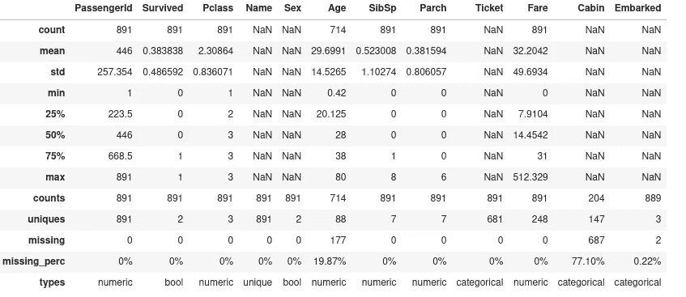

```
df.missing_values
```

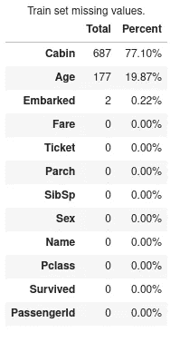

```
df.column_info()
```

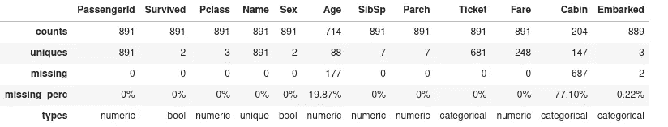

```
df.standardize_column_names()
```

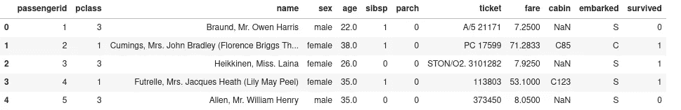

```
df.describe_column('fare')
```

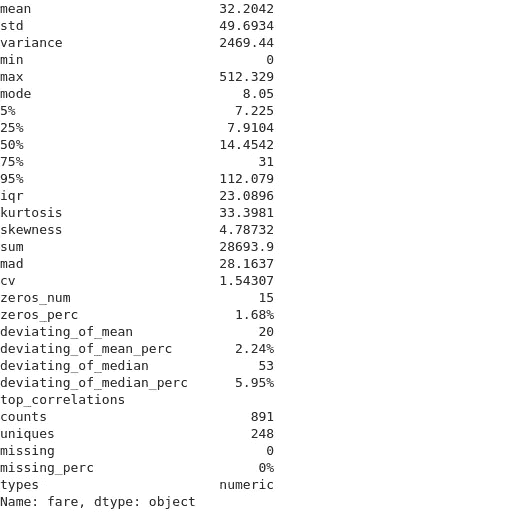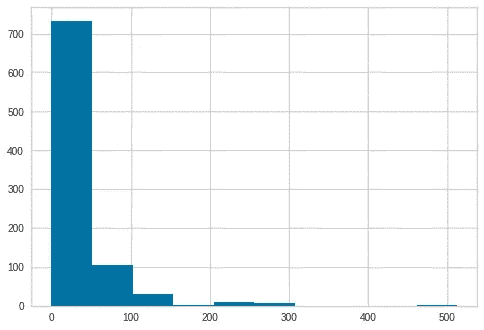

```
df.data_report()
```

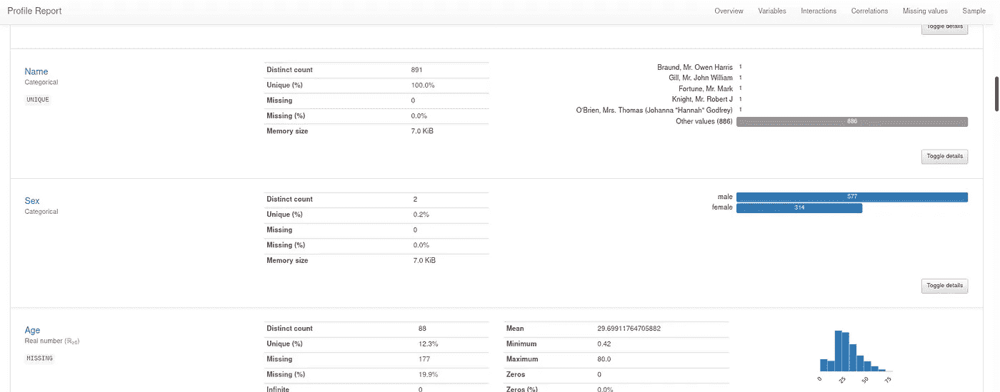

查看多个特征的直方图。

```
df.histogram('age', 'fare', hue='survived')
```

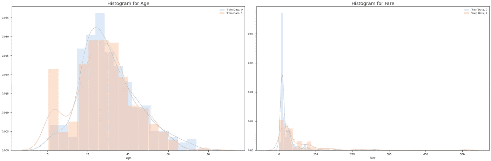

创建可配置的相关矩阵。

```
df.correlation_matrix(data_labels=True, hide_mirror=True)
```

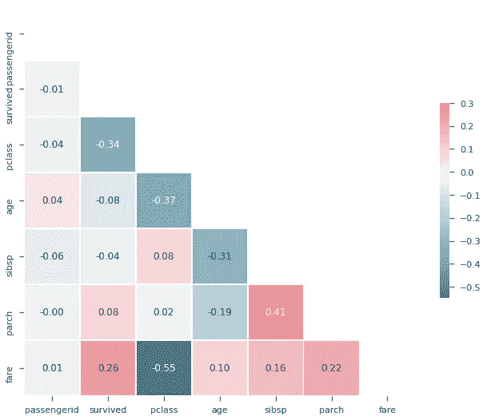

画出每个年龄买票的平均价格。

```
df.barplot(x='age', y='fare', method='mean', labels={'age': 'Age', 'fare': 'Fare'}, asc=False)
```

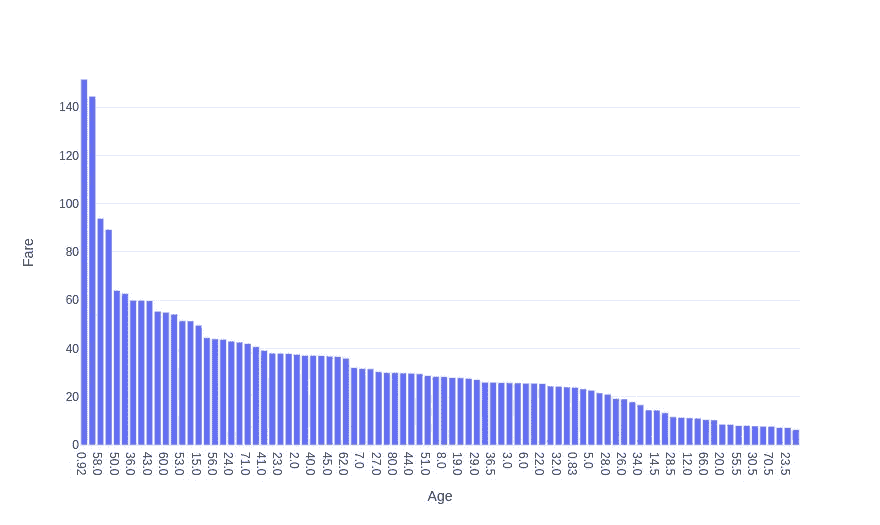

我们还可以观察年龄和公平之间的关系，并了解幸存者和幸存者之间的差异。

```
df.scatterplot(x='age', y='fare', color='survived', labels={'age': 'Age', 'fare': 'Fare'}, marginal_x='histogram', marginal_y='histogram')
```

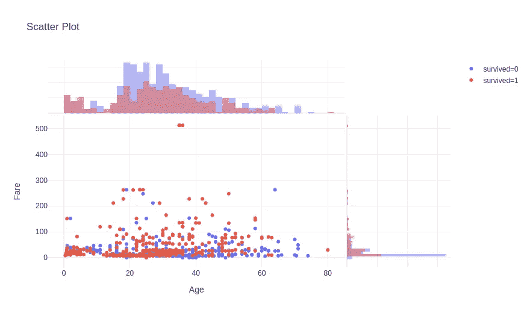

你可以想象其他的情节，比如雨云，小提琴，盒子，成对等等。我建议查看更多示例。

最大的变化之一是能够和熊猫并肩工作。如果您想转换和处理只与 Pandas 相关的数据，分析对象将反映这些变化。这允许您将 Aethos 单独用于自动分析，将 Pandas 用于转换。

为了演示这一点，我们将使用我们创建的原始 pandas 数据帧创建一个新的布尔特征来查看乘客是否为儿童。

```
orig_data['is_child'] = (orig_data['age'] < 18).astype(int)
orig_data.head()
```

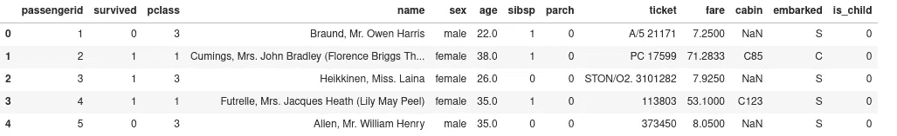

现在让我们来看看我们的分析对象。

```
df.head()
```


```
df.boxplot(x='is_child', y='fare', color='survived')
```

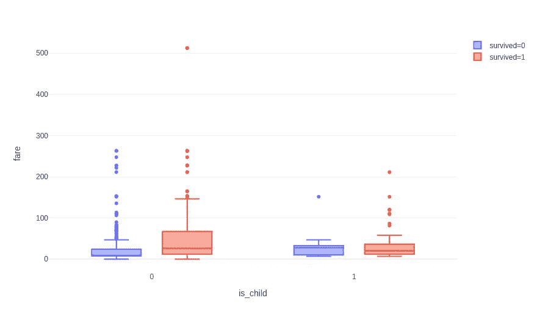

您仍然可以在 Aethos 对象上运行 pandas 函数。

```
df.nunique()
```

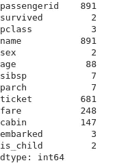

```
df['age'].nunique()
```

88

# 新功能

Aethos 2.0 中引入了一些新的分析技术。

## 预测能力得分

预测能力得分是非对称的、数据类型不可知的得分，可以检测两个列之间的线性或非线性关系。分数范围从 0(无预测能力)到 1(完美预测能力)。它可以用作相关性(矩阵)的替代方法。创建这个库需要 8080 个实验室，你可以在这里得到更多信息

```
df.predictive_power(data_labels=True)
```

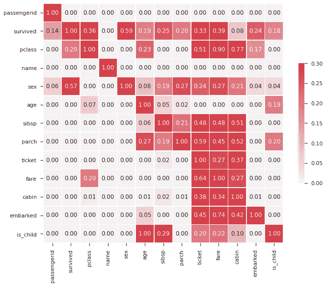

## AutoViz

AutoViz 自动可视化您的数据，并根据您的数据特征显示关键图。信用去 AutoViML 创建这个库，你可以得到更多的信息[在这里](https://github.com/AutoViML/AutoViz)。

```
df.autoviz()
```

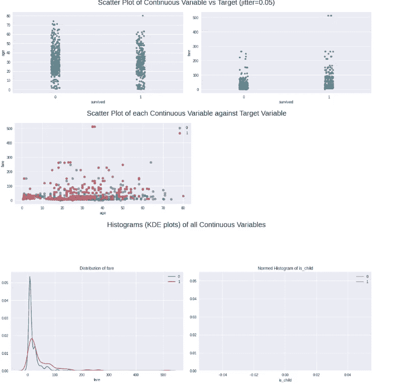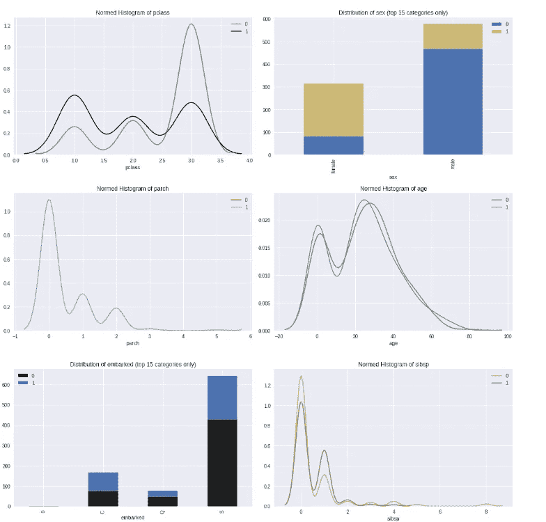

外加更多！它负责许多您通常会做的可视化工作，并帮助识别特征之间的关系。你可以在这里查看全部输出[。](https://ashton-sidhu.github.io/Blog/jupyter/aethos/datascience/2020/05/12/Aethos-2.0.html)

# 系统模型化

Aethos 2.0 引入了 3 个新的模型对象:分类、回归和无监督。这些对象具有与分析对象相同的功能，但也可以像在 Aethos 1.0 中那样转换数据。对于不熟悉 Aethos 的人来说，每当您使用 Aethos 应用转换时，它会将转换应用于训练数据，并将其应用于训练和测试数据(在分类和回归的情况下),以避免数据泄漏。

在这篇文章中，我们将讨论分类对象，但是如果你正在处理一个回归或者无监督的问题，过程是完全一样的。

```
df = at.Classification(orig_data, target='Survived', test_split_percentage=.25)
```

与 Aethos 1.0 一样，如果没有提供测试数据，它会在初始化时被分割。在 Aethos 2.0 中，它使用分类问题的分层来分割数据，以确保类平衡的一些相似性。

> **警告:**前面我们展示了修改原始数据帧并将其反映在 Aethos 对象中的能力。如果你没有为分类和回归对象提供一个测试集，情况就不一样了。
> 
> **提示:** Aethos 附带了一个清单，可以在清理、分析和转换数据时提醒您。

```
df.checklist()
```

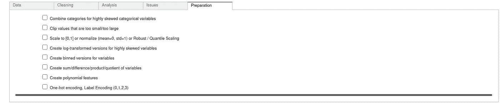

```
df.standardize_column_names()
```

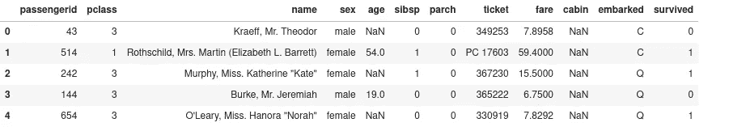

因为这是一个概述，所以让我们选择将要使用的列，去掉我们不打算使用的列。

```
df.drop(keep=['survived', 'pclass', 'sex', 'age', 'fare', 'embarked'])
```

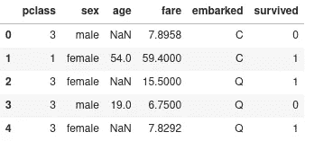

让我们把我们的转变连在一起。请记住，我们的转换将适合训练数据，并自动转换我们的测试数据。

```
is_child = lambda df: 1 if df['age'] < 18 else 0df.replace_missing_median('age') \
  .replace_missing_mostcommon('embarked') \
  .onehot_encode('sex', 'pclass', 'embarked', keep_col=False) \
  .apply(is_child, 'is_child') \
  .normalize_numeric('fare', 'age')
```

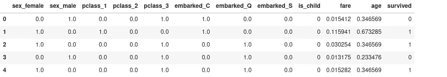

```
df.x_train.head()
```

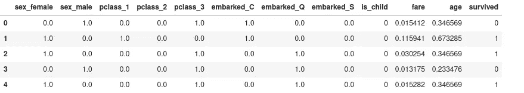

```
df.x_test.head()
```

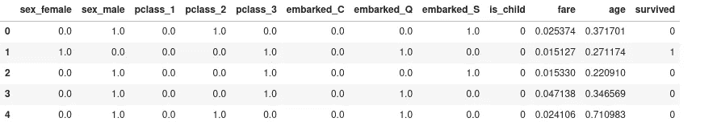

现在让我们训练一个逻辑回归模型。

我们将使用 gridsearch，它会自动返回最佳模型。在网格搜索过程中，我们将使用分层 K-fold 进行交叉验证。

```
gs_params = {
    "C": [0.1, 0.5, 1],
    "max_iter": [100, 1000]
}lr = df.LogisticRegression(
    cv_type='strat-kfold',
    gridsearch=gs_params,
    random_state=42
)
```

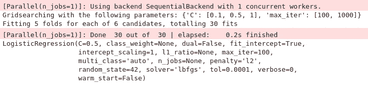

一旦模型被训练，一个 ModelAnalysis 对象被返回，它允许我们分析、解释和可视化我们的模型结果。包括一个列表，帮助您调试您的模型，如果它是过拟合或欠拟合。

```
df.help_debug()
```

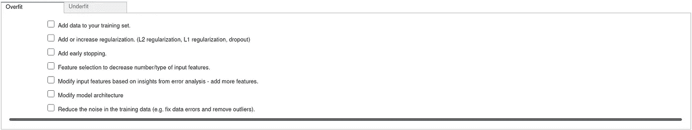

您可以通过在产生的 ModelAnalysis 对象上调用`cross_validate` 来快速交叉验证任何模型。它将显示所有折叠的平均分数和学习曲线。

对于分类问题，默认的交叉验证方法是分层 K-Fold。这允许保持某种形式的类平衡，而对于回归，缺省值是 K 倍。

```
lr.cross_validate()
```

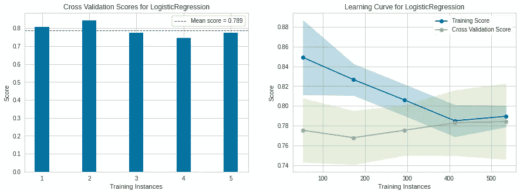

```
lr.metrics() # Note this displays the results on the test data.
```

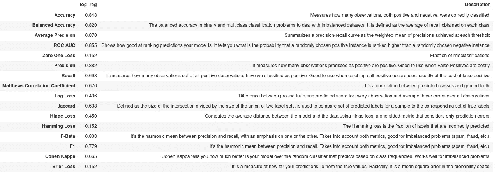

## 手动与自动

让我们手动训练一个逻辑回归，并查看和验证结果。

```
from sklearn.linear_model import LogisticRegression
from sklearn.metrics import accuracy_score, roc_auc_score, precision_scoreX_train = df.x_train.drop("survived", axis=1)
X_test = df.x_test.drop("survived", axis=1)y_train = df.x_train["survived"]
y_test = df.x_test["survived"]clf = LogisticRegression(C=1, max_iter=100, random_state=42).fit(X_train, y_train)
y_pred = clf.predict(X_test)print(f"Accuracy: {accuracy_score(y_test, y_pred).round(3)}")
print(f"AUC: {roc_auc_score(y_test, clf.decision_function(X_test)).round(3)}")
print(f"Precision: {precision_score(y_test, y_pred).round(3)}")
```

> 准确度:0.848
> AUC: 0.854
> 精度:0.882

结果是一样的。

# 模型分析

与建模类似，Aethos 2.0 引入了 4 个模型分析对象:ClassificationModelAnalysis、RegressionModelAnalysis、UnsupervisedModelAnalysis 和 TextModelAnalysis。在 Aethos 2.0 中，它们可以通过两种方式进行初始化:

*   使用 Aethos 训练模型的结果
*   通过提供模型对象、模型使用的训练数据以及评估模型性能(用于回归和分类)的测试数据来自行初始化它。

与模型对象类似，我们将探索分类模型分析对象，但对于回归、无监督和文本模型分析，过程是相同的。

# 从 Aethos 初始化

首先，我们将从建模的地方开始，查看逻辑回归模型的指标。

```
type(lr)
```

> aet hos . model _ analysis . class ification _ model _ analysis。分类模型分析

```
lr.metrics()
```


您还可以根据您的业务需求来设置项目度量。

```
at.options.project_metrics = ["Accuracy", "ROC AUC", "Precision"]lr.metrics()
```

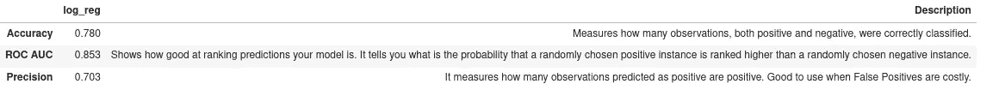

如果您只想查看单个指标，也有相应的功能。

```
lr.fbeta(beta=0.4999)
```

> 0.8380023094880403

您可以用一行代码分析任何模型结果:

*   韵律学
*   分类报告
*   混淆矩阵
*   决策界限
*   决策图
*   依赖图
*   力图
*   石灰地块
*   莫里斯敏感度
*   模型重量
*   汇总图
*   受试者工作特征曲线
*   单个指标

而且这只是针对分类模型，每种类型的问题都有自己的一套 ModelAnalysis 函数。

```
lr.classification_report()
```

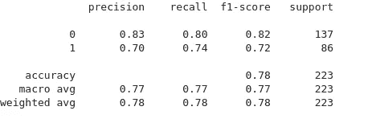

```
lr.confusion_matrix()
```


您可以将训练集中的特征提供给依赖图，否则它将只使用模型中的前两个特征。在引擎盖下，它使用 YellowBricks 决策边界可视化工具来创建可视化。

```
lr.decision_boundary('age', 'fare')
```

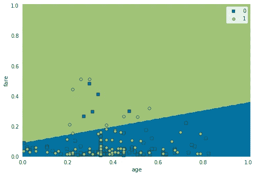

还包括自动 SHAP 用例来解释你的模型。

```
lr.decision_plot()
```

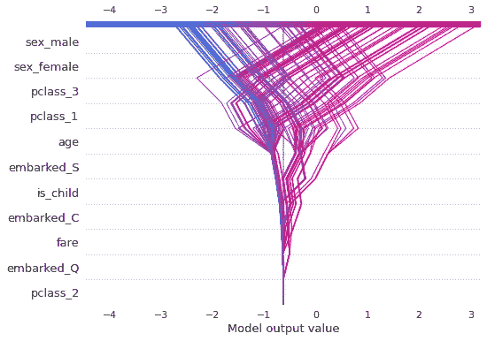

```
lr.dependence_plot('age')
```

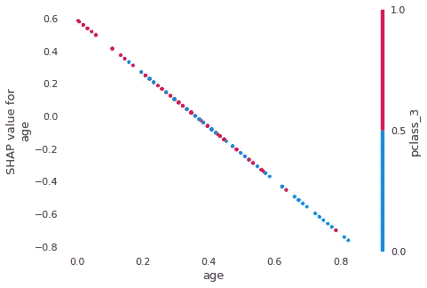

```
lr.force_plot()
```

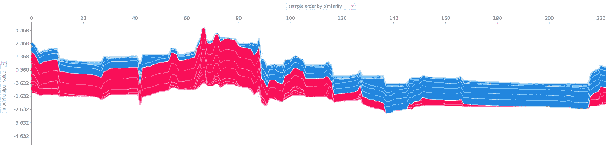

```
lr.interpret_model()
```

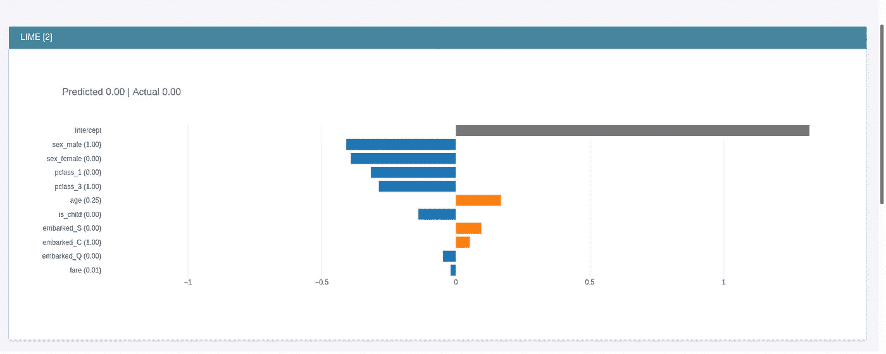

查看模型中权重最高的要素。

```
lr.model_weights()
```

> 性别 _ 女:1.16
> 性别 _ 男:-1.16
> pclass_3 : -1.08
> 年龄:-1.03
> pclass _ 1:0.98
> is _ child:0.41
> 上船 _ S:-0.31
> 船上 _Q : 0.21
> 上船 _C : 0.10
> pclass_2 : 0.10

轻松绘制 RoC 曲线。

```
lr.roc_curve()
```

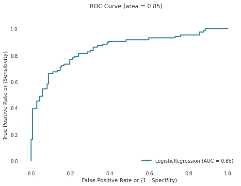

```
lr.summary_plot()
```

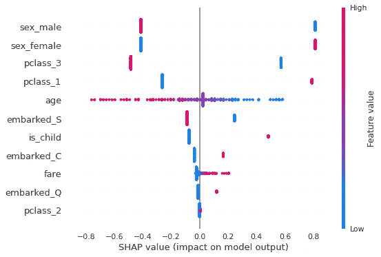

最后，我们可以使用 FastAPI、Gunicorn 和 Docker 通过 RESTful API 生成文件来部署我们的模型。

```
lr.to_service('aethos2')
```

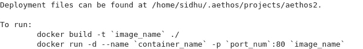

# 用户初始化

如果我们像之前在笔记本中所做的那样手动训练一个模型，并且想要使用 Aethos 的模型分析功能，我们可以。

```
lr = at.ClassificationModelAnalysis(
    clf,
    df.x_train,
    df.x_test,
    target='survived',
    model_name='log_reg'
)
```

**注意:** x_train 和 x_test 数据集必须将目标变量作为数据帧的一部分。

你现在可以做我们刚刚做的所有事情，并获得相同的结果。现在，您可以手动转换数据，训练模型，并使用 Aethos 来解释结果。我把它们放在下面以供验证。

```
type(lr)
```

> aet hos . model _ analysis . class ification _ model _ analysis。分类模型分析

```
lr.metrics()
```


```
lr.fbeta(beta=0.4999)
```

> 0.8380023094880403

```
lr.classification_report()
```


```
lr.confusion_matrix()
```


```
lr.decision_boundary('age', 'fare')
```


```
lr.decision_plot()
```


```
lr.dependence_plot('age')
```


```
lr.force_plot()
```


```
lr.interpret_model()
```


```
lr.model_weights()
```

> 性别 _ 女:1.16
> 性别 _ 男:-1.16
> pclass_3 : -1.08
> 年龄:-1.03
> pclass _ 1:0.98
> is _ child:0.41
> embarked _ S:-0.31
> fare:0.31
> embarked _ Q:0.21
> embarked _ C:0.10
> pclass _ 2:0.10

```
lr.roc_curve()
```


```
lr.summary_plot()
```


```
lr.to_service('aethos2')
```


# 反馈

我鼓励所有关于这个帖子或 Aethos 的反馈。你可以在推特上给我发信息，或者在 sidhuashton@gmail.com 给我发电子邮件。

任何 bug 或功能请求，请在 [Github repo](https://github.com/Ashton-Sidhu/aethos/issues?q=is%3Aissue+is%3Aopen+sort%3Aupdated-desc) 上创建问题。我欢迎所有功能请求和任何贡献。如果你想为一个开源项目做贡献，这个项目是一个很好的开端——如果你需要帮助，可以随时给我发消息。