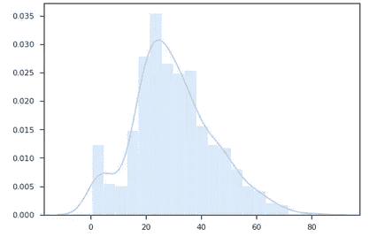
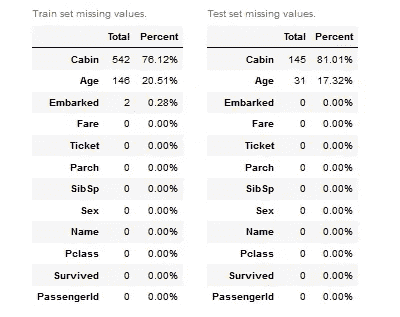

# Aethos —自动化工作流程的数据科学库

> 原文：<https://towardsdatascience.com/aethos-a-data-science-library-to-automate-workflow-17cd76b073a4?source=collection_archive---------26----------------------->


照片由来自 [Pexels](https://www.pexels.com/photo/black-flat-screen-computer-monitor-1714208/?utm_content=attributionCopyText&utm_medium=referral&utm_source=pexels) 的 [Josh Sorenson](https://www.pexels.com/@joshsorenson?utm_content=attributionCopyText&utm_medium=referral&utm_source=pexels) 拍摄

作为一名行业数据科学家，我相信许多其他数据科学家都会遇到一些棘手问题:

1.  将以前项目中的代码复制并粘贴到当前项目中，或者从一个笔记本复制并粘贴到另一个笔记本中是一件令人沮丧的事情。
2.  对于同样的任务，每个数据科学家都会以自己的方式来完成。
3.  用笔记本名称管理实验会很快变得杂乱无章，构建数据科学项目会变得一团糟。
4.  当你在分析过程中记录你的过程通常会打乱你的流程。
5.  版本控制模型，将它转换成服务，并在模型被训练后开发数据管道。
6.  出现了大量不同的库，每一个都填补了数据科学& ML 的一个空白，每次学习一个新的 API(特别是深度学习和 NLP)或阅读文档(如果有的话)都有点令人厌倦。很讽刺，我知道。
7.  制作哪怕是半吸引人的可视化效果通常都很耗时，有时甚至很困难。

这就是为什么我做了艾多斯。

[Aethos](https://github.com/Ashton-Sidhu/aethos) 是一个自动化数据科学技术和用例的 Python 库，从缺失值插补，到 NLP 预处理、特征工程、数据可视化，一直到建模和生成代码，以部署您的模型即服务，以及您的数据管道。

# 装置

让我们像安装其他 Python 包一样安装 Aethos:

```
pip install aethos
```

一旦安装了 Aethos，我们就可以做一些事情了。我们可以安装所有需要的自然语言处理语料库，

```
aethos install-corpora
```

安装 QGrid 等扩展，以便在与数据交互时获得更好的体验

```
aethos enable-extensions
```

创建一个数据科学项目，用完整的文件夹结构存放源代码、模型、数据和实验。

```
aethos create
```

# 入门指南

首先，让我们导入必要的库:

```
import aethos as at
import pandas as pd
```

在我们开始之前，让我们也配置一些选项，让我们的生活更轻松。就我自己而言，我经常写一份报告，记录我在分析过程中采取的步骤，以及我为什么要这样做，以便更好地与团队中的其他数据科学家交流我的过程，或者如果我在很长一段时间后回到实验中，也可以更好地与自己交流。在我们进行分析时，Aethos 会自动将报告写成文本文件，而不是手动编写报告(所有报告都保存在%HOME%/中)。aethos/reports/)。要让 Aethos 将报告写成 word 文档，我们只需启用选项:

```
at.options.word_report = True
at.options.interactive_table = True
```

`interactive_table`选项将使用 [itables](https://github.com/mwouts/itables) 库显示我们的数据，这是我个人最喜欢的库，因为它具有客户端搜索功能。

现在让我们加载数据。Aethos 以熊猫数据帧的形式接收数据，这样数据就可以像处理熊猫一样被加载。在这个例子中，我们将使用泰坦尼克号数据集。

```
data = pd.read_csv('titanic.csv')
```

要使用 Aethos，我们只需将数据帧传递给 Aethos 数据对象。

```
df = at.Data(data, target_field='Survived', report_name='titanic')
df
```


关于刚刚发生的事情，有几点需要注意:

*   由于这是一个监督学习问题，我们指定了我们想要预测的列(“幸存”)。
*   默认情况下，因为我们没有向数据对象传递任何测试数据，所以 Aethos 会自动将给定的数据分成一个训练集和一个测试集。这可以通过在初始化数据对象时设置`split=False`来关闭。
*   默认情况下，分割百分比为 20。这可以通过将`test_split_percentage`设置为 0 到 1 之间的浮点数来改变(默认为 0.2)。
*   我们将报告名称指定为`titanic`，因为我们指定要创建 Word Doc，所以在`%HOME%/.aethos/reports/`中将创建一个`titanic.txt`和一个`titanic.docx`。

让我们从一些基本的分析开始。

# 分析

使用数据对象就像处理熊猫数据帧一样。

```
df['Age'] # returns a Pandas series of the training data in the Age columndf[df['Age'] > 25] # returns a Pandas DataFrame of the the training data where Age is > 25.df.nunique() # You can even run pandas functions on the Data object, however they only operate on your training data.
```

添加新的列和在 pandas 中做的一样。添加新列时，它会根据数据集的长度将新数据添加到数据集(如果数据被拆分，则进行训练或测试)。但是，您也可以指定将它添加到哪个数据集:

```
# based off the length of some_iterable it will add to the train set or test set (if data is split).df[`new_col_name`] = `some_iterable`# you can also specify what dataset to add it to as welldf.x_train # pandas dataframe of the training set
df.x_test # pandas dataframe of the test testdf.x_train[`new_col`] = `some_iterable`
df.x_test[`new_col`] = `some_iterable`
```

Aethos 提供了几个选项，让您可以从整体上了解自己的训练数据。第一个你可能很熟悉。Aethos 的`describe`函数扩展了 pandas 来提供一些额外的信息。

```
df.describe()
```


我们还可以获得关于每个专栏的更详细的信息，所有这些都可以通过 [pandas-summary](https://github.com/mouradmourafiq/pandas-summary) 库获得。

```
df.describe_column('Age')
```


该命令还提供了数据的直方图。每个统计值都可以通过引用其名称来访问。

```
df.describe_column('Age')['iqr']
```

另一个选项是通过 [pandas-profiling](https://github.com/pandas-profiling/pandas-profiling) 生成 EDA 报告。

```
df.data_report()
```


我们还可以用一行代码生成直方图、pairplots 和 jointplots(注意:为了更好地适应本文，图像大小被缩放，并且是可配置的)。

```
df.jointplot('Age', 'Fare', kind='hex', output_file='age_fare_joint.png')
df.pairplot(diag_kind='hist', output_file='pairplot.png')
df.histogram('Age', output_file='age_hist.png')
```



接合图、成对图和直方图(从左到右)

我们还可以随时查看两个数据集中缺失值的信息。

```
df.missing_values
```



让我们来处理客舱、年龄和上船列中缺失的值。

出于本文的目的，我们将用最常见的值替换`Embarked`列中缺失的值，用中间值替换`Age`列中缺失的值。然后我们将删除`Cabin`列。

```
df.replace_missing_mostcommon('Embarked')
```

仅仅几行代码就发生了很多事情。先说插补。

*   Aethos 使用已建立的包(sci-kit learn、nltk、gensim 等。)来做所有的分析，在这种情况下，插补。
*   为了避免数据泄露，所有的分析技术都适用于训练集，然后应用于测试集。
*   一般来说，当存在测试集时，对训练集所做的任何事情都将应用于测试集。
*   当您运行一项技术时，该技术的一个简短描述会被写到报告中。
*   所有这些对于每一种 Aethos 分析技术都是一致的，并且可以在源代码[这里](https://github.com/Ashton-Sidhu/aethos/tree/develop/aethos)中查看(这个函数在 cleaning/clean.py 中)。

```
df.replace_missing_median('Age')
df.drop('Cabin')
```

让我们也删除 Ticket、Name、PClass、PassengerId、Parch 和 SibSp 列。

```
df.drop('Ticket', 'Name', 'PClass', 'PassengerId', 'Parch', 'SibSp')
```

这不是一篇关于为什么你应该在 pandas 中避免使用`.apply`函数的文章，但是为了 API 的覆盖范围和一致性，你也可以在 Aethos 中使用`.apply`。指定一个函数和一个输出列名，就可以开始了。

两个最大的区别在于，整个数据帧被传递到函数中，而 [Swifter](https://github.com/jmcarpenter2/swifter) 库用于并行化函数的运行，从而减少运行时间。

```
def get_person(data):
    age, sex = data['Age'], data['Sex']
    return 'child' if age < 16 else sexdf.apply(get_person, 'Person')
```


就像任何其他 Aethos 方法一样，函数`get_person`适用于训练和测试集。Aethos 在使用`.apply`时提供了一个优化，但可能的话最好还是使用矢量化。

我们现在可以删除`Sex`列。

```
df.drop('Sex')
```

我们需要将`Embarked`和`Person`转换成数字变量，为了简单起见，我们只使用一键编码。我们还想删除用`keep_col`参数指定的原始列。因为我们使用的是 scikit-learn 的 OneHotEncoder 类，所以我们也可以将关键字参数传递给它的构造函数。

```
df.onehot_encode('Embarked', 'Person', keep_col=False, drop=None)
```


# 报告

关于当前的报告特性，需要记住的几件事情是，它按照代码执行的顺序进行记录和编写，并且它目前不为任何图像添加标题。我们还可以通过执行以下操作随时写入报告:

```
df.log(`write_something_here`)
```

# 结论

Aethos 是标准化的 API，它允许你用一行代码运行分析技术、训练模型等等。我所展示的只是您可以用 Aethos 完成的分析技术的冰山一角。Aethos 中有超过 110 种自动化技术和模型，更多技术和模型即将推出。

在随后的博客文章中，我将回顾训练模型和查看 Aethos 的结果。要了解更多细节，我推荐阅读 Github 上的[用法](https://github.com/Ashton-Sidhu/aethos#usage)部分或[文档](https://aethos.readthedocs.io/en/latest/?badge=latest)。

# 即将推出

这只是对 Aethos 的介绍，但新功能即将推出！完整的路线图你可以在这里查看。

在不久的将来，你可以期待:

*   使用 MLFlow 进行实验管理
*   用更好的 API 改进现有的可视化
*   更加自动化的可视化
*   更多自动化技术(降维、特征工程)
*   预先训练的模型(GPT-2，伯特等。)

# 反馈

我鼓励所有关于这个帖子或 Aethos 的反馈。你可以在推特上给我发信息，或者在 sidhuashton@gmail.com 给我发电子邮件。

任何 bug 或功能请求，请在 [Github repo](https://github.com/Ashton-Sidhu/aethos/issues?q=is%3Aissue+is%3Aopen+sort%3Aupdated-desc) 上创建问题。我欢迎所有功能请求和任何贡献。如果你想为一个开源项目做贡献，这个项目是一个很好的开端——如果你需要帮助，可以随时给我发消息。