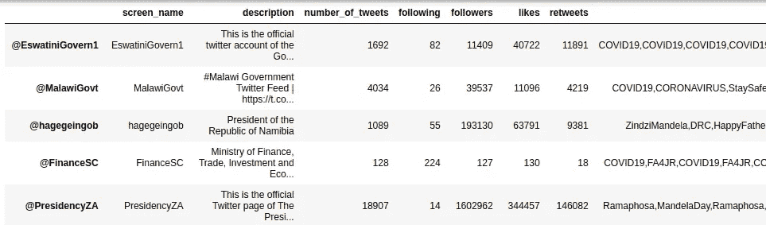
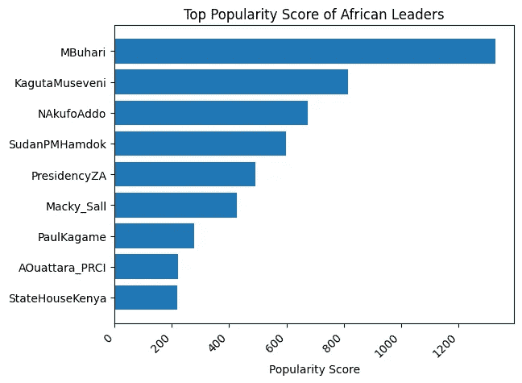
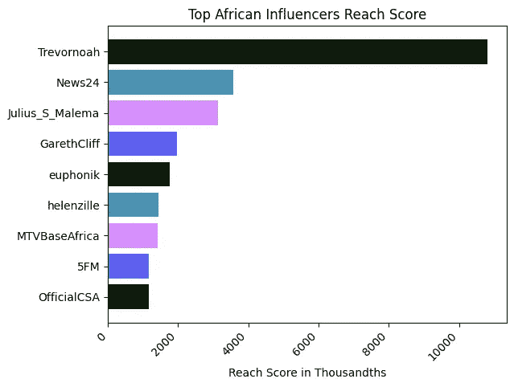

# 非洲影响者:使用 Python 对 Twitter 用户进行细分

> 原文：<https://towardsdatascience.com/african-influencers-twitter-users-segmentation-40753ee0a0bd?source=collection_archive---------78----------------------->

## 使用 Twitter 数据确定非洲最有影响力的人，以推动营销战略。


卢克·切瑟在 [Unsplash](https://unsplash.com?utm_source=medium&utm_medium=referral) 上的照片

**简介**

Twitter 是最受欢迎的社交媒体平台之一。这是一个不断更新的信息流池，在这里可以研究趋势、喜好、爱好、社区和新闻。在数百万用户中，有政治和社会影响力的人只占一小部分。这些小群体可以被确定、研究并用于各种活动和营销策略。这项研究的目的是使用 Python 来确定和排列非洲最有影响力的人和政府官员。

为了实现这一点，我们将使用 3 个指标得分:

*   人气评分-喜欢和转发
*   影响程度得分
*   相关性分数-提及和回复计数

# **数据采集**

我们从收集 twitter 句柄开始

*   [https://Africa freak . com/100-非洲最具影响力的推特用户](https://africafreak.com/100-most-influential-twitter-users-in-africa)
*   [https://e nitiate . solutions/top-18-African-s-heads-on-Twitter/](https://enitiate.solutions/top-18-african-heads-of-states-on-twitter/)。

使用 web 抓取技术来获取所需的 twitter 句柄。然后使用 Tweepy 提取分析所需的用户信息。

# **Python 库**

```
from requests import get
from requests.exceptions import RequestException
from contextlib import closing
from bs4 import BeautifulSoup
import pandas as pd
import re
import numpy as np
import os, sys
import fire
import tweepy
```

# **卷筒纸报废**

我们搜索列出的网站，以获得非洲高层人士和政府官员的 twitter 账号。

```
def simple_get(url):
    """
    Attempts to get the content at `url` by making an HTTP GET request.
    If the content-type of response is some kind of HTML/XML, return the
    text content, otherwise return None.
    """
    try:
        with closing(get(url, stream=True)) as resp:
            if is_good_response(resp):
                return resp.content  #.encode(BeautifulSoup.original_encoding)
            else:
                return None

    except RequestException as e:
        log_error('Error during requests to {0} : {1}'.format(url, str(e)))
        return None

def is_good_response(resp):
    """
    Returns True if the response seems to be HTML, False otherwise.
    """
    content_type = resp.headers['Content-Type'].lower()
    return (resp.status_code == 200 
            and content_type is not None 
            and content_type.find('html') > -1)

def log_error(e):
    """
    It is always a good idea to log errors. 
    This function just prints them, but you can
    make it do anything.
    """
    print(e)

def get_elements(url, tag='',search={}, fname=None):
    """
    Downloads a page specified by the url parameter
    and returns a list of strings, one per tag element
    """

    if isinstance(url,str):
        response = simple_get(url)
    else:
        #if already it is a loaded html page
        response = url

    if response is not None:
        html = BeautifulSoup(response, 'html.parser')

        res = []
        if tag:    
            for li in html.select(tag):
                for name in li.text.split('\n'):
                    if len(name) > 0:
                        res.append(name.strip())

        if search:
            soup = html            

            r = ''
            if 'find' in search.keys():
                print('findaing',search['find'])
                soup = soup.find(**search['find'])
                r = soup
if get_ipython().__class__.__name__ == '__main__':
    fire(get_tag_elements)
```

下面是通过其中一个列出的网站后的输出示例:

```
['@EswatiniGovern1',
 '@MalawiGovt',
 '@hagegeingob',
 '@FinanceSC',
 '@PresidencyZA',
 '@mohzambia',
 '@edmnangagwa',
 '@MinSantedj',
 '@hawelti',
 '@StateHouseKenya',
 '@PaulKagame',
 '@M_Farmaajo',
 '@SouthSudanGov',
 '@SudanPMHamdok',
 '@TZSpokesperson',
 '@KagutaMuseveni']
```

使用 tweepy APIs，我们可以传递从废弃网站获取的列表来废弃 twitter 中的用户信息。对于我们的例子，我们需要每个帐户的用户的屏幕名称、tweets 数量、关注、追随者、喜欢、转发、标签和提及。

下面是一个示例代码:

```
df = pd.DataFrame(columns=['screen_name','description','number_of_tweets','following', 'followers',
                          'likes', 'retweets', 'hashtags', 'mentions'])
def get_data(account_list):
    for target in account_list: 
        item = api.get_user(target)
        name = item.name
        screen_name = item.screen_name
        description = item.description
        number_of_tweets = item.statuses_count
        following = item.friends_count
        followers = item.followers_count
        # age of account
        account_created_date = item.created_at
        delta = datetime.utcnow() - account_created_date
        account_age_days = delta.days
        if account_age_days > 0:
            avg_tweets_per_day = float(number_of_tweets)/float(account_age_days)
        # tweets (hashtags and mentions)
        global hashtags, mentions, replies, comments  # making them global in order to intergrate them to the df later
        hashtags = []
        mentions = []
        comments = []
        retweet_count = []
        likes_count = []
        replies = []
        tweet_count = 0
        end_date = datetime.utcnow() - timedelta(days=180)
        for status in Cursor(api.user_timeline, id=target, include_rts=False).items():                
            tweet_count += 1
            if hasattr(status, "entities"):
                entities = status.entities
        process_status(status)
            #hashtags
            if "hashtags" in entities:
                for ent in entities["hashtags"]:
                    if ent is not None:
                        if "text" in ent:
                            hashtag = ent["text"]
                            if hashtag is not None:
                                  hashtags.append(hashtag)
            #mentions  (will fetch other users but will later use to do mention counts between the involved users)                   
            if "user_mentions" in entities:
                for ent in entities["user_mentions"]:
                    if ent is not None:
                        if "screen_name" in ent:
                            name = ent["screen_name"]
                            if name == target:
                                if name is not None:
                                    mentions.append(name)
```

数据帧作为输出返回。下面是输出的一个示例。



# **分析**

根据这些指标进行分析，以确定非洲最具影响力的人物。Matplotlib 用于绘制图形和可视化分析的数据。下面是非洲政府高级官员受欢迎程度得分的柱状图。



基于 in-degree 影响力的非洲顶级人物条形图。



# **结论**

根据上述图表所示的分析，非洲最有影响力的人物是:

*   特雷弗·诺亚
*   朱利叶斯·马莱马

根据分析，非洲最有影响力的政府官员是:

*   布哈里先生
*   卡古塔·穆塞韦尼

数字营销是营销策略的新标准。与合适的影响者合作，在商品和合适的市场之间架起一座桥梁。数据科学可以在企业中用于推动关键的营销决策。

参考

[1] Cha，m .，Haddadi，h .，Benevenuto，f .，和 Gummadi，K. (2010 年)。测量 Twitter 中的用户影响力:百万追随者谬误。从 http://twitter.mpi-sws.org/icwsm2010_fallacy.pdf[取回](http://twitter.mpi-sws.org/icwsm2010_fallacy.pdf)

在 [GitHub 库可以获得全部代码。](https://github.com/johnlotome/NIKE-CAMPAIGN-)