# 使用面部图像的年龄检测:传统机器学习与深度学习

> 原文：<https://towardsdatascience.com/age-detection-using-facial-images-traditional-machine-learning-vs-deep-learning-2437b2feeab2?source=collection_archive---------7----------------------->

## 使用 *scikit-learn* 和 *TensorFlow* 进入计算机视觉领域的初学者步骤。

网络摄像机视频的实时年龄分类。顺便说一下，我 26 岁了。(图片由作者提供)

我是一名有抱负的数据科学家，进行了几个月的密集数据科学学习和项目。大约一年半前，当我通过在线视频和课程学习 Python 时，我对这个领域产生了兴趣。为了提高我在该领域的理解，我决定参加由大会提供的[数据科学沉浸式](https://generalassemb.ly/education/data-science-immersive/singapore)训练营。通过这个项目，我们接受了几个项目的任务，这些项目为我们提供了“实践”经验。作为对我为期 12 周的数据科学之旅的致敬，我很乐意分享我的最后一个，也可能是其中最引人注目的一个——我的顶点项目。该项目的核心是利用图像数据和计算机视觉，利用人脸图像建立年龄分类算法。

为什么要阅读这篇文章？在互联网上快速搜索可能会产生大量关于如何构建年龄分类器的文章、视频、GitHub 链接和研究论文。那么，我的文章在一堆相似的内容中处于什么位置呢？为什么你应该继续阅读这篇文章？嗯，这是为什么...

*   **两种方法:传统机器学习与深度学习** —听从导师的建议，我试图使用两种不同的方法为这个项目构建一个解决方案。我在网上遇到的大多数资源都直接进入了深度学习和神经网络，以建立解决这个问题的解决方案(你可能会说这应该是正确的方法)。然而，为了真正欣赏数据科学中传统的机器学习方式，并欣赏深度学习的力量和可能性，我试图探索传统的机器学习方法(图像特征提取，然后使用著名的 ***sklearn*** 库进行分类建模)。我在这个项目中利用了深度学习方法的 ***TensorFlow*** 库。
*   **最重要的是，因为我是一个业余爱好者**——如果你像我一样是一个初学者，正在考虑开始(或者已经在努力)一个类似的项目，你可能会发现这篇文章很有帮助。在这里，我尝试浏览工作流程，同时讨论我在这个项目中必须做出的各种决定背后的思维过程和基本原理。我还希望，我在该领域的新手身份，加上我(相当)成功地尝试解决如此性质和规模的项目，可能是您在开始数据科学之旅时正在寻找的那种灵感。

也就是说，如果你碰巧是这个领域的专家，或者如果你有一些更好的想法来完成这个项目中的某些事情，一定要让我知道。

所以，如果我足够幸运，能让你一直保持兴趣，让我们再往前推一点，直接进入正题。

为了这个项目，我决定在我的个人电脑上使用 **Google Colab** 而不是 Jupyter 笔记本。这样做的主要原因是利用谷歌提供的免费 GPU 来训练我的深度学习模型。也就是说，也有可能使用传统的 CPU 来完成这个项目，只是可能需要稍微长一点的时间。对于那些刚刚接触 Google Colab 的人来说，你可以在这里读到一些关于它的内容[。](/google-colab-jupyter-lab-on-steroids-perfect-for-deep-learning-cdddc174d77a)

**TL；这里是所有不同方法的准确度分数的总结。**

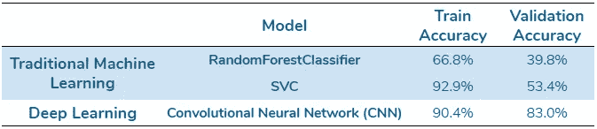

# 源代码和数据集

这个项目中使用的源代码和数据集可以在下面给出的链接中找到。请参考随附的 ***README.txt*** 文件，了解如何在运行笔记本中的代码之前将笔记本复制到您自己的 Google Drive 中。

**文件夹 1(源代码):**[*Age _ class ification _ with _ Faces*](https://drive.google.com/drive/folders/1Z-yE8YDbf_C8nWmcqpkeSf06a23PvrqJ?usp=sharing)

**文件夹 2(数据集):** [*年龄 _ 分类 _ 拥有 _ 面孔 _ 数据集*](https://drive.google.com/drive/folders/1dZhJNGmdoO1La6MOJRfUYxDZwIa-hXNX?usp=sharing)

在整篇文章中，我提供了对不同源代码笔记本的引用，这些笔记本包含了以下部分的相关代码。我希望这能让你更容易理解这个项目。

如果你已经对尝试这个项目的最终产品感到好奇(就像本文开头的 GIF)，要么**通过从** [**这里**](https://drive.google.com/file/d/18eG9nXqmlCHLp_DkFg-d0IReh34Kr3AG/view?usp=sharing) **下载 Jupyter 笔记本(以及经过训练的模型)作为 ZIP 文件进行离线尝试，要么在这个** [**Google Colab 笔记本**](https://colab.research.google.com/drive/1rAQ_n-7--A10afVTB8Sg6RkYTfe-qkJB?usp=sharing) 中进行在线尝试。请注意，实时网络摄像头视频中的年龄检测仅适用于 Jupyter 笔记本电脑，不适用于 Google Colab 笔记本电脑。您仍然可以在 Google Colab 笔记本中对您上传的照片和视频进行年龄检测。

# 数据收集和探索性数据分析(EDA)

互联网上有很多带有年龄标签的面部图像数据集。一些著名的包括 [IMDB-WIKI 数据集](https://data.vision.ee.ethz.ch/cvl/rrothe/imdb-wiki/)、[野生(LFW)数据集](http://vis-www.cs.umass.edu/lfw/)和[全年龄人脸数据集](https://github.com/JingchunCheng/All-Age-Faces-Dataset)。对于这个项目，我决定使用[面部年龄数据集](https://www.kaggle.com/frabbisw/facial-age)和 [UTKFace 数据集](https://susanqq.github.io/UTKFace/) ( [UTKFace Cropped](https://www.kaggle.com/abhikjha/utk-face-cropped) 是另一个来源)。这两个数据集都提供了已经被适当清理和标记的图像，使我能够跳过工作流程中最耗时的数据清理阶段。让我们更详细地看一下这两个数据集。

本节相关代码参见笔记本***1 _ EDA _ dataset _ prep . ipynb***。

**面部年龄数据集**包含**9778 张大小为 **200x200 像素**的 **PNG** 格式的面部**RGB 图像。图像被分成文件夹，**文件夹名称与这些文件夹**中图像的年龄标签相对应。数据集中年龄的分布和范围显示在下面的柱状图中。

面部年龄数据集中的年龄分布和范围。(图片由作者提供)

**UTKFace 数据集**包含了**23708 张人脸的 RGB 图像**以 **JPG** 的格式，每张大小为 **200x200 像素**。图像的**标签嵌入在文件名中，格式为[年龄]_[性别]_[种族]_[日期&时间]。jpg** 。数据集中年龄的分布和范围显示在下面的柱状图中。

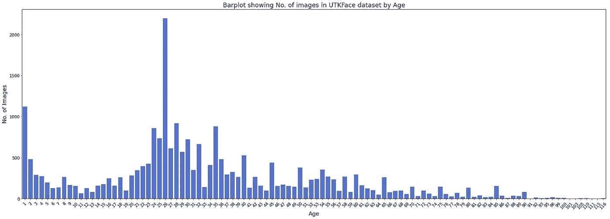

UTKFace 数据集中年龄的分布和范围。(图片由作者提供)

由于两个数据集都已经提供了标准化为 200x200 像素大小的清晰正面人脸图像(每张图像一张)，因此**我决定为这个项目将两个数据集合并在一起，并将所有 33，486 张图像转换为标准的 JPG 格式**。下面的柱状图显示了合并两个数据集后的图像分布。

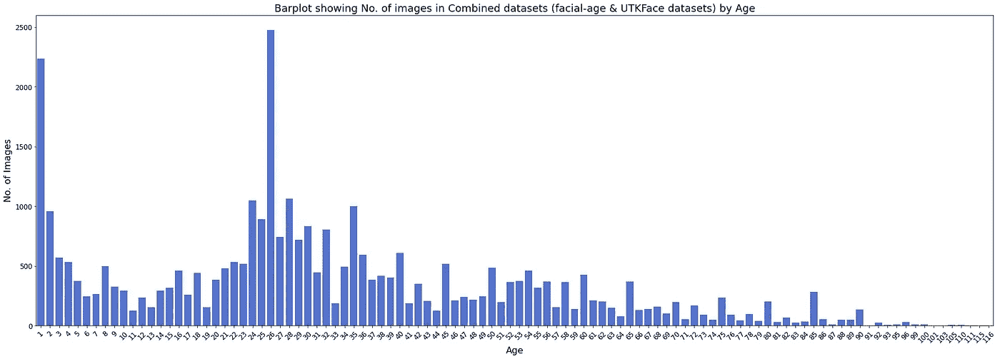

人脸年龄数据集和 UTKFace 数据集合并后的图像分布。(图片由作者提供)

在合并了两个数据集之后，下一步是将不同的年龄标签划分为不同的年龄范围。因为这个项目不是专门针对解决任何特定的数据科学问题，所以选择将年龄范围划分为不同的类别是非常灵活的。然而，仍有必要确定该项目背景下这一进程的一些制约因素，如下所示:

1.  **类别需要*平衡*** —年龄范围的类别应根据每个年龄标签可用的图像数量来建立，以使类别尽可能平衡。*这将确保分类模型学会平等地对每个年龄范围进行分类。*
2.  **班级数量需要*足够***——年龄范围的班级数量需要适当选择。太多的类别将导致非常窄的年龄范围，这可能会严重影响模型性能(通常更难预测某人的年龄精确到哪一年)。太少的类将导致非常宽的年龄范围，这可能不符合年龄分类建模本身的目的。在这种情况下，6–12 个等级可能是合适的。
3.  **每个类别都需要有*足够的数据***——年龄范围类别的数量也将取决于数据集中每个类别可用的图像数量。*太多的类别将导致狭窄的年龄范围，从而减少可用于在每个类别上训练模型的图像数量。*然而，这可能不是一个重要因素，因为*数据扩充*技术很容易获得，如果需要，可以用来增加每类可用图像的数量。

**警告** —上面确定的约束意味着在这个项目中，我使用可用数据量作为定义我的分类问题性质的驱动因素。在现实世界的数据科学问题中，这可能不是一种理想的方法。实际上，理想的方法是首先根据手头的数据科学问题建立模型的类，然后为每个类收集足够数量的数据，以便适当地解决数据科学问题。然而，考虑到这个项目的业余性质，以及我对用于年龄分类的现成面部图像数据的有限访问，我相信这种方法在这种情况下是合理的。

经过反复试验，我决定将这些图片分成以下 11 类年龄范围，确保这些类别尽可能平衡。

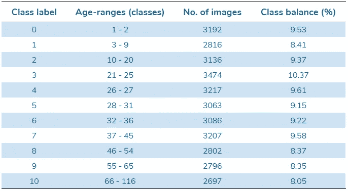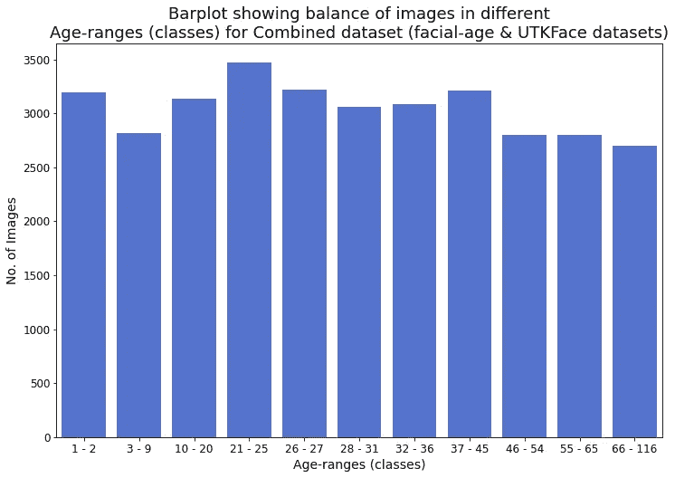

图像按年龄范围分类的分布。(图片由作者提供)

在进行下一步之前，所有的图像都标有这些新的类别标签。

# 分类建模的数据准备

在对图像执行任何形式的分类或特征提取之前，有必要将组合数据集分成训练数据集和测试数据集。我使用了[*sk learn . model _ selection . train _ test _ split*](https://scikit-learn.org/stable/modules/generated/sklearn.model_selection.train_test_split.html)方法**将数据集拆分成 70%的训练数据(23440 张图片)和 30%的测试数据(10046 张图片)**。

本节相关代码参见笔记本***2 _ dataset _ prep _ ML _ feature _ extraction . ipynb***。

# 传统 ML:特征提取

有多种技术可用于处理从图像中提取特征以进行分类建模(例如，[方向梯度直方图(HOG)](https://www.youtube.com/watch?v=4ESLTAd3IOM) ，[滤波图像的能量和熵](https://youtu.be/V724O1yc0yU)，[通道的平均像素值](https://www.analyticsvidhya.com/blog/2019/08/3-techniques-extract-features-from-image-data-machine-learning-python/)等)。).作为初学者，我确实发现所有这些方法理解起来有点复杂，用代码实现起来也有点复杂。

为了从我的项目的面部图像中提取特征，我决定对我的数据集中的一些图像应用一些不同的过滤器，并在视觉上尝试找出它们之间的任何显著差异。下图显示了该测试的结果。我强烈建议观看[这个视频](https://youtu.be/XmRKkMjD8hM)和[这个系列的其他视频](https://www.youtube.com/playlist?list=PLZsOBAyNTZwaQB9nUTYUYNhz7b22bAJYY)，以更好地了解如何应用过滤器和处理机器学习的图像。

本节相关代码参见笔记本***2 _ dataset _ prep _ ML _ feature _ extraction . ipynb***。

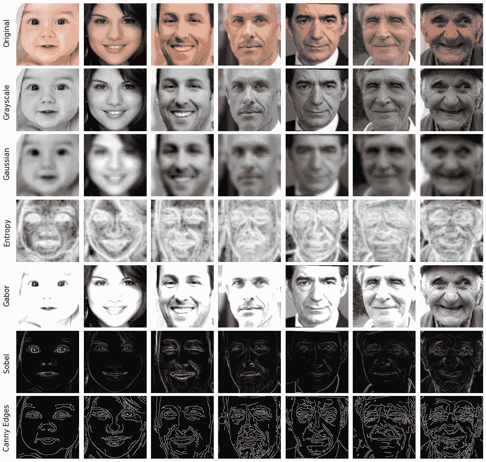

来自面部年龄数据集的面部图像的过滤版本。(图片由作者提供)

上图中的人脸随着我们从左到右(1-90 岁)年龄的增加而增加。当每个过滤器被应用于图像时，我们可以看到不同的面部特征是如何被突出显示的，以及它们是否有助于区分不同年龄的面部。

从上面的图中，我能够得出结论，在这种情况下，Canny 边缘可能是最有用的特征提取过滤器— **随着我们从年轻到年长的人脸，图像中 Canny 边缘的密度似乎会增加**。

既然选择的过滤器已经确定，下一步就是将过滤后的图像转换成标量，以便能够将它们输入到机器学习分类器中。为此，我决定**将每个 200x200 像素的图像分解成每个 10x10 像素的部分**，如下图所示。对于 400 个结果部分中的每一个，我**然后计算像素值的平均值和标准偏差**。这导致每幅图像有 800 个唯一的标量值，然后我将它们制成数据帧，用作机器学习分类器的特征。

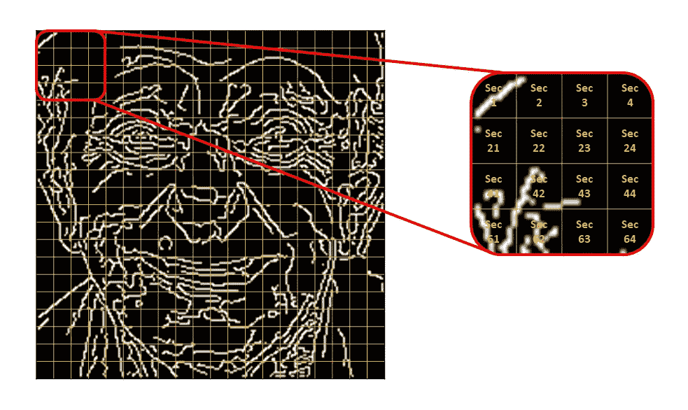

将显示 Canny 边缘的图像分解为多个部分以进行特征提取。(图片由作者提供)

# 传统 ML:分类建模

对训练和测试数据集中的所有图像重复上述特征提取过程。这些特征然后被用在两个不同的分类器算法中，[*sk learn . ensemble . randomforestclassifier*](https://scikit-learn.org/stable/modules/generated/sklearn.ensemble.RandomForestClassifier.html)和 [*sklearn.svm.SVC*](https://scikit-learn.org/stable/modules/generated/sklearn.svm.SVC.html) 。通过将超参数的多个组合传递给 [*sklearn.model_selection，这两个模型都进行了精度优化。GridSearchCV*。下表总结了所获得的结果。](https://scikit-learn.org/stable/modules/generated/sklearn.model_selection.GridSearchCV.html)

本节相关代码参见笔记本***3 _ ML _ class ification _ modeling . ipynb***。

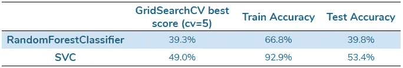

显然，**模型严重过度拟合，并且不能很好地概括看不见的测试数据**(基本上是记忆训练数据)。下面的两个标准化混淆矩阵也清楚地表明了这一点——尽管对于较年轻的年龄范围(1-2 岁、3-9 岁、10-20 岁和 21-25 岁)和较老的年龄范围(66-116 岁)来说，准确性值有些高，但是对于 26-65 岁的中间年龄范围来说，存在着显著的错误分类。

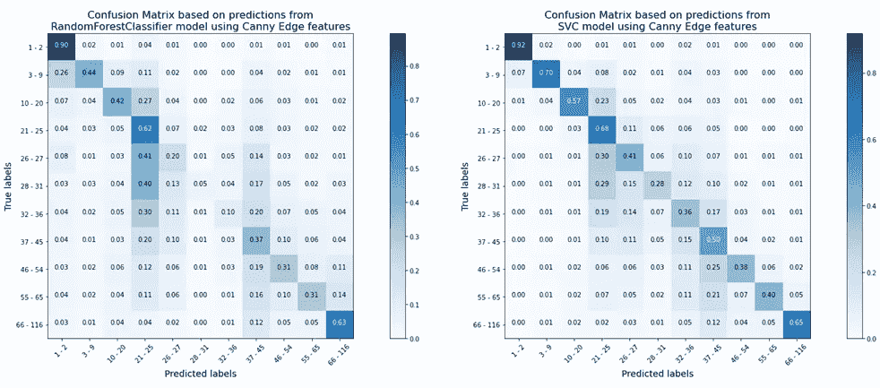

RandomForestClassifier 和 SVC 模型年龄预测的标准化混淆矩阵。(图片由作者提供)

# 传统 ML:局限性及进一步改进

当然，有许多方法可以用来提高上述准确度分数并降低模型中的过度拟合程度。例如，可以使用一些其他更复杂的技术从图像中提取更好的区分特征，或者可以使用其他分类器来查看它们在这种情况下是否执行得更好。

# 深度学习:导入数据集

为了准备要传递到神经网络中的图像数据集，我首先尝试将图像转换成一个 **Pandas Dataframe** ，其中各个像素值作为列，图像作为行。然而，由于所有像素值都必须是浮点类型(从 0–255 整数缩小到 0–1 浮点)，这导致了一个**巨大而沉重的数据帧** (33，486 行 X 40，000 列)。就在训练神经网络之前将该数据帧加载到内存中导致了持续的**“内存不足”错误(尽管使用了 Google Colab Pro 中可用的 GPU 和 25GB 高 RAM 运行时类型)**。

为了避免这些错误，我不得不采用另一种方法，即使用 TensorFlow 的内置 [***来创建**数据集管道。数据集*****](https://www.tensorflow.org/api_docs/python/tf/data/Dataset) **API。**这种方法**显著降低了 RAM 消耗**，因为当神经网络需要图像时，图像只以小得多的批量加载到存储器中(而不是像前一种方法那样将整个数据集保存在存储器中)。关于这种方法的更详细的解释可以在这篇文章[中找到。](/how-to-use-dataset-in-tensorflow-c758ef9e4428)

# 深度学习:分类建模

在正确导入数据集后，下一步是构建一个基本的**卷积神经网络(CNN)模型**，该模型在给定的数据和给定数量的总参数上具有合理的精度。**我们的想法是获得模型性能的初始基准，然后逐步尝试不同的技术，看看它们是否能从该点提高性能。在对 CNN 架构做了一些反复的实验后，我决定从下面的架构开始。**

本节相关代码参见笔记本***4 _ deep _ learning _ CNN _ modeling . ipynb***。

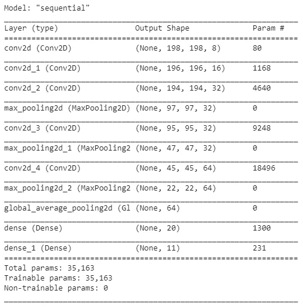

用于图像年龄分类的初始 CNN 结构。(图片由作者提供)

我决定在训练 CNN 模型时使用[*TF . keras . callbacks . early stopping*](https://www.tensorflow.org/api_docs/python/tf/keras/callbacks/EarlyStopping)作为回调，以监控验证损失，从而避免过度拟合，并在验证损失开始持续增加时停止模型的进一步训练。在适合这个模型之前，图像也被从 RGB 彩色转换成灰度。在拟合 30 个时期的模型后，获得以下损失和准确度分数。

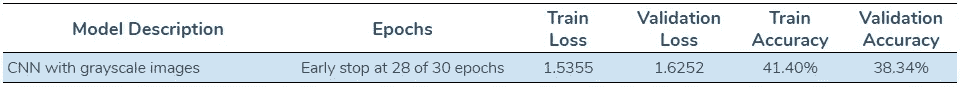

模型性能不是很好，但这是一个很好的起点，只有轻微的过度拟合。标准化混淆矩阵还显示，与上述传统 ML 方法类似，尽管年轻年龄范围(1-2 岁、3-9 岁、10-20 岁和 21-25 岁)和年长年龄范围(66-116 岁)的准确度值有些高，但 26-65 岁的中间年龄范围仍存在显著的错误分类。这可能归因于这样一个事实，即人们的面部外观(一般而言)在中年时期的变化不如在年轻和老年时期那么大。无论如何，这个过程的下一步是使用一些不同的技术来提高模型的性能。

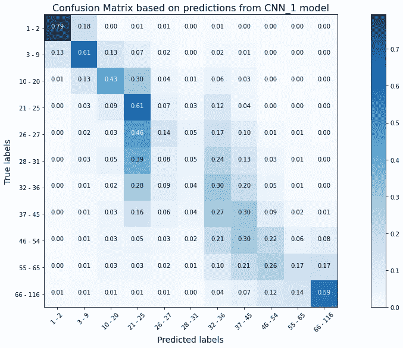

使用灰度图像从初始 CNN 模型预测年龄的标准化混淆矩阵。(图片由作者提供)

# 深度学习:改进模型

首先尝试了以下两种策略来提高模型的性能:

1.  **使用 RGB 彩色图像而不是灰度图像**:其背后的基本原理是，在图像中添加彩色数据可能会显示 CNN 模型中的一些特征，这可能会增强模型的整体性能。
2.  **增加训练数据集中的图像:**这背后的[基本原理](/data-augmentation-experimentation-3e274504f04b)是增加模型训练的数据量将有助于增加数据集中的方差。这可以提高模型的准确性，同时降低过度拟合的可能性。对于每 1 幅原始图像，通过横向翻转图像并将它们旋转不同角度，创建了 9 幅其他增强图像，如下图所示。因此，增强的训练数据集总共有 234，400 幅图像(相比之下，原始训练数据集中有 23，440 幅图像)。

训练数据集数据扩充的相关代码参见笔记本***4 _ 5 _ training _ data _ augmentation . ipynb***。

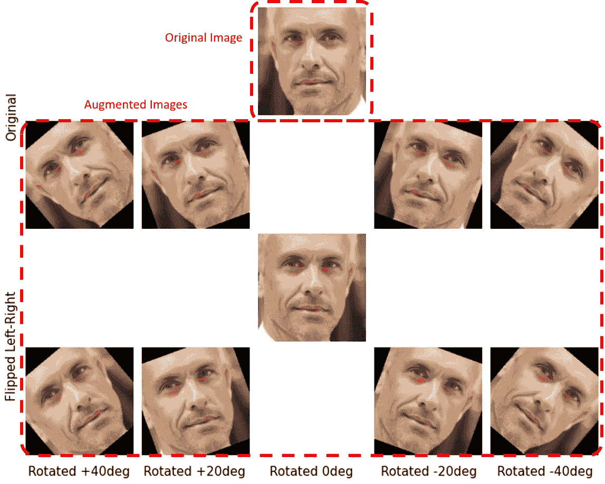

图像数据增强:从一幅原始图像创建 9 幅增强图像。(图片由作者提供)

使用与上述相同的 CNN 模型架构来拟合 RGB 彩色图像和增强训练数据集上的模型，并且观察到以下结果:

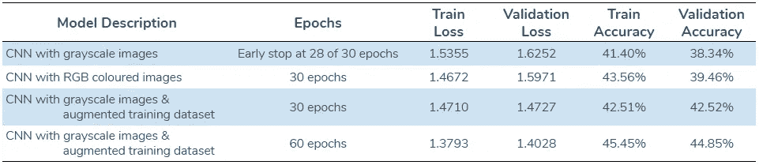

上表中的准确度分数强调了两个关键发现:

1.  **使用 RGB 彩色图像代替灰度图像可能不会提高模型性能，并且可能会导致更多的过度拟合。**
2.  **增加训练数据集中的图像有助于提高模型的准确性，同时减少过度拟合(即使在训练 60 个时期后)。**

# 深度学习:重新思考年龄范围

看一下上面所有 CNN 模型的评估，很明显准确率不是很高(最多 45%)。事实上，这是意料之中的，因为猜测一个人的年龄纯粹是基于外表，因此非常主观。就连我们人类也一直在与这个问题做斗争。有很多因素会影响一个人如何看待自己的年龄，比如遗传、生活条件和生活方式的选择(健康饮食、运动量、吸烟习惯等)。).

正如我们在上面看到的，即使增加了数据，准确率也没有显著提高。主要问题仍然是 26-65 岁这一中间年龄范围存在明显的错误分类。因此，为了避免这个问题，**我决定再次将年龄范围重新分配到班级中。然而，这一次，我并不只是查看每个年龄范围内的可用图像数量，我还决定考虑人类直觉因素(我们人类可能将一个人归类到的年龄组)以及上面混淆矩阵中显示的各个类别的准确度分数。**

**警告** —上面详述的方法意味着在这个项目中，我操纵了数据科学问题本身，以更好地适应我试图提出的解决方案。在现实世界的大多数数据科学问题中，这显然不是一种理想的方法。然而，正如在开始提到的，由于这个项目不是专门针对解决一个数据科学问题的，所以选择将年龄范围划分成类是非常灵活的。考虑到重新分配年龄检测的年龄范围类别不会产生重大后果，我认为这种方法在这种情况下是合理的。

年龄范围被重新分为以下 7 类。

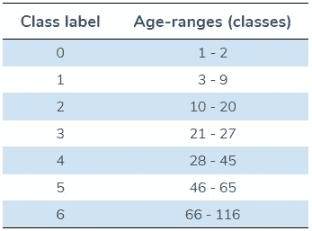

本节相关代码参考笔记本***4 _ deep _ learning _ CNN _ modeling . ipynb***。

再次使用与上述相同的 CNN 模型架构来拟合训练数据集上的模型，并且观察到以下结果:

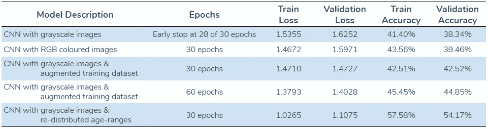

准确性分数显示了与第一个 CNN 模型在灰度图像上的拟合(这是预期的)相似的过度拟合程度，但是准确性分数本身明显更高。下面的标准化混淆矩阵还表明，我们可能已经解决了 26-65 岁这一中间年龄范围的错误分类问题(至少在一定程度上，如果不是完全的话)。

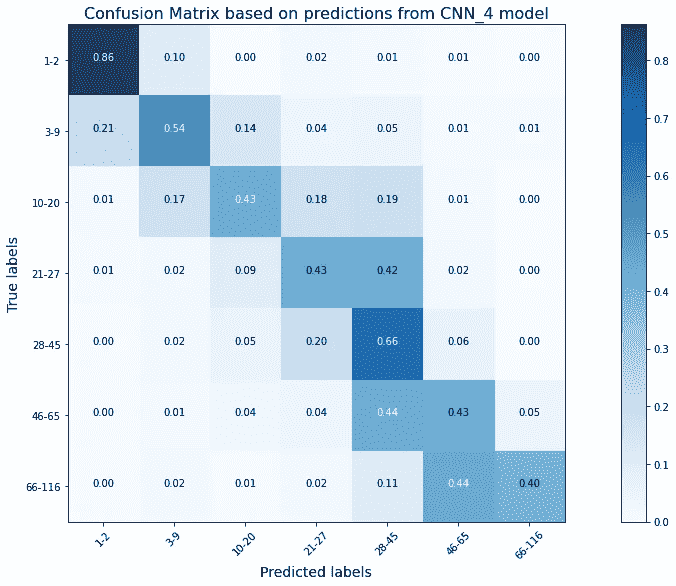

使用灰度图像和年龄范围的重新分布类别从初始 CNN 模型进行年龄预测的标准化混淆矩阵。(图片由作者提供)

# 深度学习:优化 CNN 架构

既然我已经探索了一些操纵数据集以提高 CNN 模型性能的技术，我决定优化 CNN 模型体系结构本身以提高整体性能。这里的想法是设计不同架构的多个模型，并比较它们在损耗和精度值方面的性能。我决定在训练多个 CNN 模型时使用[*TF . keras . callbacks . tensor board*](https://www.tensorflow.org/api_docs/python/tf/keras/callbacks/TensorBoard)作为回调，以便能够比较它们在交互式(肯定更直观)剧情中的表现。我强烈建议观看这个[系列视频](https://www.youtube.com/playlist?list=PLQVvvaa0QuDfhTox0AjmQ6tvTgMBZBEXN)，以更好地了解如何使用 TensorBoard 优化神经网络。

本节相关代码参见笔记本***4 _ deep _ learning _ CNN _ modeling . ipynb***。

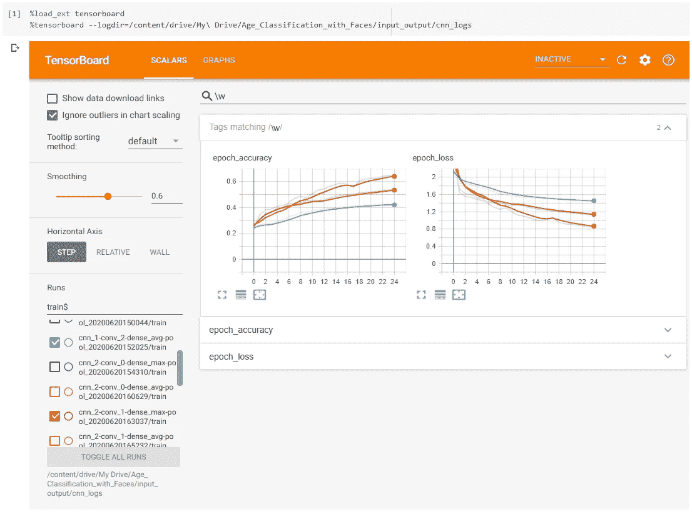

使用 TensorBoard 优化 CNN 架构以比较不同模型的性能。(图片由作者提供)

基于优化结果，在**比较了 18 种不同 CNN 模型和不同 Conv2D 和密集层数的不同架构**后，最终选择的 CNN 架构如下所示。

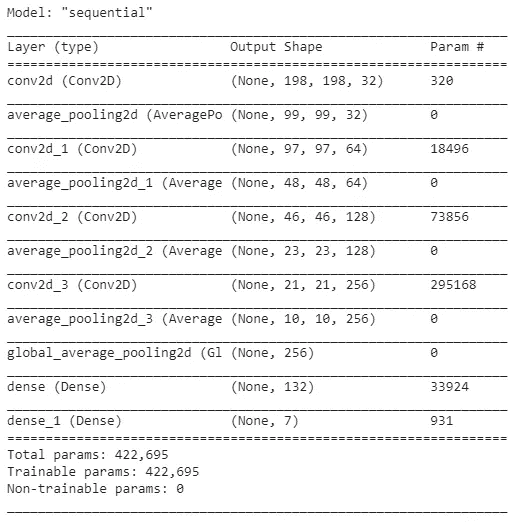

图像年龄分类的最终 CNN 结构。(图片由作者提供)

# 深度学习:构建最终模型

因此，在理解了所有上述技术对模型性能的影响之后，现在可以定义和训练最终的 CNN 模型:

1.  用**灰度图像**代替 RGB 彩色图像。
2.  用**增强的训练数据集(234，400 张图像)**代替原始训练数据集(23，440 张图像)。
3.  对于 **60 个时期**。
4.  对于**重新分配的年龄范围等级**。
5.  采用**优化架构**。

本节相关代码参见笔记本***5 _ deep _ learning _ final _ CNN _ model . ipynb***。

我决定在训练最终的 CNN 模型时使用[*TF . keras . callbacks . model check point*](https://www.tensorflow.org/api_docs/python/tf/keras/callbacks/ModelCheckpoint)作为回调，以便能够保存模型，因为它在 60 个时期内继续训练和改进性能。**该模型的性能在 60 的第 54 时段达到峰值，损失和精度值如下。**

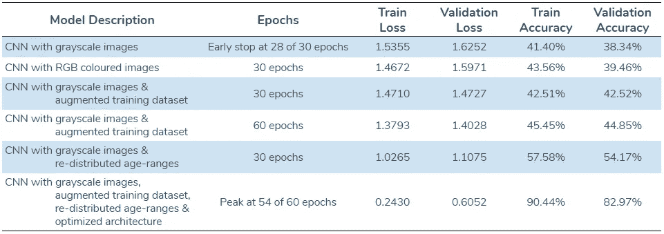

准确度分数显著提高，尽管有轻微程度的过度拟合，这可能仍然是可接受的。下图显示了 CNN 模型经过 60 个时期的训练后，损失和准确性得分的变化。下面的标准化混淆矩阵也显示了 26-65 岁这一中间年龄段的错误分类显著减少。

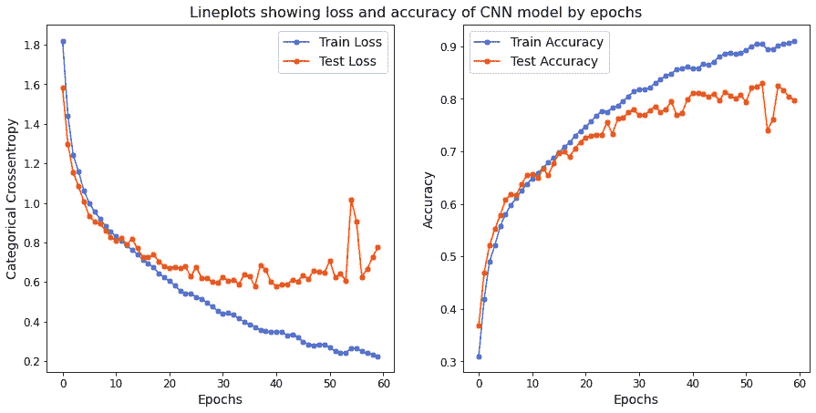

该图显示了在 60 个时期中的第 54 个时期出现峰值性能时损耗和精度值的变化。(图片由作者提供)

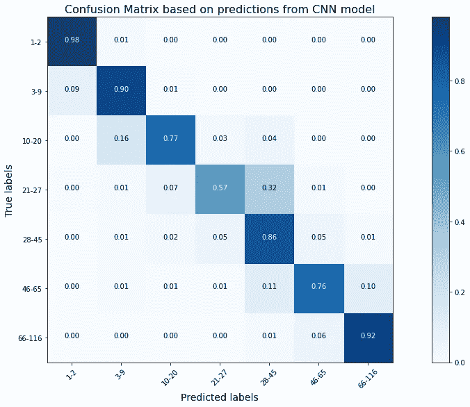

使用灰度图像从最终 CNN 模型预测年龄的标准化混淆矩阵。(图片由作者提供)

# 深度学习:局限与进一步改进

与任何数据科学工作流一样，上面介绍的深度学习方法也有其自身的局限性。例如，这个项目中使用的数据集只有大约 33，000 张图片。CNN 模型可以用图像中有更多变化的大得多的数据集来训练，以便获得甚至更好的结果。该项目的另一种方法是使用迁移学习(使用预训练神经网络的权重)，而不是从头开始创建和训练神经网络。

# 那么，哪种方法——传统的人工智能还是深度学习？

在这种情况下使用传统的机器学习方法，尽管是可能的，但并没有产生具有非常高准确度分数的模型。此外，这种方法需要大量的领域知识和图像数据处理专业知识，以便从图像中提取大量特征用于分类模型。

另一方面，深度学习和神经网络方法不需要任何重要的领域知识和图像处理专业知识，因为它不需要手动提取任何图像特征。这种方法也产生了具有更高准确度分数的更好的执行模型。因此，这个项目中两种方法之间的比较突出了神经网络深度学习的真正力量和可能性，并让我(希望你也是)更好地理解了它们近年来越来越受欢迎的背后。

所以你有它！我希望你喜欢阅读我的第一次计算机视觉冒险，我希望它能让你更好地理解如何处理这样一个性质的项目。如果您有任何问题或建议，告诉我如何以更好的方式处理此事，请务必告诉我。

另外，请随时在 [LinkedIn](https://www.linkedin.com/in/prerakagarwal/) 上与我联系。

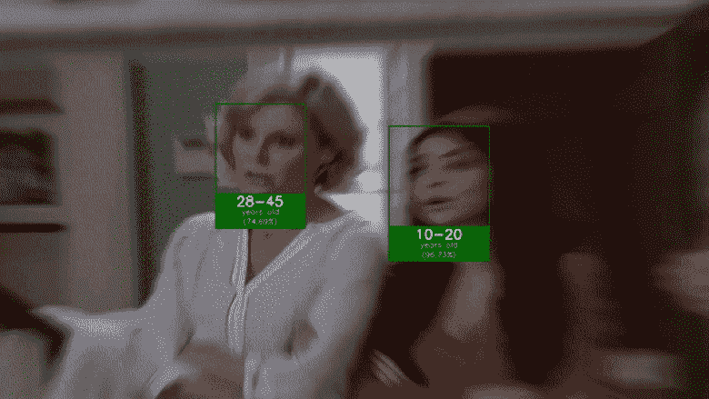

普里切特大家庭的年龄分类。(视频来源:摩登家庭，ABC)