# 基于主体的新冠肺炎卫生经济效应模拟

> 原文：<https://towardsdatascience.com/agent-based-simulation-of-covid-19-health-and-economical-effects-6aa4ae0ff397?source=collection_archive---------18----------------------->

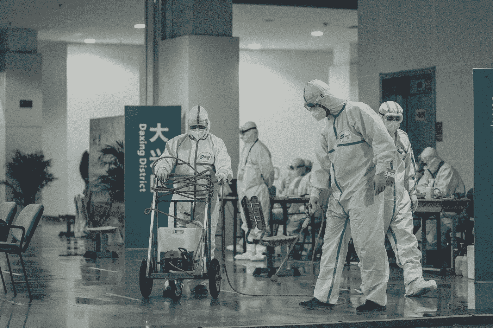

特德沃德·奎恩在 [Unsplash](https://unsplash.com/collections/9795724/saude-health?utm_source=unsplash&utm_medium=referral&utm_content=creditCopyText) 上拍摄的照片

## 开始之前

这篇文章是发表在论文[“COVID-ABS:一个基于代理人的新冠肺炎流行病模型，模拟社会距离干预的健康和经济影响”](https://doi.org/10.1016/j.chaos.2020.110088)中的内容的先前(和更基本的)版本，也可作为 arXiv 中的[预印本获得。](https://arxiv.org/abs/2006.10532)

我们正生活在一个不寻常的时代，人类正受到一种微生物的攻击，这种微生物威胁着我们的健康(身体和精神)、经济、社会福利等。从短期到中期，所涉及的变量数量及其关系的复杂性正使人们疯狂地去理解他的局部行动在未来全球情景中的影响。但是我们如何预测这些未来的情景呢？政府如何知道采取这些保护措施的积极效果？

嗯，这个问题有很多可能的答案。首先，我们必须定义一个生活在领地之上的社会是一个[复杂的](https://en.wikipedia.org/wiki/Complex_system)和[动力系统。](https://en.wikipedia.org/wiki/Dynamical_system)这类系统具有许多相互作用的变量，呈现非线性行为，其性质随时间演化。它的行为通常是随机的，它也可能依赖于它的初始条件，它可能受到邻近社会(具有不同的政策和动态)的影响，它可以显示出[涌现](https://en.wikipedia.org/wiki/Emergence)。

A [基于智能体的模拟](https://en.wikipedia.org/wiki/Agent-based_model)是模拟这些动态复杂系统的一个很好的选择，因为它实现简单，与过去事件的真实数据相比，结果准确。还因为我们可以通过对模拟环境变量进行干预来设计场景，并测量其效果。

现在我们将假设[离散事件](https://en.wikipedia.org/wiki/Discrete-event_simulation)用于我们的模拟，这意味着时间和系统的组件是离散的和原子的。更具体地说，基于代理的模拟(ABS)由一群代理组成，在代理运行和交互的循环中。每个代理都被认为是自治的，因为它有自己的内部状态，但是所有代理共享一个公共环境。状态变量驱动每个代理的行为，它们必须代表问题的特征。

ABS 用于模拟复杂的动态系统，使用其组件的单个状态来检测由于迭代过程中代理之间的相互作用而出现的全局行为。然后，它的主要目标是模拟系统的时间演化，存储每次迭代中从代理的内部状态导出的统计数据。ABS 允许我们模拟具有复杂的非线性变量关系、复杂的条件和限制的系统，这些系统可能很难用数学来描述。

如果说ABS 的主要优点是灵活性，另一方面，它的主要缺点是计算成本高。拥有一个封闭形式的方程(在动力系统的情况下是 ODE ),或者甚至用蒙特卡罗马尔可夫链模型进行随机模拟要便宜得多。然而，如前所述，我们并不总是能够做到这一点

我们将采用 ABS 来模拟一个动态已知的系统，用 [SIR 模型](https://www.maa.org/press/periodicals/loci/joma/the-sir-model-for-spread-of-disease-introduction)及其变体来表示。

# 流行病模拟概述

照片由 [Yohann LIBOT](https://unsplash.com/@yohannlibot?utm_source=unsplash&utm_medium=referral&utm_content=creditCopyText) 在 [Unsplash](https://unsplash.com/s/photos/pandemic?utm_source=unsplash&utm_medium=referral&utm_content=creditCopyText) 上拍摄

首先，我们来决定要模拟什么。流通引起的传染性传播和社会隔离的经济影响是我们的主要目标。

## 人口统计学

首先，我们需要生成具有国家人口相同特征的代理人(即人)。年龄 的 [***分布可以在***](https://en.wikipedia.org/wiki/Population_pyramid)***[https://www.census.gov/prod/cen2010/briefs/c2010br-03.pdf](https://www.census.gov/prod/cen2010/briefs/c2010br-03.pdf)或者更容易在[https://www.indexmundi.com/united_states/age_structure.html](https://www.indexmundi.com/united_states/age_structure.html)找到。我们可以用一个参数α= 2，β= 5 的 [Beta 概率分布](https://en.wikipedia.org/wiki/Beta_distribution)来表示这些分布，比如 ***age ~β(2，5)*** 。***

## 传染性传播

C OVID-19 是一种高度传染性疾病，根据伦敦帝国理工学院新冠肺炎反应小组的[报告 3:2019-nCoV](https://www.imperial.ac.uk/media/imperial-college/medicine/mrc-gida/2020-01-25-COVID19-Report-3.pdf)，*“截至 2020 年 1 月 18 日，平均每个病例感染 2.6(不确定范围:1.5-3.5)个其他人”。*

遵循 SIR 模型，每个代理必须处于以下情况之一:**易感**、**感染**、**痊愈**(也用于免疫人群)。每个模拟都有一个感染和免疫人群的初始百分比，其余人群由易感个体组成。该状态还包含死亡状态，对于那些出现 SARS-COVID-2 的严重症状并且没有抵抗的代理。

传染性传播的主要假设是媒介通过接近或接触而相互作用。因此，一个人的流动性越高，他接近感染者并被感染的可能性就越大。每个模拟都有一个**传染距离**，这是两个媒介发生病毒传播的最小距离。

T 受感染病原体医学状况的演变遵循一些现有的论文，如[对新冠肺炎病严重程度的估计](https://doi.org/10.1101/2020.03.09.20033357)、[2019 年严重程度-新型冠状病毒(nCoV)](https://www.imperial.ac.uk/media/imperial-college/medicine/mrc-gida/2020-02-10-COVID19-Report-4.pdf) 等。一旦一个病原体被感染，它可能处于以下子状态之一:**无症状**(也用于不住院的轻微症状)**住院**和**严重**(在重症监护室住院的情况)。状态转换图如下所示:

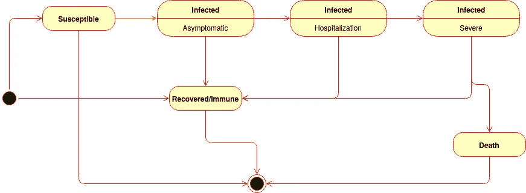

来源:作者

医疗状况的演变是随机的，并遵循下表的概率:

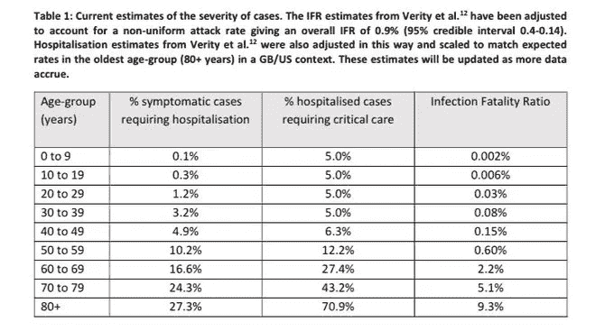

来源:[非药物干预(NPIs)对降低新冠肺炎死亡率和医疗保健需求的影响](https://doi.org/10.25561/77482)

这些住院意味着使用有限的医疗基础设施。每个模拟都有 ***临界极限*** ，即医疗保健系统能够同时处理的人口百分比。当住院和重症病例的数量超过这个限度时，就没有足够的空间给每个有需要的人了。

## 流动模式

模拟在所有代理共享的方形二维环境中进行。每个代理在这个环境中被随机初始化，例如***x ~ 𝓤(0,length)****和****y ~ 𝓤(0,height)****。*

每个模拟通过每个可能的代理状态定义其移动性**振幅**。然后，在每次迭代中，每一个智能体还会在环境中随机移动，例如其位置的增量由***【δx ~𝓝(0,1】)*振幅*** 和*【δy ~𝓝(0,1】)*振幅* *定义。*

使用欧几里德距离计算两个代理 a1 和 a2 之间的接近度，例如***(a1，a2)=√((a1 . x-a2 . x)+(a1 . y-a2 . y))***

所有死亡的代理和所有感染且感染严重性等于住院或严重的代理的***δx 和δy 自动设置为零。***

## 经济影响

埃德温·胡珀在 [Unsplash](https://unsplash.com/s/photos/covid-19?utm_source=unsplash&utm_medium=referral&utm_content=creditCopyText) 上的照片

第二个目标是模拟流动性限制对经济造成的影响——特别是对每个代理人的**收入**和**财富**的影响。这种模拟的经济动力学的基本假设是:*代理人的* ***收入*** *是其流动性*的函数。在现实世界中，有许多情况下这个条件不成立，人们仍然在家工作。但遗憾的是，情况并非总是如此。然后，代理的移动性由距其先前位置的欧几里德距离来定义，使得**移动性=*√(δx+δy)。***

在模拟的初始化过程中，代理人的财富遵循相同的社会分布，根据****的财富分布分享初始数量的总财富。这种分布是用五分位数来衡量的，每个五分位数代表一个社会阶层:20%的最贫困者，贫困阶层，工人阶级，富裕阶层，20%的最富有者。这些信息可以在 https://data.worldbank.org/topic/poverty,找到，这里有一个五分位收入分配的例子:[https://www . world bank . org/en/topic/poverty/lac-equity-lab 1/income-inequality/composition-by-quintile](https://www.worldbank.org/en/topic/poverty/lac-equity-lab1/income-inequality/composition-by-quintile)。我们可以很容易地用一条[洛伦兹曲线](https://en.wikipedia.org/wiki/Lorenz_curve)来表示这种分布，并对社会阶层的百分位数进行均匀抽样，如 ***财富~洛伦兹【𝓤(0,100】/5****]，其中/表示整数除法* ***。*******

*我们定义一个固定值来代表最低收入，最低收入是由第一个五分位数(20%最穷)定义的，它将被用作每个阶层的支出和收入的单位。例如，minimal_income[20%最穷] = 1，minimal_income[20%最富] = 14。*

*在的每次迭代中，每个代理人的**财富**减少其**最小固定支出**，最小收入单位中的常数与其实际财富成比例，例如**支出= *最小 _ 收入【财富五分位数】。*** *还有，*在每一次迭代中，财富都是由代理人每天的收入来增加的。**收入**是一个随机值，与其实际财富、流动性(或经济活动)和随机比率(对应于他们业务的不确定性——盈亏交替)成比例。然后，最后的收入用**收入~ *𝓝(0,1) *流动性* minimal_income【财富五分位数】表示。****

## *超越*

*可以提出许多其他问题和假设来探讨这个问题的不同方面。只是列举一些未来扩展的可能性:*

*   *交通限制对环境和碳排放会有什么影响？*
*   *全球变暖会受到这种减少的影响吗？*
*   *电力负荷需求会因为工业活动的限制而减少吗？还是会因为国内支出的增长而增加？*

*这里没有探讨这些问题，我们将在我们工具的未来版本中给出这些答案。*

# *给我看看代码！*

> *“空谈是廉价的。给我看看代码！”*(莱纳斯·托沃兹)**

**

*照片由 [Hitesh Choudhary](https://unsplash.com/@hiteshchoudhary?utm_source=unsplash&utm_medium=referral&utm_content=creditCopyText) 在 [Unsplash](https://unsplash.com/s/photos/source-code?utm_source=unsplash&utm_medium=referral&utm_content=creditCopyText) 上拍摄*

*我们的模拟是使用 Python3 编程语言实现的，使用库 [matplotlib](https://matplotlib.org/) 进行绘图， [Numpy](https://numpy.org/) 进行随机采样， [Pandas](http://pandas.pydata.org/) 进行数据处理。所有代码最初都是使用 [Google Colab](http://colab.research.google.com/) 框架开发和执行的。为了增加其重用性，基础代码被转移到 github 库[https://GitHub . com/petroniocandido/covid 19 _ AgentBasedSimulation](https://github.com/petroniocandido/COVID19_AgentBasedSimulation)，实验可以在[http://bit.ly/covid19_abs.](http://bit.ly/covid19_abs)执行。covid19_abs 包可以使用 pip 工具直接从 GitHub 库轻松安装。*

*通过年龄和财富分布控制感染严重度概率的全局变量封装在 [**通用**](https://github.com/petroniocandido/COVID19_AgentBasedSimulation/blob/master/covid_abs/common.py) 包中。*

*所有与代理状态相关的东西都封装在 [**代理**](https://github.com/petroniocandido/COVID19_AgentBasedSimulation/blob/master/covid_abs/agents.py) 包中。可能代理的主要状态由 [**状态**](https://github.com/petroniocandido/COVID19_AgentBasedSimulation/blob/75842084e31ffd3f02ae0a19678fb6091e38be34/covid_abs/agents.py#L4]) 枚举表示，被感染代理的具体情况由 [**感染严重性**](https://github.com/petroniocandido/COVID19_AgentBasedSimulation/blob/75842084e31ffd3f02ae0a19678fb6091e38be34/covid_abs/agents.py#L14) 枚举控制。*

*类 [**Agent**](https://github.com/petroniocandido/COVID19_AgentBasedSimulation/blob/75842084e31ffd3f02ae0a19678fb6091e38be34/covid_abs/agents.py#L20) 作为一个数据结构工作，包含每个 Agent 的状态值，包括状态、感染严重度、年龄、位置(x 和 y)和财富五分位数。*

*基于代理的仿真的主要类封装在 [**abs**](https://github.com/petroniocandido/COVID19_AgentBasedSimulation/blob/master/covid_abs/abs.py) 包中。类**实现了模拟动力学的所有主要方面，作为主要的模拟属性，代理的群体及其事件(移动、状态更新、与其他代理的联系)。***

***Simulation 类的主要方法是 [**execute()**](https://github.com/petroniocandido/COVID19_AgentBasedSimulation/blob/75842084e31ffd3f02ae0a19678fb6091e38be34/covid_abs/abs.py#L146) ，表示一个唯一的模拟迭代，执行所有 agents 的状态更新，调用其事件和交互。execute()方法还更新人口的统计数据，这是一个包含每种状态的人口百分比、感染率和每个社会阶层的财富数量的字典。***

***类模拟还包括两种类型的**触发器**，帮助我们在达到某些特殊条件时对模拟动态进行干预。第一种触发器是针对群体的，它针对每个代理进行测试，并且能够改变其任何状态变量。第二种触发器是针对模拟本身的，并在每次迭代中进行测试。***

***The class[**multi population Simulation**](https://github.com/petroniocandido/COVID19_AgentBasedSimulation/blob/75842084e31ffd3f02ae0a19678fb6091e38be34/covid_abs/abs.py#L224)是一个模拟对象的集合体，其中一个具有其动态性，但其种群之间具有相互作用。此类允许我们模拟更复杂的情况，如两个(或更多)相邻和重叠的群体(其中每个模拟在多群体模拟环境中的位置表示它们之间的交互水平)实施不同的控制策略。在这种情况下，每个模拟都会影响其他模拟，并受到其他模拟的影响。***

***数据可视化的东西封装在 [graphics](https://github.com/petroniocandido/COVID19_AgentBasedSimulation/blob/master/covid_abs/graphics.py) 包中，包括主方法[**execute _ simulation**](https://github.com/petroniocandido/COVID19_AgentBasedSimulation/blob/75842084e31ffd3f02ae0a19678fb6091e38be34/covid_abs/graphics.py#L111)，被调用来运行仿真和绘制图形。***

# ***一些初步结果***

***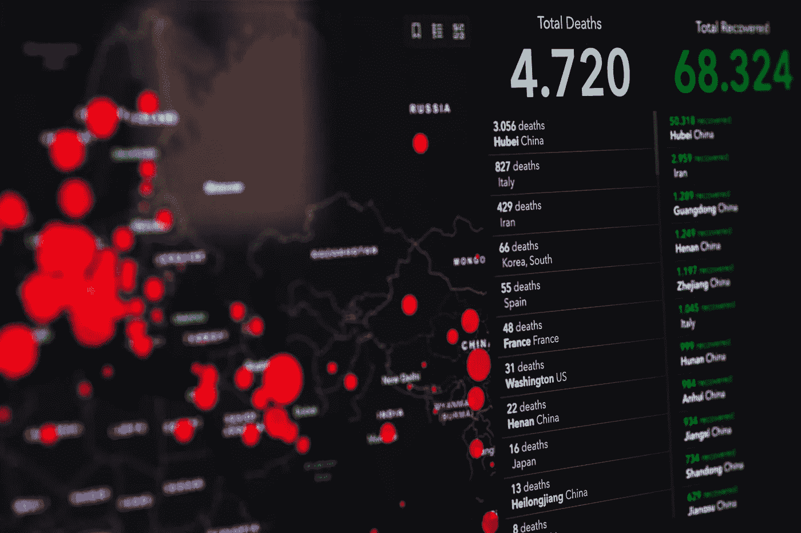***

***由[马库斯·斯皮斯克](https://unsplash.com/@markusspiske?utm_source=unsplash&utm_medium=referral&utm_content=creditCopyText)在 [Unsplash](https://unsplash.com/s/photos/pandemic?utm_source=unsplash&utm_medium=referral&utm_content=creditCopyText) 上拍摄***

***考虑到随机组件的数量，每个模拟执行都是唯一的。然而，尽管有小的特异性和罕见的异常值，一般行为——给定相同的参数集——不会变化太多。正如蒙特卡罗方法中发生的那样，考虑到平均行为及其变化，ABS 必须执行多次以产生合并结果。***

***下面我们讨论 5 个可能的场景，每个场景由一组控制代理移动模式的模拟参数组成，旨在模拟隔离存在或不存在的影响。我们精心选择了一个有代表性的执行来演示模拟的一般行为，但是也执行了 50 个执行来计算合并的统计数据。***

***值得记住的是，实验源代码和参数可在 http://bit.ly/covid19_abs.[获得](http://bit.ly/covid19_abs)***

## ***场景 1:什么都不做***

***这就是世界上有多少政治家相信这是处理新冠肺炎问题的正确方法，并照此行事，直到(在某些情况下)为时已晚。他们认为，对策是许多极端分子，更喜欢拯救经济而不是人的生命。[‘米兰永不止步’](https://www.time24.news/n24/2020/03/after-more-than-4000-deaths-from-coronavirus-milans-mayor-regrets-having-supported-the-milan-never-stops-campaign-coronavirus-latest-coronavirus-news.html)的口号变得家喻户晓。剩下的就是历史了。如果你看看经济影响图，你可以想象它并没有那么糟糕，就像每个经济自由主义者的梦想一样:经济不会停止增长。但是当你看传染演化图的时候，你可以看到医疗系统的临界极限被改变了多少，有多少人丧生。如果什么都不做，这将是灾难性的一幕。***

***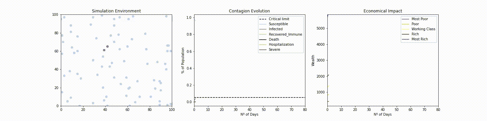***

***使用 covid19_abs 的典型场景 1 仿真***

***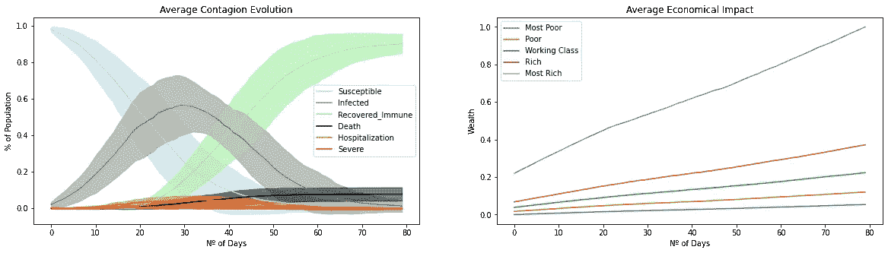***

***场景 1 执行 50 次的平均结果***

## ***场景 2:仅对受感染的人限制移动***

***这是一个乌托邦式的场景，我们可以快速诊断出受感染的人(甚至是没有症状的人)并隔离他们。我说这是乌托邦，因为极其快速和精确的诊断是不存在的！这种乌托邦式的情景对经济有益，许多政治家认为这就是情景 1 中应该发生的事情。但是他们的计算是错误的。***

***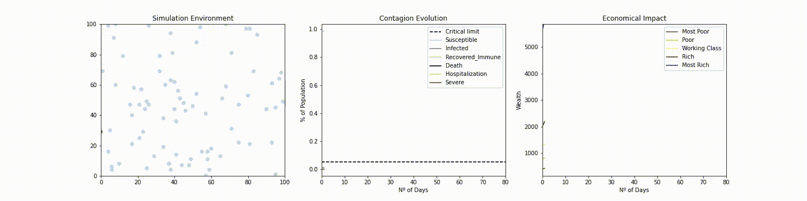***

***使用 covid19_abs 的典型场景 2 仿真***

***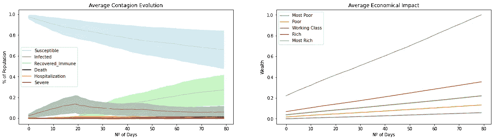***

***场景 2 执行 50 次的平均结果***

## ***场景 3:封锁(限制每个人的移动)***

***这是遵循世界卫生组织建议的情况。这种情况在医疗保健中是高度保守的，但它的目标是通过最小化人们的相互作用和病毒传播来拯救尽可能多的生命。不必说生命是无价的，经济可以在以后恢复，而不必杀死生命(穷人总是最受影响的)来授予大企业利润。***

***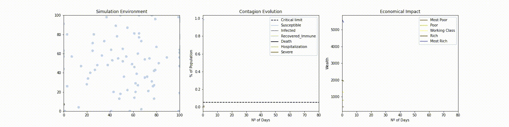***

***使用 covid19_abs 的典型场景 3 仿真***

***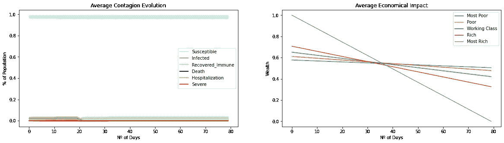***

***场景 3 的 50 次执行的平均结果***

## ***场景 4:在 10%的人口被感染后限制移动，当超过 95%是安全的时，解除限制***

***这似乎是最有可能的未来。看到疫情造成的破坏后，政府下令对所有人进行隔离。但是，一旦第一波感染减少，隔离就被取消，并导致另一波感染。这种情况会一直重复下去，直到大多数人对这种病毒产生免疫力。好的一面是医疗系统没有超负荷，但是我们会有几次隔离。***

***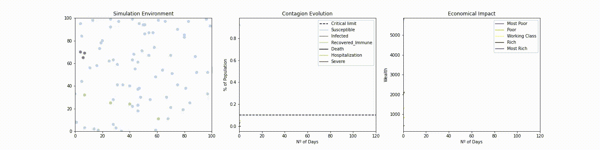***

***使用 covid19_abs 的典型场景 4 仿真***

***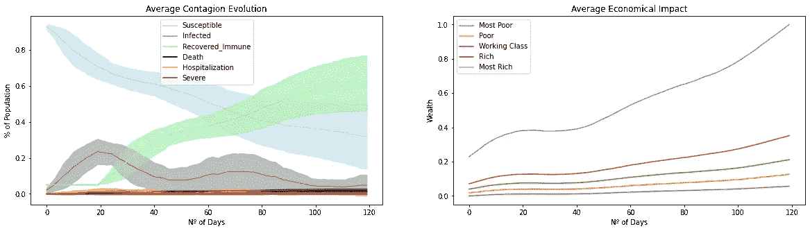***

***场景 4 执行 50 次的平均结果***

## ***情景 5:受控人群与非受控人群接触***

***政策大相径庭的人群之间的互动是一个奇怪的模拟场景，尤其是当他们相互影响的时候。我们的城市和州是分离的，但不是孤立的，很多时候，医疗保健系统和经济是密切相关的。这一模拟显示，即使接近未受管理的种群，被隔离的种群也能保护其公民。***

***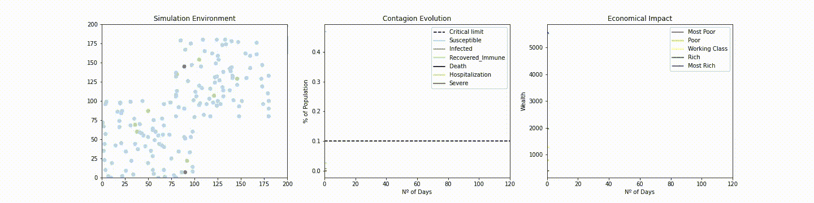***

***使用 covid19_abs 的典型场景 5 仿真***

***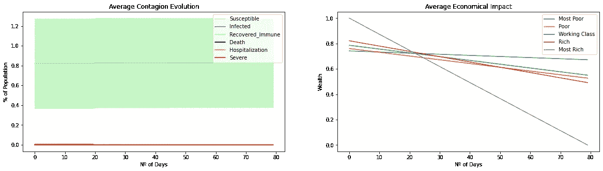***

***场景 5 执行 50 次的平均结果***

## ***场景 6:垂直隔离***

***一些政府建议只需要隔离最危险的人，比如老人和病人，让其他人正常生活，正如这里的[所看到的](https://www.brasilwire.com/milan-cannot-stop-brasil/)。除了几个先决条件之外，还有两个条件，一个是青年人的要求，另一个是青年人的要求，这就是新冠肺炎的要求。我们的模拟表明，当标准是拯救生命时，这一政策简单地不起作用。***

***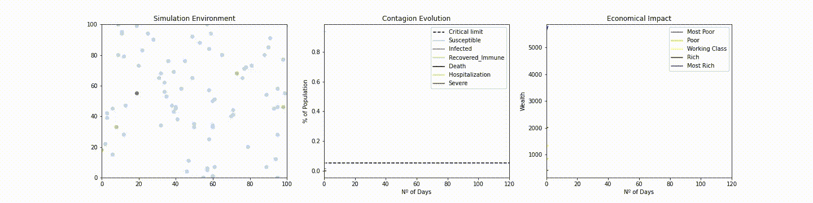***

***使用 covid19_abs 的典型场景 6 仿真***

***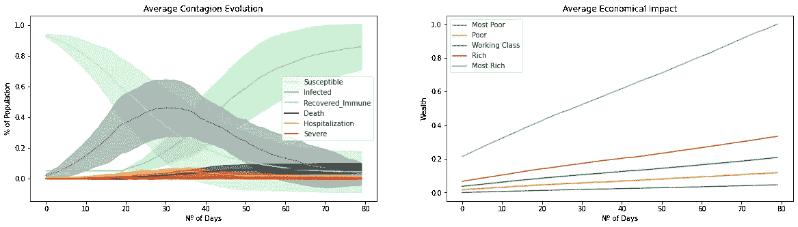***

***场景 6 执行 50 次的平均结果***

## ***场景 7:所有人的面具***

***发现了使用口罩和手套作为病毒传播对策的有效证据，参见[这里的](https://www.fast.ai/2020/04/13/masks-summary/)。证据表明，使用口罩可以减少传染距离和传染率。假设，如果我们通过使用口罩限制移动范围(但不是完全限制)并降低感染率，会发生什么？我们的模拟结果显示了健康和经济方面的乐观结果。***

***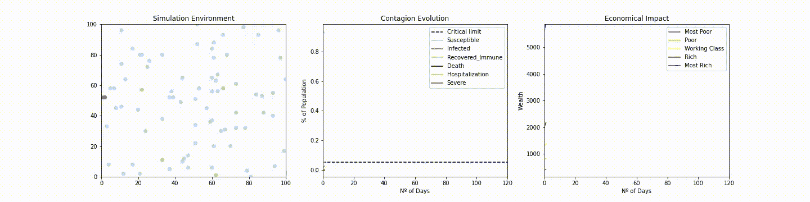***

***使用 covid19_abs 的典型场景 7 仿真***

***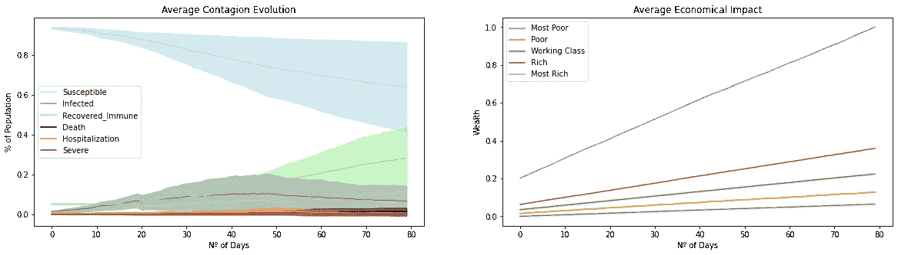***

***场景 7 执行 50 次的平均结果***

# ***结论:所有的模型都是错误的，但其中一些是有用的***

> ***“所有模型都是近似值。本质上，所有的模型都是错的，但有些是有用的。然而，必须始终牢记模型的近似性质”——乔治·博克斯***

***各种模型都是一个过程的表示，而不是过程本身。一旦它们是复杂随机(有时是混沌)过程的近似值，我们很自然地会发现已知数据的误差和偏差。这些偏差不会使模型失效，但表明它必须改进。***

***我们的想法是不断改进模型，使其更加现实和数据驱动，而不仅仅是用它来模拟许多其他尚未想到的社会和环境方面。顺便说一下，我们随时欢迎您的反馈！***

***如果可以的话，呆在家里。但是，不管发生什么，保持健康和安全。一切都会过去，一切都会好的。***

# ***进一步阅读***

*   ***流行病建模 101:或者为什么你的 CoVID19 指数拟合是错误的***
*   ***[新冠肺炎不可预测的曲线](https://medium.com/nightingale/the-unpredictable-curve-of-covid-19-e959dc8560ec)***
*   ***[所有人的面具？科学说是的。](https://www.fast.ai/2020/04/13/masks-summary/)***

# ***感谢***

***我要感谢数据科学评论人员的宝贵贡献，我的同事 [Paulo Vitor do Carmo Batista](https://orcid.org/0000-0001-6165-2174) (也是我在{ci∂ic}的合作伙伴，数据科学和计算智能研究小组)和[helder sei xas Lima](https://orcid.org/0000-0003-0934-7644)，他们都来自 [IFNMG](https://www.ifnmg.edu.br/) 和[Marcos Antonio alves](https://orcid.org/0000-0001-6934-6745)和[minds 的 frederico gade lha GUI mares](https://orcid.org/0000-0001-9238-8839)，他们来自[机器智能和数据科学实验室](https://www.minds.eng.ufmg.br/)***