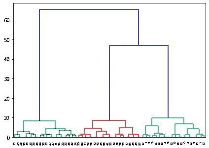

# 凝聚聚类和树状图——解释

> 原文：<https://towardsdatascience.com/agglomerative-clustering-and-dendrograms-explained-29fc12b85f23?source=collection_archive---------12----------------------->

## 凝聚层次聚类、树状图及其在 python 中的实现

[活动发起人](https://unsplash.com/@campaign_creators?utm_source=medium&utm_medium=referral)在 [Unsplash](https://unsplash.com?utm_source=medium&utm_medium=referral) 上的照片

凝聚聚类是一种层次聚类算法。它是一种无监督的机器学习技术，将群体分为几个聚类，使得同一聚类中的数据点更相似，而不同聚类中的数据点不相似。

*   同一簇中的点彼此更接近。
*   不同簇中的点相距很远。

(图片由作者提供)，样本二维数据集

在上面的二维数据集样本中，可以看到数据集形成了 3 个相距很远的聚类，并且同一聚类中的点彼此靠近。

 [## 等级聚类:凝聚和分裂——解释

### 聚集和分裂聚类算法及其实现综述

towardsdatascience.com](/hierarchical-clustering-agglomerative-and-divisive-explained-342e6b20d710) 

# 凝聚聚类背后的直觉:

凝聚聚类是一种自下而上的方法，最初，每个数据点都是自己的一个聚类，随着层次结构的向上移动，更多的聚类对被合并。

## 聚集聚类的步骤:

1.  最初，所有的数据点都是它自己的一个集群。
2.  取两个最近的集群，将它们连接起来形成一个集群。
3.  递归地进行第 2 步，直到获得所需的聚类数。

(图片由作者提供)，**第一张图:**所有的数据点都是自己的一个聚类，**第二张图:**两个最近的聚类(被一个黑色椭圆包围)结合在一起形成一个单独的聚类。

在上面的样本数据集中，观察到两个集群彼此相距甚远。所以我们在得到 2 个集群后就停止了。

(图片由作者提供)，样本数据集分为两个聚类

# 如何将两个集群连接成一个集群？

为了获得期望数量的聚类，聚类的数量需要从最初的 n 个聚类减少(n 等于数据点的总数)。通过计算两个聚类之间的相似性来组合它们。

有一些方法用于计算两个聚类之间的相似性:

*   两个聚类中最近的两个点之间的距离。
*   两个集群中两个最远点之间的距离。
*   两个聚类中所有点之间的平均距离。
*   两个簇的质心之间的距离。

选择上述任何一种相似性度量标准都有一些优点和缺点。

## 凝聚聚类的实现:

(作者代码)

# 如何获得最优的聚类数？

凝聚聚类算法的实现接受所需的聚类数。有几种方法可以找到最佳的聚类数，从而以如下方式将群体分成 k 个聚类:

> 同一簇中的点彼此更接近。
> 
> 不同簇中的点相距很远。

通过观察树状图，可以找到所需的聚类数。

树状图是数据点之间层次关系的图形表示。它说明了由相应分析产生的聚类的排列，并用于观察分层(聚集)聚类的输出。

## 树状图的实现:

(作者代码)

点击从[下载二维数据集样本。](https://drive.google.com/file/d/1I1VIaqrkNclNM7i-pnRD1ZJKc2noA4fh/view?usp=sharing)

(图片由作者提供)，**左图:**可视化样本数据集，**右图:**可视化样本数据集的 3 个聚类

对于上面的样本数据集，观察到聚类的最佳数量是 3。但是对于高维数据集，其中数据集的可视化是不可能的，树状图在寻找最佳聚类数中起着重要作用。

## 如何通过观察树状图找到最佳聚类数:

(图片由作者提供)，上述样本数据集的树状图

从上面的树状图中，找出一个最大高度不与任何水平垂直树状图线交叉的水平矩形。

(图片由作者提供)，**左:**分成 2 簇，**右:**分成 3 簇

树状图中具有最大高度的矩形可以被切割的部分，最佳聚类数将是 3，如上图右侧所示。选择最大高度矩形是因为它表示最佳聚类数之间的最大欧几里德距离。

# 结论:

 [## 了解 K-means、K-means++和 K-medoids 聚类算法

### 了解 K-means、K-means++和 K-Medoids 聚类算法及其关系的概述。这篇文章…

towardsdatascience.com](/understanding-k-means-k-means-and-k-medoids-clustering-algorithms-ad9c9fbf47ca) 

在这篇文章中，我们讨论了凝聚层次聚类算法的深入直觉。该算法的缺点是空间和时间复杂度较大，不适用于大规模数据集。即使观察树状图来寻找大型数据集的最佳聚类数也是非常困难的。

> 感谢您的阅读