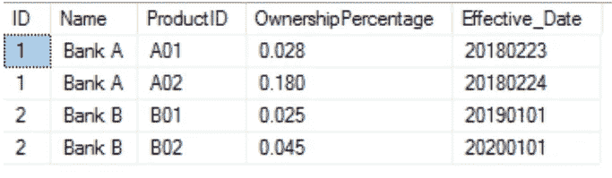
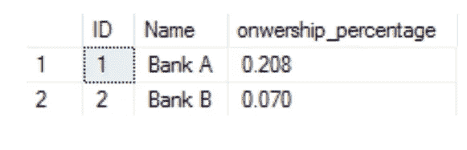
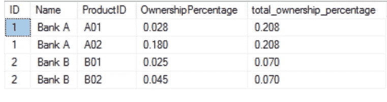
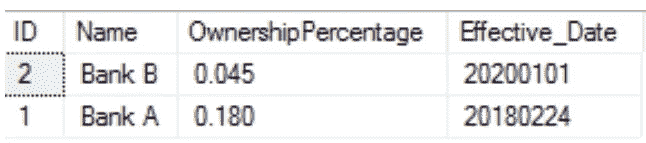

# 使用 Group by 和 Partition by 对 SQL 中的数据进行聚合和分组

> 原文：<https://towardsdatascience.com/aggregating-and-grouping-data-in-sql-with-group-by-and-partition-by-fd5eaccece75?source=collection_archive---------7----------------------->

## 通过一个简单的例子理解 GROUP BY 和 PARTITION BY 之间的区别。


**照片由** [**卡斯帕卡米尔·鲁宾**](http://Caspar Camille Rubin)**[**Unsplash**](https://unsplash.com/photos/fPkvU7RDmCo)**

# ****简介****

**聚合函数是一个非常强大的工具，可以用来分析数据和获得有用的业务洞察力。最常用的 SQL 聚合函数有SUM、MAX、MIN、COUNT、AVERAGE。为了汇总数据，聚合器通常与分组功能结合使用。在这个故事中，我将向您展示如何使用聚合函数和分组函数的组合。**

**得到💬任何数据科学或编程问题的 GPT 式答案。为成千上万的人生成摘要和学习笔记📚只需一次点击即可获得学习资源。👉**

**[](https://aigents.co/learn) [## 面向数据科学家和开发人员的免费学习资源。精选的博客、教程、书籍和…

### 机器学习和人工智能工程师的培训课程、黑客马拉松、活动和工作

aigents.co](https://aigents.co/learn)** 

# ****准备一些样本数据****

**让我们使用下面的脚本为这节课准备一些样本数据。你可以使用自己选择的不同平台，例如 [SQL FIDDLE](http://sqlfiddle.com/) 、 [KHAN ACADEMY](https://www.khanacademy.org/computer-programming/new/sql) 等。**

```
CREATE TABLE Customer (id INTEGER , name TEXT, product TEXT, OwnershipPercentage numeric(4,3) , Effective_date numeric);INSERT INTO Customer VALUES (1, “BankA”, “A01”, 0.028, 20180223) ;
INSERT INTO Customer VALUES (1, “BankA”,”A02", 0.018, 20181224) ;
INSERT INTO Customer VALUES (2, “BankB”,”B01", 0.025, 20190101) ;
INSERT INTO Customer VALUES (2, “BankB”,”B02", 0.045, 20200101) ;select * from Customer;
```

****

****表客户****

# ****问题****

**现在您可以看到，对于每个客户，都有多个(在本例中是 2 个)关于不同产品的所有权百分比和生效日期的记录。比方说，我需要为我的老板制作一份报告，并希望做一些数据分析来支持我的报告。根据我想要看到的内容，我将使用不同的聚合函数。在这节课中，我将给出使用 SUM()和 MAX()函数的例子。您可以想出不同的场景来使用其他功能。**

# ****解决方案****

**例如，我希望看到**与之前的报告相比，每个客户的投资组合随着时间的推移发生了怎样的变化**。为此，我希望看到每个客户的总所有权百分比，而不考虑产品。有两种方法可以做到这一点:使用分组依据和分区依据**

****使用分组依据****

**很简单，我能做的就是使用 aggregate SUM()函数，后跟一个“GROUP BY”子句。在查询中，SUM()函数会将一个数字列(OwnershipPercentage)中的所有值相加。GROUP BY 子句将列中所有相同的值分组，这些列是我们选择的属性，在本例中是客户 ID 和名称。**

```
SELECT ID,
Name,
sum(p.ownershippercentage) AS onwership_percentageFROM Customer GROUP BY ID, Name
```

****

****按**分组的结果**

****使用 OVER 和 PARTITION(BY)****

**获得类似结果的另一种方法是使用 OVER 和 PARTITION(BY)函数。要使用 OVER 和 PARTITION BY 子句，只需指定要对聚合结果进行分区的列。Over(partition by)子句将要求 SQL 只将每个分区内的值相加(在本例中为客户 ID)。**

```
SELECT ID, 
Name,
ProductID,
OwnershipPercentage,
sum(OwnershipPercentage) over(partition by ID) as total_ownership_percentageFROM Customer c
```

****

****结果为过(分区通过)****

**通过上面的查询，我将得到一个名为 total_ownership_percentage 的列，它是每个客户的所有权百分比值的总和。**

**现在您可能已经意识到 GROUP BY 和 OVER(PARTITION BY)的输出之间的差异。GROUP BY 通过使用我们指定的属性汇总数据，从本质上减少了返回记录的数量。OVER(PARTITION BY)同时提供汇总的数据，而不汇总所有记录。在这种情况下，通过使用 PARTITION BY，我将能够返回每个客户的每个给定产品的 OwnershipPercentage 以及同一行中每个客户的总百分比。这意味着我将拥有每个客户的总所有权百分比的重复数据，但好的一面是，在聚合过程中没有数据丢失——与 GROUP BY 的情况相反。**

```
SELECT ID,Name, 
p.OwnershipPercentage,
max(c.OwnershipPercentage) as ownership_percentage FROM Customer c GROUP BY ID,Name
```

**使用上面的代码，我将收到这条消息:*列****‘客户。“OwnershipPercentage”在选择列表中无效，因为它既不包含在聚合函数中，也不包含在 GROUP BY 子句*** *中。*这是因为 GROUP BY 将只返回每个组的唯一结果，并且选择列表只能包含作为 GROUP BY 子句一部分的聚合函数或列。**

**因此，根据您想要得到的结果，您可以使用不同的函数来获得最佳输出。当您需要每个组有一个唯一的记录时，请选择 GROUP BY，当您不想丢失任何数据但仍想进行聚合时，PARTITION BY 将是最佳选择。**

****使用聚合最大值()和分组依据****

**下面是另一个使用 MAX()的场景。假设我现在想知道最近添加的产品及其每个客户的所有权百分比。**

**一种解决方案是在子查询中应用 aggregate Max()函数和 GROUP BY。子查询是另一个 SQL 语句中的 SELECT 语句。**

```
select c.Name, 
c.ownershippercentage,
c.Effective_date as effective_date
from Customer cinner join (select Name, 
max(Effective_date) as max_date
from Customer group by Name) don c.Name = d.Name
and c.Effective_date = d.max_date
```

**子查询将返回一个我称为“d”的表。通过这个子查询，我获得了表“d”中每个客户的最新生效日期。在此基础上，我在表“Customer”和表“d”之间执行了一个连接，以得出最近生效日期的 OwnershipPercentage。上述查询将给出您想要的输出，但不是最佳解决方案。我们必须在子查询中使用 JOIN 语句以及 aggregate MAX()和 GROUP BY 的组合，这增加了复杂性。在下面找到更有效的代码:**

```
SELECT c.ID, c.Name, c.ProductID, c.OwnershipPercentage, c.Effective_DateFROM Customer cWHERE c.Effective_Date = (SELECT MAX(p.Effective_Date) FROM Customer p WHERE p.ID = C.ID)
```

**任何一种方法都会得到如下相同的结果:**

****

**感谢您的阅读。希望这对学习有帮助。**