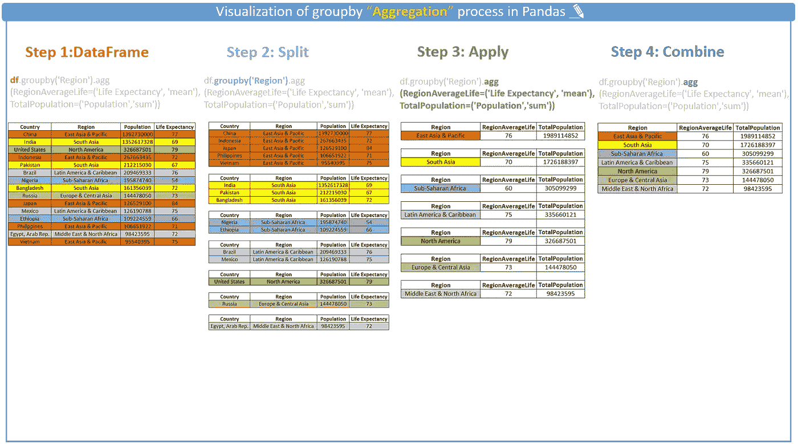
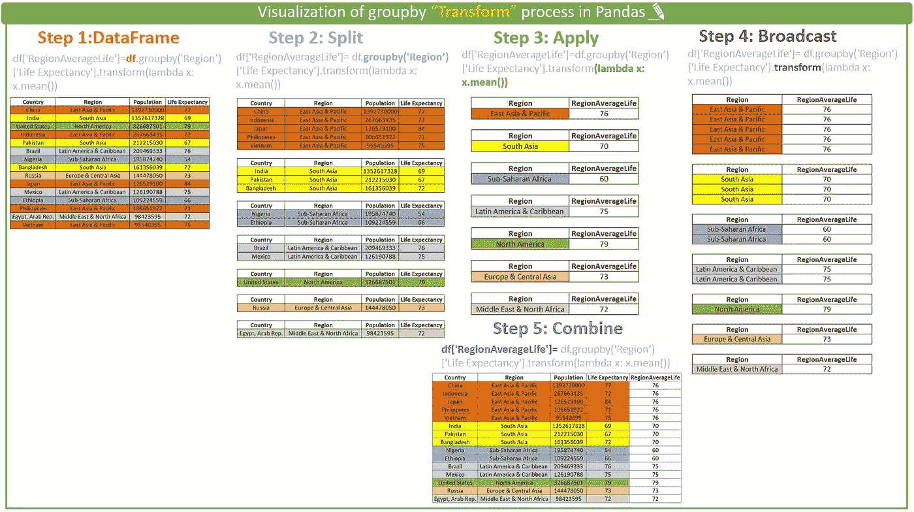
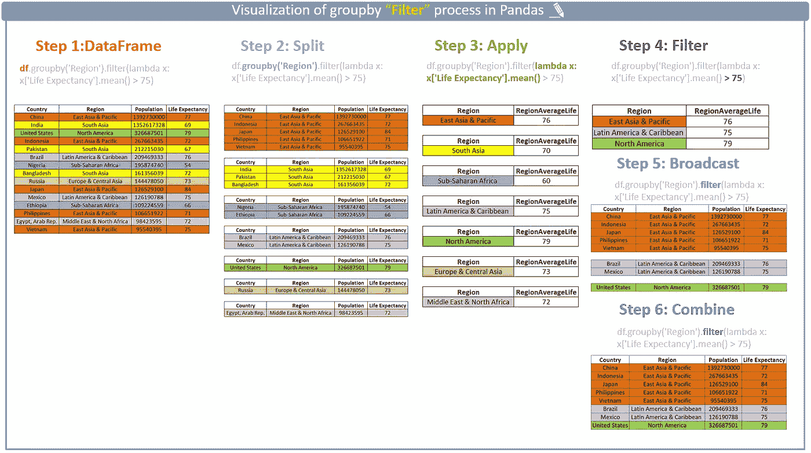
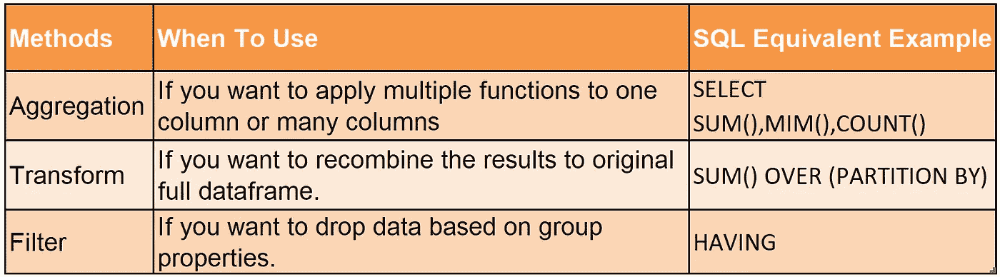

# 聚合、转换、过滤——如何以及何时使用它们？

> 原文：<https://towardsdatascience.com/aggregation-transform-filter-how-and-when-to-use-them-31ed7eb88d2e?source=collection_archive---------38----------------------->

## 熊猫:从熟练工到大师——来自受害者的声音。


信用:[帕斯卡·米勒](https://unsplash.com/@millerthachiller?utm_source=unsplash&utm_medium=referral&utm_content=creditCopyText)对 [Unsplash](https://unsplash.com/@millerthachiller?utm_source=unsplash&utm_medium=referral&utm_content=creditCopyText)

如果你想知道，当我说“受害者”时，那是因为我太被熊猫的能力宠坏了，直到我遇到了`Aggregation, Transform, Filter`、
他们让我很难理解引擎盖下的机制。在花了一些时间钻研之后，我对它有了更好的理解。现在，让我们开门见山地说吧。

我始终相信简单数据集对于方法说明的作用。因此，本文将使用一个非常简单的数据集:**不同国家/地区的人口和预期寿命。**

您可能已经熟悉带有基本计算的`groupby`聚合，如`mean(), sum(), median()`等。聚合、转换和过滤将 goupby 带到了另一个层次。

首先，我们来看一下`groupby`功能是如何工作的。2011 年，Hadley Wickham 在他的论文[“数据分析的拆分-应用-组合策略”](https://www.jstatsoft.org/article/view/v040i01)中引入了“拆分-应用-组合”的思想，使得`groupby`函数具有了说明性。一般来说，`groupby`功能由三个步骤组成:分割、应用和组合。`split`步骤根据指定的关键字将数据帧分解成子集数据帧。然后，`apply`步骤将函数应用于这些子集数据帧。最后，`combine`步骤将这些结果连接成一个输出数组。

# 聚合🐺

记住上面的过程，我们就很容易理解`aggregation`。基本上，`aggregation`对一列和多列应用多个函数。首先，它基于“区域”将完整的数据帧分成子数据帧。然后对“预期寿命”应用均值函数，对“人口”应用和函数。最后，它将结果组合成可以通过“reset_index”转换成数据帧的序列。最后，您将得到一个不同的数据帧，其长度是 groupby 键的唯一值的数量(在我们的例子中是“Region”)。下面是`aggregation`的视觉流程。



# 改变🐣

与聚合相比，`transform`多了一个叫做“广播”的步骤。它将结果从子数据帧广播到原始的完整数据帧。你可以把结果合并到原始的完整数据帧中。因此`transform`将总是返回一个与原始完整数据帧长度相同的序列。下面是`transform`的视觉流程。

`transform`的一个典型用例是计算组总数的百分比(在我们的例子中，是其所在地区的国家人口比例，例如印度在南亚地区的人口比例。

```
df[‘PopShare’]=df.groupby(‘Region’)[‘Population’].transform(lambda x: x/x.sum())
```



# 过滤器🐳

与 transform 相比，`filter`多了一个步骤。从这些子数据帧中获得结果后，它对这些结果应用一个过滤器(在我们的例子中，它是“RegionAverageLife”>75)。然后，这些过滤的结果将广播到原始数据帧中的匹配条件。因此，在这种情况下，您将获得完整数据帧的缩减版本。下面是`filter`的视觉流程。



总之，下面是`Aggregation, Transform, and Filter.`的最佳使用场景以及它们在 SQL 中的等效格式。



## ***最后***

保持乐观！感谢阅读！如果你想取得联系，可以在这里 *联系我* [*。*](https://www.linkedin.com/in/jinzhaolu/)