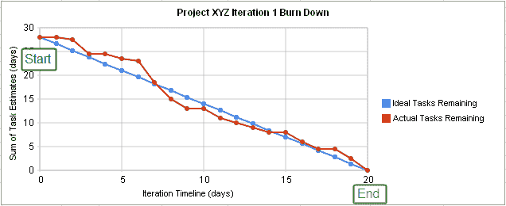

# 敏捷开发 101——科技界的雷吉娜

> 原文：<https://towardsdatascience.com/agile-development-101-5faf54df5dcc?source=collection_archive---------27----------------------->

## 当目标可能在一夜之间改变时，敏捷方法给予开发人员和数据科学家同样的适应性和灵活性。

戴维·特拉维斯在 [Unsplash](https://unsplash.com/s/photos/agile-dev?utm_source=unsplash&utm_medium=referral&utm_content=creditCopyText) 上拍摄的照片

在技术部门工作，敏捷开发很可能在你的项目中被利用。使用敏捷方法为开发人员提供了工具，以便在客户可能在一夜之间改变其目标的时候具有适应性和灵活性。使用敏捷将允许团队毫不犹豫地适应。

# 什么是敏捷开发？

敏捷开发指的是一组专注于迭代开发的方法。开发过程中的需求和解决方案在整个过程中不断发展。这种发展是由不同职能团队之间的合作推动的。scrum 和看板就是其中的两种方法。两者都鼓励对项目的频繁反思，以便开发过程与业务需求相一致，例如客户目标。

当一个开发方法声称与敏捷一致时，它是基于[敏捷宣言](https://agilemanifesto.org)。这个宣言是 2001 年由 17 个人在犹他州的一个滑雪小屋创作的。在他们相遇之前，主要的开发方法被称为瀑布方法。由于需要持续更新，这种传统方法已经过时。敏捷支持这一关键的业务需求。

原始照片由 [Szabo Viktor](https://unsplash.com/@vmxhu?utm_source=unsplash&utm_medium=referral&utm_content=creditCopyText) 在 [Unsplash](https://unsplash.com/s/photos/update?utm_source=unsplash&utm_medium=referral&utm_content=creditCopyText) 上拍摄

# 什么是敏捷宣言？

敏捷宣言基本上是一个宣言，旨在帮助开发者和企业找到一种对两者都有效的方法。这是一种让企业继续成长和适应而不会让开发人员筋疲力尽的方式。

4 价值观是宣言的核心:

1.  **流程和工具上的个人和交互**
2.  **工作软件**综合文档
3.  **客户协作**合同谈判
4.  **根据计划应对变化**

宣言指出，左边的项目(粗体)比右边的项目更有价值。两者都很重要，但把更多的重量放在左边。

该宣言有 12 条原则:

1.  我们最优先考虑的是通过早期和持续交付有价值的软件来满足客户。
2.  欢迎不断变化的需求，即使是在开发的后期。敏捷流程利用变化为客户带来竞争优势。
3.  频繁地交付工作软件，从几个星期到几个月，优先选择较短的时间尺度。
4.  业务人员和开发人员必须在整个项目中每天一起工作。
5.  围绕有积极性的个人建立项目。给他们需要的环境和支持，相信他们能完成工作。
6.  向开发团队传达信息的最有效的方法是面对面的交谈。
7.  工作软件是进步的主要衡量标准。
8.  敏捷过程促进可持续发展。发起人、开发人员和用户应该能够无限期地保持恒定的步调。
9.  对技术优势和良好设计的持续关注增强了敏捷性。
10.  简单——最大化未完成工作量的艺术至关重要。
11.  最好的架构、需求和设计来自自组织团队。
12.  团队定期反思如何变得更有效，然后相应地调整自己的行为。

当一个团队同意应用敏捷方法时，他们坚持这些价值观和原则。

# Scrum 敏捷开发？

Scrum 是敏捷开发的一个子集，它依赖于冲刺阶段的每日会议。sprint 通常需要 1-4 周的时间来完成一个项目。在这个冲刺阶段，团队将定期会面，交流他们的进展。这个简短的会议是开发人员陈述他们已经完成了什么，他们计划在下一次会议之前完成什么，以及他们是否面临任何障碍的时候。这些会议由一个 Scrum 大师领导，他的主要工作是帮助开发人员通过路障。这些快速的会议被称为站立会议，因为每个人都是站着进行的。取决于你的团队，他们可能会也可能不会这样做。

[优 X 创投](https://unsplash.com/@youxventures?utm_source=unsplash&utm_medium=referral&utm_content=creditCopyText)在 [Unsplash](https://unsplash.com/s/photos/meeting?utm_source=unsplash&utm_medium=referral&utm_content=creditCopyText) 上的照片

每个团队和企业都有自己的 Scrum 变体。它通常包括每日站立，冲刺，以及最后的冲刺回顾。有些人会让开发人员写出一个用户故事来解释新特性背后的原因。每个版本之间的结构将具有相同的骨架。

# 看板敏捷开发？

看板是一种可视化的敏捷方法。它依赖于使用卡片和一块板，想想 Trello 或便利贴和白板。这使得团队可以看到工作流将由什么组成，并尽早找到瓶颈。这可能在某个时候需要一个团队成员或者需要购买设备。这是一种非常主动的方法。

该板，又名看板板，上面将有列。这些列被称为看板泳道。每个人将给出一张卡片，进行分类，以区分任务和项目。有些泳道可能是待办事项、正在进行的事项和已完成的事项。这种可视化允许整个团队在有限的会议时间内处于项目流程的同一页面上。

Gif via [giphy](https://media.giphy.com/media/l0MYSqNU3hr8MUq0o/giphy.gif)

# 什么是常见的敏捷方法实践？

这是一个很好的问题。尽管每种方法都有自己的蓝图，但每种方法都有一些共同点。以下是一些敏捷实践:

## 结对编程

顾名思义，它是指两个程序员同时在同一代码上一起工作。这通常包括一个程序员作为打字员，另一个问他们的思维过程是什么。这也可能只是排除程序故障。当进行结对编程时，有一个时间间隔来交换角色将有助于防止双方都筋疲力尽。

Gif via [giphy](https://media.giphy.com/media/nE5FitGTYa5Xi/giphy.gif)

## 客户参与

与客户沟通项目进展对退货业务至关重要。敏捷开发为客户提供了参与当前开发的机会。不是字面上的意思，而是为了快速简单地了解项目在哪里。如果客户打电话来询问项目进展如何，项目经理会很快知道应该让客户知道什么。

## 燃尽图

燃尽图是一种很好的方式，可以直观地显示项目还剩多少时间。如果一个项目剩下太多的元素，那么这就给了开发团队一个适应环境的机会。这可能是让项目经理与客户沟通，或者对某些元素进行优先排序。

[https://en . Wikipedia . org/wiki/Burn _ down _ chart # Reading _ Burn _ down _ charts](https://en.wikipedia.org/wiki/Burn_down_chart#Reading_burn_down_charts)

## 测试驱动开发(TDD)

测试驱动开发是将需求转化为下一次迭代的测试用例的实践。这使得以前的需求不会因为急于修补特性而变得过时或被遗忘。这绝对不是任何人想要的情况。

敏捷开发是一种迭代方法，有助于持续的更新/发布。这些方法允许开发人员/人的需求和业务需求在中间相遇并被理解(希望如此)。

在我们重新学习之前，

> *原载于*【https://reginaoftech.com】