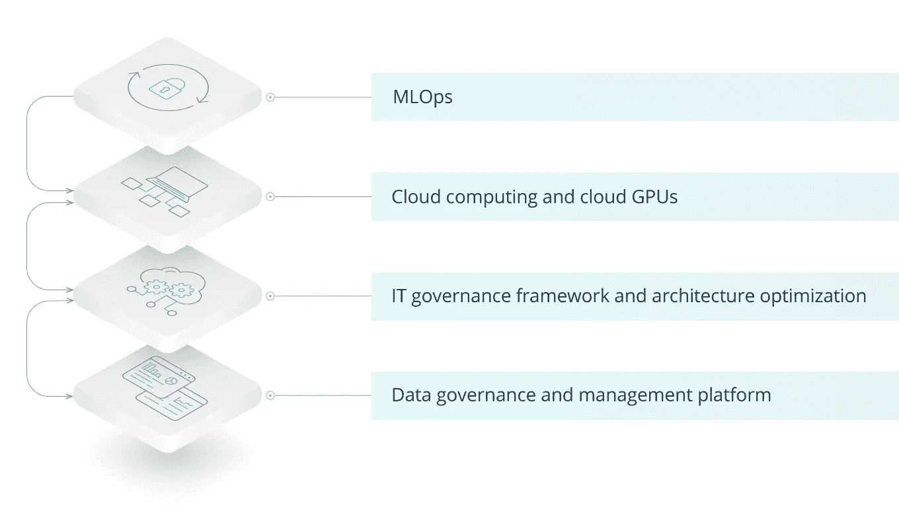
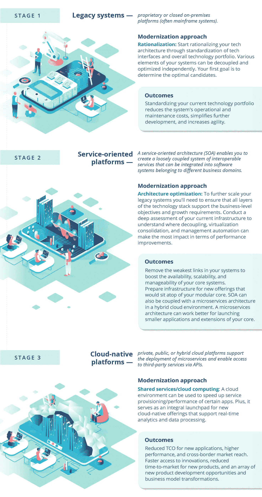

# 人工智能在银行业的应用

> 原文：<https://towardsdatascience.com/ai-adopting-in-banking-get-it-right-with-a-tech-formula-part-1-6eac6bab36c6?source=collection_archive---------39----------------------->

## 用技术公式正确解决问题(第 1 部分)

***注来自《走向数据科学》的编辑:*** *虽然我们允许独立作者根据我们的* [*规则和指导方针*](/questions-96667b06af5) *发表文章，但我们不认可每个作者的贡献。你不应该在没有寻求专业建议的情况下依赖一个作者的作品。详见我们的* [*读者术语*](/readers-terms-b5d780a700a4) *。*

你已经听到了传言:人工智能(AI)是金融领域炙手可热的新商品。但你能在你的核心银行系统上撒点“智能”就称之为胜利吗？几乎没有。

形式化一个人工智能用例，甚至运行一个成功的试点是容易的部分。部署和扩展人工智能算法是事情变得复杂的地方。

> //只有 22%使用机器学习(ML)的企业成功地将模型部署到生产环境中。//

让人工智能正确很难，但是谁需要它呢？

如果想保持长期竞争力，大多数银行都会这么做。根据 [Temenos](http://www.temenos.com/insights/white-papers-reports/eiu-2020/) 的一份报告，77%的银行高管表示，人工智能的成功实施将在未来几年内区分银行领域的领导者和落后者。

显然，最先解决人工智能扩展和部署挑战的人将获得最大的市场回报。

但是如果不知道前面有什么障碍，你就不可能赢得比赛。

# 为什么在金融领域实施人工智能很难

法规、合规性、隐私和数据偏差——这些是研究人工智能的金融机构普遍关注的问题。但是让我们暂时假设这些都不存在，从纯技术的角度来衡量复杂性因素。

想象一下:一群高管被[新的决策分析引擎](https://www.intellias.com/decision-analytics-in-finance-how-ml-ai-boosts-your-intelligence/?utm_source=medium.com&utm_medium=referral&utm_campaign=AO&utm_content=AI%20Adoption)所说服。理论上，这个项目看起来很完美

*   预测分析可以调整销售价格
*   下一个最佳行动(NBA)组件可以提高追加销售/交叉销售
*   分析组件可以减少支付中的误报数量
*   投资回收期可能只有一两年

“酷豆，”领导说。“让我们把引擎发动起来！让 ML 团队尽快解决这个问题。”

现在有趣的部分来了:机器学习团队深入项目，却遇到了一个又一个障碍:

*   巨大的数据仓库和缺乏统一的数据管理流程颠覆了准备所需数据集的流程。
*   关键数据所在的遗留基础设施需要重新搭建平台或完全替换，以避免中断核心系统。
*   需要组装和配置具有大量 GPU 的新云基础设施，以支持算法的测试和部署。
*   很少有人能真正完成所有这些事情。

这就是一个在纸面上有着极高投资回报率的盈利试点如何变成一个正在失去吸引力的大额投资，并最终在一个试点(和一些宣传)后被取消。

那么，为什么如此多的金融公司在早期的人工智能投资中遭受损失，并且未能超越试点？

有几个原因:

*   **由于过时(或不存在)的数据治理流程，缺乏生产就绪数据**和足够快速地访问这些数据的能力。
*   **人工智能算法需要关注**，尤其是在部署的最早阶段，包括监督、维护、合规和网络安全等。是的，AI 可以自我学习，但它永远不会完全不用手。
*   **一个弱的或者不存在的集成开发环境**产生了测试和部署瓶颈。
*   **人工智能部署在核心银行系统中创建了一个新的架构层**，这些系统需要与遗留系统共存，而不会中断它们。
*   **将一个算法打包成一个有吸引力的面向客户的解决方案**来增加价值需要额外的时间和专业知识。

那么，我们是在建议你完全放弃你的人工智能梦想，让数字原生竞争获胜吗？

一点也不。引入人工智能是昂贵的错误。但是您可以通过坚持自下而上的方法来最小化风险、成本和采用时间表。可以用这个公式来概括:

**(遗留+前端转换)× AI =现代银行**

这是一篇由两部分组成的文章。在这一部分中，我们将关注遗留系统。如果您想先了解前端转换，请点击这里的**(但是您也应该认真阅读这一部分！).**

# *银行业人工智能的传统转型:需要解决的 4 个领域*

**

*图片由 [Intellias](https://www.intellias.com/modernizing-legacy-banking-systems-how-to-get-it-right/?utm_source=medium.com&utm_medium=referral&utm_campaign=AO&utm_content=AI%20Adoption) 提供*

*金融领域的人工智能需要几个关键构件:*

*   *数据治理和管理平台*
*   *IT 治理框架和架构优化*
*   *云计算和云 GPU*
*   *MLOps*

> *三分之二的银行业高管(66%)表示，人工智能、云和 DevOps 等新技术将在未来五年继续推动全球银行业转型。"[泰梅诺斯报告](https://www.temenos.com/insights/white-papers-reports/eiu-2020/)*

## *数据治理和管理平台*

*连接和整合内部和外部数据源的统一数据管理平台是每个人工智能实施的支柱。*

*除了为您提供一系列用于分析的初始数据集，数据治理平台还可以帮助您:*

*   *提高数据可追溯性和可问责性*
*   *增强数据安全性和合规性*
*   *支持人工智能用例的扩展，因为你总是有精简的数据用于分析。*

*您需要组装的数据管理平台需要得到 IT 治理框架的进一步支持。*

## *IT 治理框架和架构优化*

*大多数遗留银行系统的问题是它们陈旧、混乱、僵化，没有给新的元素留下空间。*

*IT 治理过程的目标是帮助你弄清楚在你当前的架构难题中把 AI 放在哪里。*

*本质上，这样的框架被设计来帮助您挑选和探测您的遗留软件，以查看哪些系统组件可以被解耦和现代化，而不会点燃核心(也就是说，打个比方)。*

*因此，正如我在另一篇关于[银行业遗留现代化](https://www.intellias.com/modernizing-legacy-banking-systems-how-to-get-it-right/?utm_source=medium.com&utm_medium=referral&utm_campaign=AO&utm_content=AI%20Adoption)的文章中所写的那样，你可以在系统层面进行现代化，一次一个元素地发展你的平台，而不是试图一举取代核心(冒很大的风险)。*

**

*由 [Intellias](https://www.intellias.com/modernizing-legacy-banking-systems-how-to-get-it-right/?utm_source=medium.com&utm_medium=referral&utm_campaign=AO&utm_content=AI%20Adoption) 制作的信息图*

*迁移到更松散的架构将有助于您:*

*   *分配新人工智能服务的位置*
*   *将更多数据源连接到您的数据管理平台*
*   *弄清楚新算法如何与其他服务集成。*

## *云计算和云 GPU*

*下面是对 AI 的一个非常简单的解释:*

***AI =(代码+数据)×计算能力***

*考虑到您已经组织了您的代码并简化了对数据的访问(并且可能将它迁移到了云中)，您现在可以开始寻找计算能力了。*

*毕竟，深度神经网络和其他复杂的 ML 算法是耗电的生物，需要大量的计算能力来操作给它们的数据并产生预测。*

*本质上，神经网络是在训练和预测阶段对网络输入(您的数据)执行大量矩阵乘法的结果，以便您可以获得良好的输出(预测或洞察)。*

*根据任务的复杂程度，网络可以使用 10、100 甚至[100 亿个参数](https://www.popsci.com/science/article/2013-06/stanfords-artificial-neural-network-biggest-ever/)来识别给定数据中的模式并产生结果。*

*为了运行这些操作，你的算法需要计算能力，这就是[GPU(图形处理单元)](https://www.intel.com/content/www/us/en/products/docs/processors/what-is-a-gpu.html)发挥作用的地方。这些芯片可以帮助您加快计算速度，更快地获得结果。*

*你可以在内部储备一批 GPU，或者从服务提供商那里租赁云 GPU 容量——这将允许你在未来自动化和扩展更大的算法部署(或者避免在你的培训比预期更复杂时争夺资源)。*

*考虑到 GPU 即服务市场预计到 2025 年将[达到 70 亿美元，你可以猜到大多数公司更喜欢做什么。现在，除了计算能力，您还需要一些额外的资源来存储您的数据、测试集、实验、版本控制和测试结果。同样，将所有这些都保存在云中是大多数公司选择的路线。](https://www.gminsights.com/industry-analysis/gpu-as-a-service-market)*

*这就把我们带到了下一个要点:保持你的人工智能项目有组织并准备好部署。*

# *MLOps*

*机器学习+ DevOps = MLOps，这是一个新的运动，旨在创建一种建立、测试和部署 ML/AI 模型的简化方法。*

> *MLOps 的目标是帮助您采用和自动化机器学习(ML)模型的持续集成(CI)、持续交付(CD)和持续培训(CT)。[谷歌云](https://cloud.google.com/solutions/machine-learning/mlops-continuous-delivery-and-automation-pipelines-in-machine-learning)*

*更高程度的自动化增加了开发过程的可预测性，并减少了由于小错误而导致模型失败的机会。*

*以下是您从 MLOps 获得的信息:*

*   *用于推出新模型的可重复使用的管道和可重复的工作流程*
*   *改进的数据集成和统一的数据治理*
*   *自动化的模型设置、培训和测试(针对类似的项目)*
*   *一键式复制和自动化版本控制*
*   *热键访问项目所需的所有库、框架和集成*

*因此，你的人工智能团队可以直接行动起来，以更快的速度、更低的成本和更少的风险运行新的实验，而不是浪费时间来组装新的人工智能项目的所有细节。*

*总结等式的遗留转换部分:*

*   *评估你的系统，为你的人工智能找到最佳位置。*
*   *分离数据源，并将它们连接到新的数据管理平台。*
*   *寻找进一步整合和现代化的机会。*
*   *为新的人工智能测试分配云基础设施。*
*   *获得您需要的 GPU 容量。*
*   *使用 MLOps 原则制定清晰的路线图。*

*好了，我们已经完成了等式的第一部分— **遗留转换**。*

*因为它已经相当不错了，我们保留了等式的第二部分——前端和人工智能转换——作为本文 **的第二部分 [**。**](/ai-adopting-in-banking-get-it-right-with-a-tech-formula-part-2-fd1a53520403)***