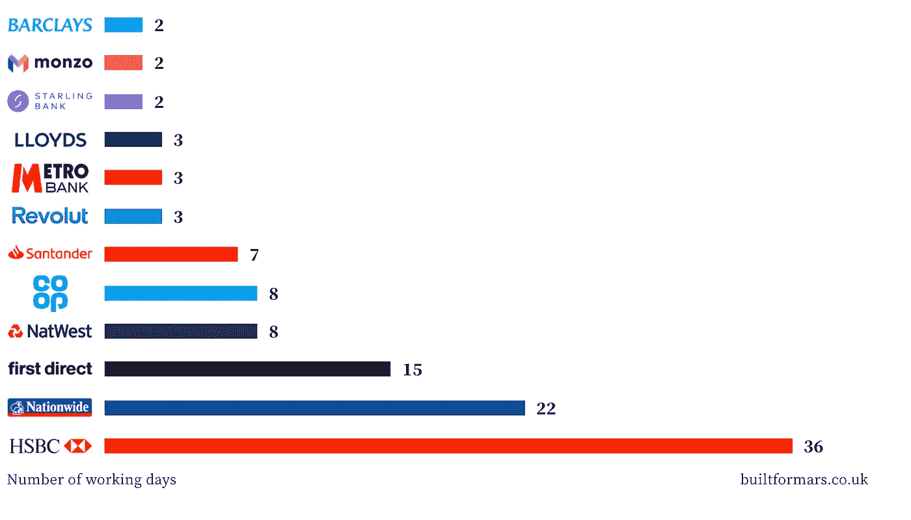
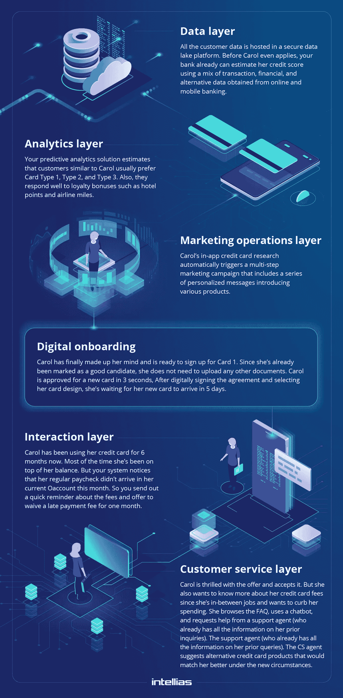

# 人工智能在银行业的应用

> 原文：<https://towardsdatascience.com/ai-adopting-in-banking-get-it-right-with-a-tech-formula-part-2-fd1a53520403?source=collection_archive---------46----------------------->

## 用技术公式正确解决问题(第 2 部分)

***注来自《走向数据科学》的编辑:*** *虽然我们允许独立作者根据我们的* [*规则和指导方针*](/questions-96667b06af5) *发表文章，但我们不认可每个作者的贡献。你不应该在没有寻求专业建议的情况下依赖一个作者的作品。详见我们的* [*读者术语*](/readers-terms-b5d780a700a4) *。*

银行业的人工智能是一大福音，但往往也是一大祸害。

权衡是巨大的，但是实施一个简单的解决方案的挑战通常会阻碍银行的创新。正如我们在本系列 的第一部分 [**中提到的，许多人工智能飞行员在测试或部署阶段都失败了。**](/ai-adopting-in-banking-get-it-right-with-a-tech-formula-part-1-6eac6bab36c6)

原因？缺乏强大的技术基础，配以清晰的技术路线图来依次升级系统的所有关键元素，然后再用人工智能增强它们。

正如我们在上一部分中所讨论的，核心银行遗留系统的分离和现代化是您路线图上的第一要务。

您议程上的下一步是前端转换。

# 让你的前端适应人工智能的采用

人工智能经常被认为是解决低效流程的良方。公司可能会说*让我们发送 RPA 来处理发票*或*为什么 ML 算法不能为客户做所有的报告？*

然而，很少有金融领袖倾向于问这个问题:*这个特定的过程甚至需要人工智能增强吗？*

因为让我们面对现实吧:很多前台银行流程都有些过时了。为了客户的房贷申请，你需要在分行收集一吨的纸质文件吗？No. [挪威的银行 ID 经验](https://cdn2.hubspot.net/hubfs/5310879/Downloads/Signicat_Federated_eIDs_Arkwright.pdf)表示，你可以完全无纸化，只需向你的客户发放数字 ID(看不到人工智能),就可以将申请过程从 16 天减少到 1 天。

当您的移动银行应用程序仍然为您的客户提供糟糕的[数字开户体验](https://www.intellias.com/6-step-guide-to-creating-a-digital-account-opening-dao-system/?utm_source=medium.com&utm_medium=referral&utm_campaign=AO&utm_content=AI%20Adoption)时，为您的移动银行应用程序添加人工智能驱动的语音礼宾有意义吗？没有。不会有太大的不同。

> //为了从人工智能的采用中获得最大的影响，传统的财务流程需要重新配置。否则，投资回报率将难以捉摸。//

**这就是转变前端流程是第二个核心要素的原因。**

好吧，那么我该如何重新配置旧的来为新的铺平道路呢？

这里有一个简单的蓝图:

*   **让你的候选人排队接受人工智能增强。**将所有可能的用例分成两类:面向客户和面向员工的流程/解决方案。从可行性、时间表和可能的节约/投资回报方面评估每个解决方案。
*   **依靠设计思维。**采取基于旅程的方法来选择你的候选人。从最终用户的角度评估你的清单。新技术可以在哪些方面增加更多价值，为什么？
*   **从零开始。与其尝试去适应一个低价值的流程，不如想想如果你 a)完全摆脱它，b)用一个干净的版本代替它，或者 c)代替它，并考虑新流程如何进一步补充和加强你的设置中的其他流程，会发生什么。**

最后一点尤其重要，因为银行业有大量漏洞百出的流程，金融科技公司很早就开始着手解决:令人生畏的开户流程、复杂的信用卡订购流程、缺乏负担得起的贷款、冗长的信用卡审批等等。

开立一个新银行账户所需的平均天数。图片由[为火星建造](https://builtformars.co.uk/banks/opening/)

基于这些数据，很容易假设仅仅增加一些人工智能算法不会帮助汇丰奇迹般地名列榜首。他们的数字银行前台需要更大的提升。

因此，如果你觉得自己在竞争中落在了后面，试试下面的数字银行前台转型[方法](https://www.intellias.com/how-to-sustainably-pursue-digital-banking-innovations-front-end-office-transformations/?utm_source=medium.com&utm_medium=referral&utm_campaign=AO&utm_content=AI%20Adoption):考虑层次，而不是单个流程或解决方案。

由 [Intellias](https://www.intellias.com/how-to-sustainably-pursue-digital-banking-innovations-front-end-office-transformations/?utm_source=medium.com&utm_medium=referral&utm_campaign=AO&utm_content=AI%20Adoption) 提供的信息图表

# 排列和扩展银行业中的人工智能用例

我们终于到达了我们一直在准备的部分——在银行业实现人工智能！

正如前面几节所述，让人工智能做好准备是一条漫长的道路，至少有两个主要的障碍:改造遗留系统和适应前台系统流程。

记住:根据埃森哲的数据，[只有 16%](https://www.accenture.com/us-en/insights/artificial-intelligence/ai-investments) 的高管能够扩大人工智能项目的规模。正如埃森哲的数据进一步指出的那样，大多数人都遇到了我在本文开头描述的相同的人工智能采用困难。

与此同时，那些成功度过最初试点阶段、实现战略扩展的企业，终于看到了承诺的红利:

> 与处于人工智能之旅概念验证阶段的公司相比，战略规模公司从人工智能投资中获得的回报接近三倍。[埃森哲](https://www.accenture.com/us-en/insights/artificial-intelligence/ai-investments)

尤其是在银行业，扩展以下类型的人工智能计划会带来最高的回报:

# 信用评分

移动数据和机器学习被证明是吸引信用薄弱的消费者的强大组合，这些消费者是目前被传统金融机构(但不太被金融科技公司)抛弃的无银行账户、银行服务不足和首次贷款者。

由 ABCD 技术堆栈(人工智能、区块链、云和数据)支持的即时和负担得起的消费贷款已经帮助三家全数字化的中国银行(作为[超级应用](https://medium.com/@annoleksyuk/super-app-as-the-future-of-fintech-become-a-platform-not-a-solution-802b6f41e9d6)运营)每年处理超过 1000 万份贷款申请，并保持平均 1%的不良贷款率。

基于替代数据来源的贷款现在正在欧洲、东南亚甚至美国迎头赶上，在美国，FICO 刚刚发布了一项[新服务](https://www.fico.com/ultrafico/)，允许消费者提交额外数据以增加他们的信用评分。

如果银行不在短期内采取行动，就有可能在消费者和中小企业贷款竞赛中失利。

# 对话式人工智能(聊天机器人)

聊天机器人的未来是语音引导的智能财务顾问，可以为客户和团队提供礼宾服务。基于人工智能的智能顾问能够:

*   提供个人理财辅导
*   协助日常账户管理
*   为资产/财富管理提供机器人咨询服务
*   提供基本的客户支持
*   提供个性化的产品/服务推荐。

去年，12%的消费者使用语音功能支付账单，10%的消费者使用语音功能向他人转账。

考虑到语音支付在 2020 年越来越受欢迎，可以肯定的是，语音在银行业的使用也将进一步攀升。

# 个人理财

由人工智能驱动的新一代个人财务管理应用程序可以为预算增添乐趣(fudgeting，有人吗？).

人工智能模型可以被配置为教会用户有意识地消费，并为以下方面提供个性化建议，而不是敦促用户停止在鳄梨吐司上浪费金钱:

*   抑制开支
*   账单规划
*   增加净值
*   提高信用评分
*   无债一身轻
*   为退休或大学做打算。

事实上，早期趋势表明，在 5 到 10 年内，个人理财领域可能会完全自主。

对银行来说，赶上这股金融扫盲潮流可以降低账户转换率，提高客户终身价值。

# 风险管理

根据 [Emerji](https://emerj.com/ai-sector-overviews/artificial-intelligence-risk-monitoring-banking/) 的说法，风险监控是银行业最受欢迎的人工智能功能之一，已经占供应商产品提供能力的 26.9%。特别是，银行正在考虑采用智能模型来预测投资风险，并为各种交易决策制定更好的行动方案。

例如， [Kensho](https://www.kensho.com/) 利用历史和实时市场数据以及自然语言处理能力和视觉图像识别来收集全面的市场数据，并对股票表现做出高度准确的预测。

# 金融欺诈

还可以配置机器学习模型来保护客户的资产。ML 在欺诈监控方面比人类团队(或由所述人类编程的传统的基于规则的引擎)更有效，因为机器学习算法:

*   可以近乎实时地操作大量数据
*   全天候运行
*   可以扩展以覆盖更广的防御面
*   可以根据个人用户的消费模式进行个性化设置
*   随着时间的推移自我改进，并能够应对以前看不到的威胁。

# 财富管理

ML 模型可以根据存储在数据湖中的数据，为您的客户和顾问提供预测性和规范性的投资建议。例如，Credit Karma 为每个用户收集了超过 2600 种不同的数据属性，他们的人工智能模型评估了大约 80 亿个关于每个客户下一步最佳行动的预测。

除了机器人建议之外，在[财富管理](https://www.intellias.com/ai-in-wealth-management-how-to-adapt-to-new-customer-demands/?utm_source=medium.com&utm_medium=referral&utm_campaign=AO&utm_content=AI%20Adoption)领域已经得到验证的人工智能用例包括:

*   业务流程优化和报告
*   个性化客户入职
*   高级作战情报。

# 包扎

我可以继续列举其他的人工智能用例，但是这条线需要在某个地方画出来。具体来说，我们应该考虑成功的早期试点与规模化人工智能部署之间的界限。你在进行遗留转换上拖得越久，这条线就离得越远，因为它会被更敏捷的竞争者推得更远。

是的，在新技术、客户偏好和不断变化的市场需求快速发展的生态系统中，致力于部署人工智能是很困难的。

但你不必一头扎进人工智能的采用中。相反，建立你的上(遗产)和下(前端)身体力量，然后在上面设置一个智能(人工智能)头。