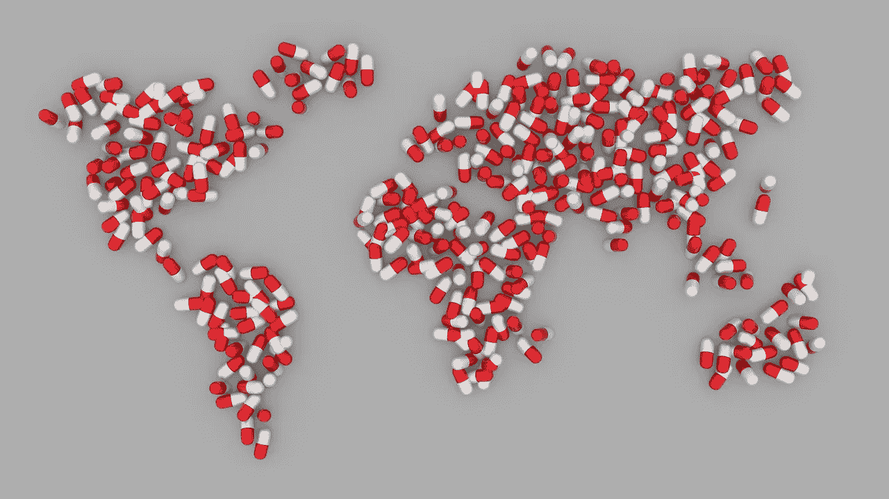
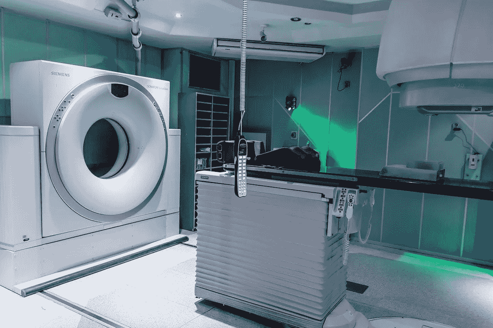
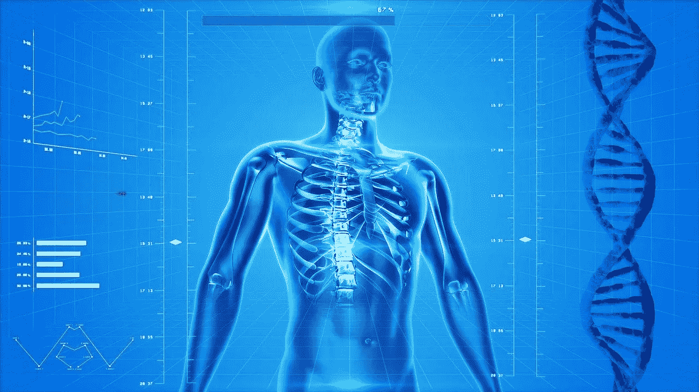
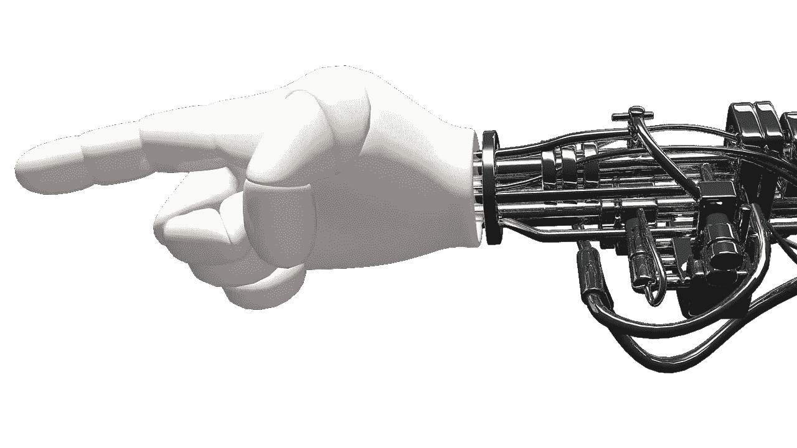
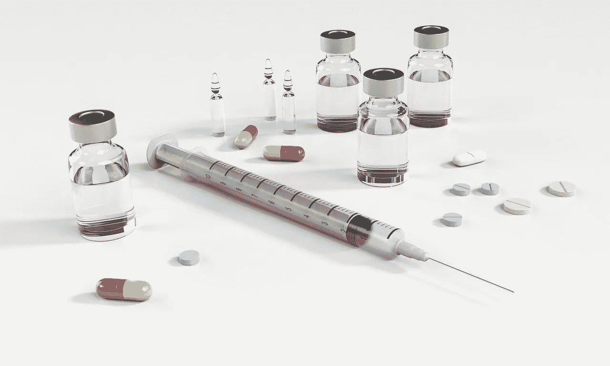
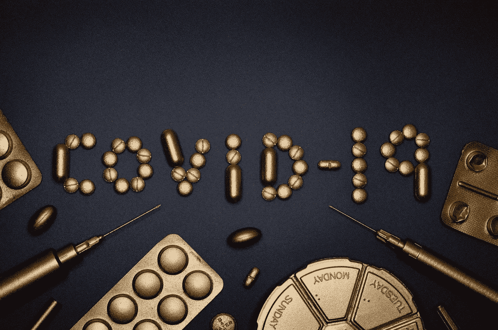

# 面向医疗保健的人工智能和机器学习

> 原文：<https://towardsdatascience.com/ai-and-machine-learning-for-healthcare-7a70fb3acb67?source=collection_archive---------13----------------------->

## AI/ML 在医疗保健中的应用概述。

***编者按:*** [*走向数据科学*](http://towardsdatascience.com/) *是一份以数据科学和机器学习研究为主的中型刊物。我们不是健康专家或流行病学家，本文的观点不应被解释为专业建议。想了解更多关于疫情冠状病毒的信息，可以点击* [*这里*](https://www.who.int/emergencies/diseases/novel-coronavirus-2019/situation-reports) *。*

图片来源: [Pixabay(免费用于商业用途)](https://pixabay.com/illustrations/world-map-pill-earth-healthcare-1185076/)

# 介绍

21 世纪只有 20 年，可以肯定的是，本世纪人类社会最大的变革性技术和推动者之一将是人工智能(AI)。一个公认的观点是，人工智能及相关服务和平台将改变全球生产力、工作模式和生活方式，并创造巨大的财富。

例如，麦肯锡认为，到 2030 年，全球经济活动将达到约 13 万亿美元(T21)。在短期内，研究公司 Gartner 预计，全球基于人工智能的经济活动将从 2018 年的约 1.2 万亿美元增加到 2022 年的约 3.9 万亿美元。

 [## 普华永道的全球人工智能研究:确定奖项

### 高度潜在的用例:基于数据的诊断支持人工智能驱动的诊断使用病人的独特历史作为…

www.pwc.com](https://www.pwc.com/gx/en/issues/data-and-analytics/publications/artificial-intelligence-study.html) 

众所周知，这种转变在很大程度上是由强大的机器学习(ML)工具和技术推动的，如深度卷积网络、生成对抗网络(GAN)、梯度提升树模型(GBM)、深度强化学习(DRL)等。

然而，传统的商业和技术部门并不是唯一受到人工智能影响的领域。[医疗保健是被认为非常适合应用人工智能工具和技术的领域](https://www.webmd.com/a-to-z-guides/features/artificial-intelligence-helps-health-care#1)。

诸如[电子医疗记录(EMR)](https://www.usfhealthonline.com/resources/key-concepts/what-are-electronic-medical-records-emr/) 等强制性做法已经为医疗保健系统应用大数据工具进行下一代数据分析做好了准备。AI/ML 工具注定会为这个流程增加更多的价值。它们有望提高初级/三级患者护理和公共医疗保健系统中自动化和智能决策的质量。这可能是人工智能工具的最大影响，因为它可能会改变全球数十亿人的生活质量。

# 医疗保健中应用 ML 的主要示例

## 人工智能辅助放射学和病理学

图片来源: [Pixabay(免费商用)](https://pixabay.com/photos/mri-magnetic-resonance-imaging-2815637/)

如今，电子存储的医学成像数据非常丰富，DL 算法可以使用这种数据集来检测和发现模式和异常。机器和算法可以像训练有素的放射科医生一样解释成像数据——识别皮肤上的可疑斑点、病变、肿瘤和脑出血。因此，使用 AI/ML 工具/平台来帮助放射科医生，将会呈指数级增长。

这种方法解决了医疗保健领域的一个关键问题，因为在全世界范围内，训练有素的放射科医生越来越难找到。在大多数情况下，由于数字医疗数据的泛滥，这些技术工人承受着巨大的压力。根据本文中的[，一个普通的放射科医师需要每 3-4 秒钟为一幅图像生成一个解释结果才能满足需求。](https://www.ncbi.nlm.nih.gov/pmc/articles/PMC6268174/)

 [## 放射学中的人工智能

### 人工智能(AI)算法，特别是深度学习，已经在…

www.ncbi.nlm.nih.gov](https://www.ncbi.nlm.nih.gov/pmc/articles/PMC6268174/) 

**识别罕见或难以诊断的疾病**通常依赖于检测所谓的“边缘病例”。由于这种 ML 系统建立在包含这些疾病的原始图像(和各种转换)的大型数据集上，因此对于这种类型的检测，它们通常比人更可靠。

> 它们有望提高初级/三级患者护理和公共医疗保健系统中自动化和智能决策的质量。这可能是人工智能工具的最大影响，因为它可能会改变全球数十亿人的生活质量。

一个优秀的测试案例是[微软的 InnerEye 项目](https://www.microsoft.com/en-us/research/project/medical-image-analysis/)，该项目采用 ML 方法，使用 3D 放射图像分割和识别肿瘤。它有助于精确的手术计划、导航和放射治疗计划的有效肿瘤轮廓绘制。

越来越多地用于早期癌症检测的 MRI 和其他先进成像系统正在配备 ML 算法。下面的文章提供了这方面的全面概述。

 [## 深度学习，人工智能提高乳腺癌检测的准确性

### 来源:Thinkstock -新人工智能(AI)帮助放射科医生更准确地阅读乳腺癌筛查…

healthitanalytics.com](https://healthitanalytics.com/news/deep-learning-ai-improve-accuracy-of-breast-cancer-detection) 

下面的 Nature 文章描述了如何应用 ML 技术来执行高级图像分析，如前列腺分割和多种成像数据源(如超声检查、CT 和 MRI)的融合。

 [## 新时代:前列腺癌中的人工智能和机器学习

### 机器学习(ML)正在彻底改变和重塑医疗保健，基于计算机的系统可以被训练成…

www.nature.com](https://www.nature.com/articles/s41585-019-0193-3) 

通过**增加外科医生的显示**，ML 工具也增加了重要的价值，例如在机器人手术和其他图像引导介入过程中的癌症定位。

> 因此，使用 AI/ML 工具/平台来帮助放射科医生，将会呈指数级增长。

## ML 和数据科学提供可操作的见解

图片来源: [Pixabay(免费商用)](https://pixabay.com/illustrations/human-skeleton-human-body-anatomy-163715/)

在当今世界， [**在各种医疗保健机构(公立医院、疗养院、医生诊所、病理实验室等)中，艾字节大小的医疗数据正在被数字化**](https://emerj.com/ai-sector-overviews/where-healthcares-big-data-actually-comes-from/) 。).不幸的是，这些数据通常是杂乱无章的。与标准事务型业务数据不同，**患者数据不太适合简单的统计建模和分析。**

强大而敏捷的人工智能平台能够**连接到大量患者数据库**并分析复杂的混合数据类型(例如，血液病理学、基因组学、放射学图像、病史),是当前的需求。此外，这些系统应该能够以深入的方式筛选分析，并发现隐藏的模式。

此外，他们应该能够将他们的发现翻译并可视化为**人类可理解的形式**，以便医生和其他医疗保健专业人员能够以高度自信和完全透明的方式处理他们的输出。

[可解释的人工智能](/interpretable-ai-or-how-i-learned-to-stop-worrying-and-trust-ai-e61f9e8ee2c2)和分布式人工智能系统——非常符合这些要求，并准备在不久的将来满足这些系统的需求。

## 用于手术辅助的物理机器人

图片来源: [Pixabay(免费商业使用)](https://pixabay.com/illustrations/hand-robot-machine-697264/)

手术机器人可以为人类外科医生提供独特的帮助，

*   增强在过程中观察和导航的能力，
*   产生精确的微创切口。
*   以最佳的缝合几何形状和伤口减少疼痛

人工智能/人工智能在这种数字手术机器人中的应用确实有令人兴奋的可能性。

*   借助大规模分布式处理**的机器人**以软件为中心的协作****
*   基于手术历史(由机器和人类执行)及其结果(有利或不利)的数据驱动**洞察和指导**
*   人工智能生成的**虚拟现实空间**用于实时方向和引导
*   **远程医疗和远程手术的可能性**相对简单的程序

下面的文章简要总结了潜在的应用。

 [## 机器人和人工智能如何创造 21 世纪的外科医生

### 外科机器人超越了硬件，为外科医生提供了更好的技能，改善了患者的预后。罗杰·史密斯|…

www.roboticsbusinessreview.com](https://www.roboticsbusinessreview.com/health-medical/how-robots-and-ai-are-creating-the-21st-century-surgeon/) 

## 用于医疗保健运营管理和患者体验的人工智能

在美国，普通公众接受适当医疗保健的费用和困难一直是长期激烈辩论的主题。

人工智能和相关的数据驱动技术为解决一些问题做好了独特的准备，这些问题被确定为根本原因——排长队，担心不合理的账单，漫长而过于复杂的预约流程，无法获得正确的医疗保健专业人员。

这些相同的问题已经困扰传统企业几十年了，人工智能/人工智能技术已经成为解决方案的一部分。这是因为，庞大的数据库和智能搜索算法是人工智能系统的强项，擅长于这种模式匹配或优化问题。因此，医院和公共卫生组织必须在日常运营中利用先进的 AI/ML 工具和技术。

 [## 医疗保健 AI - Olive 的 11 个运营应用

### 人工智能和自动化在医疗保健操作中的应用:1。资格检查和事先…

oliveai.com](https://oliveai.com/blog/11-operational-applications-for-healthcare-ai/) 

伟大的事情是，**对数据隐私的关注，这是医疗保健系统的一个复杂而困难的问题，**并没有对这种类型的人工智能应用构成巨大挑战。最常见的情况是，运营问题并不涉及与疾病、诊断或药物相关的机密患者数据，而是像任何其他现代商业企业一样，包含与财务、资本、营销或人力资源问题相关的数据。

图片来源: [Pixabay(免费用于商业用途)](https://pixabay.com/illustrations/security-secure-technology-safety-2168234/)

这种系统的核心目标应该是使以**为目标的人工智能辅助平台增强最大部分普通人的医疗保健服务体验**。传统企业中已经部署的系统的首要目标是最大化利润。用于医疗保健运营管理的强大人工智能工具必须**通过将同理心与盈利目标相结合，将自己与那些传统系统区分开来。**

## 人工智能/人工智能技术辅助下的药物发现

图片来源: [Pixabay(免费商业使用)](https://pixabay.com/illustrations/syringe-pill-capsule-morphine-1884784/)

人工智能和人工智能技术越来越多地被制药行业的大腕所选择，以解决成功发现药物这一极其困难的问题。一些突出的例子——涉及赛诺菲、基因泰克、辉瑞——摘自本文[。这些案例研究涵盖了各种治疗领域——代谢疾病、癌症治疗、免疫肿瘤药物。](https://www.nature.com/articles/d41586-018-05267-x)

 [## 人工智能如何改变药物发现

### 一个巨大的数字笼罩着寻找新药的科学家们:据估计，开发新药的费用高达 26 亿美元。

www.nature.com](https://www.nature.com/articles/d41586-018-05267-x) 

超越传统的长距离过程，人工智能技术越来越多地被应用于加速**早期候选选择**和**机制发现**的基本过程。

例如，生物技术公司 Berg [使用其人工智能平台](https://fortune.com/2018/10/22/artificial-intelligence-ai-healthcare/)分析来自患者的大量生物和结果数据(脂质、代谢物、酶和蛋白质图谱),以突出患病细胞和健康细胞之间的关键差异，并识别新的癌症机制。

 [## 伯格的人工智能:只是另一家生物技术或改变行业的公司？

### 评估伯格(波士顿生物技术)的战略在短期和中期就其人工智能，疑问…

digital.hbs.edu](https://digital.hbs.edu/platform-rctom/submission/artificial-intelligence-at-berg-just-another-biotech-or-industry-changing-company/) 

这方面另一个突出的例子来自 DeepMind 使用他们的 [**AlphaFold**](https://deepmind.com/blog/article/AlphaFold-Using-AI-for-scientific-discovery) 系统发表了与新冠肺炎病毒([新型冠状病毒](https://en.wikipedia.org/wiki/Severe_acute_respiratory_syndrome_coronavirus_2))相关的可能蛋白质结构。

 [## 与新冠肺炎相关的蛋白质结构的计算预测

### 科学界已经为应对最近的新冠肺炎疫情而振奋起来，建立在几十年的基本…

deepmind.com](https://deepmind.com/research/open-source/computational-predictions-of-protein-structures-associated-with-COVID-19) 

许多初创公司也在致力于使用人工智能系统来分析多渠道数据(研究论文、专利、临床试验和患者记录)，方法是利用**贝叶斯推理、马尔可夫链模型、强化学习和自然语言处理(NLP)中的最新技术。**关键目标是发现模式和构建高维表示，存储在云中并用于药物发现过程。

这是一篇综述文章，展示了 DL 在药物发现中的应用。

 [## 综述:药物发现中的深度学习

### 深度学习算法已经在许多不同的任务中实现了最先进的性能。

towardsdatascience.com](/review-deep-learning-in-drug-discovery-f4c89e3321e1) 

> 用于医疗保健运营管理的强大人工智能工具必须**通过将同理心与盈利目标相结合，将自己与那些传统系统区分开来。**

## 走向未来——精准医疗和预防保健

根据美国国家医学图书馆的说法， [**精准医学**](https://ghr.nlm.nih.gov/primer/precisionmedicine/definition) 是"*一种新兴的疾病治疗和预防方法，它考虑了每个人在基因、环境和生活方式方面的个体差异。*

展望未来，这可能是 AI/ML 在医疗保健领域应用的最具影响力的好处之一。

这里的目标极其复杂和苛刻——根据个人病史、生活方式选择、基因数据和不断变化的病理检查，为个人找到精确的治疗方案。自然，我们需要引入最强大的人工智能技术——深度神经网络、人工智能驱动的搜索算法/高级强化学习、概率图形模型、半监督学习——来应对这一挑战。

除了对疾病和治疗进行预测和建模，这样的人工智能系统还可以预测未来患者在早期筛查或常规年度体检数据的情况下患特定疾病的概率。此外，人工智能工具可能能够模拟疾病更有可能发生的原因和环境，从而帮助指导和准备医生干预(以个性化的方式)，甚至在个体开始出现症状之前。

> 这里的目标极其复杂和苛刻——根据个人病史、生活方式选择、基因数据和不断变化的病理检查，为个人找到精确的治疗方案。

 [## 人工智能如何推进精准医疗

### 人工智能和机器学习已经在医疗保健领域使用了多年，并将继续…

www.forbes.com](https://www.forbes.com/sites/nicolemartin1/2019/10/18/how-artifical-intelligence-is-advancing-precision-medicine/#13cc5c15a4d5) 

## 公共卫生系统的人工智能

不用说，这种强大的技术可以应用于大规模公共卫生系统以及个体患者护理。事实上，流行病的数字监控和人工智能辅助的健康数据分析已经成熟。

 [## 数字监控有助于控制疫情冠状病毒，但也威胁着…

### 苹果和谷歌正在合作开发一种新技术，这种新技术可以提醒持续使用智能手机的用户…

theconversation.com](https://theconversation.com/digital-surveillance-can-help-bring-the-coronavirus-pandemic-under-control-but-also-threatens-privacy-135151) 

世界卫生组织(世卫组织)也这么说…

 [## 大数据和人工智能

### 数字技术及其在公共卫生领域的应用正在迅速扩展。世卫组织的成员国是…

www.who.int](https://www.who.int/ethics/topics/big-data-artificial-intelligence/en/) 

图片来源: [Pixabay(免费用于商业用途)](https://pixabay.com/photos/chemistry-crown-coronavirus-cure-4932607/)

正在进行的新冠肺炎危机已经表明，对 T2 疫苗开发和 T4 治疗研究项目进行数百次平行试验是多么重要。从所有这些不同的来源获取数据并识别模式——通常产生具有高度不确定性的结果——几乎不可能用标准的统计建模技术来实现，这些技术针对小规模试验进行了优化。人工智能技术必须用于解决这样一个全球规模的问题。

 [## 新冠肺炎临床试验中的潜在治疗方案

### EBSCO 医学药物和临床信息学小组| 2020 年 4 月 8 日感染之外的前景…

health.ebsco.com](https://health.ebsco.com/blog/article/potential-therapeutic-options-in-covid-19-clinical-trials) 

# 摘要

会上讨论了人工智能/人工智能技术和平台在医疗保健领域的各种令人兴奋和具有前瞻性的应用。从放射学助理到智能健康运营管理，从个性化医疗到公共卫生的数字监控，这些主题都得到了综述。

来自数据隐私和法律框架的已知挑战将继续阻碍这些系统的全面实施。确定第三方提供商(例如，人工智能和人工智能工具、物理设备或平台的所有者)可以合法查看和使用何种数据可能极其复杂。因此，在应对这些挑战的同时，需要对法律和决策进行大规模的合理化努力。

作为技术专家和人工智能/人工智能从业者，我们应该为一个光明的未来而努力，人工智能算法的力量将惠及数十亿普通人，以改善他们的基本健康和福祉。

答同样，你可以查看作者的 [**GitHub**](https://github.com/tirthajyoti?tab=repositories) **知识库**中的代码、思想以及机器学习和数据科学方面的资源。如果你和我一样，对人工智能/机器学习/数据科学充满热情，请随时[在 LinkedIn 上添加我](https://www.linkedin.com/in/tirthajyoti-sarkar-2127aa7/)或[在 Twitter 上关注我](https://twitter.com/tirthajyotiS)。

 [## Tirthajyoti Sarkar - Sr .首席工程师-半导体、人工智能、机器学习- ON…

### 通过写作使数据科学/ML 概念易于理解:https://medium.com/@tirthajyoti 开源和有趣…

www.linkedin.com](https://www.linkedin.com/in/tirthajyoti-sarkar-2127aa7/) 

享受中等:[https://medium.com/@tirthajyoti/membership](https://medium.com/@tirthajyoti/membership)