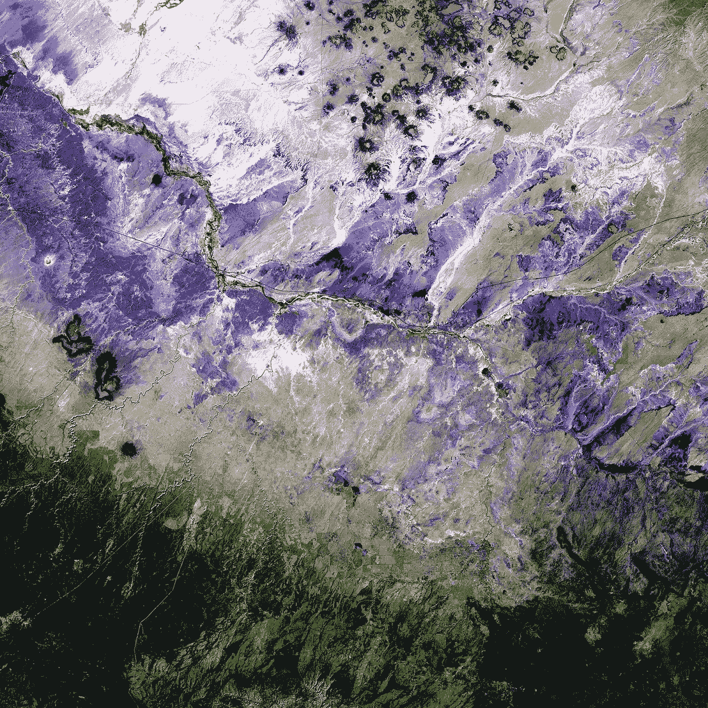

# 人工智能和我们复杂的未来

> 原文：<https://towardsdatascience.com/ai-and-our-complex-future-13b4ac36c5cd?source=collection_archive---------51----------------------->

## 变化、不稳定和混乱

德克·克内梅尔和乔纳森·福利特

我们如何在人工智能和新兴技术重塑科学、技术、社会和政策等大规模系统景观的可能未来中导航？我们采访了 Lux Capital 的常驻科学家 Sam Arbesman，他是两部获奖书籍的作者，最近的一部是[“过度复杂:理解极限下的技术”](https://www.amazon.com/Overcomplicated-Technology-at-Limits-Comprehension/dp/0143131303)，以更好地理解这个新兴世界的更大背景和影响——一个充满变化、不稳定和复杂性的未来。

图 01:变化、不稳定和复杂的未来。
[图片:《过度复杂:理解极限下的技术》的封面，作者 Samuel Arbesman。]

## **计算创造力和作者问题**

如果人类工作和创造力的未来是计算性的，那么谁会得到荣誉呢？计算创造力——利用人工智能增强人类创造力——已经出现，但迄今为止，结果参差不齐。例如，计算音乐创作处于非常先进的状态，而相比之下，计算工程相对较新。“艺术、音乐和设计领域显然发生了很多事情，”阿贝斯曼说。“在科学中有很多计算创造力，在实际计算生成假设或计算测试方面。能够以我们以前可能无法做到的方式进行大规模的科学研究，对我们如何看待创造力有很多非常有趣的影响。”

图 02:大规模的计算科学对我们如何思考创造力有着有趣的影响。
[ [照片:迈克尔·朗米尔在 Unsplash](https://unsplash.com/photos/L9EV3OogLh0) 上拍摄的“显微镜特写”

计算创造力的另一个重要的相关领域是通过计算生成的计算机代码或程序合成。“假设你有一个你想写的计算机函数。因此，在给定某些输入的情况下，您可以指定所需的输出，而不是编写它。而且，程序实际上会为你编写那个函数的代码，”阿贝斯曼说。“现在，许多这方面的工作还没有完成，一个非程序员可以非常容易地编写大型、完整的计算机程序。我们还远没有达到那个程度。但是，我确实认为……计算创造力有很多非常有趣的潜力。”

在一个人工智能增强我们的工作、软件输出人机合作成果的世界里，信用和所有权成为一个法律和社会问题。“那么当机器和人工智能正在创造艺术和音乐时，我们如何看待信用？我们如何看待版权？这些东西是怎么工作的？”阿贝斯曼说。“我认为，我们如何看待这个问题，仍有很大程度的未决问题。”如果一个由艺术家或音乐家开发的人工智能系统产生了一个人自己无法产生的创造性和新奇的东西，或者这个人甚至不知道它是如何被创造出来的，这个人工智能是合作作者吗？“我认为这对于我们如何看待什么是信用，什么是所有权有一些有趣的影响。有很多法律学者谈到这一点，也有一些法律著作已经开始被用来思考这个问题。这将开启许多真正有趣的对话。”

## **了解复杂系统固有的风险**

鉴于人工智能和新兴技术的复杂性，以及它们的采用速度和它们的存在所引发的变化，我们应该警惕各种风险。

> “在技术和工程领域，我们认为，因为我们设计了一个系统，所以它应该是合乎逻辑和理性的，并且易于人类理解。“我们认为，如果我们能够将大脑应用于这些系统，我们应该能够理解它们，”阿贝斯曼说。

从表面上看，这个假设是有道理的。但是，正如他进一步描述的那样，情况未必如此。“举例来说，当你看到……仅仅是一辆汽车内的计算机代码数量，这些东西就比我们作为一个单独的个体阅读和理解时可能会感到舒服的任何其他东西都要大得多。”随着时间的推移而进化的软件系统有着大量的遗留代码，没有人能完全理解这些代码中的许多相互作用的部分。“在许多方面，它们确实有生物学的暗示，”阿贝斯曼说，这不仅表明了它们的复杂程度，也表明了它们如何开始模仿其他看似不同的系统。

> “在技术方面，我们必须稍微远离这种传统的工程思维模式，转向生物学思维模式——采用生物学家可能如何询问复杂生物系统的一些想法，并将其用于我们自己的技术系统，”阿贝斯曼解释道。

像科学家评估生物系统一样评估事物给了我们更好的机会去理解和潜在地控制我们正在处理的复杂系统。“我认为在许多情况下，随着技术变得越来越复杂，我们使用人工智能——可能有数百万个参数由某种算法的复杂关系设置，大量数据涌入系统——当系统出错时，*你几乎不知道系统为什么出错。”*

图 03:生物学思维给了我们理解复杂系统更好的机会。
【图片:[【美国地质勘探局在 Unsplash](https://unsplash.com/photos/PqP_d9duxpk) 拍摄的“亚利桑那州彩绘沙漠”】

为了说明系统复杂性的这一点，阿贝斯曼举了一个稍早一些的技术中的灾难性缺陷的例子——丰田汽车意外加速的案例研究，这导致了 2009-2011 年间的大量召回。“大约 10 年前，丰田生产的许多汽车偶尔会加速，人们不知道为什么。在某些情况下，这些车会撞车，实际上，在某些情况下，有人会死。这是一个非常严重的问题，尽管它被委婉地称为‘意外加速’。”

美国司法部长对丰田汽车意外加速的原因进行了为期四年的调查。它导致该公司因隐瞒安全缺陷而被罚款 12 亿美元，这些缺陷包括地垫和粘性油门踏板。值得注意的是，丰田电子节气门控制系统(ETCS)及其软件没有被列为缺陷之一。然而，这并不是故事的结尾。[在 Bookout/Schwarz 诉丰田汽车公司一案中，陪审团判给原告 300 万美元的赔偿金](https://users.ece.cmu.edu/~koopman/pubs/koopman14_toyota_ua_slides.pdf)。试验的一个关键点是电子油门控制系统的缺陷是否导致了致命的碰撞。

[这份对丰田软件分析的精彩描述来自安全研究和战略公司](https://www.safetyresearch.net/blog/articles/toyota-unintended-acceleration-and-big-bowl-%E2%80%9Cspaghetti%E2%80%9D-code):“备受尊敬的嵌入式软件专家迈克尔·巴尔(Michael Barr)花了 20 多个月的时间，在一个酒店大小的房间里的五个隔间之一审查丰田的源代码，保安人员负责监督，确保进入者不得携带纸张进出，不得佩戴皮带或手表。巴尔根据他 800 页的报告，为丰田源代码的细节作证。

巴尔的证词中包括了这句话(着重号后加):“有大量的功能过于复杂。按照标准的行业标准，其中一些是不可测试的，这意味着这是一个非常复杂的配方，没有办法开发一个可靠的测试套件或测试方法来测试其中可能发生的所有事情。其中一些甚至非常复杂，以至于被称为不可维护的，这意味着如果你去修复一个 bug 或做出改变，你可能会在这个过程中产生一个新的 bug。仅仅因为你的车有最新版本的固件，也就是我们所说的嵌入式软件，并不意味着它一定比旧版本更安全。结论是故障保险是不充分的。他们拥有的故障保险包含缺陷或缺口。但总的来说，安全架构是一个纸牌屋。在油门控制失效的同时，很大一部分故障保险可能会失效，”尽管陪审团在 book out/Schwarz v . Toyota Motor Corporation 一案中做出了裁决，但丰田仍继续对他们的 ETCS 存在缺陷提出质疑。

“我认为，在这种情况下，[丰田]最终使他们的系统变得比他们需要的更复杂，这导致他们更难理解，因此更有可能实际失败。但是，在许多情况下，当我们审视系统的整体复杂性时，有时这些技术缺乏可解释性，这将对我们如何看待责备和责任产生影响，”阿贝斯曼说。复杂的人工智能系统尤其如此。

最初，在法律成文和法规建立之前，围绕新兴技术的责任总是令人困惑。然而，从历史上看，至少有一种理解的假象——法官、陪审团或其他仲裁者对情况的机制有很强的理解，并以谨慎的方式做出决定。我们已经可以看到，对于复杂的软件，比如在丰田的例子中，这种理解并不总是可能的。深度学习人工智能系统的复杂性问题变得更加困难，这些系统在训练时会在人类视野之外自学，并且一旦部署，可能是不可理解的，不可能进行反向工程。

“应该有一种方法——当一个具有巨大预测能力和强大的人工智能做出决定时——我们至少有某种方法知道这个决定是如何做出的，或者这个预测是如何做出的，”阿贝斯曼说。我们需要能够审计人工智能决策。“有一种趋势——我认为我们会越来越多地看到这种趋势——试图创建可解释的人工智能和机器学习系统，”阿贝斯曼说。“我认为这将非常重要。”为了减轻风险，就像丰田案例所展示的那种问题，人工智能需要可解释的系统。阿贝斯曼对可解释的人工智能的乐观态度令人振奋，但至少有一个问题是，它是否会被证明是可能的，至少在从机器学习角度驱动的软件中。这将是一个需要关注的领域。

## **解决自动化的社会风险**

除了人工智能系统本身的复杂性带来的风险，这种软件和自动化对整个社会的影响也带来了潜在的问题。这些延伸到诸如工作和就业的未来等重要话题，以及对人类生活的存在主义关切。阿贝斯曼说，自动化程度的提高有可能“造成一定数量的工作岗位减少，甚至几乎所有工作岗位的减少”。“我认为，我们需要围绕如何思考未来每个人生活的意义和目的进行更多的对话。”作为一个社会，我们希望未来是什么样的？

“即使在《星际迷航》后稀缺时代的最佳场景中，每个人的需求都得到了满足，每个人都能够过上真正美好的生活，没有人需要工作，没有人可以沉迷于自己的所有爱好，做自己想做的事情，问题仍然是:‘人们如何过上自己真正想过的生活？’”阿贝斯曼说。在这种情况下，人们如何看待他们有意义的生活？”我认为我们现在就需要进行这些对话，而不是以后。如果有很大一部分人不再需要工作，我们如何确保这些人感觉他们在为社会做贡献，做创造性的工作，实现一定的潜力和目标，如果他们不再需要拿薪水的话？"

但首先，我们需要以一种不对我们现有社会造成巨大破坏的方式进入这个后匮乏世界。“我可以看到，我们的世界现在正处于大量自动化和失业的边缘。也许，几百年后，我们将会在这个美妙的后匮乏时代的乌托邦里。但是，从现在到那时，可能会有大量的中断。我认为，作为一个社会，我们越早开始这些哲学对话，我们就会变得越好，因为当人们已经失去工作的时候……一大部分人，那就已经太晚了。所以，我们现在真的需要进行这样的对话，”阿贝斯曼说。

[*Creative Next*](https://creativenext.org/) *是一个播客，探索人工智能驱动的自动化对创意工作者，如作家、研究人员、艺术家、设计师、工程师和企业家的生活的影响。本文伴随* [*第二季第十二集——我们复杂的未来*](https://creativenext.org/episodes/our-complex-future/) *。*