# 机器学习和真实状态:预测阿姆斯特丹的租金价格

> 原文：<https://towardsdatascience.com/ai-and-real-state-renting-in-amsterdam-part-1-5fce18238dbc?source=collection_archive---------11----------------------->

## 决定一套公寓是否物有所值从来都不容易。机器学习能帮助我们理解我们在房地产市场的地位吗？

无论你是大学生还是中产阶级家庭，租房或买房总是一个令人望而生畏的过程，往往看起来冲动或冒险(柠檬的真正经济**市场**)。

如果租房本身已经很难，在阿姆斯特丹租房也不会让事情变得更容易。随着城市法规越来越多，学生公寓的等候名单越来越长，人口过剩，在阿姆斯特丹租公寓让许多人不顾一切地寻找第一个机会，容易受到诈骗和高价合同的伤害。

在本教程中，我将介绍阿姆斯特丹租赁市场的整个数据科学项目，从收集数据、数据清理、可视化的基础，直到使用机器学习和超参数调整来开发该市房屋的估价模型。一路上也有很多关于有趣的机器学习话题的讨论，比如维数灾难和多重共线性。请随意修改代码，并在您所在的城市应用该项目，以更好地了解您作为租赁者/购买者的立场！

你在分析中使用的实际统计方法应该是你的价值判断，我会将更深入的解释与我使用的所有方法联系起来，所以请确保你检查了它们！

# 1)我如何获取数据？

有了(高质量的)数据，就越多越好。机器学习是统计学的一个特殊领域，我们将计算机算法应用于非常**非常**大的数据集。在你建立了你想要回答的问题之后(我应该租吗？该不该买？我应该搬到另一个城市吗？)你可以开始寻找包含回答这些问题所需数据的网站。

就我而言，我想在阿姆斯特丹找到一套物有所值的公寓。因此，我在阿姆斯特丹市搜索了**租房网站。**简单对吧？然而，总是检查他们的服务条款和 robots.txt，以确保你被允许尊重地搜集他们的数据。(我们将在教程的后面讨论这意味着什么)。对于这个项目，我将使用阿姆斯特丹租赁网站 Pararius。


阿姆斯特丹的 Pararius 租赁页面

找到您想要从中获取数据的列表页面。点按“检查”以了解有关其网站中数据结构的更多信息。点击后，侧边栏会显示数据所在的 HTML 存储。在下面的例子中，我需要的数据主要在盒子

*   中，这意味着我将在后面的代码中使用这些信息来引用这些数据。此时此刻，我们不需要指定我们是否想要价格、位置、邮政编码…我们只想知道所有这些数据所在的“盒子”。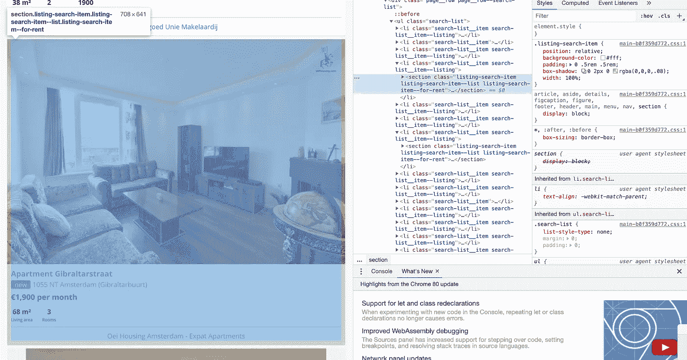

阿姆斯特丹的 Pararius 租赁页面

# 2)刮痧时间到了！

现在，我们要开始编码了！与任何网络搜集一样，我们将从向我们之前选择的网站发出请求开始，这样他们就可以向我们提供我们想要的数据。

我们应该记住，向网站发出请求类似于在特定页面上刷新我们的浏览器:这增加了他们服务器的流量，如果以机器人高速率完成，可能会淹没他们！我在代码中添加了随机睡眠时间，这样脚本会在抓取更多页面之前停止几秒钟。

如果您对请求和头的工作方式特别感兴趣，您也可以使用完全随机的头来创建您的请求。这对于大多数网站来说是不必要的(并且不应该破坏他们的 TOS ),但是如果你想在你的代码中增加安全性和匿名性，这是我的(尽可能)匿名标题的解决方案:

抓取完所有需要的页面后，您可以运行:

```
len(houses)
```

找出总共收集了多少房屋广告。因为我们稍后会用这些数据训练一个模型，所以你的目标应该是至少 1000 个房屋广告。

# 3)我们得到了数据，但我什么都不明白？

收集完所有数据后，您应该执行几个打印命令以确保一切正常:

如果请求成功(即我们没有被网站阻止)，将打印(响应)

len(houses)会打印出你成功刮到了多少房屋广告

print(house_data[1])将以 HTML 格式打印您抓取的第二个广告块。我总是更喜欢看第二个，因为第一个可能包含头和我们分析的下一部分:数据清理的混淆部分。

## 数据清理

当我执行 print(house_data[1])时，我在我的 Jupyter 实验室中得到这个:

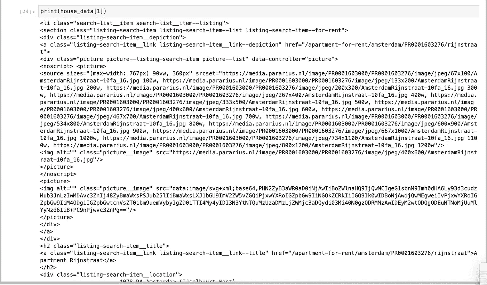

好了，现在还不要逃避这个教程。你现在看到的是从你的列表网站上抓取的漂亮的 HTML 脚本！再往下看:

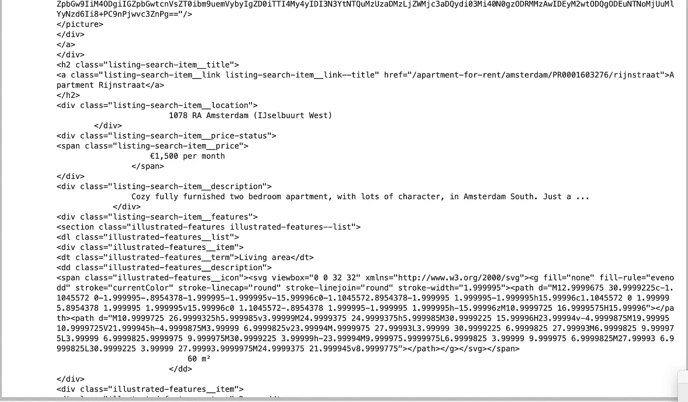

我们实际上可以识别出一些东西！这个广告区的公寓好像在阿姆斯特丹大街 1078 号，月租 1500 欧元，60m！对于数据清理，我们需要在 HTML 的*汤*中找到这些信息，并记下它们的位置(就像我们之前对网站所做的一样！)

比如:要得到价格，你需要搜索，得到你需要的位置:

。您应该对您分析所需的所有信息进行同样的处理。然而，仅仅查找 HTML 标签和类可能会返回比您想要的更多的信息。确保尝试添加[0]，[1]，[2]，…来测试哪个参数会准确地给出您正在寻找的行。

点击方块查看 GitHub 上的代码

很多时候，即使找到了正确的行，也可能会有额外的字符需要从数据框中清除，比如租金价格中的字母，或者邮政编码中的空格。检查一下*神奇的* regex 测试器([https://regex101.com/](https://regex101.com/))来知道如何 str.replace()你的问题。几个例子:

*   要删除非数字字符:

```
df["column name"].str.replace("\d","")
```

*   要删除数字字符:

```
df["column name"].str.replace("\D","")
```

*   删除“新建”一词:

```
df["column name"].str.replace("new","")
```

这是我们的数据框清理后的样子:

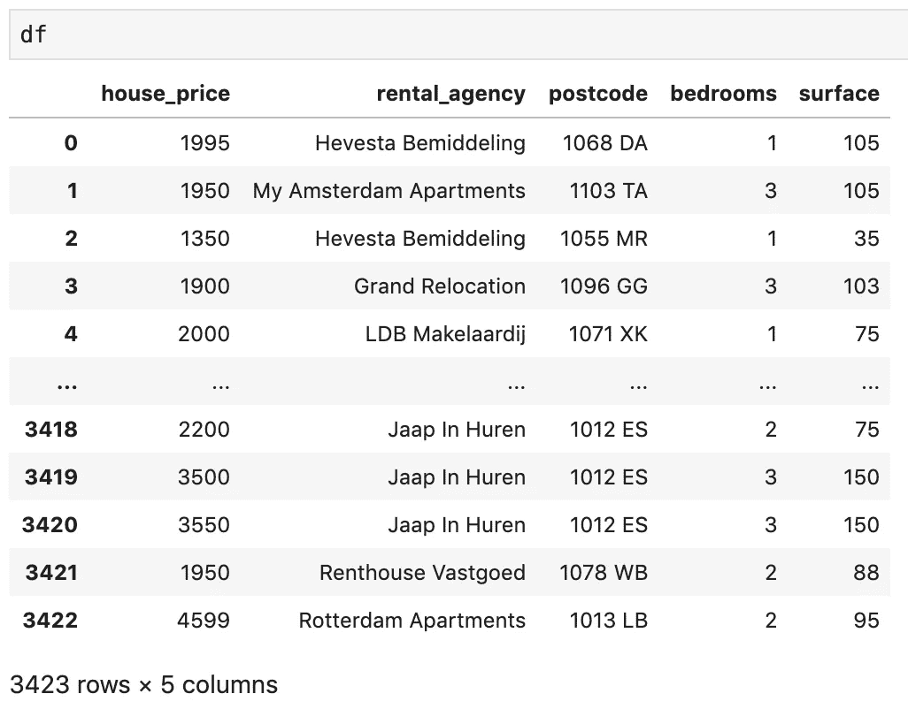

# 4)真实状态市场

不仅要有数据，还要知道如何使用数据。对于租客来说什么是重要的？租赁价格的差异是由什么造成的？根据您之前收集的数据，这些变量可能对您可用:

*   表面尺寸
*   卧室数量
*   如果公寓配有家具(二进制)
*   如果价格包含水电费(二进制)
*   到市中心的距离
*   邻近地区的流行趋势
*   租赁机构(二元)
*   临时合同与长期合同。(二进制)

在本教程中，我们将关注如何测量这些变量。我无法使用家具、公用事业账单或合同长度进行分析，因为我使用的网站上没有这些数据，但如果你可以获得这些数据，我强烈建议将它们包括在内。

# 5)离市中心的距离:地理位置

*位置，位置，位置*。租房的时候公寓的位置真的那么重要吗？阿姆斯特丹的许多人都会同意这一点，因为在迷人的中世纪街道上驾驶汽车是不切实际的，公共交通不是很实惠，在大风大雨中骑自行车简直太糟糕了。

但你如何区分这对租金价格的影响呢？地理定位！在本教程中，我们将使用[主格](https://nominatim.openstreetmap.org/)。我们将使用它来获得数据集中每个公寓的坐标，然后将它们与城市中的一个(理想的)点进行比较。

代码如下:

这里的想法是获取数据框中每个地址的纬度和经度，这样我们就可以尽可能精确地计算距离。这是您应该得到的结果:

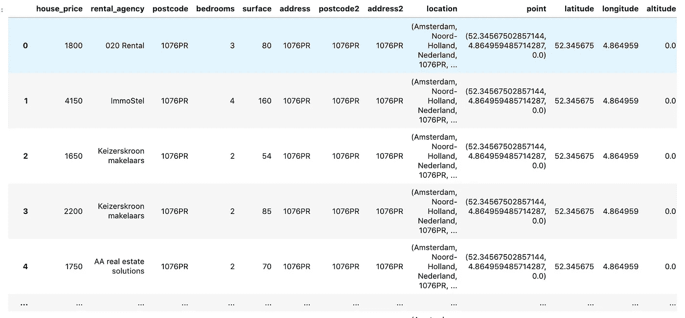

需要注意的是，**点、位置和高度栏将被删除**。点只需要获得纬度和经度点，海拔是不需要的，因为我们正在研究荷兰的房子！(举例来说，如果你住在瑞士，这将是一个值得考虑的有趣因素)。

让我们来计算距离:到目前为止，你应该已经在你的城市中选择了一个点来计算公寓和这个特定点之间的距离。对于阿姆斯特丹，我选择了具有以下坐标(中心点)的阿姆斯特丹中央车站:

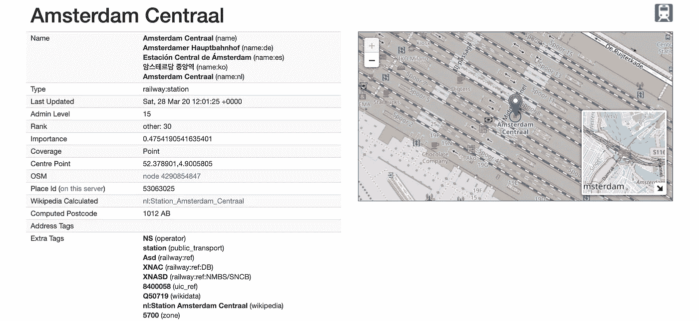

在选择了我的点并获得了它的坐标(也在 nomim 上)之后，您将创建两列，分别是该点的纬度(52.370216)和经度(4.895168)。

如果您正在分析一个较大的城市，该城市有多个被认为是理想的位置，那么您也可以根据需要对不同的地理点多次运行此代码。(不要忘记更改列名，这样就不会覆盖上一点！).

例如，阿姆斯特丹 Zuid 站附近有一个金融区，与居住在市中心附近的租户相比，该金融区与工作租户的相关性可能相同(甚至更高)。如果你使用类似多元线性回归的方法，而不是机器学习统计算法，衡量这些不同的场景更重要**，因为它们天生更擅长识别非线性关系和聚类。出于这个原因，我不会把它包括在这个分析中，但它是一个有趣的因素，取决于所使用的统计方法。**

# 6)可视化租赁市场趋势

现在我们已经有了数据集中所有公寓的地理位置，我们可以进一步可视化它们的租金价格在地理上的位置，并发现任何可能与我们的分析相关的趋势。我们将通过谷歌地图和 Jupyter 的 gmaps 包来实现这一点:

```
conda install gmaps ## to install the google maps package
```

您还需要一个 Google Maps API 密匙，这个密匙很容易请求(而且在大多数情况下是免费的)。你可以[点击这里](https://developers.google.com/maps/documentation/maps-static/intro)索取。

通过下面的简单代码，我们可以在 Jupyter 笔记本上请求交互式 google 地图(有时它无法与 JupyterLab 一起正常工作)，并输出一个热图图层，告诉我们该城市租金最高的地方。

我们应该得到阿姆斯特丹租金价格的美丽地理图:

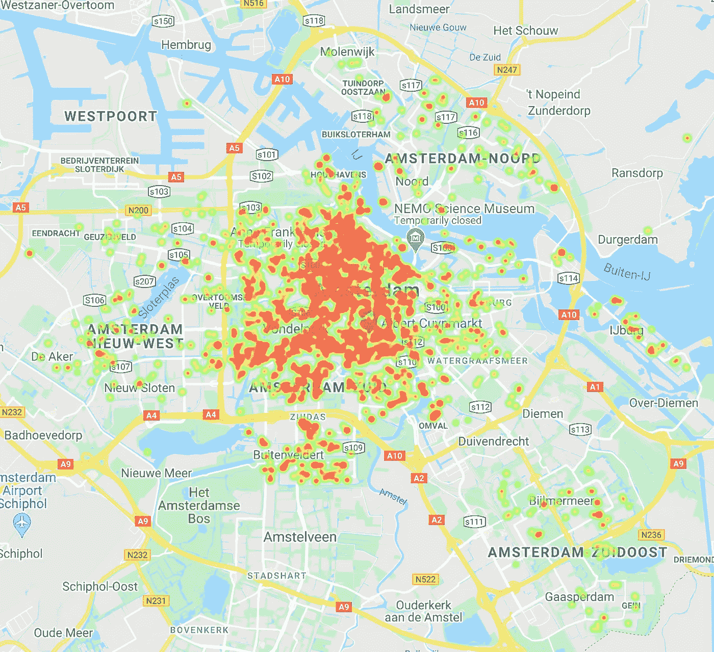

**热点图分析:**不出所料，租金价格较高的大多集中在市中心周边，具体来说就是*德瓦伦*，也有外围街区如*德皮耶普*和城市公园*冯德尔帕克*周边，这些地方都是豪宅集中的地方。Nieuw-West 、 *Zuidoost* 、 *Ijburg* 和 *Noord* 更远的街区似乎具有较低的租金价格，以绿色表示。位置似乎对租赁价格有很大的影响，但绝对不是唯一的因素。

关于 gmaps 的更多例子和教程[点击这里](https://jupyter-gmaps.readthedocs.io/en/v0.3.3/gmaps.html)。

我们还应该看看我们的数据框架中的变量如何与房价相关联。这是检查房价和表面积之间关系的代码:

```
import matplotlib.pyplot as pltplt.figure()
plt.scatter(amsmodel1['surface'],amsmodel1['house_price'], s=20, edgecolor="black",c="darkorange", label="surface")
plt.xlabel("Surface Area")
plt.ylabel("House Price")
plt.title("Surface Area vs. House Price")
plt.legend()
plt.show()
```

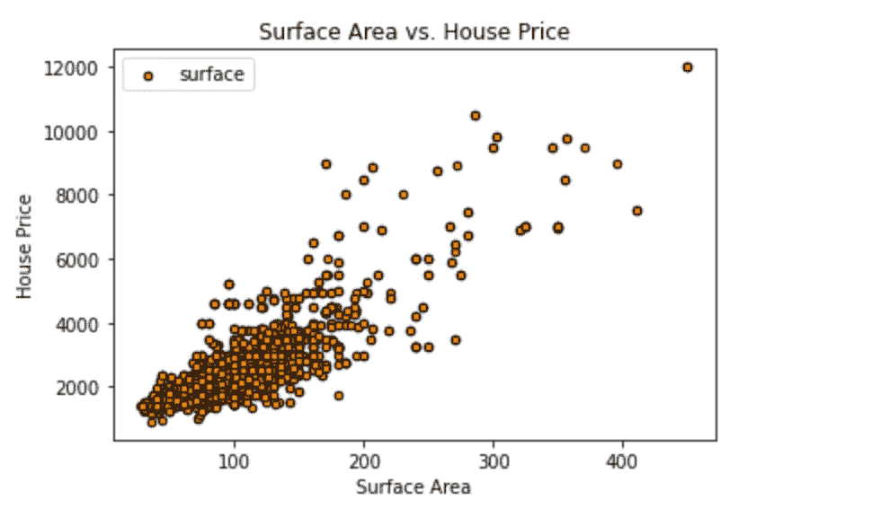

说到户型的表面积，两者之间有非常明显的向上倾斜的趋势关系！然而，应该注意的是:

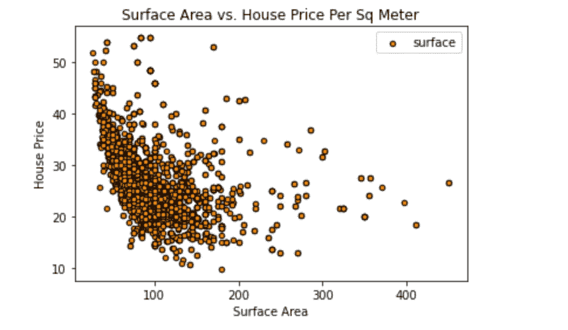

随着房子越来越大，增加一平方米的边际价格急剧下降。因此，几乎总是选择更大的房子(如果你买得起的话)实际上会让你的钱花得更划算。

这是检查房价和卧室数量之间关系的代码:

```
import matplotlib.pyplot as pltplt.figure()
plt.scatter(amsmodel1['bedrooms'],amsmodel1['house_price'], s=20, edgecolor="black",c="darkorange", label="bedrooms")
plt.xlabel("Bedrooms")
plt.ylabel("House Price")
plt.title("Bedrooms vs. House Price")
plt.legend()
plt.show()
```

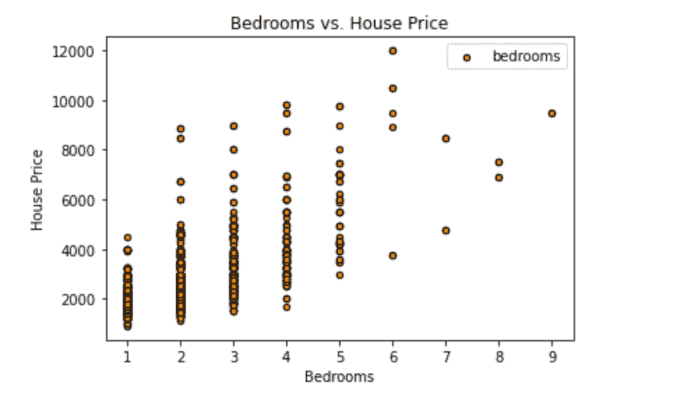

一个与表面面积有些相似的结论是，房子的卧室越多，租金就应该越高。然而，这也不是唯一的因素，因为有 5 个房间的公寓每月租金低至 3000 美元，高至 10000 美元。

如果您现在查看您的数据框，您会注意到许多列是“阶梯”列，以便获得有关房屋的更多信息。我们可以删除所有这些列，因为我们将不再使用它们。

```
del df5['address']
del df5['address2']
del df5['altitude']
del df5['latitude']
del df5['longitude']
del df5['point']
del df5['lat2']
del df5['lon2']
del df5['coord1']
del df5['coord2']
del df5['location']
```

## 多重共线性

如果我们运行多重线性回归(或一个变量的变体)，我们将不得不检查彼此之间高度相关的独立变量。一种方法是通过相关矩阵:

正如我们在下面的相关矩阵中看到的，有两个独立变量显示出一些多重共线性(r > 0.7):卧室和表面积。这是有道理的，因为房子越大，通常会有越多的卧室。

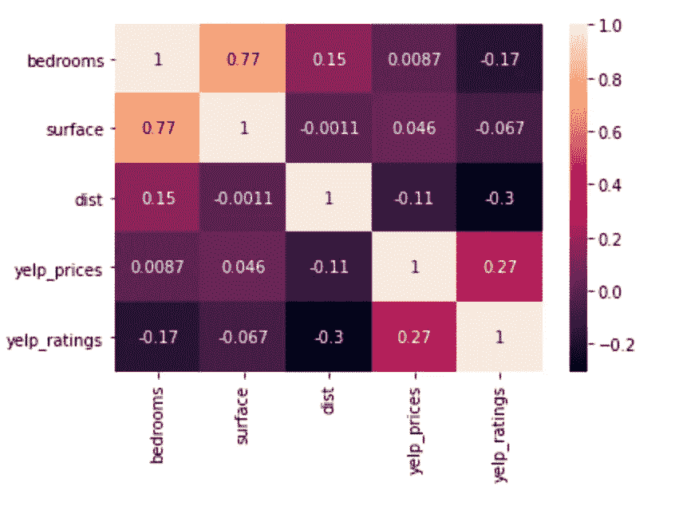

解决这个问题的一个方法是将两个变量合并为一个，例如为每个卧室的平方空间创建一个新变量:

```
amsmodel1['surface_per_bedroom'] = amsmodel1['surface']/amsmodel1['bedrooms']
```

删除表面和卧室变量后，我们的相关矩阵如下所示:

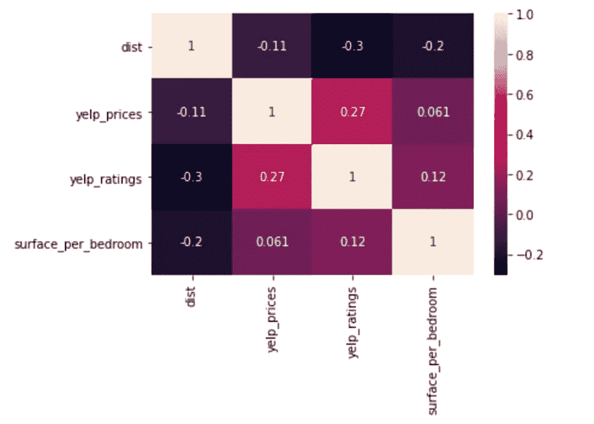

该过程成功消除了数据集中的多重共线性。然而，对于大多数机器学习算法，我们从不需要检查变量之间的高度相关性— **多重共线性不会影响机器学习模型的准确性，尤其是集成学习模型，如随机森林算法。**

在决策树的每一点上，该算法将进行最佳分割，这将更准确地预测目标变量，而不管自变量如何相互关联。此外，对于回归模型，目的是了解特定变量的影响，而在机器学习中，我们对模型的预测能力更感兴趣。如果你想了解更多这方面的内容，这里有一个关于这个主题的精彩讨论:[https://stats . stack exchange . com/questions/168622/why-is-multicollinearity-not-checked-in-modern-statistics-machine-learning](https://stats.stackexchange.com/questions/168622/why-is-multicollinearity-not-checked-in-modern-statistics-machine-learning)

# 7)邻居趋势:使用 Yelp API

在每个大城市，有几个街区似乎非常受欢迎(因此租金特别高)，尽管它们并不靠近市中心，也不一定住有更大的公寓。在我们的谷歌地图热图中可以找到的一个例子是 *De Pijp* ，它位于阿姆斯特丹环路之外，主要提供小型和未装修的公寓，但平均租金高于中央车站右侧的公寓。

我们如何以定量的方式来衡量受欢迎程度的影响？

一种方法是使用 Yelp！受欢迎的街区往往有受欢迎的酒吧和餐馆，评级高，价格也可能高。大多数支付更高租金居住的人用以下理由来证明这一点:

> “这就是城市的生活！”
> 
> “所有的酷酒吧和餐馆都在那里”。


照片由[Louis Hansel @ shotsoflouis](https://unsplash.com/@louishansel?utm_source=medium&utm_medium=referral)在 [Unsplash](https://unsplash.com?utm_source=medium&utm_medium=referral) 上拍摄

Yelp 可以帮助我们，为我们提供数百家餐馆，并以标准化和易于量化的方式告诉我们它们的评级和价格:$是便宜的食物，$$和$$$处于中间，而$$$是昂贵的。此外，这也有助于我们了解目前可能不太受欢迎的街区，但传统上是更富裕的地区(有许多$$$$餐馆)，因此租金较高。

你需要注册 Yelp API，用你的替换我的 **api_key** ，并且用你正在分析的城市替换**位置**。还可以建立第二个外环，从不同的城市获取数据。如果您有一个包含列**城市**的数据框，您可以将该列转换成一个列表，并在该列表上迭代请求！

从 Yelp 收集数据后，我们需要将其与现有的租赁数据进行匹配。以下是如何做到这一点:

将 yelp 数据映射到我们的数据框后，删除任何空行并检查我们有多少列，数据框看起来是这样的:

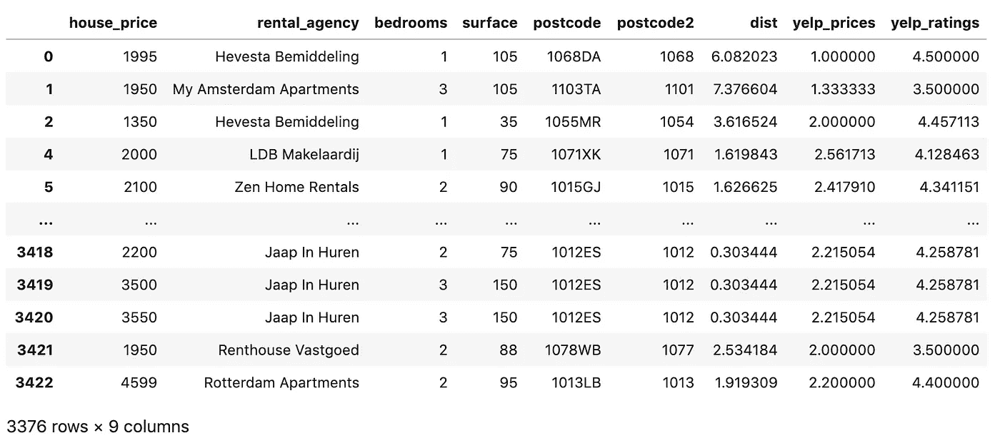

现在我们有了一个关于 yelp 价格和评级的更多信息的数据集，我们可以可视化它们与房价的关系，以了解这一指标是否可能改善我们的模型。

以下代码散点图 yelp 评分与房价的关系:

```
import matplotlib.pyplot as pltplt.figure()
plt.scatter(amsmodel1['yelp_ratings'],amsmodel1['house_price'], s=20, edgecolor="black",c="darkorange", label = "yelp")
plt.xlabel("Yelp Ratings")
plt.ylabel("House Price")
plt.title("Yelp Ratings vs. House Price")
plt.legend()
plt.show()
```

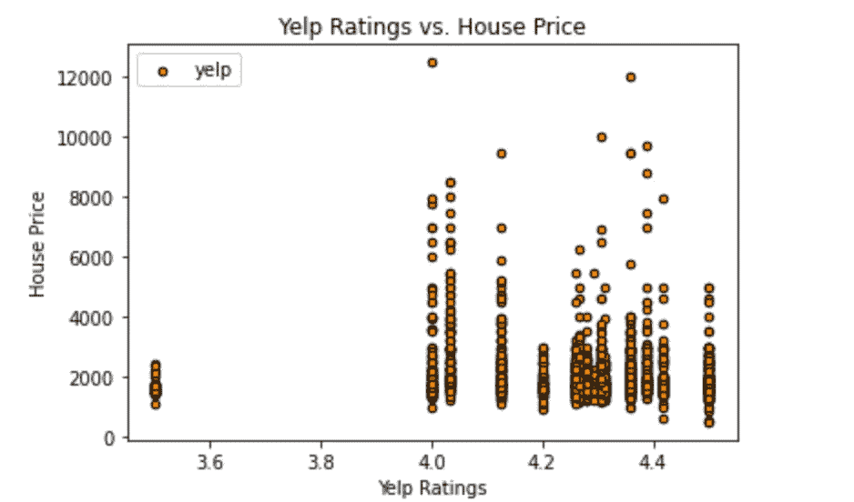

下面的代码散点图 yelp 价格与房价:

```
import matplotlib.pyplot as pltplt.figure()
plt.scatter(amsmodel1['yelp_prices'],amsmodel1['house_price'], s=20, edgecolor="black",c="darkorange", label="yelp")
plt.xlabel("Yelp Prices")
plt.ylabel("House Price")
plt.title("Yelp Prices vs. House Price")
plt.legend()
plt.show()
```

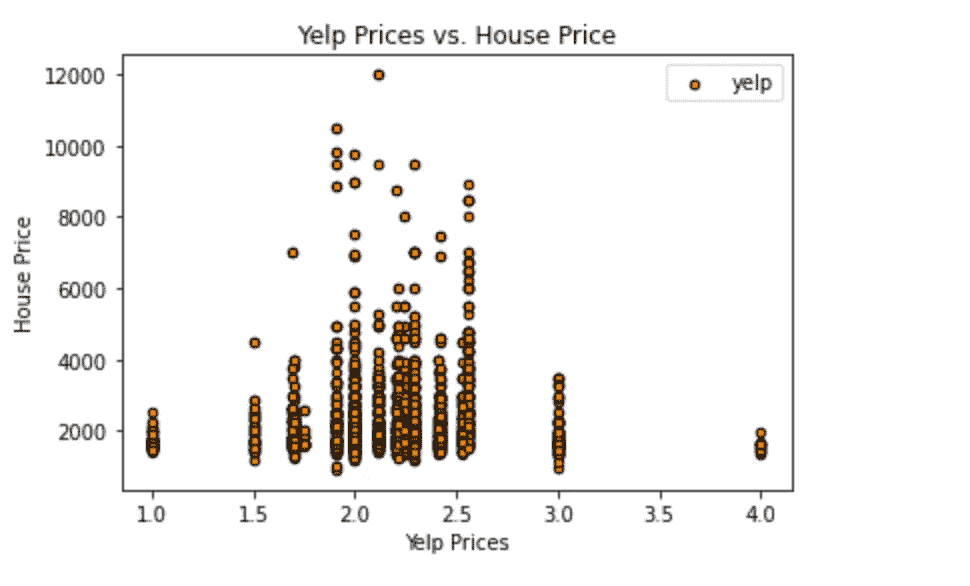

当只考察这两个变量之间的关系时，这里显然没有很强的线性关系。希望我们能够用机器学习算法来判断增加这些变量是否会对房价产生影响，尽管这种影响比线性影响更复杂。

# 9)虚拟变量

我们终于准备好训练模型了吗？没有。我们的模型将只接受整数类型的值，现在我们有几列是分类的(或者换句话说，在数字上没有意义，但作为我们公寓的类别)。我们需要创建一个叫做**虚拟变量**的东西，用计算机可以数字理解的方式来表示这些类别。

这里有一个关于虚拟变量及其作用的快速(但很棒的)解释:[https://medium . com/@ Brian . Collins 0409/dummy-variables-done-right-588 f 58596 AEA](https://medium.com/@brian.collins0409/dummy-variables-done-right-588f58596aea)

代码如下:

现在我们有惊人的 327 列！在数据科学项目中，我们应该批评我们分析的每一步，以防止偏见和其他误解。对于高维度的数据帧，我们需要考虑维度的**诅咒**，它会混淆机器学习方法，因为这些点相距如此之远，以至于它们看起来都一样(因此从分析中无法真正得出任何结论/区别)。如果我们的数据集遇到这个问题，它可能会降低我们在随机森林算法中的准确性。

最广为接受的经验法则是，对于数据集中的每个要素，我们至少应该有 5 个训练数据点。在这个项目中，我们有:

```
training data set = 3376*80% 
ration training points/features = 2700.8/327 = 8.26
```

这(幸运地)通过了我们的 5 个训练数据的特征比例规则！

此时，我们的数据框应该如下所示:

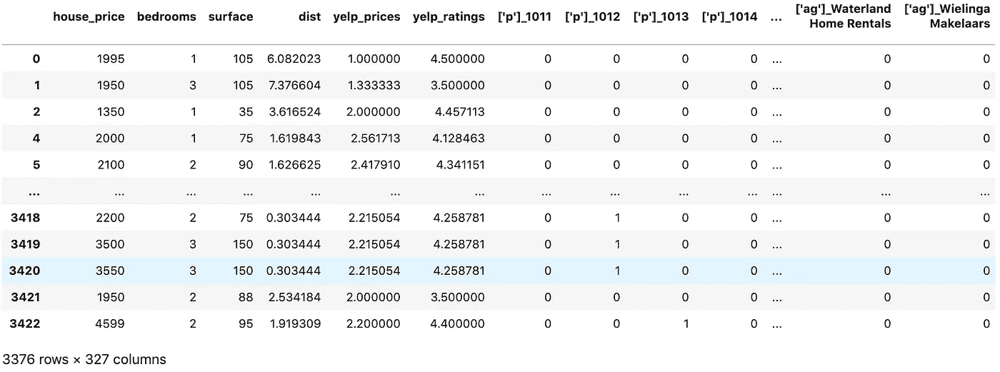

我们有 3376 行，327 列，以及关于房价，卧室数量，表面积，离市中心的距离，yelp 平均价格和地区评级，邮政编码的虚拟变量和租赁机构的虚拟变量的数据。

# 9)随机森林

随机森林算法是一种集成学习方法，它构建决策树，分割数据并测试每个决策以了解每个要素的权重，有望实现数据集要素对目标(在本例中为房价)的真实影响。[这里](/understanding-random-forest-58381e0602d2)是一篇关于这个算法的很棒的文章。

对于随机森林，我还将结合 K-Fold(K = 10)交叉验证方法，这意味着我们将把数据分成 10 个部分，训练 9 个部分并针对第 10 个部分进行测试，并在每次迭代中使用 10 个部分中的不同部分作为测试数据，最大化数据集的大小以获得更好的结果。关于交叉验证[的更多信息，请点击](/cross-validation-a-beginners-guide-5b8ca04962cd)。

对于这个项目，我将使用开源包 sklearn 将算法应用于数据集。代码如下:

几分钟后，您应该开始得到一些结果。这些是我从这个数据集得到的结果:

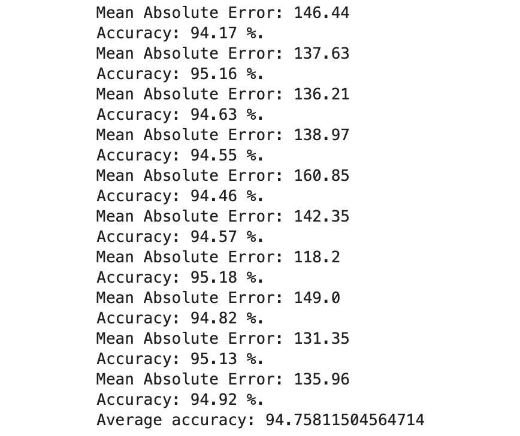

94.75%的平均准确率已经不错了，但是有没有可能增加模型的功效呢？我们可以尝试不同的超参数调整设置，以将准确率提高几个百分点:

# 超参数调谐

文章的这一部分在很大程度上基于这篇文章:[超参数调优 Python 中的随机森林](/hyperparameter-tuning-the-random-forest-in-python-using-scikit-learn-28d2aa77dd74)，你绝对应该去看看，以便更深入地理解代码。

Sklearn 具有强大的功能 RandomizedSearchCV，可以测试不同的参数，并推荐哪些参数可能最大限度地提高模型的准确性。

代码首先指定特性应该测试的每个参数的选择:

我们将随机森林回归器拟合到 RandomizedSearchCV 中，它在 100 个组合中搜索 3 次，并返回最佳参数。

这些是我们为此模型获得的最佳参数的结果:

```
{'n_estimators': 400,
 'min_samples_split': 2,
 'min_samples_leaf': 1,
 'max_features': 'sqrt',
 'max_depth': None,
 'bootstrap': False}
```

我们回到原始代码，包括这些参数:

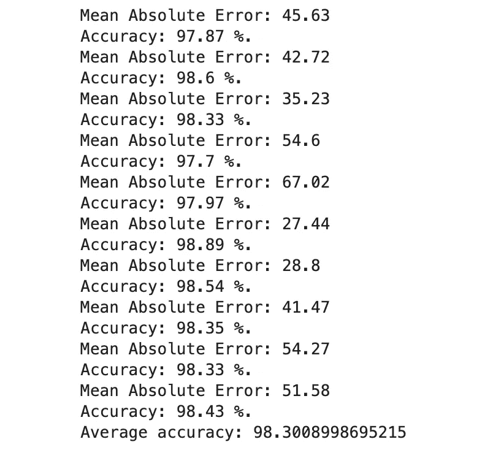

将我们的准确率提高到 98.30%！

# 10)决策树和特征重要性

如果你打开图像 tree.png，你应该得到这样的东西:

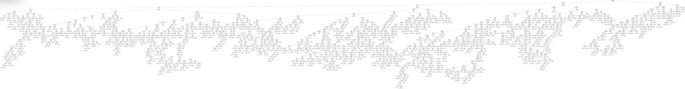

这是表示所有随机森林算法决策的图表，包括分裂、分支、叶子、平均标准误差、样本数和每个分裂的预测值。浏览每一个树分裂并不是非常有用(或省时),但是看几个并看看它们对你是否有意义是非常有趣的。


特征重要性条形图是 sklearn 的一个选项，在理解算法的发现方面更有效一些。首先，我们定义我们只希望看到决定预测结果 0.5%以上的特性，我们还将创建这些特性的列表。

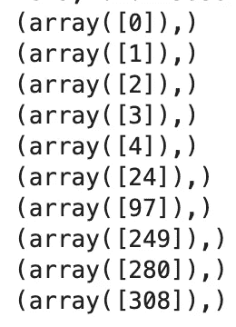

**list_of_index** 将返回一个列表，其中包含最重要的列号数组。由于输出的格式，正确地转换列表有点困难，所以我用相应的正确列重新定义了列表。

```
list_of_index = [0,1,2,3,4,24,97,249,280,308]
```

接下来，我们需要获取列和列标签:

最后，这是 matplotlib 条形图的代码:

这是结果图:

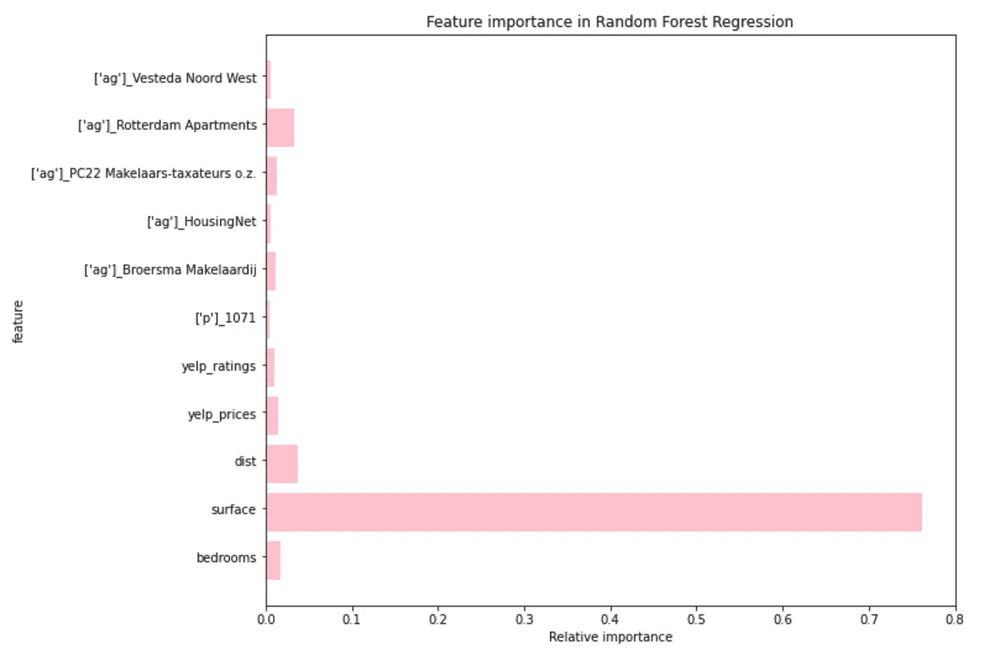

**特征重要性图分析**:与普遍的看法相反，位置(由变量 dist 表示)是第二重要的影响。相反，到目前为止，表面积是决定阿姆斯特丹租金的最重要因素。卧室数量、yelp 评分、yelp 价格和一些租赁机构也有显著影响。在其他条件相同的情况下，住在特定的邮政编码 1071(考虑到这是许多名人居住的地区，这在阿姆斯特丹确实是一个奢侈的邮政编码)会给你的房租账单增加一大笔钱。

如果我们分析每平方米房屋的租赁价格，而不是绝对价格，会怎么样？通过将以下代码添加到算法之前的流程中:

再次运行随机目录林，我们会得到以下结果:

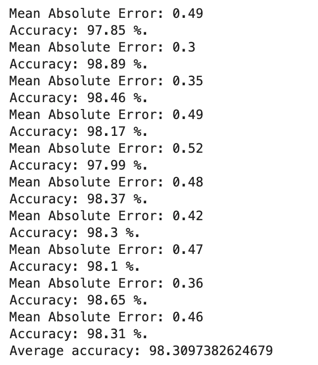

平均准确率为 98.309%，用平方米来衡量价格比我们之前获得的 98.30%稍微提高了模型的准确率。功能列表也发生了变化:

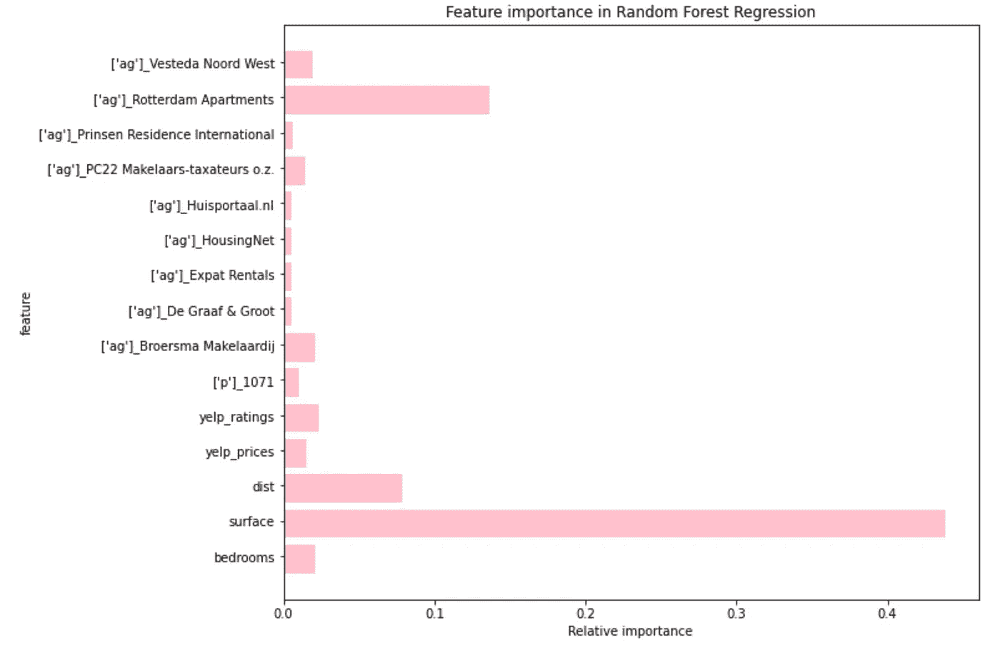

它仍然将表面积和位置作为决定租金价格的主要因素，但降低了它们的相对重要性，增加了 yelp 评级和价格的相对重要性，同时也将更多的租赁机构添加到可以影响(积极或消极)阿姆斯特丹房屋租金价格的机构列表中，其他一切都是平等的。

# 11)预测

我们有模型，我们知道它是如何工作的。然而，我们已经知道上市公寓的价格，我们对它是否值得标价有一个相当好的想法。这个项目如何对一个已经了解阿姆斯特丹真实市场的人有用？

该模型的真正魅力在于它的预测能力。虽然一个真正的国有开发商可能会凭直觉知道一套公寓应该值多少钱，但我们现在也有了一个定量工具，可以分析市场样本，并输出精确的价格，这可以将真正的国有房东或长期居住在阿姆斯特丹的人的专业知识带给新的租户和买家。

以下是如何使用训练好的模型进行预测:

上面的预测是针对一个 45 平方英尺的单卧室公寓。米，邮政编码为 1018，是从真正的国家机构 JLG 房地产租赁。我们可以从相应的邮政编码 1018 中查询 yelp_prices 和 yelp_ratings 数据帧，以在预测中指定它们。

对于这个特定的公寓，预测的租金价格是 1530 美元，这与该公寓的实际租金价格(1538 美元)极其接近，尽管该模型从未有过这个数据点，而且该公寓上市还没有一年多。

# 12)结论

这个项目让我明白，理解阿姆斯特丹的真实市场绝对比简单地看邮编和公寓的平方米要复杂得多。虽然这两个特征是最重要的，但你可以很容易地为同一套公寓支付更多的钱，仅仅因为你使用了特定的租赁机构，决定住在有好餐馆的社区，或者想成为名人的邻居(好吧，这不是令人震惊的*。*

希望我已经能够对这个市场的内部运作有更多的了解，并帮助一些人预测他们应该为他们的新房子支付多少钱。感谢您的阅读！


照片由[格里洛·爱德华](https://unsplash.com/@edouard_grillot?utm_source=medium&utm_medium=referral)在 [Unsplash](https://unsplash.com?utm_source=medium&utm_medium=referral) 拍摄

## 参考

网络抓取算法:[https://towards data science . com/looking-a-house-build-a-web-scraper-to-help-you-5ab 25 badc 83 e](/looking-for-a-house-build-a-web-scraper-to-help-you-5ab25badc83e)

随机森林可视化:[https://towardsdatascience . com/how-to-visualize-a-decision-tree-from-a-random-Forest-in-python-using-scikit-learn-38 ad 2d 75 f 21 c](/how-to-visualize-a-decision-tree-from-a-random-forest-in-python-using-scikit-learn-38ad2d75f21c)

超参数调优:[https://towardsdatascience . com/hyperparameter-Tuning-the-random-forest-in-python-using-scikit-learn-28 D2 aa 77 DD 74](/hyperparameter-tuning-the-random-forest-in-python-using-scikit-learn-28d2aa77dd74)