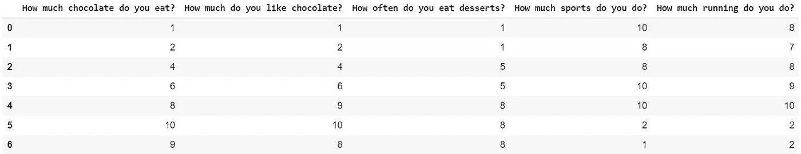
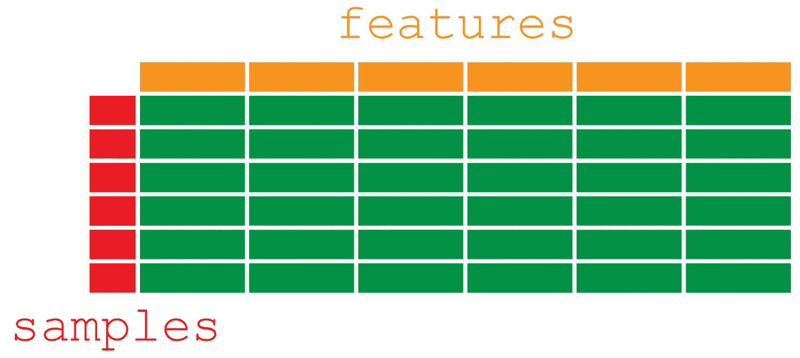
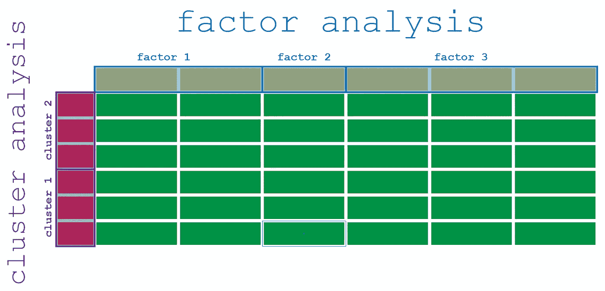
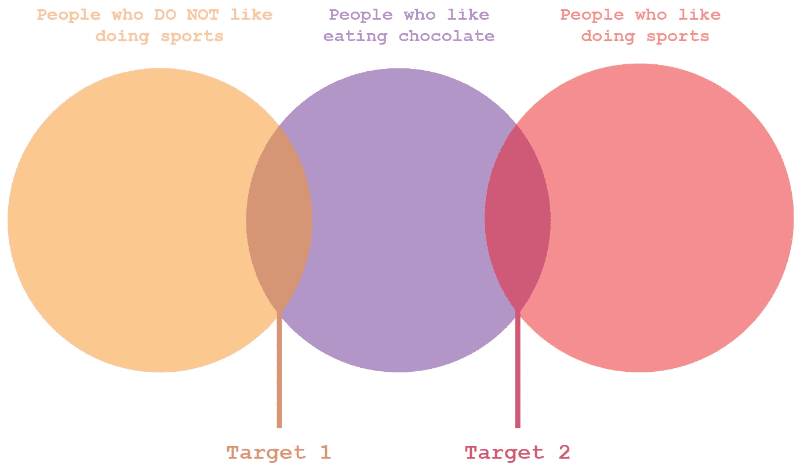
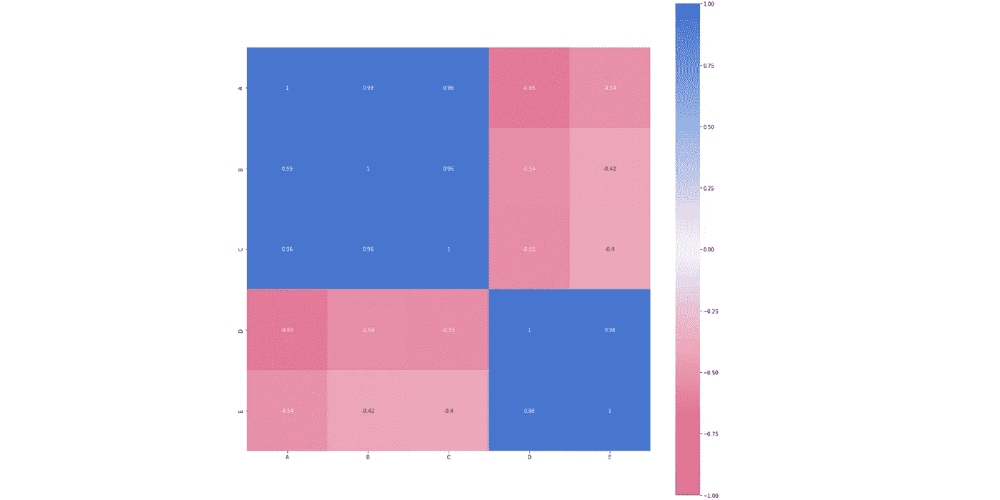

# 人工智能在市场营销中的应用

> 原文：<https://towardsdatascience.com/ai-applied-to-marketing-383bda3367cb?source=collection_archive---------62----------------------->

## 实用人工智能

## 寻找客户利基并理解数据

人工智能是可以应用于营销的最基本的算法集之一。由于这个主题的复杂性，我将把自己限制在人工智能对客户数据的最实际的应用上。

## 营销中的应用

营销严重依赖于数据收集和数据分析。您可以利用这些数据获得关于以下方面的深刻信息:

*   客户目标和利基
*   市场分析
*   竞争

你可以使用各种商业策略和统计工具从你的数据中提取信息，然而，AI 允许你执行两种特定的分析:

*   **因素分析**
*   **聚类分析**

# 实际例子

让我们假设您已经分发了以下调查。每个人必须回答 5 个不同的问题，分数从 1 到 10。

7 个人已经回答了 5 个问题:7 个样本，5 个特征

本质上，该数据集的低分辨率版本转化为:

# 因子分析与聚类分析

如果我们想对这个数据集应用无监督学习算法来找出额外的信息，我们可以执行因子和聚类分析。首先，让我们不要混淆术语，在初级数据科学家中，这种差异并不总是为人所知。

因子分析适用于特征，聚类分析适用于样本

## 聚类分析或客户细分

聚类分析用于了解不同类型的客户。对样本进行分析，目的是将样本分组。在我们的初始示例中，您可能会发现两种不同的集群:

*   吃很多巧克力、做很多运动的客户
*   吃很多巧克力并且根本不做运动的客户

从聚类分析中出现了 2 个目标

如果您将您的整个客户列表划分为集群(或细分)，您将会更好地理解:

*   目标是谁
*   以哪里为目标

## 要素分析

因子分析比聚类分析稍微复杂一点，因为它不太直观。

如果你想访问已经被用来模拟这个解释的代码，[从我的仓库下载它。](https://github.com/arditoibryan/Projects/tree/master/20200520_Factor_Analysis)

实际上，我们可以使用这个工具来理解我们调查中的许多问题。例如，如果每个人必须回答 20 个问题(可能是 100 个，也可能是 1000 个)，我们如何解释这些数据？

很简单，我们看到问题是如何变化的，这样我们就可以根据共同因素将它们分组。

例如，在我的调查中，我问:

*   你吃多少巧克力？
*   你有多喜欢巧克力？

那些是不同的问题吗？不，本质上它们是同一个问题，如果你看所有的答案，它们几乎是相同的:它们的相关性为 **0.9863，这几乎是完美的**。

用字母 A 到 E 表示的问题的相关矩阵

如果我们决定测量变量一起移动的强度，我们只需要计算它们的相关系数。我们可以立即将它们分成两个独立的列:我们称之为因子。因为数据集是简单的，我可以只看一个相关矩阵就得到这个结果，实际上，这要困难得多，过程也要繁琐和近似得多。

执行因素分析后，我们可以确定:

*   因子的数量
*   每个因素在多大程度上解释了差异

我们可以简单地使用两个因素来简化我们的调查，这两个因素可以命名为:

*   巧克力消费量(前 3 栏)
*   体育锻炼倾向(最后两栏)

如您所见，我们向客户询问的所有信息现在都更有意义了。

# 因子分析示例

因子分析通常被用来理解指标和测量。因子分析技术已被用于提取:

*   大五人格测试(5 个因素= 5 个特质)
*   智商测试(1 因素= 1 智力)
*   客户满意度研究
*   竞争对手分析

# 人工智能将如何影响营销

人工智能已经开始对营销和广告产生影响。由于大数据的可用性，你可以在你的市场范围内接触到唯一的潜在客户。一个很好的例子是社交媒体上的定向广告:但要利用它，你需要知道搜索什么。

## 我需要成为一家大公司才能使用这些工具吗？

不，只要你能访问数据，你就可以从你的客户那里收集任何类型的信息。收集大量数据是昂贵的，但在一定限度内，甚至可以免费下载。例如，关于人们的个性或顾客对某些产品的满意度的开源研究将会为你节省很多钱。

你总是可以选择自己下载数据，连接到数据库并使用人工智能工具，但大量的工作已经可以在互联网上免费获得，如 Kaggle 或 GitHub 等网站。

## 那些分析工具是创新的吗？

事实上，这些统计工具已经存在很长时间了。然而，他们的准入门槛现在低了很多。如果几年前你需要一个专家团队来执行必要的分析，现在任何由一名工程师操作的开源机器学习工具都可以以低得多的价格输出相同的结果。

## 我的竞争对手会使用类似的技术吗？

每个高性能的公司(不仅仅是大的技术公司)都会做市场分析，但是他们也会依赖他们的数据。期待你的竞争对手做这些准确的研究，以达到他们的潜在客户。