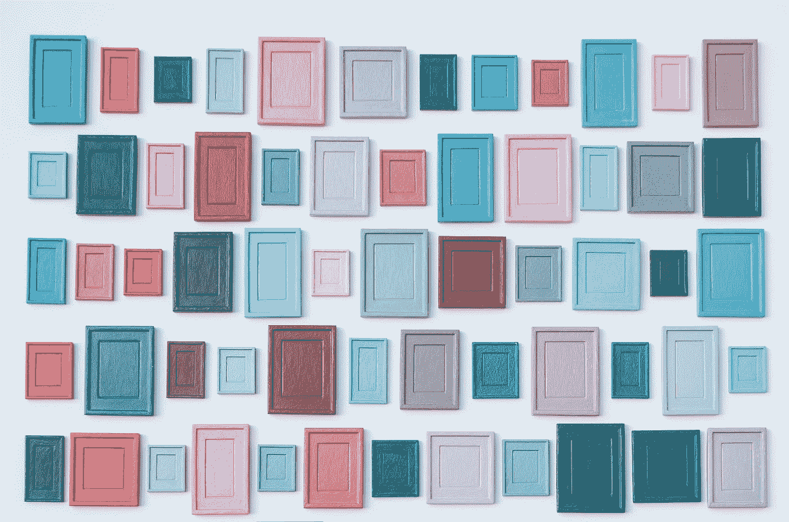
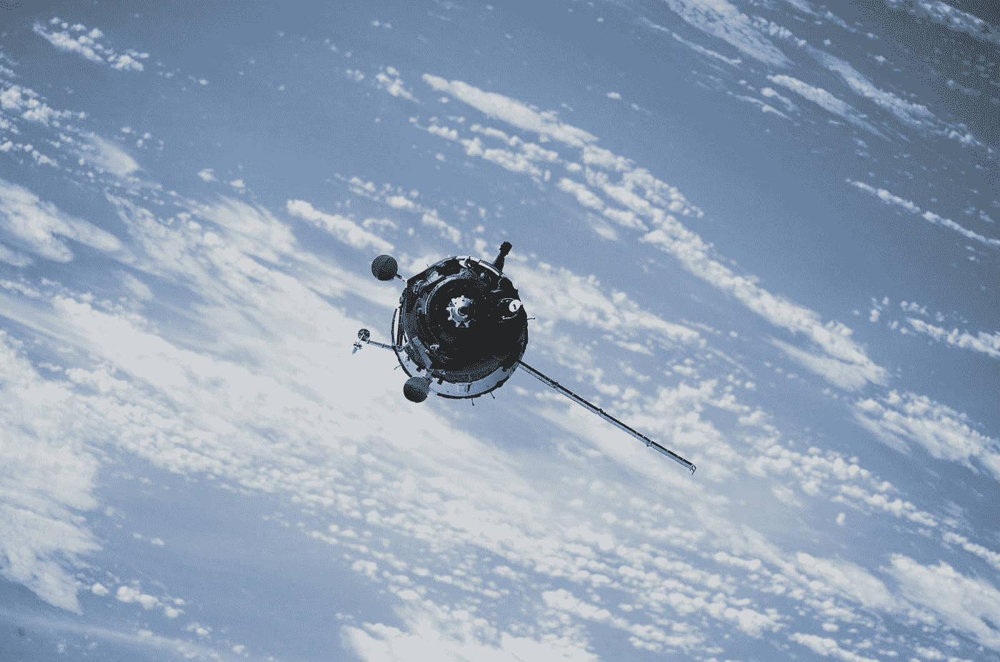
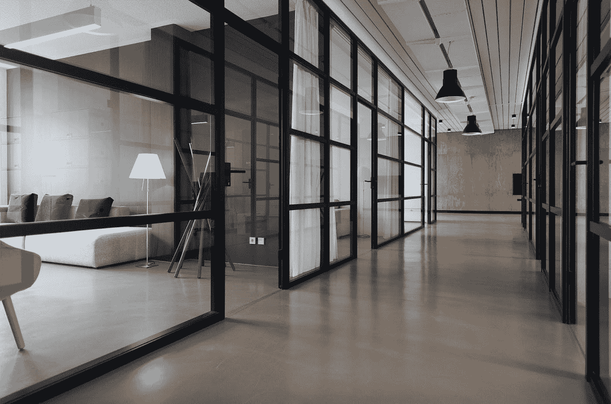

# 人工智能、建筑和生成设计

> 原文：<https://towardsdatascience.com/ai-architecture-and-generative-design-e22320828d46?source=collection_archive---------24----------------------->

## 创造性工作的算法头脑风暴

德克·克内梅尔和乔纳森·福利特

建筑，像许多创造性的职业一样，跨越了数字和物理世界。随着 3D 打印等技术推动这一学科在重建建筑环境方面向前发展，人工智能和生成式设计正在从规划和设计的角度对建筑产生影响，这一行业在很大程度上是数字和计算的。我们采访了 Autodesk 的 AEC 生成设计高级产品经理 Lilli Smith，她在建筑领域从业超过 20 年，在过去的 18 年里一直在开发建筑师用来设计作品的软件。

在建筑、艺术和其他创意领域，生成式设计是一种自动创建设计选项的方法，可以平衡各种竞争目标。最新一波的生成式设计是由人工智能推动的。“在建筑设计问题中，这是常有的事，”史密斯说。“没有一个你试图追求的单一目标——没有一个*式的*答案。但是，做一个建筑项目有很多不同的目标。因此，举例来说，在城市设计工作流程中，拥有大量的开放空间和良好的视野可能很重要。但投资回报和通过更多可出租区域产生的价值可能也很重要。”

图 01:创成式设计是一种自动创建设计选项的方法，可以平衡各种竞争目标。
[图片:[由马库斯·斯皮斯克在 Unsplash](https://unsplash.com/photos/QtFAXP6z0Wk) 上拍摄]

> 创成式设计可以帮助自动创建选项，满足设计者希望编码到系统中的各种目标。生成式设计也可以是一种开拓设计师思维的探索工具——不一定要解决问题或提供一个正确的答案。

“使用算法来指导这些设计选项的创建，计算机会给你…它能给的最好的选项，给定的目标和探索的规模也是你指定的，”史密斯说。“然后，您可以与利益相关者讨论哪些目标实际上可能更重要，或者哪些设计……利益相关者可能出于其他原因更喜欢。这是与人交流的好方法。”

> “当设计有几个输入时，人类很难记住这些输入的所有组合，”史密斯说。“实际上，计算机可以用不同输入的组合让你大吃一惊，这可能是你以前从未想过的……”

人工智能可以很快产生大量符合项目要求的概念。在同样的时间和金钱预算下，由机器进行的大规模概念生成，或我们过去可能认为的“头脑风暴”，比人类所能做的更负担得起，也更全面。这在架构环境中尤其重要，正如 Smith 所描述的，需求是复杂的、广泛的，并且经常是相互竞争的。“所以，计算机并不是真的自己想出任何东西，”史密斯说。“(它)只是有一种自动化的方式来产生所有这些人类不擅长的组合，但计算机确实擅长。然后能够对它们进行排序或搜索，考虑到你已经包括的不同指标，有时甚至会产生你意想不到的令人惊讶和愉快的结果。”

## **生成设计简史**

尽管我们认为“生殖”这样的术语和应用是最前沿的，但程序艺术家已经使用这种创造性的方法超过 50 年了。“生成式设计其实并不新鲜，”史密斯说。“生成艺术有着悠久的历史。”20 世纪 60 年代，匈牙利计算机艺术家先驱 Vera Molnár 使用早期编程语言 Fortran 来生成图像，在她的作品中检查主题、变化、自动生成和选项显示。数字艺术家曼弗雷德·莫尔是算法艺术的另一位先驱，他在 20 世纪 60 年代和 70 年代创造了各种 3D 几何图形。在他们 1972 年的文章《绘画和雕塑的形状语法和生成规范》中，设计技术专家 George Stiny 和 James Gips 创建了一个设计系统的人工编码，描述了一个生成形状的生产系统。“对于参数化设计中发生的许多事情，这确实是一条直接的思路，也是 CityEngine 等工具的基础，city engine 是 Esri 基于 GIS 数据进行城市规划的工具，也是其他工具，”Smith 说。“20 世纪 70 年代的一些论文展示了人们在建筑中，特别是在医院平面图中是如何思考的，如何用算法来布置这些平面图，”史密斯说。“所以，这些想法在建筑领域已经存在很长时间了。他们也涉足工程领域。”

在人工智能驱动的生成方法的一个更近的例子中，美国宇航局使用程序设计来创建其卫星天线的配置。美国宇航局艾姆斯研究中心该项目的领导者杰森·罗恩在[描述了算法设计方法，这是该机构于 2006 年发表的一篇专题文章](https://www.nasa.gov/centers/ames/research/exploringtheuniverse/borg.html):

> Lohn 说:“人工智能软件检查了数百万种潜在的天线设计，然后选定了最后一种。根据 Lohn 的说法，在同样的情况下，该软件的速度比任何人都要快。“通过模仿达尔文‘适者生存’的过程，最强的设计存活下来，能力较弱的则无法存活。”
> 
> *“我们告诉计算机程序天线应该具有什么性能，计算机模拟进化，保留接近我们要求的最佳天线设计。最终，它瞄准了满足任务所需规格的东西，”Lohn 说。*

“他们搜索了成千上万个不同的天线，”史密斯说。“他们能够想出一种设计，这种设计是他们通过自己的传统设计过程无法想到的。但最终的天线设计比传统天线的效率高出 90%以上。”在美国宇航局的例子中，我们可以看到人工智能如何通过引入人类最初可能不会考虑的高级设计选项来通知和增强创造性决策，并带来令人惊讶的有效结果。设计输出更好，因为人和机器都在做自己最擅长的事情。

图 02: NASA 使用程序设计来创建卫星天线的配置。
【图片:[美国宇航局在 Unsplash](https://unsplash.com/photos/8Hjx3GNZYeA)

## **实践中的计算设计方法**

部分受创成式设计历史的启发，Autodesk research 长期以来一直对使用创成式工作流感兴趣。“几年前，Autodesk 收购了一家名为“走出纽约”的建筑公司，”Smith 说。“[一群]才华横溢的设计师，他们也有计算机头脑。他们真的是很好的程序员，非常好的设计师。此外，他们还参与了许多涉及生成式设计追求的项目。”

“他们与空中客车公司合作开发隔板。这是一个计划的一个组成部分，可能看起来不是非常重要。但是，有许多不同的功能必须考虑到该面板。“他们必须能够移除它的某些部分，以容纳进入飞机的紧急担架，”史密斯说，“当然还有严格的安全标准和碰撞测试标准。”

“他们能够利用这一过程研究灵活的模型，并研究如何取出一种材料，但你仍然有这个面板的结构完整性。并且使用 3D 打印技术将每个隔板的总重量降低了约 45%或约 30 公斤，”史密斯说。“在一架非常大而且重量很重的飞机上，这可能看起来微不足道。但是，他们估计，目前这一代 A320 系列飞机的重量减轻可能会导致每年减少近 50 万公吨的二氧化碳排放。”

为了测试生成式设计的应用和理论，Autodesk 在他们新的 Autodesk 多伦多工厂的设计中使用了这种方法，该工厂被称为新兴技术新中心。“他们想使用生成技术来设计新的办公空间。因此，他们开始收集大量数据来指导设计，并帮助他们为理想的办公室设定目标，”史密斯说。“所以他们会问一些问题，比如:‘你想坐在谁的旁边？’，‘你一天能分心多少？’、“你是喜欢办公桌附近有充足的日光，还是因为你使用屏幕而不喜欢强光，所以需要一个更暗的环境？”。在进行了广泛的内部研究后，该团队制定了六个目标，用于评估他们的设计。”史密斯说:“他们调查了现有员工，然后将所有数据归结为六个目标，分别是关于亲近、分散注意力等。该团队创造了一种灵活的模式。”史密斯说:“他们知道这种设计将如何运作，也知道它如何灵活多变。他们想研究…他们在哪里放置一组桌子，在哪里放置一组便利设施，意味着会议室、电话亭、更多的私人空间。因此，他们开发了灵活的模型和方法来衡量这些设计的成功，并使用计算机来帮助指导他们找到满足这些目标的解决方案。”

图 03:人工智能可以帮助建筑师开发灵活的模型来设计理想的办公空间，并帮助指导他们找到满足这些目标的解决方案。
【图片:[由纳斯图·阿布塔莱比在 Unsplash](https://unsplash.com/photos/yWwob8kwOCk) 上拍摄

## **人工智能和建筑的未来**

> “我们交谈过的许多人都看到了计算机增强他们设计努力的可能性，”史密斯说。“他们看到，人类在这些设计工作中仍然至关重要，因为他们将提出问题，决定解决什么样的问题，使用机器来帮助他们做得更好。”

“我认为，在机器为我们编写所有软件或进行设计之前，我们还有很长的路要走。也许有一天会实现，但我认为在机器人接管之前，我们还有很长的路要走，”史密斯说。我们的电脑霸主还有很长的路要走。机器将会帮助我们制造东西，而不是把我们从等式中移除。他们将删除更多的物理，手工，平凡，繁琐的部分。他们将不会解决核心问题，特别是在研究和需求的前面，但即使暂时，一旦生成方法确定了正确的基本方向，他们也不会解决核心解决方案。

“我认为生成式设计是设计师的一种不同的思维方式。考虑为 design 设计*一个系统而不是几个一次性的设计是不同的…史密斯说:“考虑如何让整个设计系统为你所用是不一样的。“它还需要计算设计技能，这样你就可以使用计算机来增强你的能力。我们试图通过创建这些可视化脚本环境，让架构师和工程师更容易地编写代码，只需将这些不同的节点或不同的功能放在一起。我们还致力于开发人们可以共享的节点。并且发展一个希望彼此分享代码的社区。”*

让创作者通过一个视觉界面，不需要学习编程或与不复杂的用户界面纠缠，这对于释放人工智能在创作环境中的潜力非常重要。提供可视化使用环境的方法，而不是期望非程序员使用编程来最好地使用下一代工具，是人工智能等新兴技术的一个常见主题。与流行的每个人都学习编程的重要性相反，现实是为创意人员创造工具的公司正在积极尝试制造这些工具，以便我们中的非程序员可以充分利用它们。事实上，虽然今天有很好的理由让许多创意人员学习某种程度的编程，以最好地利用我们可以支配的早期和新生工具，但这些技能可能会建立我们长期的整体知识库，但只会在较短的时间范围内实际适用于我们的工作，在这个过渡时期，计算创意还处于早期。

使用人工智能辅助的自动化方法来更好地设计建筑很可能是未来的必然趋势。“到 2050 年，地球上将有 100 亿人口。如果你算一下，我们将需要每天建造大约 13，000 栋建筑来容纳所有这些人，”史密斯说。“为了在不完全破坏地球的情况下建造所有这些建筑，我们将不得不开发更好的方法来设计和建造[它们]……生成式设计是这一努力中的一种工具。我认为我们必须彻底改变我们做事的方式，以适应地球上所有这些人的需求。”

[*Creative Next*](http://www.creativenext.org) *是一个播客，探索人工智能驱动的自动化对创意工作者，如作家、研究人员、艺术家、设计师、工程师和企业家的生活的影响。本文伴随* [*第三季第六集—建筑与生成设计*](https://creativenext.org/episodes/architecture-generative-design/) *。*