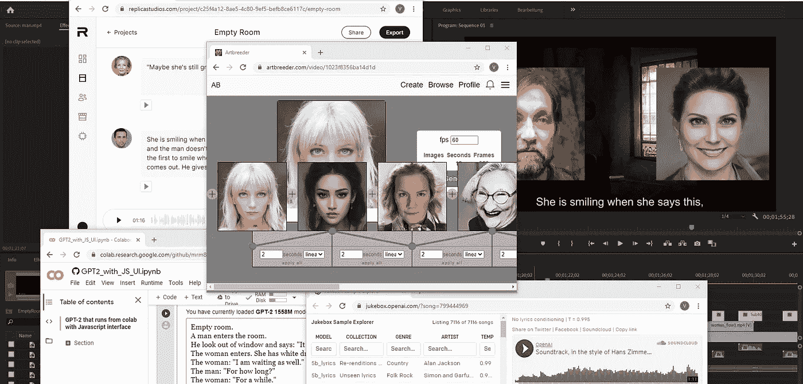
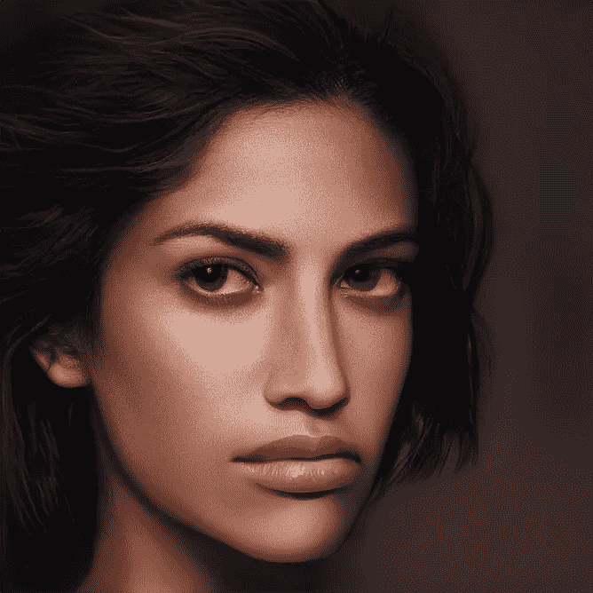
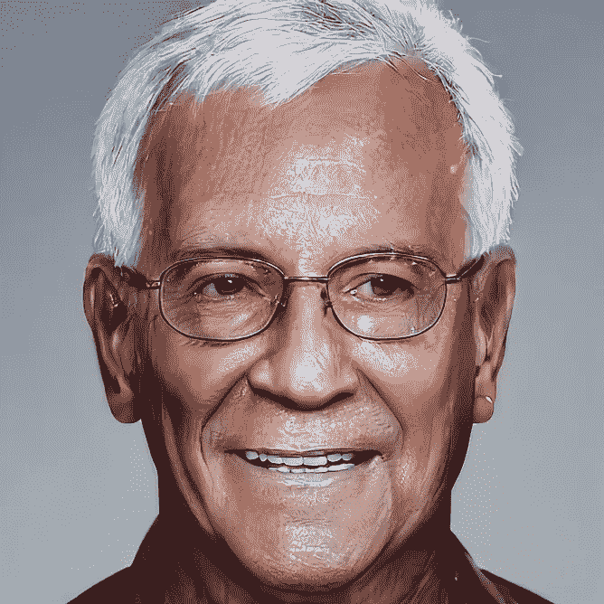
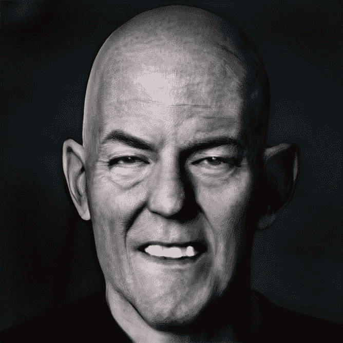
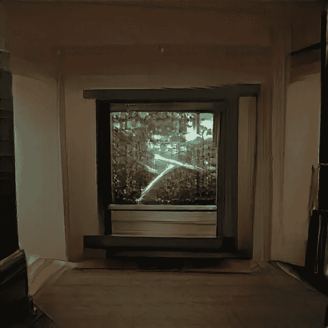
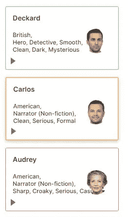
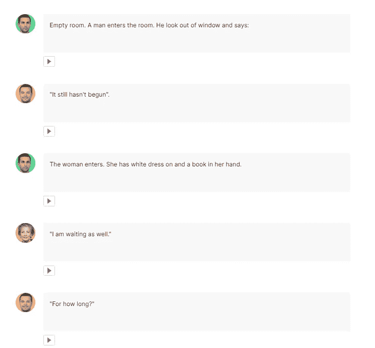

# 作为电影制作人的艾

> 原文：<https://towardsdatascience.com/ai-as-a-movie-maker-e5865b99a06c?source=collection_archive---------15----------------------->

## 我如何只用 ML 模型制作了一部完整的短片(你也可以做到)。



Merzmensch 的拼贴画。

**真热闹。我记得看了一遍又一遍的《T4》和《太阳之春》。被荒谬的对话迷住了，我试图理解这部短片中发生了什么。但这种意义曾经悄悄溜走。[因为是 AI 写的](https://arstechnica.com/gaming/2016/06/an-ai-wrote-this-movie-and-its-strangely-moving/)。**

本杰明是作者的名字。这个名字的背后是一个递归神经网络 LSTM 隐藏，由人工智能研究员兼诗人罗斯·古德温开发。这部电影由获得英国电影电视艺术学院奖提名的英国电影制作人奥斯卡·夏普执导，主演包括托马斯·米德蒂奇。

即使情节由荒谬和看似随机的短语组成，我们的大脑也在试图理解它。我思故我在。

罗斯关于人工智能和创造力的必读论文对我来说极具启发性。如果你没有机会，一定要读读这个。

[](https://medium.com/artists-and-machine-intelligence/adventures-in-narrated-reality-6516ff395ba3) [## 叙述现实中的冒险

### 由机器智能实现的书写语言的新形式和界面

medium.com](https://medium.com/artists-and-machine-intelligence/adventures-in-narrated-reality-6516ff395ba3) [](https://medium.com/artists-and-machine-intelligence/adventures-in-narrated-reality-part-ii-dc585af054cb) [## 叙述现实中的冒险，第二部分

### 正在进行的写作和机器智能实验

medium.com](https://medium.com/artists-and-machine-intelligence/adventures-in-narrated-reality-part-ii-dc585af054cb) 

通过他的实验(以及后来他的人工智能生成的书“ [1 the Road](https://en.wikipedia.org/wiki/1_the_Road) ”)，罗斯证明了人工智能可能实现的目标。这一认识也是至关重要的:人工智能不仅仅是一个工具，也不是作家的完全替代品。你需要一个共生体来和艾一起创造艺术。

# 没有摄影棚的电影。

我们已经看到了机器学习有多少创造性的用途。

有了 3D 本·伯恩斯效应，我们可以制作动画梦境，将照片转换成空间相机的飞行。

我的系列的预告片

有了 OpenAI 的 [GPT-2](https://openai.com/blog/better-language-models/) ，我们[可以写完整个故事](/8-ai-driven-creative-apps-for-you-and-your-kids-5fdd71407dc4?source=---------21------------------)。

但是如果我们把所有的方法结合到一件艺术品上呢？所以我就这样做了，用人工智能制作了一部短片。

…但是在你看它之前:你有一个想法吗，**你需要什么来创作一部电影？**

你当然可以为了艺术质量而放弃一些元素，但是通常，你需要以下要素来制作一部电影(即使是一部短片):

*   剧情
*   摄像机/视觉效果
*   演员们
*   音乐

你还需要一个原创的想法和(在大多数情况下)尚未使用的媒体资源。

那么，我们如何应用机器学习方法来满足所有这些要点呢？

## 剧情

如前所述， **GPT-2** 是一个强大的 NLP 模型(在 40 GB 文本上预先训练，有 15 亿个参数)来生成文字。它的主要缺陷——也是主要优势——是创作内容的超现实特征。它们通常没有意义(至少对于知识转移需求来说——在文学语境中它们可以是一个像样的解释对象)。并且:每次**都会生成一个新的唯一文本**。

让我们看看 [GPT-3](https://github.com/openai/gpt-3) 未来会走哪条路( [OpenAI 公布了这个拥有 1750 亿个参数的新巨型模型](https://venturebeat.com/2020/05/29/openai-debuts-gigantic-gpt-3-language-model-with-175-billion-parameters/)，由于其尺寸过大，目前无法进行微调)。

出于需要，我使用了一台由 Manuel Romero 设计的带有 Java 界面的 GPT-2 笔记本:

[](https://colab.research.google.com/github/mrm8488/shared_colab_notebooks/blob/master/GPT2_with_JS_UI.ipynb) [## 谷歌联合实验室

### 编辑描述

colab.research.google.com](https://colab.research.google.com/github/mrm8488/shared_colab_notebooks/blob/master/GPT2_with_JS_UI.ipynb) 

有几种不同的笔记本，允许你微调 GPT-2 或在你的文本上进行训练，但我选择了这种特殊的 Colab 笔记本，因为它的用户友好和坚固的结构，以及对整个 15 亿参数模型的支持。

对于我的电影，我输入了以下提示:

```
**Empty room.****A man enters the room.****He looks out of the window and says: "It still hasn't begun".****The woman enters. She has a white dress on and a book in her hand.****The woman: "I am waiting as well."****The man: "For how long?"****The woman: "For a while."**
```

GPT 2 为我提供了各种文本，但我选择的是一部荒诞戏剧的惊人之作，介于贝克特、姆罗泽克和大卫·林奇之间:

```
Empty room.A man enters the room.He looks out of the window and says: "It still hasn't begun".The woman enters. She has a white dress on and a book in her hand.The woman: "I am waiting as well."The man: "For how long?"The woman: "For a while."The man: "Ah, you know, I'm a very patient man."The woman: "I know, of course."The man: "I'm going to have to be less patient, then." The woman starts to laugh; the laughter has an ominous edge that only she can feel."In my defence," she says, "I never actually told you what it was I was going to tell you."The man, suddenly, remembers: "That's right."The woman: "So you are lying behind me." The man is surprised by the abruptness of the accusation. He does not, however, feel any anger; as he has noticed in previous encounters, it is the woman who is most convincing when she's saying the lies.The man: "But it was not what you expected."The woman: "Oh…no." She is trying to sound convincing.He wants to ask her about her mother. The woman: "Do you think she'll be willing to lie?"The man turns down the opportunity.The woman: "Maybe…""Why?""Maybe she's still grieving." She is smiling when she says this, and the man doesn't think she'll be the first to smile when the truth comes out.He gives up. "No."The woman: "It's not over." The man has not got to see her family again. He had hoped to return to his work. He has nothing else to do. He wants to be a man.
```

它也说服了我，因为模糊的沟通水平。这就好像在所有那些稀疏的短语后面隐藏着一个巨大的故事(人脑在解释过程中确实产生了奇迹)。

所以我有了一个剧本。

## 画面

我是 StyleGAN2 的粉丝，但尤其是它在[art breader](/artbreeder-draw-me-an-electric-sheep-841babe80b67?source=friends_link&sk=2fff2b9e102ce632d725e58bfa4c67dd)中的实现(至少在“肖像”部分)。

你可以生成新的面孔，你可以制作过渡甚至动画([点击](/artbreeder-draw-me-an-electric-sheep-841babe80b67?source=friends_link&sk=2fff2b9e102ce632d725e58bfa4c67dd)了解更多关于使用 Artbreeder 的信息)。所以我创建了一堆面孔的图像([看这里的资产](https://medium.com/merzazine/the-empty-room-2020-75230f183e8b?source=friends_link&sk=e18b708ac6bb70dee44f3a8a99090db5))**男人**、**女人**，还有一些**房间**的图片。

这是一件棘手的事情，以配合故事的一部分(例如，在“笑的时刻”等)。)，但是经过各种试错，对我来说还是管用的。

以下是一些用于视觉效果的资源:



我用 ArtBreeder 创建的图像

当然，你可以使用[一阶运动模型](/first-order-motion-model-ab3908407208?source=friends_link&sk=e8772741be0db5da9e3f9af5ec392ffc)来制作动态脸部动画(使用你自己的安迪·席克斯技巧):


我为本文生成的[一阶运动模型。](/first-order-motion-model-ab3908407208?source=friends_link&sk=e8772741be0db5da9e3f9af5ec392ffc)

但是对于我的荒诞和极简风格，面部变形是最合适的。

## 演员们

脸已经做好了，但是还缺少一些东西:声音。

语音生成可能是最古老的机器学习方法之一。我最喜欢的是[**梅尔内特**](https://sjvasquez.github.io/blog/melnet/)——一个品质令人难以置信的模特。[只听样本](https://audio-samples.github.io/)(在专业演讲者或名人数据集上训练)。唉，MelNet 不能作为工作存储库或 Colab 笔记本使用。

我的第二选择是亚马逊波利。作为亚马逊 AWS AI/ML 服务的一部分，Polly 提供了各种语言的大量语音。缺点是:他们中的大多数都有相当的主持人魅力，并不总是适合虚构的内容。

我在人工智能生成的视频“预测”中使用了一种声音:

尽管如此，如果在一些对话中使用非情绪化的声音，并不真正令人信服。

然后我发现了[复制品工作室](https://replicastudios.com/)。



在[https://replicastudios.com/](https://replicastudios.com/)我的仪表盘截图

他们目前提供了一个小的集合，但声音有惊人的质量。他们中的一些可以更好地用于主持人的需要，但另一个已经承担戏剧力量。

我选择了这三种声音——**迪卡**代表 ***旁白*** ，**卡洛斯**代表 ***男人，*** 和**奥黛丽**代表 ***女人*** 。

你也可以尝试各种声音的情感特征，你甚至可以训练他们你的声音，但这三个对我的需求来说是完美的。

复制品工作室的使用非常简单。你按时间顺序排列短语，并给角色配上合适的声音:



我在[https://replicastudios.com/](https://replicastudios.com/)的仪表盘截图

可以为您的项目将声音导出为 mp3 文件。

## 音乐

今年，在 OpenAI 发布了 [JukeBox](https://jukebox.openai.com/) 之后，人工智能生成的音乐达到了新的质量水平——这是一个包含 7k 首歌曲和音乐作品的图书馆，由各种音乐家和词曲作者预先训练的模型生成([也可在此处阅读](https://medium.com/merzazine/icymi-010-music-art-lyrics-memes-it-times-of-a-i-89c36b4cc0f8?source=friends_link&sk=a10fe8a5cd2b04a3c96c49d8e9c8ba33))。

他们中的许多人都相当浮华(像这个噩梦般的 [*【莫扎特】p*](https://jukebox.openai.com/?song=802874764)*piece*)。但是很多都很漂亮。尤其是与人工智能生成的视觉效果相结合，它们在内心唤起了奇怪的感觉。

我在我的系列“呼吸 ZeroX”中使用它们:

对于我们的视频，电影的东西应该通过，所以我查找了汉斯·季默的音乐训练(并改变了一点速度):

## 开始！

剩下的是相当艰苦的工作——对于我的视频，我使用了 Premiere Pro 和大量的咖啡。可能最棘手的事情是在时间上拉伸视频，并使它们与剧情同步(ArtBreeder 的原始面部过渡长度在 8-30 秒之间)。

***建议*** :我用了“*时间插值:光流*”。它在现存的画面之间创造新的画面，使画面流畅。有时它会产生小故障——但如果是关于数字生成的电影，它们总是受欢迎的！

现在:在这里。

# 空房间。

我想知道哪些新的视听珍品将采用新的 ML 方法。敬请期待！