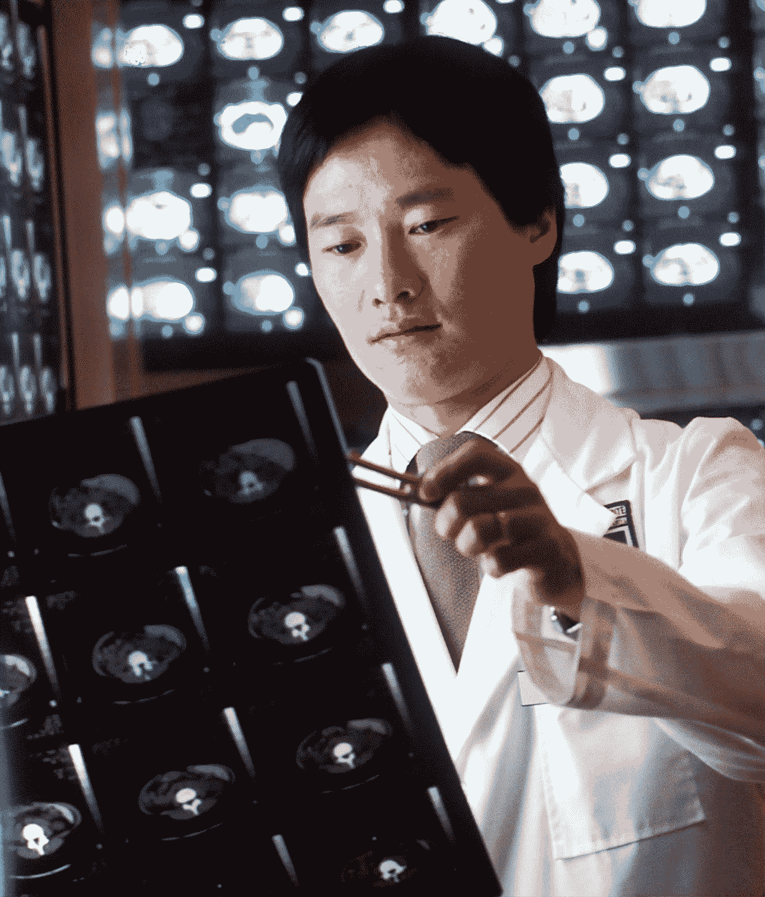

# 人工智能作为设计材料

> 原文：<https://towardsdatascience.com/ai-as-design-material-2748d84bbb7b?source=collection_archive---------61----------------------->

## 看到设计在创造人工智能驱动的产品中的作用

德克·克内梅尔和乔纳森·福利特

铅笔和速写本、记号笔和白板、像素和代码——这些是我们通常会联想到的设计材料。它们是设计师用来探索并最终实现他们需要解决的问题的解决方案的元素。无论是模拟还是数字，传统还是现代，它们在设计中的形式和作用都是显而易见的。不太明显的是，人工智能，更具体地说，机器学习，也是一种设计材料。虽然我们看到了人工智能对影响设计师的各种数字产品的影响，从常见设计工具的日益强大，如 [Adobe Creative Cloud](https://www.adobe.com/creativecloud.html) 到混合现实等新兴平台，但人工智能本身通常被认为是软件工程师的材料。此外，机器学习的最新发展仍处于新能力和新发明的发现阶段。我们离标准化的库和插件还有很长的路要走，这些库和插件可以被设计师以类似于今天的字体、照片和图标的方式应用。

乔什·克拉克是 Big Medium 的创始人和负责人，Big Medium 是一家纽约设计工作室，专门研究人工智能、互联设备和响应网站的未来友好界面。克拉克在世界各地发表演讲，阐述他的观点，即设计师应该将人工智能视为他们最新的设计材料。一般来说，人工智能，特别是机器学习，为设计师提供了一系列引人注目的功能和机会，以重要的方式创新和改善他们的设计体验。虽然 Clark 关于人工智能是一种新的设计材料的论点令人信服，但他关于人工智能现在是一种可用的设计材料的想法是一种反直觉的说法——这使得它变得更加有趣。

图 01:铅笔和素描本、记号笔和白板、像素和代码——这些是我们通常会联想到的设计材料。[图片:[由凯莉·西克玛在 Unsplash](https://unsplash.com/photos/gcHFXsdcmJE) 上拍摄]

“所有设计师都使用某种材料。“HTML 和 CSS 是设计材料，……数据及其可视化是设计材料，”克拉克说。“和所有这些东西一样，每种材料都有一定的优点和缺点。就像我认为机械师或木工正在处理物理材料，并学习它能做什么，它的边界是什么一样，我认为思考机器学习的同样事情是有用的。”

机器学习作为一种新的设计材料的比喻很聪明。这有助于揭开人工智能的神秘面纱，也有助于将它框定为我们一般使用范围内的东西。这不仅仅是大公司和魔法工程师精心制作的节目的一部分。它实际上可以影响许多不同的体验。设计师的核心专长是，或者至少应该是，为用户体验的利益而创造，因此他们有非凡的潜力去了解机器学习技术，理解它们的使用环境，并领导产品、服务和体验的创造，以有意义的方式让我们的生活变得更好。不仅仅是将我们与技术联系起来，设计师现在还可以塑造让我们生活更美好的技术。这是一个令人兴奋的机会。

> “对于许多设计师来说，他们一直认为机器学习和人工智能是数据科学家或算法工程师的领域，甚至可能没有设计师的角色，”克拉克说。“随着我越来越多地使用由机器学习驱动的产品，我越来越清楚地认识到，设计师有着巨大的作用，这在很大程度上是一种设计材料，我们迫切需要在设计上给予一些关注。”

# **设计师使用人工智能的五种方式**

克拉克详细介绍了设计师在软件产品中使用人工智能的五种方式——推荐、预测、分类、聚类和生成。“人工智能已经准备好用于日常产品，有时是以小的方式，”克拉克说。“我认为，随着机器学习变得越来越普遍，正如我们已经开始看到的那样，随着越来越多的设计师和开发人员意识到这是一个你可以在工具包中拥有的工具，在界面中加入一点机器学习和一点智能就像在网页中加入一点 JavaScript 和一点互动一样常见。”

克拉克的观点不仅有助于进一步揭开人工智能用法的神秘面纱，而且实际上也有助于将它置于情境之中。就这一点而言，设计师可以利用人工智能的前三种方式——推荐、预测和分类——在早期的网站和软件设计中一直是考虑因素。人工智能增强了这些功能，但这些并不是新的方法，而是这些功能现在运行方式的一次重要演变。过去的设计者创建文字和静态的表单，现在他们可以提供动态的交互，如果应用得当，可以大大改善用户体验。Clark 提供了一些人工智能在当今产品推荐、预测和分类中的应用示例:

## *推荐*

“[举例来说]，Slack for teams，for big enterprise organizations，可以让你寻找某方面的专家。例如，你可以输入“人力资源”这样的词，它会显示那些经常谈论人力资源的人。这不仅仅是一个暴力文本搜索。它围绕概念提供建议，”克拉克说。

## *预测*

“预测是基于历史数据:‘接下来最有可能发生的事情是这样的’。…在谷歌的 Gmail 功能中，它会提示下一个单词或短语，你可以在应用程序中加入这一点点智能，让它变得更好。”

## *分类*

“(人工智能的)第三个应用是分类，这实际上是你在教机器将一个事件、一个物体、一张照片或一个短语与某种分类、某种类别进行匹配，”克拉克说。“我们在日常产品中看到的一个例子是谷歌表单，谷歌调查工具，它让你通过输入问题并选择答案来建立调查。……几年前，谷歌加入了一点机器学习，这样当你键入问题时，它会默认它认为最有可能的答案分类。”

克拉克接下来描述了群集和生成的人工智能功能，这些功能有可能为新软件提供巨大的动力。

## *聚类*

“有了聚类，你给机器一大堆信息，它就开始定义类别。克拉克说:“它能识别‘这是基线’、‘这是正常’和‘这是一大堆以有趣或相似的方式不同于正常的东西’”。“这方面的一个例子是一个名为[深度病人](https://www.nature.com/articles/srep26094)的系统，它收集了成千上万的医疗记录，并对它们进行大量处理以找到模式。”深度病人能够比大多数人类医生早两年预测精神分裂症的发作。“你可以用[深度耐心]来引导人类的注意力，”克拉克说。但是，这并不意味着可以替代医生的判断。

“我认为关于这一点有趣的事情之一是，我们并不真正理解机器如何或为什么进行这种聚类。所以，在深度病人和精神分裂症的情况下，你可能会想，‘哦，这太好了。这将让我们对精神分裂症的工作原理有新的理解。但实际上没有。“深度患者处理所有的患者记录，但我们实际上并不知道它是如何得出这个结果的。”“甚至创造这个系统的人也不理解它，”克拉克说。所以，这是个棘手的问题。“我们有信息，但我们不知道它是如何得到的。

“我认识几个策展人，他们通过这样的系统管理他们博物馆或研究所的艺术收藏品，并让机器开始对它们进行聚类和分组，”克拉克说，“机器以不同于人类策展人的方式做这件事。它们不符合我们更传统地看待艺术的正式艺术流派或时期，但它们仍然以有趣的方式分组。在费城的巴恩斯基金会，当他们通过图像识别搜索运行他们的收藏，并开始寻找，例如，映射到天使概念的艺术品。它发现了肯定不是天使的东西，包括雕塑和花瓶以及类似的一些奇怪的东西，但也有不完全是天使的东西。”

“你可能会想，‘嗯，那不是很有用’。……但是，策展人实际上把它看作是一种富有成效的摩擦，这些机器很奇怪，它们以不同的方式看待世界。他们不会像我们人类那样对事物进行分类。但是，这也让我们以新的方式看待这个世界，否则我们将无法看到，”克拉克说。*生产摩擦*是一个有用的术语:人工智能可以从一个新颖的角度处理问题，尽管一些结果可能没有用，但也可能有巧妙和意想不到的发现。

## *一代*

机器也可以开始代表我们生成内容。例如，移动照片编辑应用 FaceApp 可以拍摄你的照片，并使用神经网络，以非常真实和令人信服的方式让你看起来老了几十年。“这是一代人的一个例子，”克拉克说，“无论是创造艺术、写作句子还是创造可视化——这种想法是机器可以开始进行某种创造。作为一名设计师，这是我感兴趣的事情。实际上，我已经看到机器接管了我工作中一些更机械的面向生产的方面。”人工智能支持的设计生成的一个例子可以在 Uizard 中找到，这是一个应用程序，使设计师能够拍摄他们的草图，然后用 HTML 生成完整的设计，将熟悉的线框符号映射到完整的设计模式。

聚类和生成开始感觉更像实际的智能，人工智能不仅仅是以方便的方式改进我们熟悉的东西，而是提供了一个超出设计师之前想象的额外处理层。

图 02:一个生成式人工智能工具可以将人们熟悉的线框符号映射成完整的设计模式。
[图片:[由光晕上的](https://unsplash.com/photos/tZc3vjPCk-Q) ]

## **模式检测和人机协作**

机器学习最擅长的也许是检测模式。在这种背景下，克拉克提出四种功能成为可能——提出更好的问题并获得更好的答案，提出完全不同类型的问题，访问新类型的数据，以及浮现不可见的模式。

有了人工智能，我们可以更好地回答问题，并以更有效和更明智的方式来做。例如，人工智能可以围绕概念创建语义向量，而不是对搜索短语进行强力匹配。此外，人工智能可以让我们提出全新的问题。“我们现在能够搜索情感，而不是仅仅搜索文本或概念，”克拉克说。“例如，想象一下呼叫中心的某个人。现在，你不用按时间顺序接收邮件了……实际上，你可以查找紧急邮件，邮件中的措辞是紧急、愤怒或不安。在这个例子中，人工智能理解和分类内容的能力使运营商能够控制他们的日常工作负载，主动引导各种类别的传入流量和工作流。

因为机器现在能够理解人们相互交流的所有混乱方式——我们在拍什么照片，我们的讲话是什么，我们的笔迹是什么——人工智能使我们能够访问新类型的数据。“所有这些过去对机器完全不透明的东西现在都是机器可读和可理解的，”克拉克说。“这意味着我们可以从中挖掘数据和洞察力，但也意味着我们可以将这些新的数据源用作交互平台。”

人工智能使我们能够显现不可见的图案。“机器能够看到我们根本看不到的东西，部分原因是它们能够浏览和理解如此大量的数据，并找到否则会丢失的模式……而我们却无法发现自己，”克拉克说。“事实证明，在许多情况下，机器在一些我们作为人类最关心的事情上实际上非常糟糕，”克拉克说。“但他们擅长做我们通常不喜欢做的事情，那些重复的、容易出错的或无趣的任务。他们很擅长发现我们没有发现的模式。因此，我认为设计工作的一部分是找出用户旅程中的一个点，在那里机器实际上是有帮助的，并显示出我们不会发现的洞察力。”

克拉克描述了这种人机协作如何才能理想地工作。“我与一家医疗保健公司合作，试图找出如何使用机器学习来帮助放射科医生更好地完成工作。放射科医生通过图像和 x 光来识别我们身体中的问题——肿块或其他问题。而且，他们的大部分工作实际上都是在寻找不存在问题的东西，”克拉克说。“这是一个巨大的工作量，一张接一张地查看图像，直到他们有了真正需要他们专业知识的东西。例如，机器学习可以做的事情之一是分类，显然具有非常高的灵敏度。我们不希望有任何错误的否定，机器会传递一些重要的信息。“这个想法是，机器可以做一遍，把有趣的案例带给人类——不是做人类的工作，而是让人类做他们最擅长的事情。”这对设计师来说是真正的机会，不仅仅是自动化，而是推断由于这些新的机会而可能发生的事情，甚至是重新想象整个系统的更大方面

图 03:人工智能可以对大量的图像和 x 光进行分类，并显示出最有趣的病例。
【图片:[由国立癌症研究所在 Unsplash](https://unsplash.com/photos/xcN1taJ2y0M)

## **风险与机遇**

克拉克非常关注数据，这是推动大量机器学习的原材料。“我认为我们必须意识到，不仅仅是我们如何使用数据，而且作为设计师，我们如何教育人们更明智地使用数据，理解它是如何被使用的以及为了什么目的，”克拉克说。“我认为，对于我们如何使用数据，我们有责任做到真正透明。我并不是说我们应该在使用条款中规定，你必须阅读成千上万的信息才能使用一项服务。”

克拉克说:“很多时候，人们和公司会说，‘嗯，你知道，如果我们告诉人们我们在用他们的数据做什么，他们就不会想使用我们的服务。’我认为这应该是一个巨大的危险信号，如果你这么说，那么你可能不应该做那件事。"

“在过去的几年里，你已经看到事情会如何出错，偏见会如何以令人不快的方式蔓延到系统中，这些系统会如何被外国政府以玩世不恭的方式用来操纵公司的民主，利用那些认为自己是客户但实际上是公司服务的人，而实际上他们是在为公司服务。”

“尽管机器学习的力量和前景都很强大，但它的风险在于，它将迅速加剧不平等并扩大差距，因为使用这项技术的人将能够从中获得最大的……好处。然后就进入了这种非常恶性和令人担忧的循环，”克拉克说。

“我选择乐观。我看到这些都是强有力的工具，可以用来做好事，也可以用来做坏事。我认为这就是为什么我们需要设计师和真正关心人类体验的人参与到这些事情中来的原因，这样他们就不会只是为更愤世嫉俗的势力服务。我认为，这是一个我们所有人都必须选择乐观并倾向于这一点的时候，并对事情可能会如何出错带来适当的怀疑和意识，但也给这些真正强大和令人兴奋的新工具带来一种可能性。”

[*Creative Next*](https://creativenext.org/) *是一个播客，探索人工智能驱动的自动化对创意工作者，如作家、研究人员、艺术家、设计师、工程师和企业家的生活的影响。本文伴随* [*第三季第二集— AI 作为设计素材*](https://creativenext.org/episodes/ai-as-design-material/) *。*