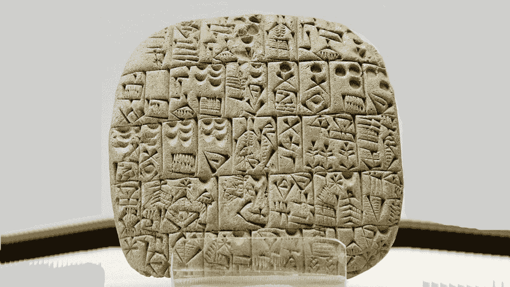
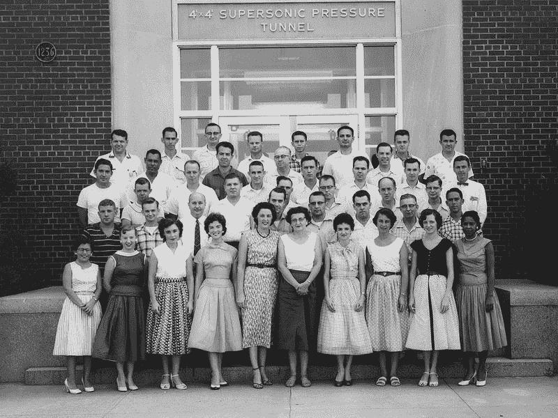
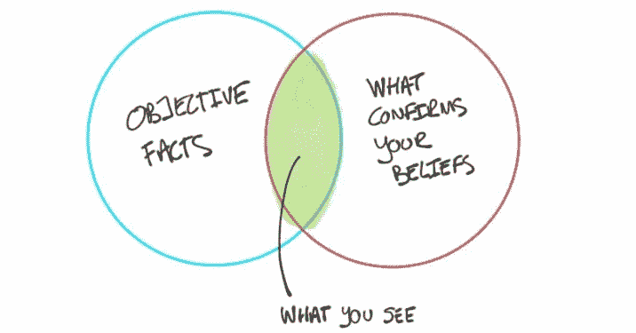
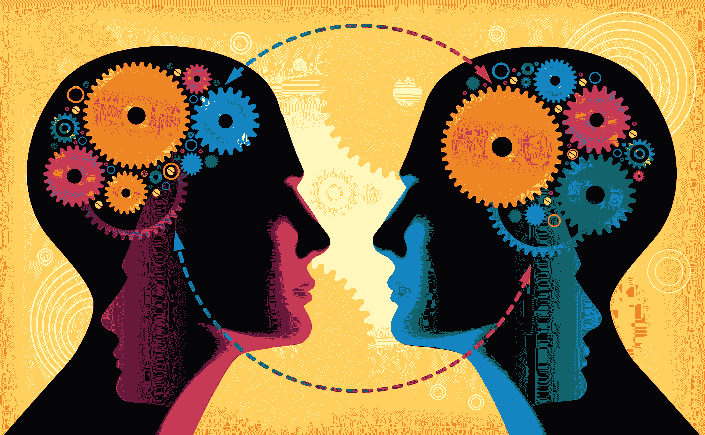

# AI = "自动灵感"

> 原文：<https://towardsdatascience.com/ai-automated-inspiration-75bff7b9481b?source=collection_archive---------8----------------------->

## 历史(和未来)的简短游览！)的数据科学

*(改编自我的* [*原福布斯 AI 文章*](http://bit.ly/quaesita_history) *)。)*

下面是文章的音频版本，由作者为你朗读。

在 19 世纪，医生可能会为情绪波动开出水银处方，为哮喘开出砷处方。他们可能不会想到在你手术前洗手。当然，他们不是想杀你——他们只是不知道该怎么做。

这些早期的医生在他们的笔记本上潦草地记下了有价值的数据，但是他们每个人在一个巨大的拼图游戏中只拿了一块。如果没有共享和分析信息的现代工具，以及理解这些数据的科学，就无法阻止迷信取代通过可观察事实的钥匙孔看到的东西。

自那以后，人类在技术方面取得了很大进步，但今天机器学习( [ML](http://bit.ly/quaesita_simplest) )和人工智能( [AI](http://bit.ly/quaesita_ai) )的繁荣并没有真正与过去决裂。这是人类理解周围世界的基本本能的延续，这样我们才能做出更明智的决定。我们只是拥有比以往任何时候都好得多的技术。

> 今天人工智能的繁荣并没有真正与过去决裂。我们只是拥有比以往任何时候都好得多的技术。

一种看待这种模式的方式是把它看作是数据集的革命，而不是数据点。这种差异并不小。数据集帮助塑造了现代世界。

## 书写的发明

想想苏美尔(今天的伊拉克)的抄写员，他们在 5000 多年前就把手写笔压在泥板上。当他们这样做时，他们不仅发明了第一个书写系统，而且发明了第一个数据存储和共享技术。

世界上第一个数据存储和共享技术的例子，[泥板](https://en.wikipedia.org/wiki/Clay_tablet)。你不能在上面存放太多的数据，而且检索是一件痛苦的事情(你必须全力以赴)。

如果你被 AI 超越人类的能力的承诺所鼓舞，考虑一下文具给了我们超人的记忆。虽然今天很容易把写作视为理所当然，但可靠地存储数据集的能力代表着通往更高智能的道路上开创性的第一步。

> 如果你被人工智能超越人类能力的承诺所鼓舞，那就认为文具给了我们超人的记忆力。

不幸的是，从泥板及其电子前的同类中检索信息是一件痛苦的事。你不能对着一本书打响指来得到它的字数。相反，你必须将每个单词上传到你的大脑中进行处理。这使得早期的数据分析很费时，所以最初的尝试只停留在本质上。虽然一个王国可能会分析它通过税收筹集了多少黄金，但只有勇敢的灵魂才会在医药等应用上尝试同样的努力推理，因为几千年的传统鼓励即兴发挥。

## 分析的兴起

约翰·斯诺绘制的[地图](https://en.wikipedia.org/wiki/John_Snow#/media/File:Snow-cholera-map-1.jpg)显示了 1854 年伦敦大流行中的霍乱病例。

幸运的是，我们的物种产生了一些不可思议的先驱。例如，约翰·斯诺绘制的 1858 年伦敦霍乱爆发期间的[死亡地图](https://en.wikipedia.org/wiki/John_Snow#/media/File:Snow-cholera-map-1.jpg)启发了医学界重新考虑疾病是由瘴气(有毒空气)引起的迷信，并开始仔细研究饮用水。

分析师弗洛伦斯·南丁格尔(1820-1910)

如果你知道《拿着灯的女士》(The Lady With The Lamp)，弗洛伦斯·南丁格尔(Florence Nightingale)因其作为护士的英雄般的同情心而出名，你可能会惊讶地发现，她也是分析学的先驱。她在克里米亚战争期间发明的信息图表拯救了许多人的生命，她将糟糕的卫生状况确定为医院死亡的主要原因，并激励她的政府认真对待卫生问题。

弗洛伦斯·南丁格尔[发明的极区图](https://en.wikipedia.org/wiki/Florence_Nightingale)，显示了死于可预防疾病的人数(蓝色)，死于创伤的人数(红色)，以及死于其他原因的人数(黑色)。

随着信息的价值开始在越来越多的领域得到体现，导致了计算机的发明，单数据集时代开始了。不，不是你今天习惯的电子伙伴。“计算机”最初是一种人类职业，其从业者手动执行计算和处理数据以提取其价值。

所有这些人都是电脑！摄于 20 世纪 50 年代的超音速压力风洞工作人员的照片。

[数据](http://bit.ly/quaesita_hist)的美妙之处在于，它能让你形成一个比凭空想象更好的观点。通过浏览信息，你会受到启发，跟随弗洛伦斯·南丁格尔和约翰·斯诺的脚步，提出新的问题。这就是[分析](http://bit.ly/quaesita_analysts)的全部内容:通过探索激发模型和假设。

## 分析的缺点

不幸的是，没有第二个数据集，你无法知道你的这个[数据启发的](http://bit.ly/quaesita_inspired)观点是不是胡说八道。除了你看到的特定数据点之外，它在一般情况下是否有效？你没有合法的途径知道。欢迎来到 20 世纪的分析。

Paul J 为我的[文章](http://bit.ly/quaesita_inspired)创作的关于数据驱动决策中的确认偏差的插图。

你不能相信你的发现，因为你的无意识偏见(如[确认偏见](http://bit.ly/quaesita_default))掌控着方向盘——你会立即看到最方便看到的东西，而你会错过所有其他的东西。你可能认为你看到了所有能看到的东西，但实际上你只看到了皮毛。我们人类的注意力广度和记忆力比我们想象的要小，所以探索性数据集对我们来说通常是一种狒狒陷阱。

> *分析是关于灵感和探索的，但是那些超越所探索的数据的观点不能被认真对待。*

为了检验你对数据之外的世界如何运作的看法，你不能使用最初激发你这种看法的数据。我们的物种在薯片中发现了猫王的脸。虽然*这个*芯片可能看起来像猫王，但我们不能用它来断定*大多数*芯片都像猫王。为了了解我们的观点是否会被严肃对待，我们必须在我们从未见过的新芯片上测试它们。

# 从数据集到数据分割

20 世纪初，在不确定性下做出更好决策的愿望导致了一个平行职业的诞生:[统计学](http://bit.ly/quaesita_statistics)。统计学家帮助你测试，如果一种现象也适用于你当前的数据集之外，这种行为是否明智。

> 统计的严谨性要求你在出手之前先发号施令；分析更多的是一种高级后见之明的游戏。

一个著名的例子与世界上第一本统计学教科书有关。它的作者描述了一项假设测试，以回应他朋友的说法，即她可以品尝出牛奶是在水之前还是之后加入茶中的。他希望证明她是错的，但数据迫使他得出结论，她可以。

## 阿喀琉斯之踵

[分析和统计](http://bit.ly/quaesita_versus)有一个主要的致命弱点:如果你使用相同的数据点进行假设生成和假设检验，你就是在作弊。(看了[这个](http://bit.ly/quaesita_sydd)就明白为什么了。)如果你选择用你的数据来获得严谨而不是灵感，你就得从别处获得灵感。经典的来源是苦苦思索。换句话说，你坐在一个扫帚间里沉思，仔细地构建你的统计问题，阐明你所有的假设，然后你有一次机会来测试你的世界心理模型是否真的站得住脚。

不幸的是，要用数学的方式详细说明你的全部直觉并对其进行测试，需要付出大量的努力和训练。你需要集中精神。但至少现在你有了一个合法的方法来检查你的印象是否值得采取行动。欢迎来到 20 世纪后期的统计数据。

## 数据集革命

统计学的严谨性要求你在采取行动之前先发号施令[；](http://bit.ly/quaesita_inspired)[分析](http://bit.ly/quaesita_analysts)更像是一场高级后见之明的游戏。这些学科几乎是悲喜剧般的不兼容，直到下一次重大革命——数据分割——改变了一切。

数据分割是一个简单的想法，但对于像我这样的数据科学家来说，这是最深刻的想法之一。如果你只有一个数据集，你必须在[分析](http://bit.ly/quaesita_analysts)(不可测试的灵感)和[统计](http://bit.ly/quaesita_statistics)(严谨的结论)之间做出选择。黑客？把你的数据集分成两部分，然后拥有你的蛋糕并吃掉它！

双数据集时代用两个不同[品种的数据专家](http://bit.ly/quaesita_roles)之间的协调团队合作取代了[分析](http://bit.ly/quaesita_analysts) - [统计](http://bit.ly/quaesita_statistics) [紧张](http://bit.ly/quaesita_battle)。分析师使用一个数据集来帮助你框定你的问题，然后统计学家使用另一个数据集给你带来严谨的答案。

> *将你的数据集一分为二，然后鱼与熊掌兼得！*

这种奢侈伴随着一个沉重的价格标签:数量。如果你甚至难以为一个可观的数据集收集到足够的信息，那么拆分说起来容易做起来难。双数据集时代是一个相当新的发展，伴随着更好的处理硬件、更低的存储成本和通过互联网共享收集的信息的能力。

事实上，导致双数据集时代的技术创新迅速迎来了下一个阶段，一个自动化灵感的三数据集时代。有一个更熟悉的词来形容它:[机器学习](http://bit.ly/quaesita_simplest)。

## 一次性命题的测试

有没有想过，当谈到严谨性和数据时，为什么统计学家往往倾向于焦虑不安？在你计划你的问题之前看一个数据集破坏了它作为统计严谨性来源的纯度。如果你问错了问题或者问得很愚蠢，你就没有机会再问先知第二次了。

即使你在考虑进行多重比较校正，也就是允许每个数据集有多个假设的统计咒语，只有你提前计划好所有的假设，你的程序才是有效的。你不能拿你的测试数据集玩 20 个问题，反复放大一个闪亮的结果，假装你已经洗手不干了。

> 测试仍然是一个一次性的提议——不允许你向一个解决方案反复爬行。

为了使这种严格的方法有效，你必须提前计划，如果有不止一个问题，使用一些充满歉意的数学方法，然后一次同时执行测试。您不能多次打开该测试数据集。

## 第三个数据集的奢华

既然你只有一次机会，你怎么知道哪一个来自分析的“洞察力”是最值得测试的呢？好吧，如果你有第三个数据集，你可以用它来激发你的灵感进行一次试驾。这个筛选过程被称为[验证](http://bit.ly/quaesita_mrbean)；这是让[机器学习](http://bit.ly/quaesita_simplest)运转的核心。

> *验证是机器学习的核心——它允许你自动激发灵感。*

一旦你可以自由地将所有东西扔向验证墙，看看有什么东西卡住了，你就可以放心地让每个人都尝试提出一个解决方案:经验丰富的分析师、实习生、茶叶，甚至是与你的业务问题无关的算法。无论哪种解决方案在验证中效果最好，都会成为合适的统计测试的候选方案。你刚刚授权自己自动激发灵感！

图片:[来源](https://cdn.psychologytoday.com/sites/default/files/field_blog_entry_images/2019-02/_vladgrin_shutterstock_78881305.jpg)。

## AI =自动灵感

这就是为什么[机器学习](http://bit.ly/quaesita_simplest)是数据*集合*的革命，而不仅仅是数据。这取决于是否有足够的数据进行三向分割。

人工智能( [AI](http://bit.ly/quaesita_ai) )在图片中的位置？使用[深度神经网络](http://bit.ly/quaesita_emperor)的机器学习在技术上被称为深度学习，但它有另一个流传下来的昵称: [AI](http://bit.ly/quaesita_ai) 。虽然 AI 曾经有过不同的含义，但今天你很可能会发现它被用作深度学习的同义词。

深度神经网络凭借在许多复杂任务上超越不太复杂的 ML 算法而赢得了他们的大肆宣传。但是它们需要更多的数据来训练它们，并且处理要求超过了典型的笔记本电脑。这也是为什么[现代 AI 的崛起是浮云故事](http://bit.ly/forbes_ai)；云允许你租用别人的数据中心，而不是致力于建立你的深度学习平台，使人工智能成为一个先试后买的命题。

> *现代人工智能的崛起是一个云的故事，因为云让人工智能成为一个先试后买的命题。*

有了这个拼图，我们就有了完整的职业补充: [ML/AI](http://bit.ly/quaesita_emperor) 、[分析](http://bit.ly/quaesita_analysts)和[统计](http://bit.ly/quaesita_statistics)。包含所有这些的总括术语叫做[数据科学](http://bit.ly/quaesita_datasci)，让数据变得有用的学科。

## 灵感的未来

现代[数据科学](http://bit.ly/quaesita_datasci)是我们三数据集时代的产物，但许多行业通常会产生过多的数据。那么，有四个数据集的情况吗？

好吧，如果你刚刚训练的模型得到一个低的验证分数，你的下一步行动是什么？如果你和大多数人一样，你会立刻要求知道为什么！不幸的是，没有可以询问的数据集。您可能想在您的验证数据集中进行调查，但是不幸的是，调试破坏了它有效筛选您的模型的能力。

通过对你的验证数据集进行[分析](http://bit.ly/quaesita_analysts)，你可以有效地将三个数据集变成两个。你没有寻求帮助，而是不知不觉地回到了一个时代！

解决方案在你已经使用的三个数据集之外。要解锁更智能的训练迭代和超参数调整，您需要加入前沿:四个数据集的时代。

> *尖端是四路数据拆分到燃油加速。*

如果你认为其他三个数据集给了你灵感、迭代和严格的测试，那么第四个数据集促进了加速，通过先进的[分析](http://bit.ly/quaesita_analysts)技术缩短了你的人工智能开发周期，这些技术旨在提供关于每一轮尝试什么方法的线索。通过采用四路数据分割，您将处于利用[数据](http://bit.ly/quaesita_hist)丰富的最佳位置！欢迎来到未来。

# 感谢阅读！人工智能课程怎么样？

如果你在这里玩得开心，并且你正在寻找一个为初学者和专家设计的有趣的应用人工智能课程，这里有一个我为你制作的娱乐课程:

在这里欣赏整个课程播放列表:【bit.ly/machinefriend 

# 与凯西·科兹尔科夫联系

让我们做朋友吧！你可以在 [Twitter](https://twitter.com/quaesita) 、 [YouTube](https://www.youtube.com/channel/UCbOX--VOebPe-MMRkatFRxw) 和 [LinkedIn](https://www.linkedin.com/in/kozyrkov/) 上找到我。有兴趣让我在你的活动上发言吗？使用[表格](http://bit.ly/makecassietalk)取得联系。