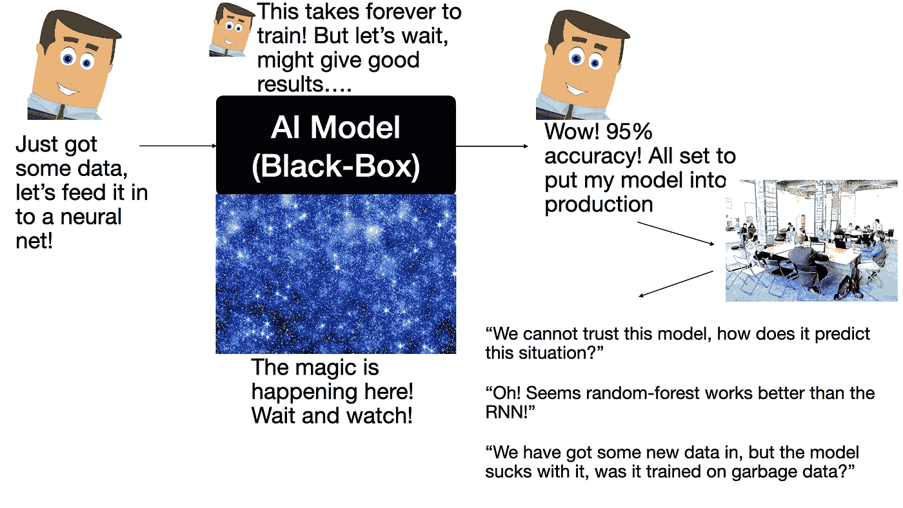

# 超越准确性的人工智能:透明性和可扩展性

> 原文：<https://towardsdatascience.com/ai-beyond-accuracy-transparency-and-scalability-d44b9f70f7d8?source=collection_archive---------64----------------------->

## 好的人工智能不仅仅是准确的，它是透明的和可扩展的(因此是值得信赖的)

乔伊特·查特吉的概念。卡通/明星和商务会议元素是来自 Pixabay/Pexels 的免费图片(无需注明出处)。请适当引用这篇中等文章。

我们都非常熟悉人工智能(AI)技术(尤其是深度学习)在全球范围内创造的大肆宣传——主要归因于一个目标，获得更高的准确性，并击败现有的基准。这在深度学习技术继续应用的几乎每个领域都非常突出，例如，尽管模型可以达到很高的准确度(在某些情况下，即使是垃圾数据也可能给你> 90%的准确度！)，它们受到透明性、可伸缩性和可解释性的关键问题的困扰。如果你的人工智能模型仅仅是精确的，但不具备其他任何一个特征，它有什么好的吗？

答案是，不，它在现实生活中没有任何好处(除非您只将它应用于 Iris flower 数据集)。这是大多数可以采用人工智能的企业不愿意这样做的唯一原因——人们不信任人工智能。那么，目前的人工智能方法在哪里缺乏，我们如何才能尽自己的一份力量来构建值得信赖的人工智能？

# **透明度**

图片由 [Gerd Altmann](https://pixabay.com/users/geralt-9301/?utm_source=link-attribution&utm_medium=referral&utm_campaign=image&utm_content=924572) 从 [Pixabay](https://pixabay.com/?utm_source=link-attribution&utm_medium=referral&utm_campaign=image&utm_content=924572) 拍摄

人工智能模型，尤其是深度学习者，简直就是黑盒。向模型输入一些数据来训练它，它会自动学习数据中的模式，一旦你给它一些新的、看不见的(测试数据)，它就能够对你看不见的数据进行预测/分类(取决于你是否训练了一个回归/分类模型),准确率为 X%。现在，有趣的事实是，一旦你训练了一个神经网络模型几百个时期，在大多数情况下，它们将能够学习各种非线性复杂数据中的模式，并在你看不见的测试数据上给你很大的准确性。但你怎么知道你的人工智能模型在获得如此高的准确性方面做了什么？模型查看了数据中的哪些要素(参数)？哪些特性对获得 X%的准确率贡献最大？透明度的作用来了。

透明的人工智能将允许你判断你的人工智能模型为什么(以及如何)为你的数据做出决定(或不做出决定)。以及如何才能让我们的人工智能模型变得透明？这一领域正在进行一些令人兴奋的研究

1.  利用简单易用的库来解释 AI (例如 https://github.com/slundberg/shapSHAP[，莱姆](https://github.com/slundberg/shap)[https://github.com/marcotcr/lime](https://github.com/marcotcr/lime)等等。).这些是一些出色的软件包，允许您识别数据集中有助于特定预测的要素！它们为你提供了可解释的特性总结，附加力图等。和直观的可视化，使黑盒决策变得理智。
2.  *深度学习模型中的注意机制:*因此，想象你的数据集由一些复杂的图像/时间序列/文本等组成，你正在执行各种任务，以高精度预测黑盒神经网络之外的事物。但可悲的是，传统的神经网络模型(无论是卷积神经网络(CNN)，递归神经网络(RNNs)等。，甚至不同类型的这些模型，如长期短期记忆(LSTMs)都是黑箱。为了避免这个问题，注意力机制来了。

假设您的数据集中有 N 个要素，关注机制会为您提供要素对特定结果的重要性分数(权重)。虽然这种机制最初在神经机器翻译(NMT)中变得突出，但现在它扩展到了所有类型的数据(文本/音频/时间序列数字数据等)。).[https://medium . com/@ dhartidhami/attention-model-797472 AC 819 a](https://medium.com/@dhartidhami/attention-model-797472ac819a)是解释在神经模型中如何计算注意力的资源。

3.*利用因果推理:*哦对！相关性计算起来很简单，但是它有必要给你完整的数据和模型吗？一个大大的不！相关性不一定意味着因果关系。如果你需要让你的人工智能模型可信，你需要确定你的特征内部的因果关系(什么特征导致了特定的结果)，以及你的数据集中的多个特征如何共享隐藏的关系(作为人类，我们无法判断，但因果推理可以帮助确定)。[https://towards data science . com/inferencing-causality-in-time-series-data-b 8 b 75 Fe 52 c 46](/inferring-causality-in-time-series-data-b8b75fe52c46)是推断时间序列数据因果关系的绝佳起点。

# **可扩展性**

图片由[皮克斯拜](https://pixabay.com/?utm_source=link-attribution&utm_medium=referral&utm_campaign=image&utm_content=3216241)的 Gerd Altmann 提供

对，所以你的人工智能模型达到了 95%的准确率！令人兴奋的东西。它还以 1%的精度击败了最先进的基准，但比最先进的多花费了 15 天的额外计算资源和训练时间(在 GPU 上也是如此)。等等！以这种密集的计算资源为代价获得 1%的精度提升？我认为我们在这里走错了路。在复杂的工业系统和商业中，真的有很多人能接触到这样的计算能力/金钱/资源吗？大多数人不会。此外，以计算复杂度为代价获得 1%的精度提升没有太大意义。如果我们从我们的模型中获得了一些额外的好处，故事将会不同(这里的好处意味着可解释性和透明性)。

但可悲的是，人工智能的大肆宣传意味着击败最先进的技术，不幸的是，这在研究界一直很突出。如何改变这种情况，使您的模型具有可伸缩性？

来自 [Pixabay](https://pixabay.com/?utm_source=link-attribution&utm_medium=referral&utm_campaign=image&utm_content=2991600) 的[图米苏](https://pixabay.com/users/Tumisu-148124/?utm_source=link-attribution&utm_medium=referral&utm_campaign=image&utm_content=2991600)的图片

1.  *做正确的事情，如果更简单的模型(例如随机森林)比复杂的深度学习者的高度复杂的堆叠模型工作得更好*(没有给你提供额外的好处)，那么请不要在这种情况下使用深度学习模型。如果你真的想，只利用可以提供透明度的深度学习模型(如上所述，通过注意力机制，或通过利用结合传统 ML 学习者和深度学习者的混合方法)。
2.  *你的模型适应新数据吗，还是只对特定的数据段有好处？通过使你的人工智能模型通用化，尝试使它们可扩展，利用迁移学习技术，这可以促进从密切相关的领域学习，使你的人工智能模型在新的领域中工作良好。因此，迁移学习使你能够在新的数据集中做出预测，在某些情况下甚至不需要额外的训练数据！(少镜头学习是这种技术的一种变体，只需要少量带标签的训练数据样本)。下面是迁移学习[的精彩介绍 https://medium . com/@ alexmoltzau/what-is-Transfer-Learning-6 ebb 03 be 77 ee](https://medium.com/@alexmoltzau/what-is-transfer-learning-6ebb03be77ee)。*
3.  *移除冗余特征:*是的，我们知道深度学习者不需要广泛的特征工程，但如果你有成千上万个特征(并且你清楚地知道其中只有 20 个对你拥有的数据有逻辑意义)，那么为什么不手动移除剩余的无用特征呢？或者利用一些特定的技术来识别该领域的关键特征([https://dzone . com/articles/feature-engineering-for-deep-learning](https://dzone.com/articles/feature-engineering-for-deep-learning)是一个很好的资源)？

最后，

## **保持简单愚蠢！**

不要急于在你的人工智能模型获得高精度后就直接应用于生产。前面已经概述过，在现实生活和业务中，很多时候，在您的个人电脑中使用数据 X 时工作的东西，在实践中可能会在行业中使用非常相似的数据 Y 时吸收性能。AI 不错，但并不总是最好的。我们需要通过超越准确性的思考使它变得更好。作为研究人员、工程师和数据科学家，我们的目标应该是建立透明、可解释和可扩展的人工智能模型。只有这样，我们才能利用人工智能造福社会，让我们周围的世界变得更美好。

## ***精准+透明=值得信赖的 AI！***

就是这样！希望这篇文章能让你意识到可解释人工智能在日常生活中的价值。

如果你愿意，你可以通过 LinkedIn 联系我:[http://linkedin.com/in/joyjitchatterjee/](http://linkedin.com/in/joyjitchatterjee/)