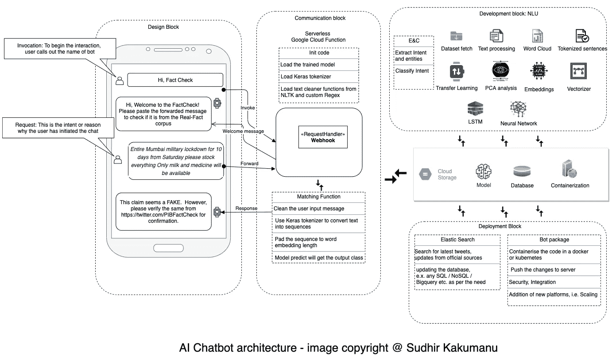
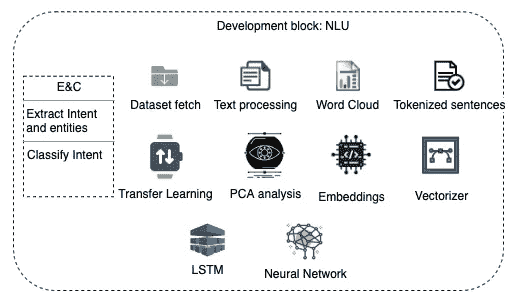
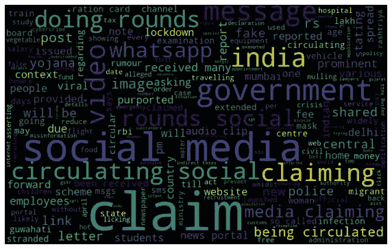
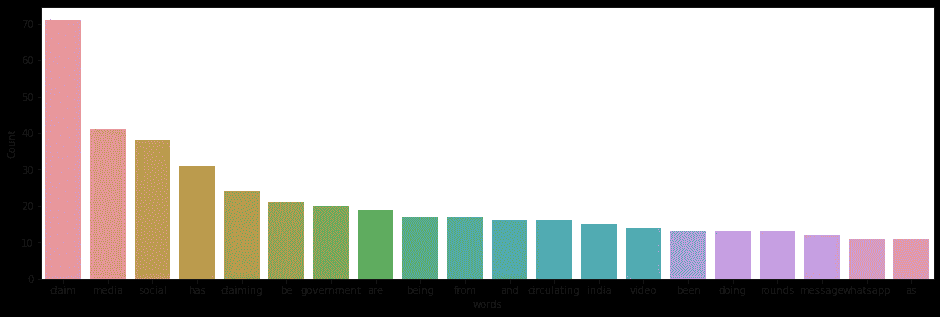
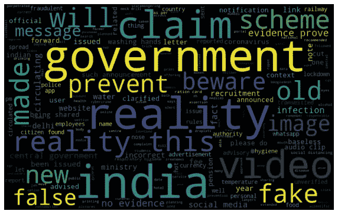
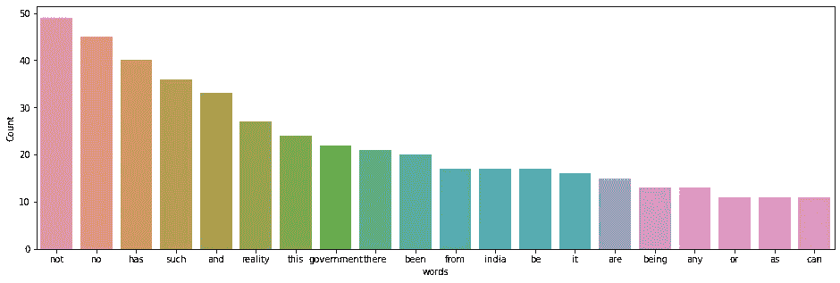
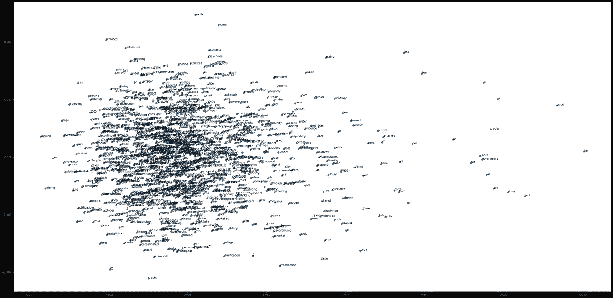
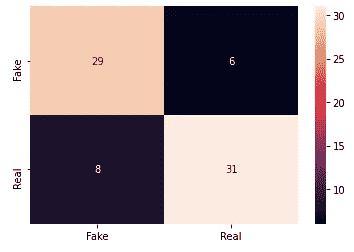

# 人工智能聊天机器人对虚假信息进行情感分析。

> 原文：<https://towardsdatascience.com/ai-chatbot-for-sentiment-analysis-on-fake-messages-abf96382a92d?source=collection_archive---------73----------------------->

## 通过社交媒体传播的假新闻已经成为一个严重的问题。在本文中，我们将了解如何通过对转发的消息进行“事实检查”来进行情感分类，并将该解决方案作为聊天机器人集成到 Telegram 中。

我们将浏览我为这个解决方案构建的架构，并尝试解决社交媒体中转发消息的真实性和正确性。

这个语料库很小，而且是从 PIB 官方[推特](https://twitter.com/PIBFactCheck)页面上经过核实的事实中提取的。

**AI chatbot** :顾名思义，它是一种通过文本或语音交互来模仿人类对话的 AI 软件程序。聊天机器人变得越来越突出的原因是因为它们可以全天候工作，节省时间和金钱，将企业与客户、员工、家庭自动化等联系起来。

## 限制范围，我们集中于情感分析，而不是对话机器人。我将解决这个问题，以检测短信是假的还是事实，而不是意图分类。

**聊天机器人方法**:选择方法是主动的(例如，对用户请求的建议)还是被动的(仅仅响应用户请求)。对于事实检查用例，我们采用反应式方法，因为我们只需要做出反应，告知消息是否是事实。

以下是架构:

让我们从模块开始，详细了解每一个模块:

**设计模块**:该模块控制对话流程，主要关注请求和响应，基于规则，也可用于意图分类。但是，我限制了流量，以解决消息的真实性。

**通信模块**:由于通信非常轻量级，所以我使用了无服务器架构。我们可以用谷歌云功能(或 AWS Lambda)来托管代码。API 可以通过 REST 调用，这简化了我们的过程。

*   初始化函数:将训练好的模型和标记器从云存储中复制到临时目录中。
*   更新功能:更新最新型号。这可以通过 REST API 调用，它将更新的模型从存储桶复制到临时目录。
*   Webhook:这个函数通过后端系统处理用户的请求和响应。它还记录用户请求并跟踪对话。
*   匹配功能:本模块的重要组成部分。它清理文本，使用经过训练的标记器和模型来预测消息是真是假。

**部署模块**:处理模型、数据集、模型训练和云基础设施管理的部署。使用官方 twitter API，我们从官方源页面获取新的 tweets，将数据提取到相关部分，并将数据集存储在 DB 中。为了 CI/CD，组件被集装箱化。我将在以后的文章中详细介绍这个模块。

# **NLU 街区:建筑的大脑**

NLU 组件:图片版权@ Sudhir Kakumanu

简而言之，这个模块负责对转发的消息进行情感分析。执行流程如下:

1.  **数据集**:我们获取数据集进行事实检查。这个数据集是从印度 PIB 的官方 twitter 句柄策划的。
2.  **文本处理**:对数据集进行处理，即删除特殊字符、调整编码、词条分类、解构缩写、社交信息俚语等。
3.  WordCloud 是从这段文字中准备出来的，并经过分析，看看是否有我们可以去除的异常值。

词云和频率分布

4.**迁移学习**:我们将使用在[谷歌新闻数据集](https://code.google.com/archive/p/word2vec/)(约 1000 亿字)的一部分上训练的预训练向量。该模型包含 300 维向量，包含 300 万个单词和短语。

5.**应用 PCA** 并分析主成分，以检查数据集是否有任何协方差，简单来说，我们检查是否有任何公共因子。

主成分分析

6.**嵌入和矢量化器**:从预训练的模型中提取嵌入，并对训练语料进行矢量化，得到嵌入矩阵。这个嵌入层充当我们的神经网络的初始层。这是一个 Word2Vec 表示，用于提取单词的语义信息。

7. **LSTM &神经网络**:为了捕捉文本序列化信息，我们将使用 LSTM(基于 RNN 的模型)来理解句子的上下文，即从先前的神经元记住的单词序列，并将其传递给未来以进一步分析数据。

自定义数据集的单词嵌入是在训练神经网络时学习的。

1.  训练过程是这样的，用我们拥有的语料库的大小(单词*维度)创建一个空的嵌入矩阵。
2.  获取谷歌新闻预训练嵌入中存在的词的向量/嵌入，未知词被零初始化。
3.  现在，神经网络被训练，单词的嵌入或同现随着上下文更新(当添加 LSTM 时)。

模型摘要:

模型摘要

训练精度:

模型训练历史

使用下面的混淆矩阵可以达到 98%的准确度:

**演示视频**:

## 对转发消息的模型的进一步测试:

> **训练消息** : *声明:Whatsapp 上正在流传一份所谓的 3 周 5 阶段“路线图”，据称是由政府制定的，旨在放松#COVID19India 限制。*
> 
> **Whatsapp 转发消息** : *放松新冠肺炎限制的政府路线图将进行为期 3 周的审核流程，当前阶段将于以下日期开始:第 1 阶段–5 月 18 日第 2 阶段–6 月 8 日第 3 阶段–6 月 29 日第 4 阶段–7 月 20 日第 5 阶段–8 月 10 日如果冠状病毒病例开始增加，我们将恢复到前一阶段设定的限制*
> 
> **训练信息** : *声明:一名#WhatsApp 转发者称，从周六开始，孟买将进行为期 10 天的军事封锁*
> 
> **Whatsapp 转发消息** : *从周六起整个孟买军事封锁 10 天，请储备所有物品，只有牛奶和药品可用*

***结论*** :我们能够成功检测出一条用不同语法和短语编写的 Whatsapp 转发消息

感谢阅读，如果你喜欢这篇文章，请鼓掌。

页（page 的缩写）关于程序代码，请参考我的笔记本。