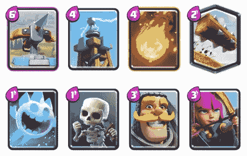
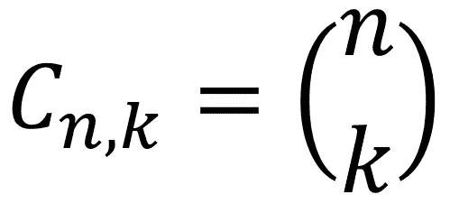
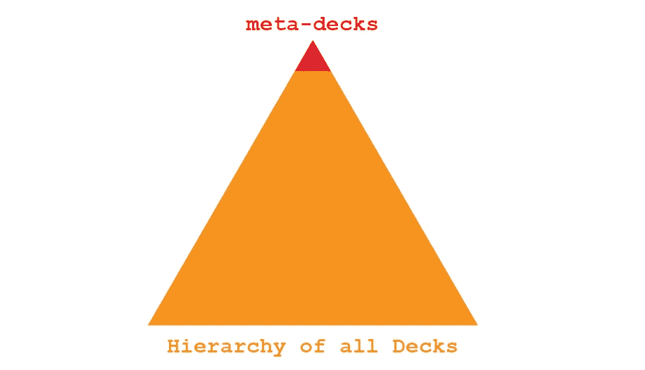
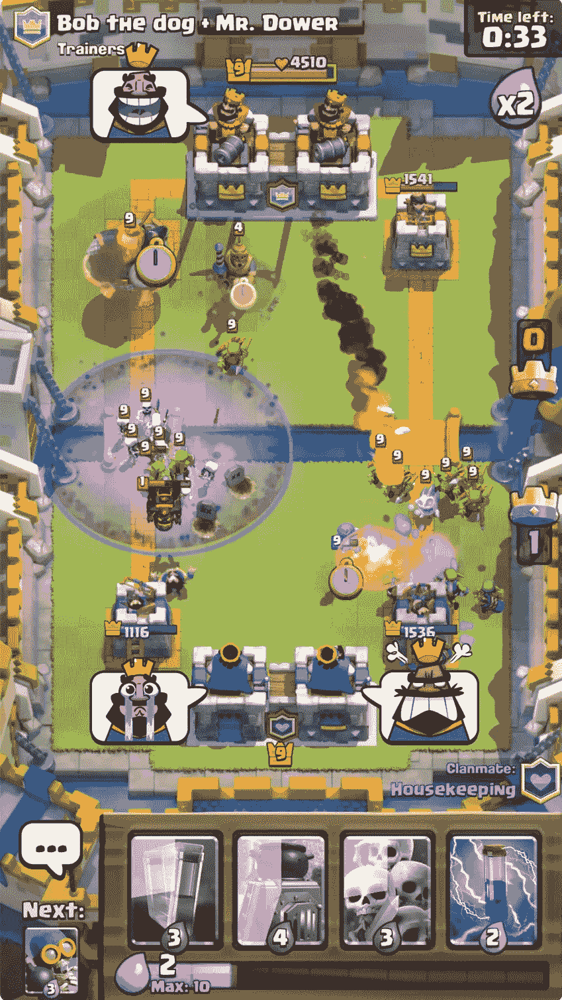
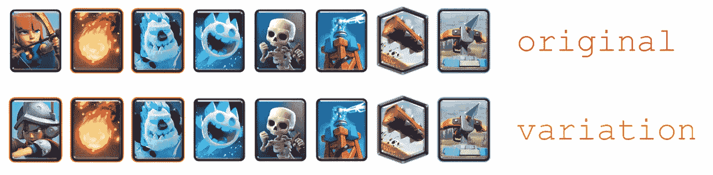
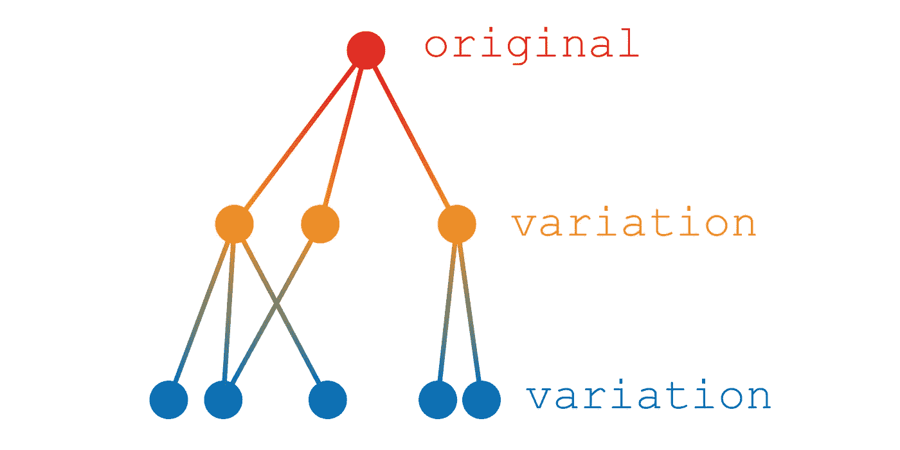
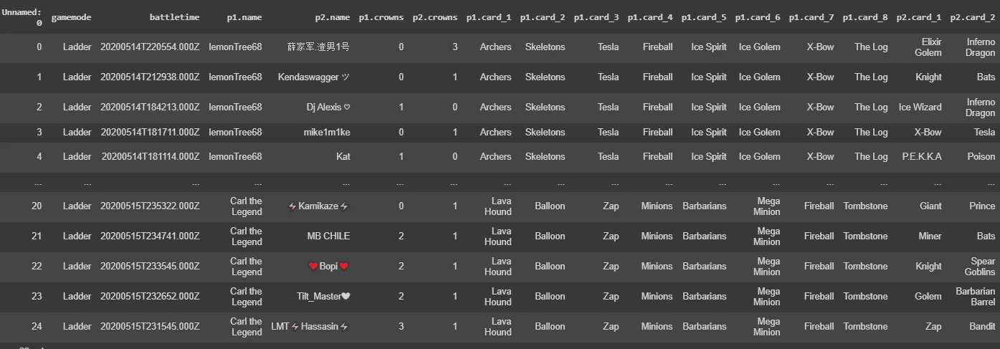
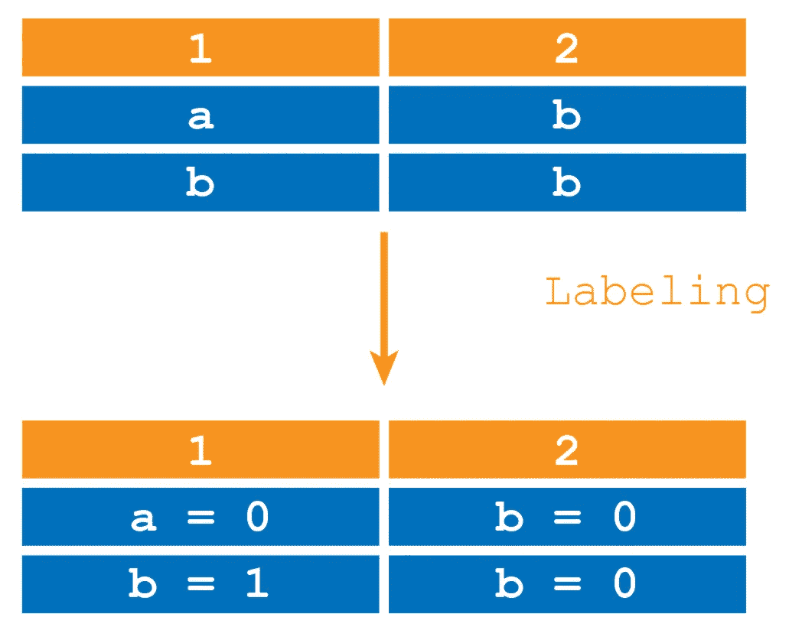
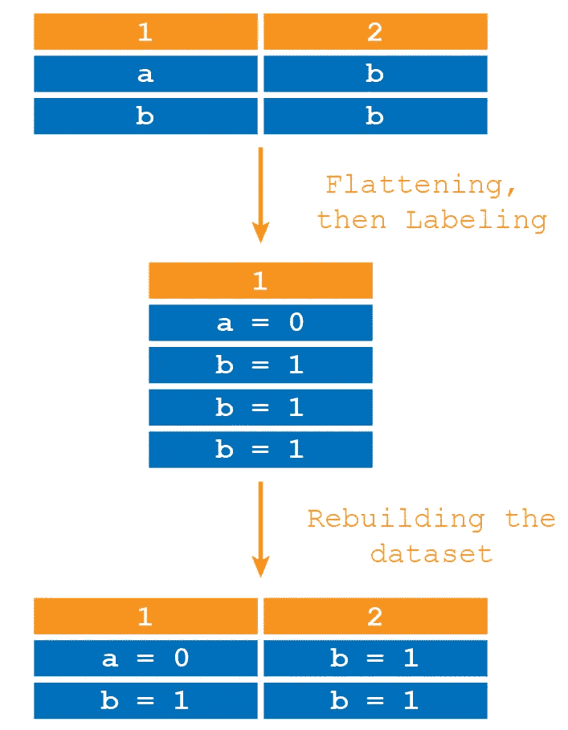
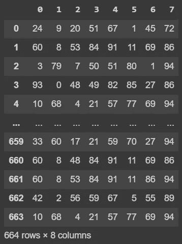

# 分类数据的聚类分析(上)

> 原文：<https://towardsdatascience.com/ai-cluster-analysis-of-categorical-data-part-i-8e702ca6675b?source=collection_archive---------46----------------------->

## CRL 元卡片组的聚类分析

## 使用 Clash Royale 原始数据提取最新的元卡片组

* * *代码在 Clash Royale 介绍之后开始:如果您不感兴趣，请跳过

我的资料库里有完整的代码。笔记本名为:CRL_Clustering。

在本文中，我将创建一个人工智能，给定一个 Clash Royale 匹配的数据集，它将识别哪些是主要的聚类。所有数据都是分类的，因此我不会使用传统的因子分析技术，而是使用 K-Node 算法。

# 视频游戏中的元卡片组介绍

在解释我将要创建的人工智能背后的代码之前，我需要澄清什么是元甲板，以及它们如何与这个项目相关。专业的电子游戏玩家已经把对竞技电子游戏的研究变成了一门真正的学科。

在视频游戏中，你需要从一堆卡片中准备你的牌组，有大量的可能组合，从这个可能性的海洋中出现了一小批帮助玩家获得竞争优势的组合:所谓的**元牌组**。

我将创建一个人工智能，可以找到哪些是在名为皇家冲突的竞争游戏中使用的元甲板，从原始数据中提取它们。

## 皇家冲突，选择 8 张牌

在这个游戏中有 98 张卡(直到 2020 年 5 月，游戏每隔几个月增加一张卡)。每个玩家必须组成一副 8 张牌，与其他玩家对战。



由 8 张牌组成的一副牌的例子，从:【www.theclashify.com】T4 检索

## 有多少副牌？



简单组合的公式

可能的套牌数量是 **6345015248033280，**顶级玩家从这些组合中找出元套牌。元牌经常变化，所以职业玩家需要保持更新，继续研究游戏。


皇家竞技对决中著名的元牌示例，图片来自[www.statsroyale.com](http://www.statsroyale.com)

# meta 套牌是怎么诞生的？

不幸的是，没有数学方法来确定哪些是最好的套牌。冠军拥有的唯一可能性是尝试他们中的许多人，看看哪一个比其他球员表现得更好。

从本质上讲，通过不断的迭代，元牌是那些允许顶级玩家持续获胜的牌，因此允许他们在竞争对手的等级中攀升至顶级。因此，这些特定的套牌在社区中数百万场比赛中幸存了下来。



正如你所看到的，在某件事情上变得优秀，即使是在电子游戏上，也需要很多努力、承诺和学习。

# 玩家如何知道哪些是元套牌？

最后，玩家社区(不仅仅是前 100 名)如何找出每个赛季的元套牌？由于使用了 Youtube、脸书小组和 www.statsroyale.com 等皇家冲突的统计网站，人们可以看到顶级玩家玩什么以及他们的胜率。然后，这些套牌被社区中的所有玩家复制和使用，无论是普通玩家还是专家，直到职业玩家级别。



检索自:【https://clashroyale.fandom.com/wiki/2v2 

# 使用聚类从原始数据中提取元数据组

现在让我们假设我们对这款电子游戏一无所知，也不知道这一季的主打牌是什么。我拥有近 700 场顶级球员的比赛(669 场)。

我的人工智能要做的是找出哪些牌组被玩得更一致，并隔离它们。

## 变异问题



原始 meta-deck 的一个常见变体:X-Bow，从 www.statsroyale.com[取回的图像](http://www.statsroyale.com)

让我们记住，任何人都可以编辑他们的卡片组，所以玩家可以很容易地创建一个元卡片组的独特变体，我们不想在计算中考虑它，所以我们需要一个算法来找出哪些是原始卡片组，而不是变体。我们假设变奏曲会以较低的频率播放，而原始牌组会以最高的频率播放。



变化的层次

在元牌的层级中，由于数百万玩家可能的变化和实验的频率，变化的程度可以达到数百个深度。

**整个程序**

1.  使用 API 下载匹配数据集
2.  预处理:对每一行进行个性化排序
3.  预处理:整个数据集的标签编码
4.  预处理:整个数据集的 one_hot 编码
5.  执行聚类分析
6.  训练 K 节点算法
7.  调整聚类数以获得准确的结果
8.  估计最高元牌组

在本文中，我将讨论第 3 步:对整个数据集进行标签编码。在教程的下一部分，我将完成人工智能。

# 1.匹配数据集

为了方便起见，我[已经下载并准备了数据集](https://github.com/arditoibryan/Projects/tree/master/20200518_CRL)，我们将使用它对分类数据进行聚类。如果您希望下载您自己的 Clash Royale 比赛数据集，请[按照这个完整的指南来创建一个下载数据的 API。](https://medium.com/towards-artificial-intelligence/clash-royale-api-looping-query-for-data-collection-2a6ed6a505d4)

```
X = pd.read_csv('/content/drive/My Drive/Colab Notebooks/CRL daily collector/CRL (1).csv')
```



查看 CRL.csv

目前，数据集包含了太多的信息:我们需要去掉所有不包含关于球员 n. 2 的数据的列。原因是我下载了被选为玩家 n.1 的几个玩家的最近 25 场游戏。一个玩家通常玩一个原型，如果我们的整个数据集重复包含单个用户玩的牌组的比例太高，我们的数据集中元牌组的方差将会大大降低。

```
X = X[['p2.card_1', 'p2.card_2', 'p2.card_3', 'p2.card_4', 'p2.card_5', 'p2.card_6', 'p2.card_7', 'p2.card_8']]
X
```

我们将只查看玩家 n. 2 的牌组列表。

* * *在我的例子中，我将数据与我的 Google Drive 连接。您应该根据存储您的的位置编辑第一行。csv 文件。

# 2.预处理:订购套牌

不幸的是，我们收集的数据非常混乱。每一行中的牌的顺序对应于一场比赛中打出的牌的顺序。玩家可以开始使用军队，但也可以开始使用法术。为了看得更清楚，我们需要按照特定的顺序将卡片分类。

* * *特征的顺序不影响最终结果。然而，我相信这一步是必要的，以便清楚和全面地看到最终结果。

## 将每张卡转换成它的类型

在游戏中，基本上有四种类型的卡。它们被概念化，以允许人们创建适当的甲板。

*   获胜条件
*   部队
*   建筑物
*   拼写

因为我所拥有的数据集没有显示卡片的类型，所以我们需要创建一个能够将每张卡片转换为其相应类型的算法。

## 例子

这就是我所说的将每张卡映射到其类型的意思:使用下面的模拟列表:

```
['Zap', 'Knight', 'Giant', 'Earthquake', 'Musketeer', 'Ice Spirit', 'Skeletons']
```

…相应的类型将是:

```
['Spell', 'Troop', 'Troop', 'Win Condition', 'Spell', 'Troop',   'Troop', 'Troop']
```

## 转换算法

我创建了一个名为 CRL_Cards_Classification.csv 的. csv 文件，该文件将每个现有的卡与其对应的类型进行映射。

```
#https://docs.google.com/spreadsheets/d/1wIH69gfuCCoPRoWOIyUqQHMKkUfpb4GAxUbBYX8PwRc/edit#gid=1477229539
C = pd.read_csv('/content/drive/My Drive/Colab Notebooks/CRL daily collector/CRL_Cards_Classification.csv')cards_classifier = C.copy()
#getting rid of the first column, useless
cards_classifier.pop('Type_1')
cards_classifier = cards_classifier.values.transpose()
cards_classifierdef order_row(list1):
  #mapping input list made of cards with their type
  card_dictionary = dict(zip(cards_classifier[0],   cards_classifier[1]))
  card_dictionarylist_tot_classification = list()
  for m in list1:
    a = card_dictionary.get(m)
    list_tot_classification.append(a)
  list_tot_classification
```

## 个性化排序

对于数据集中的每一副牌，我希望所有的牌都按顺序排列:胜利条件，队伍，建筑，法术。

为此，我们将首先为每种类型分配一个升序值，这样我们就知道哪种类型最先出现:

```
class_dict = {'Win Condition': 0, 'Troop': 1, 'Building': 2, 'Spell': 3}
  list_tot_num = list()
  for m in list_tot_classification:
    a = class_dict.get(m)
    list_tot_num.append(a)ordered_list = [x for _,x in sorted(zip(list_tot_num, list1))]
  return ordered_list
```

## 例子

```
list1 = ['Arrows', 'Baby Dragon',  'Bomber', 'Golem',  'Lightning',  'Mega Minion',  'Mini P.E.K.K.A', 'Night Witch', 'Cannon']
ordered_list = order_row(list1)
```

会变成:

```
ordered_list
['Golem',  'Baby Dragon',  'Bomber',  'Mega Minion',  'Mini P.E.K.K.A',  'Night Witch',  'Cannon',  'Arrows',  'Lightning']
```

# 3.预处理:对整个数据集进行排序

```
#sort each row in the dataset based on type order
for c in range(len(X.values)):
X.values[c] = order_row(X.values[c])
X = pd.DataFrame(e.X.values)
```

* * *如果我们想按字母顺序对列表进行排序，我们将使用下面的代码，而不是 order_now

```
X.values[c] = sorted(X.values[c])
```

# 3.预处理:标注整个数据集

现在，我们已经根据易于理解的层次结构对数据集进行了排序，我们可以开始对其进行预处理。我们现在将标记整个数据集，稍后您会明白为什么，这将比标记单个行更有问题。

通常，工程师使用 scikit-learn 工具来轻松标记分类数据。不幸的是，scikit-learn 和其他工具一次只允许标记一列。这是一个例子，说明为什么它可以代表一个**问题**:



可以看到，在第一列 b = 1，在第二列 b = 0。原因是该算法将标签应用于每个**单独的列**，而不考虑其他列中的值。

## 正确的标签

为了获得准确的标注，我们需要将所有内容平铺到一列中，然后应用标注并重新构建初始数据集:



这将使用下面的代码来执行:

```
#flat everything in one list
one_row = list()
for k in e.X.values:
for n in k:
one_row.append(n)
one_row = pd.DataFrame(one_row)
one_row#labeled list
from sklearn.preprocessing import LabelEncoder
le = LabelEncoder()
le.fit(one_row[0])
one_row_labeled = le.transform(one_row[0])
one_row_labeled#rebuild the original dataset and convert it to DataFrame
import numpy
X_labeled = numpy.array_split(one_row_labeled, (len(one_row)/8))
X_labeled = pd.DataFrame(X_labeled)
X_labeled
```



现在，我们已经成功地正确标记了我们的每个特征，我们可以执行 one_hot 编码来将我们的数据集输入到 AI 中。

在我的下一篇文章中，我将描述整个过程，但是，在我的知识库中的笔记本上，你已经可以找到第二部分了。

-> [转到第二部分](/ai-cluster-analysis-of-categorical-data-part-ii-47f3a13601a2)