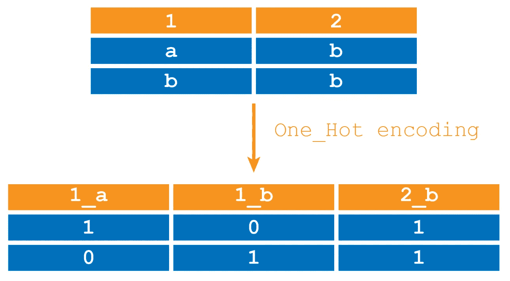
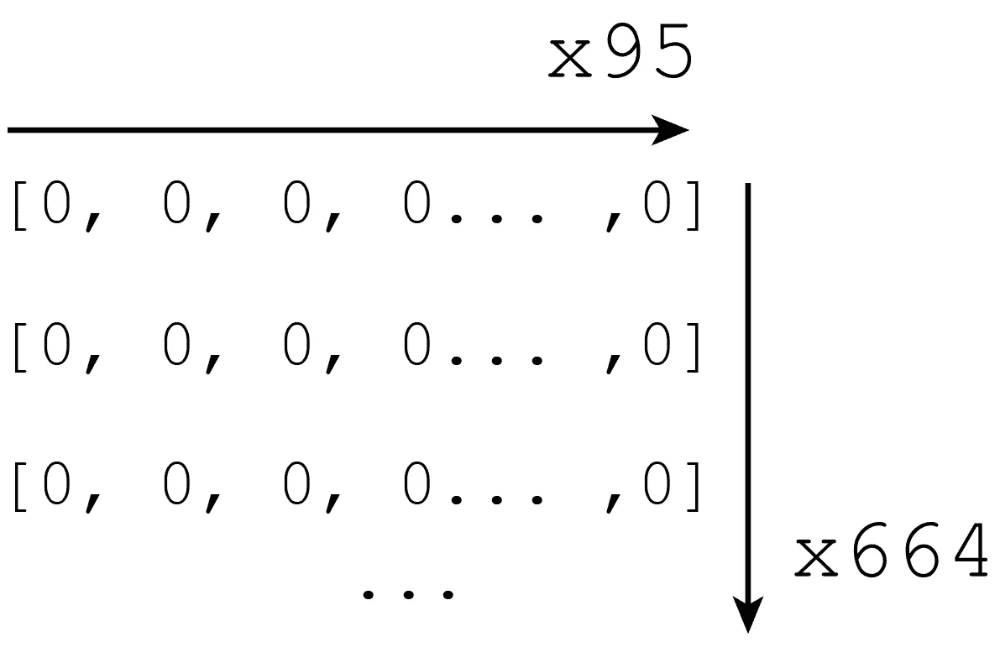
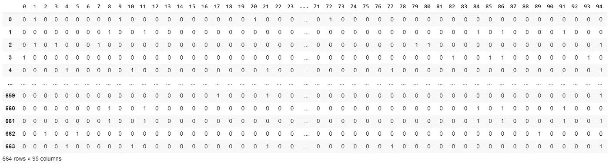
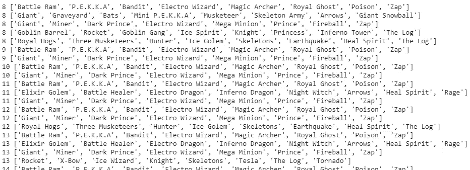
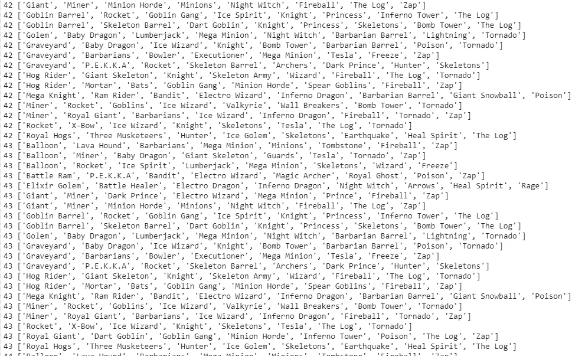
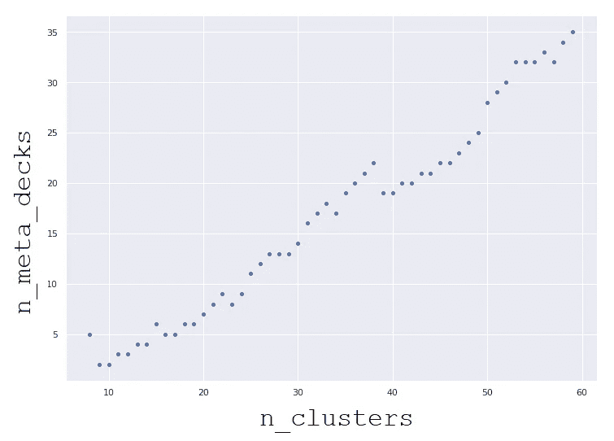
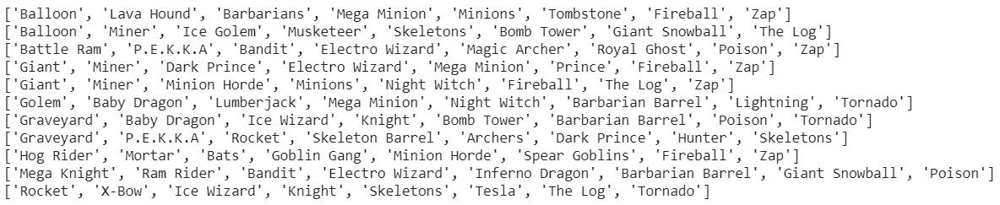

# 分类数据的聚类分析(第二部分)

> 原文：<https://towardsdatascience.com/ai-cluster-analysis-of-categorical-data-part-ii-47f3a13601a2?source=collection_archive---------37----------------------->

## CRL 元卡片组的聚类分析

## 使用 Clash Royale 原始数据提取最新的元卡片组

**整个过程**

[我的仓库里有完整的代码。](https://github.com/arditoibryan/Projects/tree/master/20200518_CRL)笔记本名为:CRL_Clustering。

1.  使用 API 下载匹配数据集
2.  预处理:对每一行进行个性化排序
3.  预处理:整个数据集的标签编码
4.  预处理:整个数据集的 one_hot 编码
5.  执行聚类分析
6.  训练 K 节点算法
7.  调整聚类数以获得准确的结果
8.  估计最高元牌组

到目前为止，[第一部分](/ai-cluster-analysis-of-categorical-data-part-i-8e702ca6675b)涵盖了第三步:对整个数据集进行标签编码。在本教程的最后一部分，我将介绍接下来的五个步骤。

# 4.预处理:整个数据集的 one_hot 编码

在步骤 3 中，我们已经标记了数据集中的每个元素，获得了以下结果:


为了将我们的数据集输入到 AI 中，我们需要使用 one_hot 编码。只有这样，模型才能处理分类数据。我们所有的列都是可互换的:这意味着我们将需要一大块 one_hot 变量。

如果我们必须对每一列都应用 one_hot 编码，我们将会得到每一列一个 one_hot 块:这就是我们现在想要的。对于 8 个现有要素，列之间的数据将被认为是独立的，标签将应用于各个列，而不是单个数据集:



从上图可以看出，如果我们必须对每一列应用 one_hot 编码，就会出现这种情况。在上面的例子中，b 在两列中，但它将被分解为 1_b 和 2_b，b 将被拆分为两个独立的变量。这意味着一张卡片。第一列中的巨人和第二列中的巨人将完全不同。因为事实并非如此(卡片组的顺序不应该影响元卡片组的选择)，所以当数据集中的相同变量位于不同的列中时，我们必须找到一种方法来避免它们的分离。

```
print(max(one_row_labeled+1), len(X_labeled))
95 664
```

我们的数据集总共有 94 张牌在任何可能的牌组中被玩家使用。这意味着每一行必须有 94 列，每一列代表一个虚拟变量。

```
#  one_hot of multiple columns at the same time
#create an empty dataset of equal lenght of max. label (94), but equal width of our X (664)
m = [[0 for x in range(max(one_row_labeled)+1)] for x in range(len(X_labeled))]
```

我首先创建了这个空数据集作为多维数组:



我现在将遍历 x 的每一行。每一行将包含 8 个不同的数字，我将找到相应的虚拟变量行并将其设置为 1。

```
#turn each corresponding label to 1
for row in range(len(X_labeled.values)):
for num in range(len(X_labeled.values[1])):
m[row][X_labeled.values[row][num]] = 1
m = pd.DataFrame(m)
m
```

在正确的位置添加了 1 之后，我将把列表转换成数据帧。这就是我们最终得到的结果:



现在我们可以把它输入到模型中。

# 5.执行聚类分析

现在我们已经准备好了数据，我们需要确定最佳的集群数量:

```
#graph the number of clusters
from sklearn.cluster import KMeans
import matplotlib.pyplot as pltwcss = []
for i in range(1, 100):
km = KMeans(n_clusters = i, init = 'k-means++', max_iter = 300, n_init = 20, random_state = 0)
km.fit(m)
wcss.append(km.inertia_)plt.plot(range(1, 100), wcss)
plt.title('The Elbow Method')
plt.xlabel('No. of Clusters')
plt.ylabel('wcss')
plt.show()
```


我们正试图通过肘方法来评估最佳集群的数量。通常，我们会寻找图中曲线弯曲最厉害的地方。不幸的是，我们可以立即看到，没有明确的迹象表明有一定数量的集群(也许大约 20 个集群有一个可能的弯曲)。特别是在 K 模式中，由于特征的分类性质，很难估计最佳的聚类数目。我们需要通过多次迭代并比较结果来找到最佳的聚类数。

# 6.训练 K 节点算法

```
!pip install kmodes
```

* * *因为我正在使用 Google Colab，所以我将使用上面的代码安装 kmodes 包，但是，根据您是在本地机器上还是远程运行您的算法，它可能会有所不同。

## 将每一行与其所属的聚类进行映射

现在让我们在数据集上运行一个使用 K-Mode 的实验。我需要指出对数据集进行分组的聚类数。本质上，输出是一个 664 个数字的数组。每个数字映射一行及其对应的分类。

```
#mapping each row to its correponding cluster
from kmodes.kmodes import KModes
test=KModes(n_clusters=20, init='Cao') #Huang in another possibil
cluster=test.fit_predict(m, categorical=list(m.columns))cluster
array([11,  0, 11,  4,  5,  3,  3, 11, 11,  9, 11, 11, 16,  5,  5,  0,  6,         1, 11,  3, 15,  0,  8,  1,  8,  0, 15,  5,  7, 15,  8, 17,  1, 15,         5,  2, 19, 13,  1,  9,  7, 16,  7,  1, 16,  3,  5,  1,  8,  7,  6,        16, 18,  7,  0,  3,  3,  3, 13, 19, 15, 11,  8,  4, 14,  4,  2, 14,         5,  7,  6,  1,  8,  1,  3,  8,  4,  3,  5, 19,  2,  1,  5,  0,  1,         6, 14,  8,  3,  4,  7,  4,  1, 14,  1,  5, 11, 18,  5,  1,  0,  2,        12,  3,  8,  9,  2,  4,  7,  7, 16, 11,  4, 11, 11,  1, 16,  6,  0,        16, 12,  0,  3,  7, 18,  1, 12,  0, 16, 18, 16,  3,  4,  7,  1,  1,         1,  2,  3, 19,  5, 11,  4, 16,  4,  0,  3, 12,  0, 12,  0, 12,  5,         2, 14, 11, 12, 15,  1, 11,  7,  2, 12,  0,  3,  3, 12,  7,  7, 18,         1, 16,  7, 17,  1, 12, 11, 14, 15,  3,  5,  0,  8, 14,  2,  2,  0,         4,  7, 16,  8, 11,  0,  6,  1,  5, 19,  7,  7, 16,  0,  2, 11,  4,         7,  5,  1,  8, 14,  0,  0, 19, 11,  7, 15,  5,  9,  2, 11,  7, 19,        14,  3, 11, 11,  1,  9,  5, 12, 12,  7, 12, 14, 14, 11,  0,  8,  3,         4, 11,  4,  5,  8, 15, 15, 14,  7,  4,  3,  6,  3,  5,  7,  4,  6,        15,  5, 13, 11,  4, 16,  7,  0, 14, 16,  7,  3,  9, 15,  0,  7,  0,         1,  8, 15,  5, 11,  3,  6,  4, 12, 15,  1,  2,  7,  1,  6,  1,  3,         8,  1,  0, 17,  5,  5, 14, 11,  3,  4,  2,  3,  7,  7, 11,  3,  0,         4,  1,  3,  7,  7,  4,  8,  3,  0,  3,  3,  9, 12,  3,  7,  7,  8,        12,  2,  3,  2, 19,  5,  7,  2, 14,  7,  2,  4,  1,  5, 19,  3,  2,        13,  5,  5,  3, 19,  4,  2, 15, 19,  1,  0, 12, 13,  8, 13,  0, 17,         7, 14,  3,  4,  0, 14, 12,  0,  1,  8, 12,  4,  3, 17, 15,  7,  4,         3, 14,  0, 12,  0,  9,  1, 14,  4, 12,  7,  4,  3,  2,  3, 15, 16,         2,  4,  0,  2, 15, 12,  7, 15,  2,  1,  1,  4,  0, 19,  6,  5, 11,        12,  8,  3, 16,  2,  3, 19,  0,  0,  1,  3, 17, 11, 10,  2, 15,  2,         0,  3,  7,  4, 17,  5,  5,  1,  8,  6,  6, 12,  5, 13, 19,  2,  6,         3,  3,  4,  3, 12, 17,  5, 15,  0, 19,  6,  0,  3,  2,  3,  0, 12,        11,  2, 14,  1,  1,  0,  7,  7, 12,  8,  4,  1, 12, 14, 17, 17,  8,         0,  2,  3,  2,  0, 16,  2,  6,  2,  0,  6,  3,  1,  0,  8,  3,  7,        11, 15,  0, 11, 11,  7,  2,  6,  5, 11,  4,  3,  5, 17, 15,  2,  0,        11, 11,  4,  3, 16, 19,  8, 15, 14,  0,  5, 13,  2,  0,  2, 14, 19,         8,  0,  1,  1, 14,  6, 15, 19, 19,  2,  0,  1,  1, 11,  5,  3,  3,         6,  8,  8,  1,  0, 19,  7,  2,  8,  4,  0, 12, 12, 12, 14,  4,  2,        16,  9,  0,  0,  4,  0,  2,  8,  4,  0,  2, 15,  4, 13, 15,  3,  0,         0,  4,  5,  6,  9,  0,  4, 14, 19,  1, 15, 15, 14,  2, 17,  4,  0,        15,  2, 12,  8, 14,  2,  1, 15,  2,  2,  2, 11, 12,  6,  0,  0, 12,         3, 17, 14, 11,  4,  0,  2,  4, 17,  0,  3,  5, 16,  0, 12,  0, 17,        17,  6,  4,  0, 16, 16,  0, 14,  3, 12, 11, 19,  6,  8,  2,  0,  4,         0,  7, 17,  1,  0, 15, 16, 13,  1,  7, 16,  0, 14,  6,  0,  0, 16,         5], dtype=uint16)
```

## 了解 20 个集群

现在，我们如何隔离集群并了解它们需要具备哪些特征？

```
test.cluster_centroids_
array([
[0, 0, 0, …, 0, 0, 0], 
[0, 1, 0, …, 0, 0, 0], 
[0, 0, 0, …, 0, 0, 0], 
…, 
[0, 0, 0, …, 0, 0, 0], 
[0, 0, 0, …, 0, 0, 1], 
[0, 0, 0, …, 0, 0, 1]
])
```

这 20 个 one_hot 数字列表描述了每个单个集群的特征。每一个都由 94 个元素组成，其中一些是 1，大多数是 0。如果对于每个列表，我们将把这 94 个二进制值转换成数字，然后把数字转换成卡片名称，我们将得到 20 副元牌。

## 将数字转换为卡片名称

目前，结果对我们来说是不可理解的。我们需要把它们翻译成我们能理解的语言。下面的算法采用 K 模式算法的输出，并将其转换为原始字符串:

```
#convert one_hot numbers to final decks
def archetypes(knode_list):
  archetypes_list = list()#for each 1 inside the one_hot cluster form return its number
  #not all clusters have the same lenght
  #store all number is arrays
  cc = list()
  for n_centroids in range(len(km.cluster_centroids_)):
    for k in range(len(km.cluster_centroids_[n_centroids])):
      if km.cluster_centroids_[n_centroids][k] == 1:
      cc.append(k)
  len(cc)#determines number of chunks per cluster
  n_chunks = list()
  for am in range(len(km.cluster_centroids_)):
    n_chunks.append((list(km.cluster_centroids_[am]).count(1)))
  n_chunks#creates the meta-decks
  from itertools import islice
  it = iter(cc)
  sliced =[list(islice(it, 0, i)) for i in n_chunks]
  slicedsliced_list = list()
  #convertion numbers to card names
  for o in sliced:
    sliced_list.append(order_row(list(le.inverse_transform(o))))#we only conserve the win conditions
  card_dictionary = dict(zip(cards_classifier[0],
  cards_classifier[1]))
  card_dictionary#an absurd way of making a copy of our dataset, .copy() does not work
  list_tot_classification = [x[:] for x in sliced_list] #un modo     assurdo per fare copia, altrimenti non funzionafor o1 in range(len(list_tot_classification)):
    for o2 in range(len(list_tot_classification[o1])):
      a = card_dictionary.get(list_tot_classification[o1][o2])
      list_tot_classification[o1][o2] = aonly_win_conditions = list()
  #only conserve lists with win conditions
  for o3 in range(len(list_tot_classification)):
    if 'Win Condition' in list_tot_classification[o3]:
    only_win_conditions.append(sliced_list[o3])#we store all the lists with a lenght of 8: full decks
  for _ in sorted(only_win_conditions):
    if len(_) == 8:
      archetypes_list.append(_)return archetypes_list
```

# 7.调整聚类数以获得准确的结果

现在，让我们尝试我们刚刚编写的算法的不同配置，并比较结果。我将运行总共 60 个集群，存储每次迭代的结果和元组数:

```
import numpy as np
from kmodes.kmodes import KModesarchetypes_len = list()
for clus in range (8, 60): ###FUNZIONA IN UN FOR CYCLE, MA NON IN UNA FUNZIONE
  km = KModes(n_clusters=clus, init='Cao', n_init=100, verbose=0)
  clusters = km.fit_predict(m)#one_hot results to archetypes sorted by win condition
  archetypes_list = archetypes(km.cluster_centroids_)
  archetypes_len.append(len(archetypes_list))
  for _ in archetypes_list:
    print(clus, _)
#25 is the optimal number of meta-decks
```



具有最小数量分类的初始输出的屏幕截图



具有更多分类的输出屏幕截图

正如我们从上一张图中看到的，簇的数量越多，相似元牌的数量就越多。本质上，在某一点上，甲板变化也包括在计算中。

## n 簇和 n 元牌

我现在已经将集群的数量存储在了 archetypes_len 中。我将创建一个包含集群范围的列表，这样我们就可以绘制出集群数量和元组数量之间的关系。

```
import seaborn as sns
archetypes_iteration = [x for x in range(8, 60)]
archetypes_iteration
sns.set(rc={‘figure.figsize’:(11.7,8.27)})
sns.scatterplot(archetypes_iteration, archetypes_len)
```



这如何转化为我们的元卡片组的层次结构？


## 集群的正确数量是多少？

*   如果集群的数量太少，我们最终只有几个元甲板。它们将是正确的，可能是列表顶部的那些，但它们仅代表元组池中的一小部分。
*   如果集群的数量太大，我们不仅会列出顶层，还会列出它们的所有变体，最后会列出一个模糊了元层概念的层。

只有在数量合适的情况下，我们才能对当前赛季中使用最多的元套牌有一个概念。


一副元牌示例:从:[www.reddit.com](https://www.reddit.com/r/ClashRoyale/comments/e5arf5/any_tips_for_icebow/)检索

# 8.估计顶级元牌

最后，在查看了数据之后，我选择了一些簇，这些簇显示了变化最小的顶层元素。我们可以得出结论，这些是第 11 季的元套牌，即当前的皇家冲突季:

```
#questo funziona
n_clusters = 25
km = KModes(n_clusters=n_clusters, init='Cao', n_init=100, verbose=0)
clusters = km.fit_predict(m)#one_hot results to archetypes sorted by win condition
archetypes_list = archetypes(km.cluster_centroids_)
for _ in archetypes_list:
  print(_)
```



输出