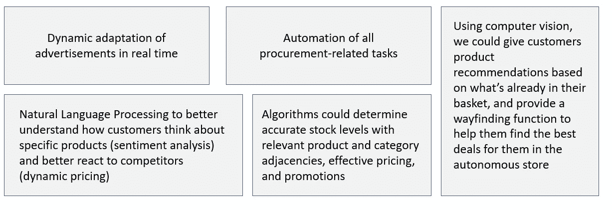

# 人工智能分散自治组织和零售业的未来

> 原文：<https://towardsdatascience.com/ai-decentralized-autonomous-organizations-and-future-of-retail-5e0f096a5bc9?source=collection_archive---------30----------------------->

## 爱道如何帮助创造完全自主的商店和新的商业模式

西蒙·贝克在 [Unsplash](https://unsplash.com/collections/10727740/digital-identity?utm_source=unsplash&utm_medium=referral&utm_content=creditCopyText) 上的照片

由于最近的卫生危机，零售商店自动化的需求已经成为优先事项。事实上，如果零售商想要生存，调整他们的商业模式已经变得至关重要。在这种背景下，我从事了一个与 AI 去中心化自治组织(AI DAO)和零售店相关的项目。

**商店可以独立吗？你能投资一个不需要人工的商店吗？用分布式人工智能能让一个店更智能吗？**

在这篇文章中，我将解释为什么现有的零售商面临风险，必须紧急投资新的商业模式，解释 AI DAOs 的关键作用，以及零售商如何从中受益。

## 我们所知的零售店将会消失

由于一系列的封锁和来自在线竞争对手的不断上升的威胁，零售商别无选择，只能接受自动化。总的来说，我们的购物方式正在发生变化。

> 简而言之，零售业的未来是自动化、更小的商店、数字化体验和更灵活的劳动力。

一些零售商已经决定将他们的商店转变成仓库和配送站，为完全转移到网上的企业服务。其他人已经开始从事半自主商店的工作。

**就我所见，自动化的道路往往需要几个计算机视觉算法。**利用计算机视觉帮助零售商收集足够的数据，以更好地了解他们的客户。

**主要战略要点是尽可能打造最佳客户体验。**实现这一目标的唯一方法是收集尽可能多的客户数据，以及他们如何与所有产品互动。

# 自主店爱道

这种自动化可以更进一步: **AI 去中心化自治组织**。

A **DAO** 是一种去中心化的商业模式。它是由管理企业如何运作的智能合同组成的。**“道的一切经营决策和财务行动都记录在一个公开的、不可更改的上”(** [**2**](https://www.bitcoininsider.org/article/20974/blockchain-ownerless-businesses-are-horizon) **)。**

一个 DAO 的每个参与者/投资者都可以就公司的运营方式投上一票。该区块链对所有投资者/代币持有者开放，便于与每个投资者分享所有信息。

一个人工智能 DAO 将是一个使用多个人工智能代理(群体智能)的 DAO。还有其他方法可以创建 AI DAO ( [3](http://Artificial Intelligence (AI) DAOs (decentralized autonomous organizations) - BigchainDB & IPDB Meetup #4 - April 05, 2017) )，但是我们决定专注于这一个。

> 根据 S. Ponomarev ， [A. E .沃隆科夫](https://arxiv.org/search/cs?searchtype=author&query=Voronkov%2C+A+E)的说法，“多智能体系统通信是一种技术，它为多个交互的智能体提供了一种相互通信以及与环境通信的方式。多智能体系统用于解决单个智能体难以解决的问题。多智能体通信技术可用于管理和组织计算雾，并作为一个全球性的分布式操作系统”( [4](https://arxiv.org/abs/1702.08529) )。

多智能体系统只是 M2M(机器对机器)通信的一种形式。换句话说，它是各种通信人工智能的松散生态系统。

这种形式的 M2M 通信允许学习人工智能实际交换信息，并更快地解决复杂的问题。**未来，自主店将与其他组织(供应商等)互动。)在全球 M2M 生态系统中使用人工智能代理。**

> 机器对机器( *M2M* ) *是设备之间使用任何通信信道的直接通信，包括有线和无线。*

对 AI DAOs 的这种需求也来自于 AI 只存在于筒仓中。当前的解决方案通常只能在特定的公司、基础设施或部门内运行。互操作性的缺乏严重限制了全自主商店的发展。

> 通过协调的人工智能代理，零售商可以外包大量的网络决策，包括治理、投票、安全等具体问题。

**想象一个由 AI 去中心化自治组织经营的商店。**世界各地的承包商可以负责 AI DAO 拥有的自主商店的维护/物流，并可以直接由 AI DAO 支付费用。

同样的爱道商店可以用钱自主地重新进货，雇佣它需要的服务(清洁、安全、物流等等)并自己支付。

**此外，随着越来越多的人投资这家商店，所有的用户都将拥有发言权和投票权，这将影响到艾道的决策。**

这样的商店将利用几个人工智能子领域(NLP，计算机视觉等)来适应客户的需求，跟踪支出和偏好。我相信这个实体是基于进化论的。艾道斯永远不会被看做“完了”。**服务、产品和价格永远在变化。**

除了大多数任务的自动化，决策过程将是非常独特的。这些决定可以使用**智能合约**来做出。

> 一个**智能契约**是一段计算程序，当满足某些条件时自动执行( [5](https://en.wikipedia.org/wiki/Smart_contract) )。

根据 Joe Liebkind 的说法，AI DAO“通过智能合同可以自动跟踪库存，创建和支付账单，扫描收到的货物等”( [6](https://www.investopedia.com/news/daos-and-potential-ownerless-business/) )。

通过增加人工智能，DAOs 将创造新的商业模式。很快，我希望看到越来越多的完全独立的企业，每个人都可以投资。或许零售商将不再把他们的顾客仅仅视为消费者，而是让他们拥有一部分自主商店。

我们可能会进入一个新时代，在这个时代，普通客户也可以很容易地成为投资者。这种新的商业模式将适用于许多其他组织。这可能包括分散的对冲基金、分散的公共事业提供商等。

## 自动化—是的，但是什么和如何自动化？

AI DAOs 必须基于几个 AI 子领域，以覆盖尽可能多的领域。以下是人工智能已经覆盖的一些领域:

# 人工智能分散自治组织商业模式

通过利用生殖对抗网络(GANs)和 3D 打印，我们可以想象一家商店实时分析市场趋势，并决定制造市场上最流行的商品。自主商店将收集销售数据，并根据访问商店的普通顾客来确定给定产品是否合适。

这家自主商店还可以利用基于机器学习的算法进行动态定价。

我预测 GANs 和艾道斯结合会大量使用。事实上，一些行业可以从这种结合中受益。可以创建自主市场来销售 GANs 制造的商品。

最近，一个网络平台( [7](https://blocking.net/34101/application-of-dao-dao-of-art/) )设法让一个生成性的对抗性网络(甘)生成艺术。这幅画后来被卖掉了，收入被用来支付所使用的资源。

> 一个**生成对抗网络** ( **GAN** )是 Ian Goodfellow 和他的同事在 2014 年设计的一类机器学习框架。( [8](https://en.wikipedia.org/wiki/Generative_adversarial_network) )

我还预测有些自主店只会做互动屏。我们可以想象，当顾客走过时，或者根据网上发生的事情，交互式墙会动态地改变它们的内容。这将使新品牌能够进入“实体”商店。**位于街道上的随机图腾屏幕将成为一个独立的商店。**

# **问题**

根据我的经验，围绕现有技术的有效性/安全性，以及它们能否从小商店扩大到大商店，仍存在大量问题。

一个主要的挑战是精确地看到需要多少次人类店员来解决问题。此外，客户隐私也是需要考虑的因素。可以收集哪些数据？我们如何在多个国家调整我们的数据策略？

另一个问题是缺乏数据。事实上，训练人工智能和开发机器学习算法需要获取大规模的数据，这是极其昂贵的。除了数据扩充，解决这个问题的一种方法是使用**合成生成的数据**。

> **合成数据**是人工制造的信息，而不是由真实世界事件生成的**。**

## 平稳过渡

我相信自动驾驶商店的发展将遵循与自动驾驶汽车相同的道路。今天的挑战是将现有商店转变为半自主商店。

利益攸关方需要找到切实可行的解决方案来实现这一转变，并降低转换成本。再过几年，AI DAOs 可能是一个解决方案。

# 数据对零售商店的重要性

大多数主要零售商现在已经开始使用计算机视觉进行一些概念验证，以更好地了解他们的客户。他们面临的主要挑战是更好地了解新的购物习惯，同时降低与销售点相关的所有成本。

显然，随着网上购物的出现，风险是以许多不相关的实体销售点告终。**我们如何创造新的收入模式和客户体验？**我们如何结合线上和线下商店的最佳实践来提高顾客满意度。

**AI DAOs 可以帮助你与客户建立新的关系。从简单的顾客到你“自己的”自主商店的投资者…**

# 如果您希望了解更多关于这个主题的信息，我推荐以下链接:

*   [封锁如何让购物变得更好](https://www.technologyreview.com/2020/05/25/1002168/retail-robots-save-local-store-business-lockdown-pandemic-coronavirus-economic-crisis/)
*   [有了区块链，无主业务即将出现](https://www.bitcoininsider.org/article/20974/blockchain-ownerless-businesses-are-horizon)
*   [人工智能(AI) DAOs(去中心化自治组织)—BigchainDB&IPDB Meetup # 4—2017 年 4 月 5 日](https://www.slideshare.net/BigchainDB/artificial-intelligence-ai-daos-decentralised-autonomous-organisations-bigchaindb-ipdb-meetup-4-april-05-2017)
*   [多智能体系统和分散人工超级智能](https://arxiv.org/abs/1702.08529)
*   [为什么多智能体系统会让人工智能变得更好](https://www.appypie.com/multi-agent-systems)
*   [DAOs、区块链和无主业务的潜力](https://www.investopedia.com/news/daos-and-potential-ownerless-business/)
*   [道的运用:艺术之道](https://blocking.net/34101/application-of-dao-dao-of-art/)