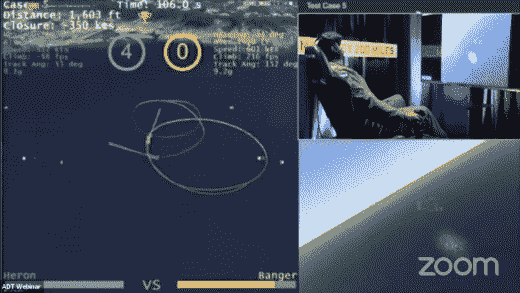
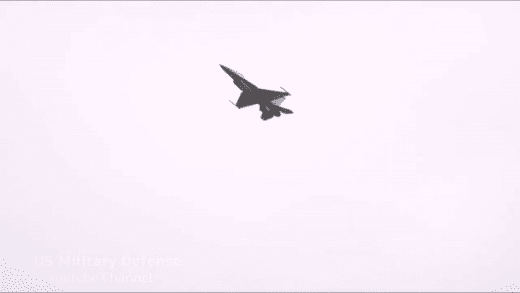

# 人工智能又一次打败了人类

> 原文：<https://towardsdatascience.com/ai-defeats-human-again-fe17ab9ed87c?source=collection_archive---------48----------------------->

## 情报的

## 这一次没有比赛，艾是远远优于

让我们沿着记忆的小路漫步，看看人工智能在面对人类对手的人类挑战中脱颖而出的时刻。

1997 年，世界目睹了国际象棋世界冠军[加里·卡斯帕罗夫](http://www.kasparov.com/)的失败。人工智能在棋盘游戏中的统治地位在 2015 年和 2016 年再次出现，DeepMind 的人工智能系统 alpha GO[击败了职业围棋选手范辉](https://en.wikipedia.org/wiki/AlphaGo_versus_Fan_Hui)和世界冠军围棋选手 Lee Sedol 。

人工智能对人类的统治不仅限于棋盘游戏，2011 年，IBM Watson，一个能够回答琐碎问题的计算机系统[在一场危险游戏中击败了布拉德·鲁特和肯·詹宁斯](https://www.youtube.com/watch?v=P18EdAKuC1U)。

我们可以在人工智能战胜人类的不断增长的清单上再增加一个日期。

# 2020 年 8 月 20 日，人工智能在模拟空战中击败人类 F-16 喷气式战斗机

DARPA alpha dog fight****是一系列测试 AI 算法执行格斗机动、战斗和策略的能力的试验。****

****决赛于 2020 年 8 月 18 日至 20 日在八个团队之间举行，获胜团队 Heron Systems AI 与一名人类战斗机飞行员对决。****

********

****[Banger(人类)vs Heron(AI)模拟缠斗](https://www.youtube.com/watch?v=NzdhIA2S35w)。****

****DARPA 的 AlphaDogFight 的目的是找到开发人工智能系统的方法，可以将空战和机动的责任从人类飞行员转移到人工智能系统。不可避免地在飞行系统中建立对人工智能的信任。****

****人类飞行员被命名为“Banger ”, Herons 系统的人工智能被命名为“Heron”。Heron 和 Banger 之间的对峙发生在模拟环境中，两名飞行员都控制着一架 F-16 战斗机。****

****这最后的挑战旨在测试苍鹭的机动能力、战斗系统和对人类对手的决策能力。挑战持续了五轮，人工智能飞行员 Heron 以无可争议的方式击败了 Banger。****

****该赛事的评论员预测，邦格和海伦之间的对决将是“一场势均力敌的战斗”。****

****在所有回合之后，Heron 在所有五轮挑战中都取得了完美的胜利。****

****据解说员称，Heron 表现出超人的能力，能够非常准确地射击和瞄准，同时表现出高度动态的机动性。****

> ****“显示出超人的能力”****

****在一些回合中，Banger 改变了战术和策略，以便在与 Heron 的比赛中占据上风。在上一轮比赛中，Banger 的战术变化导致了一轮比赛，突出了 Heron 能力的一些限制。这一轮仍以海伦获胜而告终。****

****在所有五轮中，Heron 没有损失任何生命，这意味着 Banger 没有一发子弹击中 Heron 的战斗机。****

# ****把它带回地球****

****尽管 Heron 取得了压倒性的胜利，但人们注意到人工智能系统具有“完美的状态信息”，这意味着人工智能系统具有模拟环境的不间断的定量和视觉数据。****

****在现实世界中，拥有关于环境和其他变量的完整信息并不常见。****

****现实的不可预测性会影响军事力量如何从模拟环境中获取信息和看似“良好”的性能。****

****简单地说，我们不会很快在模拟之外看到任何驾驶 F-16 战斗机的人工智能系统。****

********

****战斗中的 F-16 喷气式战斗机****

****DARPA AlphaDogFight 试验的进步和经验教训将为未来的发展开创先例，这些发展可以带来更可靠的人工智能系统，可以在模拟环境之外与战斗机飞行员携手合作。****

# ****获胜队****

****决赛于 2020 年 8 月 18 日至 20 日举行，有八支队伍参加。在三天的时间里，团队的人工智能系统分别面对其他人工智能算法，然后在循环赛中相互面对。****

****最后一天，前四名的队伍在淘汰赛中对决，获胜的队伍面对人类对手。****

****参与最终 AlphaDogTrial 活动的团队:****

*   ****[极光飞行科学](https://www.aurora.aero/)****
*   ****[EpiSys Science](https://www.episci.com/)****
*   ****[佐治亚理工学院](https://gtri.gatech.edu/)****
*   ****[洛克希德·马丁](https://www.lockheedmartin.com/en-gb/index.html)****
*   ****[Perspecta 实验室](https://www.perspectalabs.com/)****
*   ****[物理测试](https://physics-ai.com/)****
*   ****[SoarTech](https://soartech.com/)****
*   ****获胜团队 [Heron Systems](https://heronsystems.com/)****

********

****[苍鹭系统](https://heronsystems.com/)****

****Heron Systems AI agent 是一种基于深度强化学习的人工智能，它通过在模拟环境中不断训练，获得了超过 30 年飞行时间经验的专业知识。****

****Heron 团队将他们的成功归因于两个主要因素:规模和多样性。****

****他们归因成功的比例成分指的是获胜的人工智能代理能够积累的飞行时间的数量。多样性部分说明了 Heron Systems 开发的相互对抗的人工智能代理的数量；每个代理都有自己独特的神经网络架构、奖励系统和构建。****

****Heron System 的一位发言人表示，该团队的下一步是将人工智能系统整合到可以在现实生活环境中载人的无人机中。****

****[AlphaDogfight 选拔赛决赛完整视频](https://www.youtube.com/watch?v=NzdhIA2S35w)****

# ****我希望这篇文章对你有用。****

****要联系我或找到更多类似本文的内容，请执行以下操作:****

1.  ****订阅我的 [**邮件列表**](https://richmond-alake.ck.page/c8e63294ee) 获取每周简讯****
2.  ****跟我上 [**中**](https://medium.com/@richmond.alake)****
3.  ****通过 [**LinkedIn**](https://www.linkedin.com/in/richmondalake/) 联系我****

**** [## AI 里有黑人吗？

### 我们仍然是人工智能中代表最少的种族之一，然而我们可能会因为它的利用和滥用而遭受最大的痛苦。

towardsdatascience.com](/are-there-black-people-in-ai-fb6928166d73)  [## 根据吴恩达(斯坦福深度学习讲座)，你应该如何阅读研究论文

### 关于如何通过知名人士发表的研究论文获取知识的指导。

towardsdatascience.com](/how-you-should-read-research-papers-according-to-andrew-ng-stanford-deep-learning-lectures-98ecbd3ccfb3)****