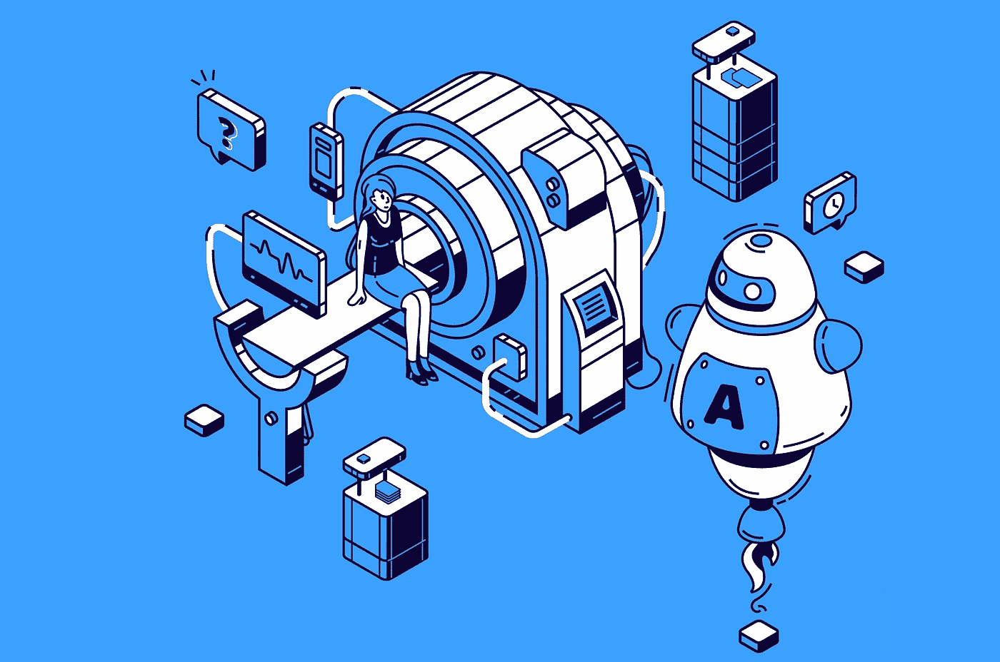
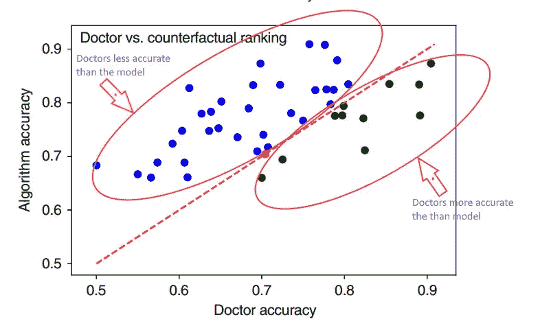

# 研究发现，人工智能现在比你的医生更好地诊断疾病

> 原文：<https://towardsdatascience.com/ai-diagnoses-disease-better-than-your-doctor-study-finds-a5cc0ffbf32?source=collection_archive---------14----------------------->

## 同行评议的研究表明，你很快会咨询机器人医生的第二意见

图片来源: [upklyak](https://www.freepik.com/vectors/people)

电子战研究发现，因果机器学习模型不仅比以前基于人工智能的症状检查器更准确，而且在许多情况下，现在可以超过人类医生的诊断准确性。这主要是由于所使用的方法，这些方法允许在诊断中有更多的“创新”,甚至对更复杂的患者疾病有更高的准确性。

在由来自巴比伦健康和伦敦大学学院的研究人员撰写的[同行评审研究](https://www.nature.com/articles/s41467-020-17419-7#Sec3)中，当任务是诊断真实疾病的书面测试案例时，新模型的得分高于 72%的全科医生。

该报告称，到目前为止，尽管进行了大量的研究工作，诊断算法仍难以达到医生的诊断准确性。这是因为机器学习算法试图遵循与医生在症状检查中相同的过程。但是，如果我们让机器去执行哪怕是最不可能的计算——它们的诊断准确率会比人类高。

通过不遵循与人类诊断相关的更传统和可预测的模式，使用反事实方法的新因果机器学习算法可以自由地运用所有可能性。这是夏洛克·福尔摩斯在诊断中可能尝试的方法:“*当你排除了不可能，剩下的，不管多么不可能，一定是真相*”

> 反事实机器学习算法在定义“如果”时并不局限于人类的极限场景。

在实验中，医生的平均诊断准确率为 71.40%，而标准关联算法的准确率为 72.52%，是研究中排名前 48%的医生。

但新的反事实算法以 77.26%的平均准确率击败了他们两人，使其成为前 25%的医生，并实现了“专家临床准确性”。对于罕见疾病，这些改善甚至更加明显，因为这些疾病的诊断错误更常见，也往往更严重。

# 现在，机器比人更有“创造力”

有人可能会认为，由于无限的存储、即时的历史回忆、对数据的访问和计算速度，机器学习比人类医疗从业者更熟练。然而，在这项研究中，反事实的机器学习算法取得了成功，因为它们比医生更具“想象力”。

本质上，反事实机器学习算法并不局限于人类在定义“如果”时的限制场景。“我们让一个人工智能拥有强大的算法，并赋予它想象交替现实的能力，并考虑‘如果这是一种不同的疾病，这种症状会出现吗’？这使得人工智能能够区分病人疾病的潜在原因，并比超过 70%的医生得分更高，”[巴比伦健康科学家兼该研究的主要作者乔纳森·里奇斯博士说。](https://www.prnewswire.com/news-releases/peer-reviewed-research-shows-babylons-latest-artificial-intelligence-could-help-doctors-improve-diagnosis-particularly-for-complex-cases-301109974.html)

这与典型的人类医生诊断形成对比，在典型的人类医生诊断中，医生“旨在通过确定引起症状的疾病来解释患者的症状。”现有的机器学习算法效仿关联诊断——换句话说，识别与患者症状密切相关的疾病。该研究指出，包括贝叶斯模型和深度学习在内的这些算法基于关联推理(与患者症状和病史的相关程度)来识别疾病。

然而，这项研究中的研究人员将诊断重新定义为“将因果关系与病人的症状分开”像夏洛克一样，反事实可以测试如果某些前提条件不同，特定的结果会发生在哪里。该算法删除了症状的所有可能原因(疾病和外部因素)，然后隔离出唯一可能的原因。

根据这项研究，反事实可以量化疾病假说解释症状证据的程度，方法是确定如果有可能干预和治愈疾病，症状就不会出现的可能性。这个排除过程，不管多么不可能，都会导致更有创造性，更重要的是，更准确的诊断。

# 为什么它很重要

初级保健医生的诊断错误是一个全球性的挑战。根据另一项关于初级保健失误的[研究](https://qualitysafety.bmj.com/content/26/6/484)，仅在美国，每年就有 5%的门诊病人接受错误的诊断。对于病情严重的患者，其中 20%被初级保健医生误诊。其中，三分之一的误诊导致了病人的伤害。

另外，医生超负荷工作，供不应求。据美国医学院协会称，到 2033 年，美国将面临 54000 到 139000 名医生的短缺。其中，随着越来越多的美国人接受门诊治疗，将需要多达 55，200 名初级保健医生。虽然今年 6 月发布，但 AAMC 分析是在 2019 年进行的-在冠状病毒袭击之前。因此，预计的缺口可能会更大。

在全球范围内，对医疗保健可及性的关注是最重要的。“世界上有一半的人几乎享受不到医疗保健，”[Babylon 首席执行官兼创始人 Ali Parsa 博士说](https://www.prnewswire.com/news-releases/peer-reviewed-research-shows-babylons-latest-artificial-intelligence-could-help-doctors-improve-diagnosis-particularly-for-complex-cases-301109974.html)“人工智能将成为一个重要的工具，帮助我们所有人结束医疗保健分配不均的不公平现象，让地球上的每个人都更容易获得和负担得起。”

# 这项研究

在这项研究中，20 名全科医生创建了 1671 个名为 vignettes 的现实书面医疗案例，其中包括 350 多种疾病的典型和非典型症状。这些小插图模拟了一种疾病的典型表现，可能包括病史、症状和人口统计信息，如年龄和性别。为了模拟真实世界的条件，该列表并不详尽。

每个短片都由一名医生创作，并由其他几名医生验证是否“真实”。每个医生都有资格至少达到全科医生的水平，或相当于委员会认证的初级保健医生。

经过验证后，44 名全科医生(一个单独的小组)每个人都提供了至少 50 例(平均 159 例)进行评估。然后，通过在诊断简介中包含实际疾病的患者比例来衡量它们的准确性。

两个版本的人工智能被用于与全科医生进行比较——一个基于当前标准的算法使用相关性，以及新的反事实因果模型。

# 结果呢

医生的准确率在 50–90%之间，平均得分为 71.40%。旧的相关算法的表现与普通医生相当，达到 72.52%，位于前 48%的医生中。

新的反事实算法实现了 77.26%的准确率，高于医生的 32，等于 1，低于 11。这一分数使其在人类群体中排名前 25%，根据该研究，“达到了专家临床准确性。”

对于包括罕见疾病、复杂病例或混杂因素在内的较难的小插曲，反事实算法继续表现出色。在这些情况下，与关联算法相比，该算法为 29.2%的罕见疾病和 32.9%的非常罕见疾病提供了更好的诊断。

医生与算法患者诊断准确性(来源数据:Richens，J.G .，Lee，C.M. & Johri，S. [利用因果机器学习提高医疗诊断的准确性](https://doi.org/10.1038/s41467-020-17419)

上图用图形表示了算法与医生准确度的关系。线上的蓝色点对应于比算法实现的准确度低的医生，线下的绿色点显示医生比模型更准确的地方。红点指出了医生和机器学习算法达到相同精度的地方。

该研究进一步证明，更简单的医疗案例集导致更高的医生准确性分数，而更复杂的插图导致更高的机器学习分数。

# 第二种意见，问 Bot 医生？

医生担心被机器取代吗？一位参与这项研究的全科医生说，还没有。“我很兴奋有一天这个人工智能可以帮助我和其他医生减少误诊，腾出我们的时间，帮助我们专注于最需要护理的病人，”Tejal Patel 博士说。“我期待这种类型的工具成为标准，帮助我们增强我们的工作。”

该模型尚未用于商业应用，Parsa 承认，“这不应该被耸人听闻地称为机器取代医生，因为真正令人鼓舞的是，我们终于获得了允许我们提高现有医疗保健系统覆盖范围和生产力的工具。”所以这些工具可以用来增强混合场景，人加机器。

考虑到在这项研究中，医生倾向于在具有简单插图的病例集中实现比机器学习算法更高的准确性。相比之下，对于更复杂的场景，反事实算法比医生实现了更高的准确性。由于病例复杂性之间的反比关系，该研究表明，诊断算法是“对医生的补充，在医生错误更常见的情况下，该算法表现更好，反之亦然。”

这项研究甚至进一步假设:因果和反事实推理可以应用于医学诊断以外学科的机器学习方法吗？另一位研究作者、伦敦大学学院讲师 Ciaran Lee 博士认为是这样的。“这种方法有巨大的潜力来改善其他所有当前的症状检查器，但它也可以应用于医疗保健和其他领域的许多其他问题——这就是为什么因果人工智能如此令人印象深刻，它是普遍的，”Lee 说。

现有的机器学习算法已经开始接近或略微超过人类健康从业者的效率。现在，富有想象力的反事实分析进一步超过了健康从业者的准确性。研究人员指出，未来的实验可以专注于确定混合方法对提高患者诊断准确性的有效性。所以你的医生可能很快就会向机器人医生寻求第二种意见。研究作者假设，很可能“医生和算法的联合诊断比单独诊断更准确。”