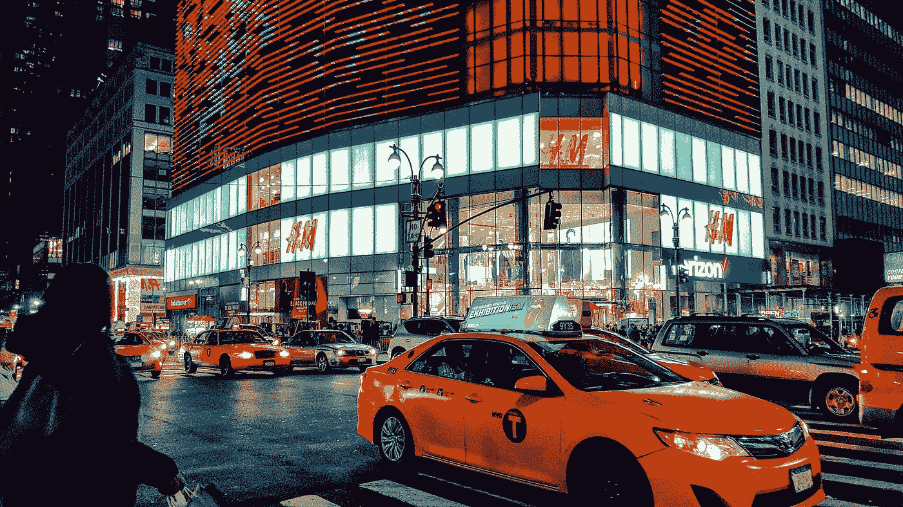
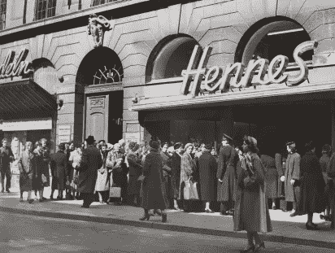
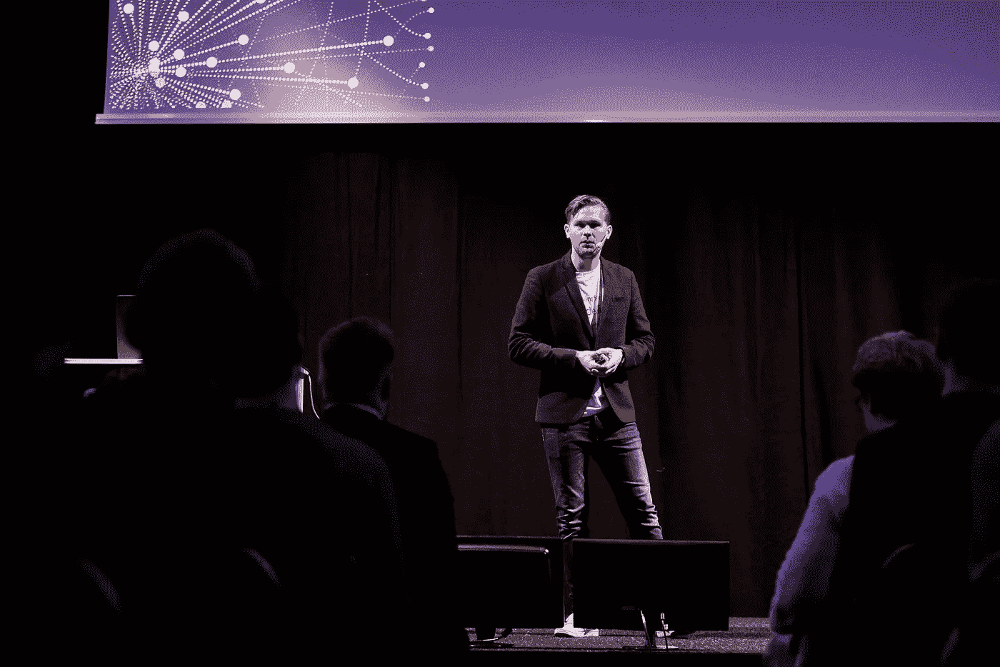
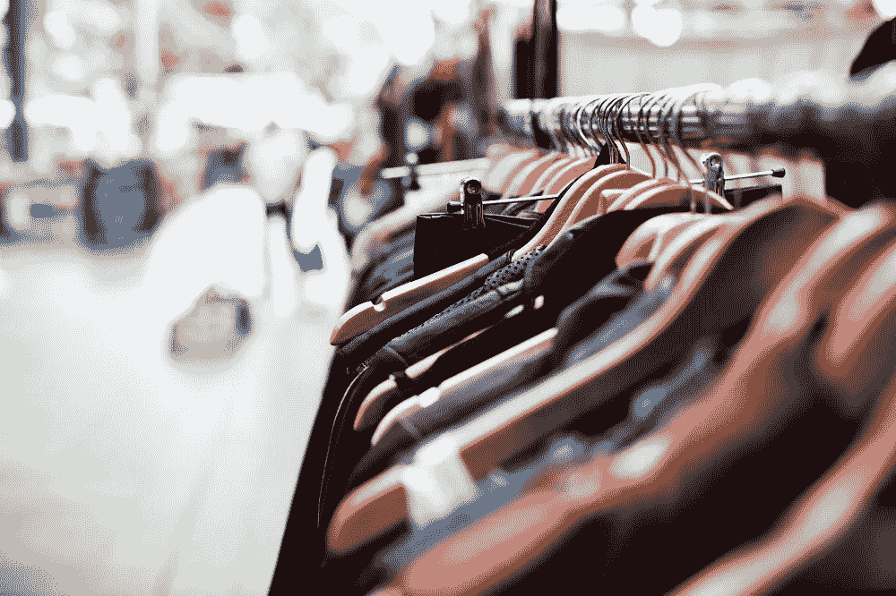
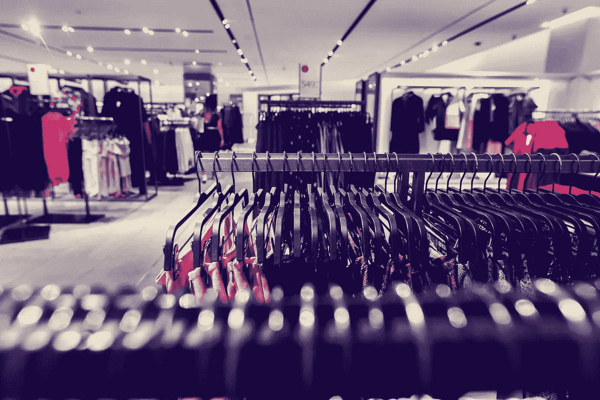

# 人工智能驱动的零售:H&M 集团是如何做到的

> 原文：<https://towardsdatascience.com/ai-driven-retail-how-h-m-group-does-it-c9606597f7bc?source=collection_archive---------20----------------------->

## 零售业中的人工智能:H&M 案例研究

图片由 exels.com[的](https://www.pexels.com/photo/architecture-art-building-business-296492/)Ibrahim Boran 拍摄

[时尚零售商](https://read.hyperight.com/what-we-can-learn-from-aldos-battle-tested-data-governance-story/)越来越多地求助于人工智能(AI)来满足顾客的需求。人工智能驱动的零售使品牌能够在 21 世纪的经济中竞争，并通过个性化的购物体验来满足现代客户的需求。

随着越来越多的零售公司将其业务从传统的实体零售店转向电子商务，他们能够更深入地了解客户的偏好，以满足需求。

谈论零售中的人工智能将我们带到了时尚行业最受欢迎的品牌之一——H & m。

## H&M 集团和他们人工智能驱动的故事

H&M 集团一直在人工智能方面进行大量投资，以保持在时尚周期的顶端，并支持其大规模增长。

自 1947 年成立以来，这家时装零售商一直在欧洲、美国和全球范围内快速扩张。早在 1998 年，他们就开始在网上销售。

照片由 [H & M 组](https://hmgroup.com/)拍摄

仅在 2004 年，H&M 就拥有 1000 多家店铺，这一数字呈指数级增长，在全球 72 个国家拥有近 5000 家店铺。截至今天，这家零售巨头雇佣了 177，000 名员工，并为其供应商雇佣的员工提供了 160 万个工作岗位。

但是，一个品牌经理如何保持这种增长，跨越不同的国家、市场甚至大洲？他们如何确保满足如此庞大的购物需求和期望各异的顾客群的需求？最重要的是，他们是如何管理全球数千家店铺的？

对所有这些问题都有答案的人是 H & M Group 的产品领域首席工程师 AI Foundation Errol Koolmeister。他在 2019 年 [**数据创新峰会**](https://datainnovationsummit.com/) 上的讲话中解释说，他们在 2016 年首次开始在业务中采用人工智能。数字化的影响是显而易见的，H & M 集团知道他们必须做些什么来保持相关性。“我们，作为一个公司，作为一个人，开始越来越多地上网”，Errol 描述道。

Hyperight AB 在[数据创新峰会](https://datainnovationsummit.com/#gallery)上的照片/版权所有

埃罗尔表示:“我们开始发现，拓展实体店的商业模式变得相当困难。”。显而易见的解决方案是，他们需要人工智能来维持增长。

## 人工智能驱动的零售的到来

意识到他们必须适应新的产业转移，H&M 集团问他们自己一个问题“作为一个公司，我们想去哪里？”这时，零售品牌意识到他们需要在人工智能和高级分析方面提升自己的水平。尽管他们在一些部门表现出色，比如 CRM，但他们知道他们还没有达到规模化。

这是他们开始进行第一次概念验证的时刻。埃罗尔解释说:“我们试图看看是否能从它们身上提取任何价值。幸运的是，H&M 集团挑选的用例是成功的，可以投入生产，使它们盈利。

“这一切都是为了快速行动，”他继续说道。埃罗尔表示:“如果我们在 2016 年只是说让我们做一个概念证明，然后就停止了，那就没有价值可言。”。不幸的是，90%的其他案例都是这样，他们只是做了概念验证，并没有继续生产。

视频由[hyperlight AB](https://hyperight.com/)——[人工智能驱动的零售——埃罗尔·库尔迈斯特，H & MxAI](https://hyperight.com/out?url=https%3A%2F%2Fyoutu.be%2F9RmWXsxG8iM)

事实证明，H&M 集团的成功之处在于，他们在 2016 年就已经专注于生产。他们下定决心，如果他们要从人工智能开始，他们就要大干一场。Errol 强调说:“这实际上是从小处着手，大处着眼，快速扩展”。根据他的说法，在现实中，没有人工智能用例，它们都是商业案例。H&M 集团实际上使用人工智能来扩大他们的商业解决方案。

H&M 集团的用例有不同的成熟度等级。但不管情况如何，他们始终专注于生产。因此，他们有一个定义好的过程来实现用例:

*   概念验证(POC)——这并不需要很长时间就能实现，因为正如 Errol 解释的那样，他们已经有了自己的数据湖，随时可以使用。这使他们能够在几周内启动虚拟机并获得洞察力。如果 POC 成功，则进入下一阶段。
*   试点——H&M 集团在几个市场试点该解决方案，以测试理论是否符合现实。他们将该案例投入生产，进行测试并评估结果。如果试点成功，他们将推出解决方案。
*   工业化和推广—流程的最后一步是向所有 72 个国家、177，000 名员工和近 5，000 家商店推广该解决方案。考虑到用户的数量，解决方案必须非常可靠。

## 人工智能驱动的零售的真实 H&M 集团例子

图片来源:[人工摄影](https://unsplash.com/@artificialphotography?utm_source=medium&utm_medium=referral)在 [Unsplash](https://unsplash.com/photos/vB5qtt8X4NA)

这里有一些由于实施人工智能解决方案而产生的具体例子。

**保持流行商品的库存** — H & M 依赖于保持对潮流的领先才能获得成功。在算法的帮助下，他们分析商店收据和退货，以评估每个商店的购买情况。这样，时尚品牌就知道在某些地方应该促销和储备哪些商品。

预测市场需求——像 H & M 这样的时尚零售商依赖价格有竞争力的新鲜产品。数据洞察有助于 H & M 预测市场需求，这样他们就不必打折出售库存。

**自动化仓库** —如今，客户期望随时随地获得快速、无障碍的交付。因此，H & M 集团投资了自动化仓库，最终将为大多数欧洲市场提供次日送达服务。这些仓库和它们的免费运输，只对忠诚的客户开放，是由算法和数据驱动的。

**个性化的线下顾客体验** —借助 RFID 技术，H & M 也在其实体店推出了个性化的在线推荐。顾客获得由算法选择的店内商品建议。他们还可以查看他们在网上看到的商品在实体店中是否有售，并扫描标签以查看该商品在另一家商店或网上是否有售。

**定制服装** — [这家瑞典时尚品牌与一个人工智能技术平台](https://hmgroup.com/media/news/general-news-2019/the-laboratory-and-h-m-germany-collaborate-on-a-limited-collecti.html)合作，测试了按需生产，这显示出更具体地响应客户愿望以及根据当地需求调整产品数量的巨大潜力。

[Artem Beliaikin](https://unsplash.com/@belart84) 在 [Unsplash](https://unsplash.com/photos/-rHdyWZkySU) 上的照片

## H&M 集团的故事有什么启示？

在当今的数字化世界，单靠人力管理像 H&M 这样的全球零售品牌是不可能的。在人类能力终结的地方，人工智能开始了。以 H&M 集团人工智能驱动的零售为例，零售商可以通过在业务中实施人工智能来提高人类智能，从而受益匪浅:更准确的商品决策，简化的供应链和顶级的客户体验。这就是 H&M 集团所说的放大智能——机器和人类、科学和艺术、数据和直觉之间的合作。

*本文原载于 Hyperight.com***。**