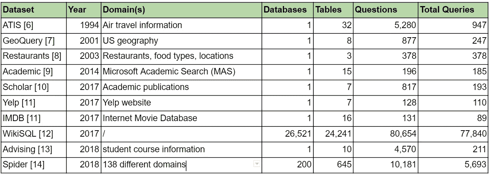
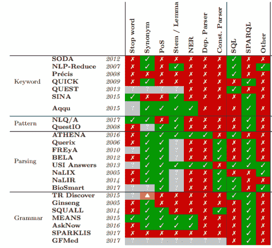
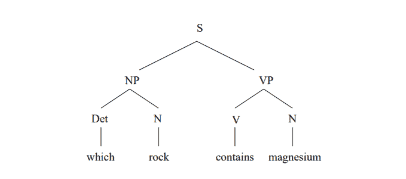
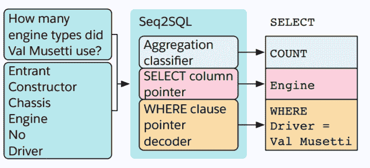
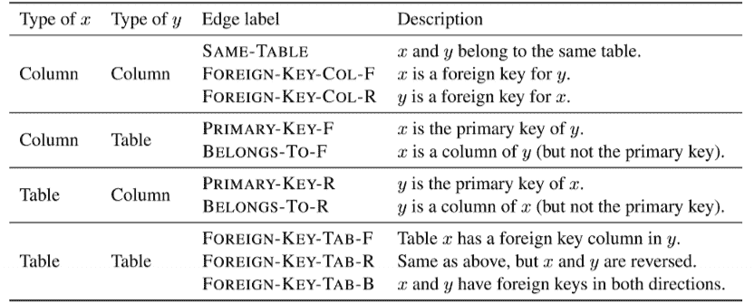
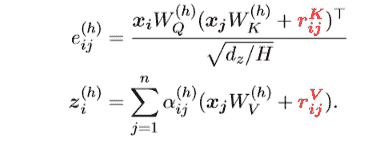
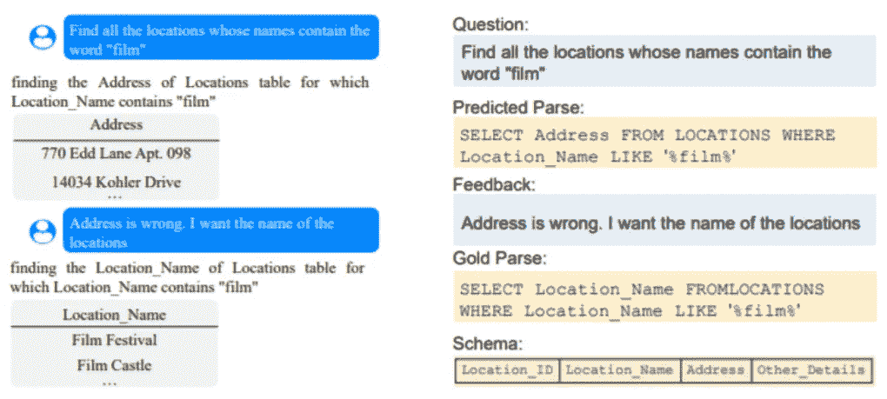

# 使用分析表进行人工智能对话

> 原文：<https://towardsdatascience.com/ai-enabled-conversations-with-analytics-tables-66a10c9a3d05?source=collection_archive---------21----------------------->

## [理解大数据](https://towardsdatascience.com/tagged/making-sense-of-big-data)

## 将自然语言数据库查询转换为 SQL 代码的人工智能进展综述

*作者* [*Gowtham R*](https://www.linkedin.com/in/gowtham1/) *和*[*Sundeep Teki*](http://sundeepteki.org)*2020 年 11 月 1 日*

照片由[卡斯帕·卡米尔·鲁宾](https://unsplash.com/@casparrubin)****[Unsplash](https://unsplash.com/photos/fPkvU7RDmCo)****

# ******1。简介******

****近年来，驱动不同行业及其系统的数据量呈指数级增长。大多数商业信息以关系数据库的形式存储，关系数据库存储、处理和检索数据。数据库为多个行业的信息系统提供支持，例如，消费技术(例如，订单、取消、退款)、供应链(例如，原材料、股票、供应商)、医疗保健(例如，医疗记录)、金融(例如，金融业务指标)、客户支持、搜索引擎等等。****

****现代数据驱动型公司必须跟踪其业务的实时状态，以便快速了解和诊断数据中出现的任何问题、趋势或异常，并立即采取纠正措施。这项工作通常由业务分析师手动执行，他们用 SQL 等声明性查询语言编写复杂的查询，以获得存储在多个表中的业务洞察力。这些结果通常以图表或图形的形式进行处理，以使领导团队能够快速可视化结果并促进数据驱动的决策制定。****

****尽管解决基本业务指标的最常见的 SQL 查询已被预定义并合并到像 PowerBi 这样的商业产品中，这些产品能够洞察业务指标，但是任何新的或后续的业务查询仍然需要由分析师手动编码。数据库查询和相应结果的消费之间的这种静态交互需要耗时的人工干预，并导致缓慢的反馈周期。让非技术业务领导通过抽象出底层 SQL 代码的自然语言查询直接与分析表进行交互，效率要高得多。****

****定义 SQL 查询需要对数据库模式、SQL 语法有很强的理解，对于初学者和非技术利益相关者来说很快就会变得不知所措。弥合这一沟通鸿沟的努力导致了一种新型处理的发展，这种处理被称为数据库自然语言接口。随着微软[1][2]、Salesforce [3][4]和其他公司正在开发自然语言(NL)到 SQL ( **NL2SQL)** 的类似技术，这种自然搜索功能近年来变得越来越流行。当答案可以在不同的数据库或表格中找到时，转换后的 SQL 还可以使 Alexa、Google Home 和其他虚拟助手改善他们的响应。本博客将回顾 NL2SQL 的挑战、评估方法、数据集、不同方法和一些最先进的深度学习方法。****

********

****图一。从 WikiSQL 数据集转换为 SQL 的 NL 查询示例([来源](https://arxiv.org/pdf/1711.04436.pdf))****

********

****图二。涉及多个表的 NL2SQL 示例( [source](https://arxiv.org/pdf/1906.11790.pdf) )****

# ****2.技术挑战****

## ****2.1 理解 NL 查询并将话语与图式对齐****

****系统必须理解用户的问题和表模式(列、表名和值)，才能将查询正确地映射到 SQL。这里的一个关键挑战是理解 DB 表的结构化模式(例如，列的名称、数据类型和存储值)以及**输入查询和模式**之间的对齐。例如，对于问题，*哪个国家的 GDP 最大？*，模型需要将 GDP 映射到国内生产总值列。有时这个问题可能还需要理解列的语义，而不仅仅是列名。****

********

****图 3。一些查询可能需要理解单元格值([源](https://arxiv.org/pdf/2005.08314.pdf))****

****对于图 3 所示的表格和问题，用于回答示例问题的*场馆*栏指的是*主办城市*。因此，该模型需要将查询中的“city”与表中的 venue 列对齐。****

## ****2.2 跨领域推广****

********

****图 4。跨域设置中可能出现的错误示例([来源](https://www.aclweb.org/anthology/2020.acl-main.742.pdf)****

****为不同的领域收集大量的训练数据是昂贵且不可扩展的。因此，训练系统以推广到不同的领域和数据库是很重要的。这种概括将涉及识别新的实体、在 SQL 查询中正确地映射看不见的短语和实体，以及处理新颖的数据库和查询结构(更大的表、SQL 组件的组合等)。)[5].****

## ****2.3 订单事项问题****

****解决 NL2SQL 任务的标准方法之一是使用 [seq2seq](https://d2l.ai/chapter_recurrent-modern/seq2seq.html?highlight=sequence%20sequence) (因为 NL 查询和 SQL 都是序列)模型及其变体。这种方法的一个问题是，由于交换和关联属性，不同的 SQL 查询可能彼此等价。****

********

****图 5。两种方式编写相同的 SQL 查询([来源](https://arxiv.org/pdf/1711.04436.pdf)****

****在上面的例子中，我们看到，即使交换了 WHERE 条件，也会产生相同的结果，但是从语法上看，两个查询是不同的。如果我们将前者作为基本事实，而 seq2seq 模型预测后者，那么它将受到惩罚。****

# ****3.数据集****

********

****表 1。NL2SQL 的一些表格数据集概述([来源](https://www.researchgate.net/publication/343021594_Recent_Advances_in_SQL_Query_Generation_A_Survey))****

****NL2SQL 任务有几个数据集。这些包含带注释的 NL 问题，对应于一个或多个表的 SQL 对。这些数据集在*域*(单个域与跨域)*大小*(查询数量——这对于正确的模型评估至关重要)，以及*查询复杂性*(单表与多表)方面有所不同。****

****像 ATIS、GeoQuery 这样的早期数据集关注于单个域，并且在查询数量方面也是有限的。一些最新的数据集，如 WikiSQL、Spider，是跨域的，并且与上下文无关，具有较大的规模。WikiSQL 和 Spider 的一个显著区别是查询的复杂性。WikiSQL 中的查询更简单(只包含 SELECT 和 WHERE 子句)。此外，WikiSQL 中的每个数据库只是一个简单的表，没有任何外键。Spider 包含适度数量的查询，并包含涉及表连接和嵌套查询的复杂问题。SParC[15]和 CoSQL[16]是 Spider 数据集的扩展，它们是为上下文跨域语义解析和会话对话文本到 SQL 系统而创建的。****

# ****4.评估方法****

****评估 NL2SQL 系统最常用的方法是**执行精度**和**逻辑形式精度**。****

****执行准确性将预测 SQL 查询执行后的结果与基本事实查询的结果进行比较。这种方法的一个缺点是，可能有一个不相关的 SQL 查询与问题不对应，但仍然给出了正确的答案(例如，NULL result)。****

********

****图 6。SQL 规范化示例(图片由作者提供)****

****逻辑形式准确性将预测 SQL 查询的精确字符串匹配与基本事实查询进行比较。这一指标的局限性在于，它会错误地惩罚那些在执行时产生正确结果，但与真实 SQL 查询没有精确字符串匹配的预测。解决排序问题的一种方法是在比较之前对 SQL 查询进行规范化。SQL 规范化是一种通过对 SELECT 中的列、FROM 中的表和 WHERE 约束进行排序以及标准化表别名、大写和符号间的间距来使计算保持一致的方法。****

****Spider [19]的作者使用**组件匹配**，它测量不同 SQL 组件(如 SELECT、WHERE、GROUP BY 等)上预测和真实情况之间的平均精确匹配。预测和基本事实被解析和分解成子组件，然后按组件计算它们的精确匹配。****

****例如，要评估选择组件:****

*****选择 avg(col1)，max(col2)，min(col1)* 分解为*集合(avg，min，col1)，(max，col2)*****

****然后将该集合与地面真实集合进行比较。****

********

****图 7。来自 Spider 数据集的样本问题按硬度分类([来源](https://arxiv.org/pdf/1809.08887.pdf))****

****尽管这解决了排序问题，但它仍然没有考虑预测何时使用不同的逻辑(与基本事实 SQL 相比)来获得相同的结果。因此，为了进行彻底的评估，还应该使用执行精度。****

****[19]中的作者还根据 SQL 组件、选择和条件的数量，通过硬度 T10 对查询进行分类。这种分类非常有助于更深入地了解模型在查询复杂性方面的性能。****

# ****5.NL2SQL 的不同方法****

********

****图 8。NLIs 的分类和使用的 NLP 技术([来源](https://arxiv.org/pdf/1906.08990.pdf))****

## ****5.1 基于规则的方法****

****大多数现有方法集中于结合歧义检测的自然语言的基于规则的解析器。一些基于规则的系统使用触发词来*识别用户问题中的模式*。例如，“by”是聚合查询中常用的词，如“列出由<导演>执导的电影”。这里，触发词的左侧可能有 SELECT 子句所需的关键字，右侧有 GROUP BY 子句所需的关键字。****

********

****图 9。从国家表中匹配国家资本的简单模式([来源](https://arxiv.org/pdf/cmp-lg/9503016.pdf)****

****尽管这种方法很简单，但它(如果规则是格式良好的)已经被证明可以处理非常广泛的查询类型。Siri 和 Cortana 等现代对话代理遵循类似的原则，尽管规则不是确定性的，而是基于训练的(意图的逻辑回归分类器)。****

## ****5.2 基于语法的系统****

****在基于语法的系统中，用户的问题被解析，得到的解析树被直接映射到 SQL 中的表达式。创建可以描述用户问题的可能句法结构的语法。****

********

****图 10。过于简单的语法([来源](https://arxiv.org/pdf/cmp-lg/9503016.pdf))****

****图中所示的过于简单的语法认为用户的问题由名词短语和动词短语组成；名词短语由一个限定词后跟名词组成，限定词由“什么”或“哪个”等词组成。****

********

****图 11。解析“哪种岩石含有镁？”后得到的解析树用上面的语法([来源](https://arxiv.org/pdf/cmp-lg/9503016.pdf))****

****这个语法可以用来分析一个问题，比如“哪种岩石含有镁？”然后将得到的解析树映射到 SQL。这种到 SQL 的映射将由规则执行，并且完全基于解析树的语法信息。****

## ****5.3 基于深度学习的方法****

****基于规则的方法在*覆盖范围、可伸缩性和自然性*方面受到限制。它们对自然语言的多样性也不够健壮，并且很难跨域扩展。大规模监督数据集的出现，如 WikiSQL、Spider 等。、自然语言处理的进展、[预处理](https://d2l.ai/chapter_natural-language-processing-pretraining/bert.html#sec-bert)【20】等。已经使深度学习模型能够在 NL2SQL 任务中实现最先进的结果。****

****几乎所有的深度学习模型都使用[编码器-解码器【21】](https://d2l.ai/chapter_recurrent-modern/encoder-decoder.html)模型从自然语言输入中生成 SQL 查询。编码器可能是【22】/【24】或最近的[变压器](https://d2l.ai/chapter_attention-mechanisms/transformer.html)【25】网络。大多数模型的不同之处在于它们对模式的编码方式(表名、列名、单元格值等)。)以及它们如何产生 SQL 输出。****

****一些模型将模式作为其输出词汇表的一部分。换句话说，他们把所有的表名、列名等。，并在解码 SQL 输出时，从词汇表中选择这些单词。NSP[10]，DBPAL[18]是使用这种方法的一些方法。这种方法的一个主要限制是**我们不能使它们适应跨域，因为它们不能在输入中编码新的模式**。****

********

****图 12。Seq2SQL 模型的组件，将问题、列名和 SQL 标记作为输入([源](https://arxiv.org/pdf/1709.00103.pdf))****

****相比之下，SEQ2SQL[3]等其他方法使用模式作为模型的输入，在解码时，使用[指针网络](/understanding-pointer-networks-81fbbc1ddbc8)【26】使用输入中提到的表或列名。例如，在 SEQ2SQL[3]中，作者使用了列名、问题标记和 SQL 标记，如 SELECT、WHERE、COUNT、MIN、MAX 等。作为输入。他们的指针网络通过专门从这个扩充的输入序列中选择来产生 SQL 查询。作者还声称，除了限制输出空间之外，这种增强的指针网络还产生了更高质量的 WHERE 子句。****

********

****图 13。指针网络示例([来源](https://www.researchgate.net/publication/318488414_End-to-End_Information_Extraction_without_Token-Level_Supervision))****

****基于从自然语言输入生成 SQL 查询，存在三种类型的模型:[序列到序列](https://d2l.ai/chapter_recurrent-modern/seq2seq.html?highlight=sequence%20sequence)，序列到树，以及[槽填充](https://en.wikipedia.org/wiki/Semantic_role_labeling)【23】。序列对序列模型将 SQL 生成为单词序列。序列到树模型生成预测 SQL 查询的语法树。槽填充方法将 SQL 查询视为一组槽，然后使用每个槽的相关解码器对整个问题进行解码。基于语法的解码器的一个优势是**它们可以在每一步检查语法错误，产生带有连接、嵌套查询等的复杂查询。没有任何语法错误**。****

## ****5.4 现代深度学习方法****

****现代深度学习方法使用更多技术来学习 NL 问题和表格中呈现的结构化信息的联合表示。他们使用各种[基于注意力的](https://d2l.ai/chapter_attention-mechanisms/index.html)架构进行问题/模式编码，使用[基于 AST](https://ruslanspivak.com/lsbasi-part7/) 的结构架构(序列到树)进行查询解码。IRNet [1]，RAT-SQL(当前 spider 中的 SOTA 方法)[2]使用[BERT](https://d2l.ai/chapter_natural-language-processing-pretraining/bert.html#sec-bert)【21】(用于 NL 表示)以及内部策略对表中的结构化信息进行编码。相比之下，TaBERT[27]使用通用的预训练方法来学习自然语言句子和表格数据的表示。这些技术包括模式链接、更好的模式编码、使用 DB 内容(单元格值而不仅仅是列名和表名)、问题和模式表示的上下文化。****

## ****5.4.1 模式链接****

********

****图 14。RAT-SQL 中的模式链接(问题到列和表的链接)([源](https://arxiv.org/pdf/1911.04942.pdf))****

****这包括将问题中的实体引用与正确的模式列或表对齐。文本匹配是问题-模式对齐的最佳证据，它可能直接有利于编码器。链接一般是通过 IRNet 和 RAT-SQL 中的字符串匹配来完成的。问题中的 n 元语法(长度最大为 5 或 6)用于匹配模式中的列名或表名(包括完全匹配和部分匹配)。链接后，IRNet 用相应实体的类型(表名/列名等)标记问题中提到的每个实体。)一边编码。基于 n 元语法与问题单词的重叠，列名也被分配了精确匹配和部分匹配类型。另一方面，RAT-SQL 用问题单词和列/表名作为节点构建一个图，边是问题-列-M、问题-表-M 等。，其中 M 是 EXACTMATCH、PARTIALMATCH 或 NOMATCH 之一。****

********

****图 15。IRNet 中的模式链接([源](https://arxiv.org/pdf/1905.08205.pdf)****

## ****基于价值的链接****

****自然语言问题也可以提到值(如“对于 4 缸汽车，哪种型号的马力最大”中的“4”)，它将作为某个表中的单元格值出现。IRNet 在[知识库](https://www.conceptnet.io/)中查找问题中提到的值，并在返回的结果中搜索部分或完全匹配的列名。根据匹配情况，为列名分配类型值完全匹配和值部分匹配。另一方面，如果问题单词作为一个值出现在列中，RAT-SQL 会在问题单词和列名之间添加一个边缘列值。****

****TaBERT 直接使用 DB 内容，而不是链接和使用列名。作者认为*内容提供了关于列语义的更多细节，而不仅仅是列名*、*，后者可能有歧义*。他们选择一个*内容快照*，该快照仅包含几行根据字符串匹配(n-gram 重叠)与 NL 问题最相关的内容。****

## ****模式编码****

********

****图 16。具有多个表格的示例图表模式([源](https://arxiv.org/pdf/1906.11790.pdf)****

****这包括对数据库中的关系结构进行编码。在具有多表关系的数据库中(对主键、外键等进行编码)，这更具挑战性。是必不可少的)。IRNet 对列和表进行编码，以获得列和行的表示。这些列由列名及其类型表示，它们是通过模式链接定义的。最终的表示是通过添加列名嵌入、上下文嵌入(基于问题中匹配的 n 元语法)和类型嵌入来创建的。****

********

****图 17。RAT-SQL 模式图中的边类型([来源](https://arxiv.org/pdf/1906.11790.pdf)****

****RAT-SQL 将模式表示为以列和表为节点的有向图。这些边由上图中详述的数据库关系定义。****

## ****5.4.4 问题和模式表示的上下文化:****

****这有助于学习有效的联合表达。RAT-SQL 通过在问题词和模式链接后定义的模式实体之间添加边来扩充模式图。他们引入了一个关系感知[自我关注](https://d2l.ai/chapter_attention-mechanisms/transformer.html#multi-head-attention)【25】层来使用输入中的关系结构，并学习序列元素之间的“软”关系。它们通过提供一种交流已知关系(如主键、外键等)的方式来做到这一点。在边缘标签中定义)的方法。****

********

****图 18。 **rij** 对已知的关系进行编码，并添加到自我关注方程中([来源](https://arxiv.org/pdf/1906.11790.pdf))****

# ****6.结论和未来趋势****

********

****图 19。整合人类反馈以改进 NL2SQL 系统的示例([来源](https://arxiv.org/pdf/2005.02539.pdf))****

****在这篇博客中，我们回顾了 NL2SQL 的最新发展水平——问题陈述、挑战、此类系统的评估以及解决该任务的现代机器学习技术。最近的工作还集中在改善用户在使用这种系统时的体验。Photon [4]是一个灵活的系统，支持 NL 问题和 SQL 输入。它还有一个困惑检测模块，可以检测无法回答的问题，并帮助用户解释一个问题以获得正确的答案。[28]中的作者还表明，纳入人类反馈可以进一步提高这些系统的准确性和用户体验(见图 19)。****

********

****图 20。展示 NL2SQL 系统可解释性的示例([来源](http://dmkd.cs.vt.edu/papers/WWW20.pdf))****

****尽管现代 NL2SQL 技术在基准测试集上取得了良好的准确性，但它们在生产环境中仍远未表现出稳健的性能。在商业决策的背景下，培养和建立用户对这种系统的信任对于实现可靠的性能是至关重要的。NL2SQL 方法有可能显著提高人类分析师的效率，因此他们可以将更多的时间集中在结果的上下文解释和验证上。现代端到端深度学习系统的输出缺乏可解释性，尽管有关于人工智能系统如何在引擎盖下工作的重要研究，但将人纳入环中以提供反馈并提高预测能力将加速 NL2SQL 系统在现代数据驱动的组织中的采用和使用。****

# ****7.参考****

****[1]郭，，等.“跨域数据库中复杂文本到 sql 的中间表示研究”(2019) arXiv 预印本 arXiv:1905.08205****

****[2]王，白林等，“Rat-sql:文本到 sql 解析器的关系感知模式编码和链接”(2019) arXiv 预印本 arXiv:1911.04942****

****[3]钟、维克托、、熊和理查德·索彻。" Seq2sql:使用强化学习从自然语言生成结构化查询."(2017) arXiv 预印本 arXiv:1709.00103****

****[4]曾，吉川等，“光子:一个健壮的跨域文本到 SQL 系统”(2020) arXiv 预印本 arXiv:2007.15280****

****[5] Suhr，Alane 等人，“探索跨数据库语义解析的未探索的泛化挑战”(2020)计算语言学协会第 58 届年会会议录。****

****[6] Dahl，Deborah A .等人，“扩大 ATIS 任务的范围:ATIS-3 文集”(1994)人类语言技术:1994 年 3 月 8 日至 11 日在新泽西州普兰斯伯勒举行的研讨会会议录。****

****[7]唐、拉普昂和雷蒙德·穆尼。"在归纳逻辑编程中使用多子句构造函数进行语义分析."(2001)欧洲机器学习会议。施普林格，柏林，海德堡，2001。****

****[8]唐、拉普昂和雷蒙德·穆尼。"数据库接口的自动构建:整合语义分析的统计和关系学习."(2000)关于自然语言处理和超大规模语料库的经验方法的联合 SIGDAT 会议。****

****[9]李、费和 H. V .贾加迪什。"为关系数据库构建交互式自然语言界面."(2014)VLDB 基金会会议录 8.1:73–84。****

****[10] Iyer，Srinivasan 等人，“从用户反馈中学习神经语义分析器”(2017) arXiv 预印本 arXiv:1704.08760****

****[11] Yaghmazadeh，Navid 等，“SQLizer:从自然语言中进行查询合成”(2017)美国计算机学会程序设计语言会议录 1。OOP SLA:1–26。****

****[12]钟、维克托、、熊和理查德·索赫尔。" Seq2sql:使用强化学习从自然语言生成结构化查询."(2017) arXiv 预印本 arXiv:1709.00103****

****[13] Finegan-Dollak，Catherine 等人，“改进文本到 sql 的评估方法”(2018) arXiv 预印本 arXiv:1806.09029****

****[14]俞，陶，等.“Spider:面向复杂跨领域语义分析和文本到 sql 转换的大规模人工标注数据集”(2018) arXiv 预印本 arXiv:1809.08887****

****[15]于，陶，等.“Sparc:跨领域上下文语义分析”(2019) arXiv 预印本 arXiv:1906.02285****

****[16]俞，陶等.Cosql:跨域自然语言数据库接口的对话式文本到 sql 的挑战.〉(2019) arXiv 预印本 arXiv:1909.05378****

****[17] Finegan-Dollak，Catherine 等人，“改进文本到 sql 的评估方法”(2018) arXiv 预印本 arXiv:1806.09029****

****[18] Basik，Fuat 等，“Dbpal:数据库的学习型 nl 接口”(2018)2018 年数据管理国际会议论文集****

****[19]俞，陶，等.“Spider:一个面向复杂跨领域语义解析和文本转 sql 任务的大规模人工标注数据集”(2018) arXiv 预印本 arXiv:1809.08887****

****[20] Devlin，Jacob 等，“Bert:用于语言理解的深度双向转换器的预训练”(2018) arXiv 预印本 arXiv:1810.04805****

****[21] Sutskever，Ilya，Oriol Vinyals 和 Quoc 诉 Le。"用神经网络进行序列对序列学习."(2014)神经信息处理系统进展。****

****[22]罗纳德·威廉斯；杰弗里·辛顿；通过反向传播错误学习表征。(1986 年 10 月)《自然》。****

****[23] Kim，Hyeonji，等,“SQL 的自然语言:我们今天在哪里？."(2020)VLDB 基金会会议录 13.10:1737–1750。****

****[24] Hochreiter，Sepp 施密德胡伯，于尔根《长短期记忆》。神经计算。****

****[25]瓦斯瓦尼、阿希什等人，“你所需要的只是关注。”(2017)神经信息处理系统进展。****

****[26] Vinyals、Oriol、Meire Fortunato 和 Navdeep Jaitly。“指针网络”(2015)神经信息处理系统进展。****

****[27]尹，彭成等，“表格:联合理解文本和表格数据的预处理”(2020) arXiv 预印本 arXiv:2005.08314****

****28 埃尔戈哈里、艾哈迈德、萨加尔·侯赛尼和艾哈迈德·哈桑·阿瓦德拉。"与你的解析器对话:交互式文本到 SQL，带有自然语言反馈."(2020) arXiv 预印本 arXiv:2005.02539****