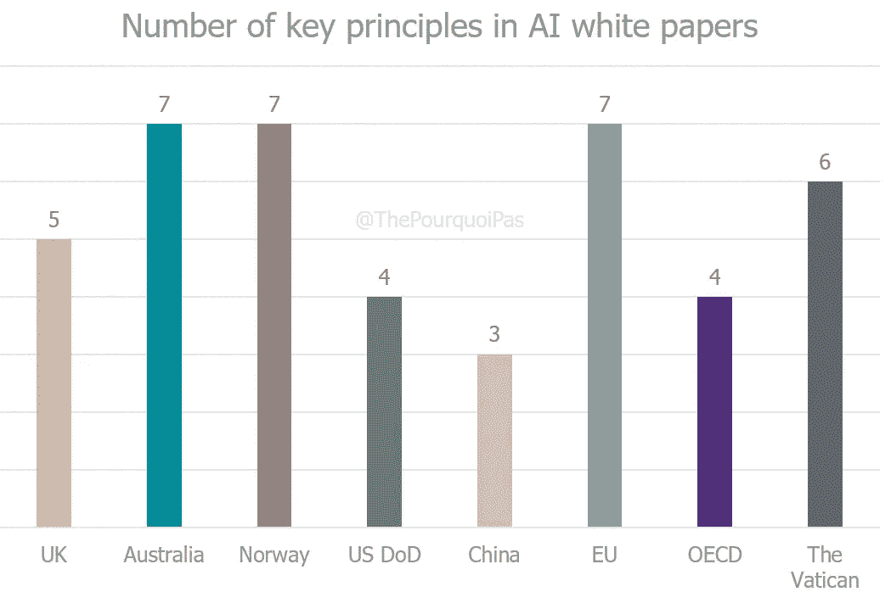

# 人工智能伦理不存在

> 原文：<https://towardsdatascience.com/ai-ethics-doesnt-exist-87803ee8fddc?source=collection_archive---------62----------------------->

## 意见

## 拿一片止痛药，这可能会变得复杂

[点击这里查看更多有趣的图片](https://www.thepourquoipas.com/graphs)

[人工智能](https://www.thepourquoipas.com/artificial-intelligence) (A.I)是革命还是战争？上帝还是宠物？锤子还是钉子？*难道我们* ***真的*** *还需要更多的比喻来形容吗？如今，人工智能决定了在社交媒体上向我们展示哪些信息，我们看到哪些广告，以及我们在线上和线下的报价。一个算法可以在技术上[编写](https://www.digitaltrends.com/cool-tech/japanese-ai-writes-novel-passes-first-round-nationanl-literary-prize/)和[分析](https://www.economist.com/prospero/2018/03/08/machines-are-getting-better-at-literary-analysis)书籍，[在几乎所有可以想到的游戏](https://www.scientificamerican.com/article/how-the-computer-beat-the-go-master/)中击败人类，制作[电影](https://futurism.com/videos/ibms-watson-edits-movie-trailers-now/)，创作古典歌曲[帮助魔术师](http://www.wired.co.uk/article/tom-london-magic-thomas-webb-hacker-ibm-samsung-microsoft) [表演更好的戏法](https://spectrum.ieee.org/tech-talk/computing/software/ai-helps-magicians-perform-mind-reading-tricks?utm_source=MIT+Technology+Review&utm_campaign=844ee928cf-The_Download&utm_medium=email&utm_term=0_997ed6f472-844ee928cf-155974721)。除了艺术，它还有可能鼓励更好的决策，做出医学诊断，甚至解决一些人类最紧迫的挑战。与[刑事司法](https://www.thoughtworks.com/insights/blog/how-artificial-intelligence-transforming-criminal-justice-system)、[零售](https://www.thepourquoipas.com/post/machine-learning-nlp-computer-vision-deep-learning-in-retail)、[教育](https://www.mckinsey.com/featured-insights/artificial-intelligence/the-role-of-education-in-ai-and-vice-versa)、[招聘](https://www.forbes.com/sites/valleyvoices/2018/01/29/how-ai-is-changing-the-game-for-recruiting/)、[医疗](https://www.pwc.com/gx/en/industries/healthcare/publications/ai-robotics-new-health/transforming-healthcare.html)、[银行](https://www.forbes.com/sites/oliversmith/2018/05/22/ai-powered-bank-accounts-of-tomorrow-are-solving-the-biggest-problem-with-your-finances-you/#3eddfafc2616)、[农业](https://www.youtube.com/watch?v=cw3flTRrPts)、[运输](https://www.europarl.europa.eu/RegData/etudes/BRIE/2019/635609/EPRS_BRI%282019%29635609_EN.pdf)、[战争](https://www.thepourquoipas.com/post/5-ways-artificial-intelligence-will-forever-change-how-we-view-the-battlefield)、[保险](https://thenextweb.com/growth-quarters/2020/02/24/3-ways-ai-is-transforming-the-insurance-industry/)、[媒体](https://www.thepourquoipas.com/post/complete-guide-to-machine-learning-in-the-media-industry)……不胜枚举。*

然而，我们经常忙于讨论人工智能是否能做某事的细节，以至于我们很少问自己是否应该设计它。

这就是伦理的用武之地。公司和政府都已经意识到 [**类固醇**](https://www.simplilearn.com/ai-deep-learning-put-big-data-on-steroids-article) 的统计数据能够[造成巨大伤害](https://medium.com/syncedreview/2018-in-review-10-ai-failures-c18faadf5983)，并且正在研究各种方法来应对潜在的后果，而不影响他们的底线或战略地缘政治优势。他们提出了几十条“原则”，一条比一条更难执行，甚至无法就基本框架达成一致。讨论[战争](https://www.thepourquoipas.com/post/5-ways-artificial-intelligence-will-forever-change-how-we-view-the-battlefield)，[自动化](https://www.thepourquoipas.com/post/will-automation-take-my-job)，大规模监控，威权至上；但是这些讨论不能在关键道德原则和红线达成一致之前进行。

因此，下面是围绕人工智能和伦理讨论的“快速”指南。它旨在帮助使对话民主化:我们不一定需要更聪明的人坐在桌子旁(*我写的任何东西对专家来说都不是新闻*，但是我们**确实需要**一张更大的桌子。或者更多的桌子。或者更多的座位。或者某种视频会议解决方案。

我讨厌隐喻。

# 伦理可以有许多不同的含义

在我们深入当代关于伦理的讨论之前，我们首先需要了解什么是伦理。伦理有一个非常简单的字典定义:“管理一个人的行为或进行一项活动的道德原则”。

在像我这样的反向投资者破坏所有人的乐趣之前，这大概是所有人能做到的极限了。你看，即使我们把**规范伦理学**(对伦理行为的研究)与其较弱的表亲[元伦理学](https://en.wikipedia.org/wiki/Meta-ethics)和[应用伦理学](https://en.wikipedia.org/wiki/Applied_ethics)分开，仍然没有一个关于什么是好/坏和/或错/对的定义。的确，**好的可能是错的，坏的可能是对的**。

为了更好地理解为什么人工智能伦理学的当前主张与道德原则没有什么关系，我们应该了解以下几个学派:

*   **；TL；最大多数人的最大幸福是道德和立法的基础，也就是“目的证明手段的正当性”。近亲:[功利主义](https://en.wikipedia.org/wiki/Ethics#Utilitarianism)。**
*   **[**义务论**](https://en.wikipedia.org/wiki/Deontological_ethics)；TL；我们有责任总是做正确的事，即使这会产生负面的后果。“你避免让自己受苦的事，不要强加给别人” ( *爱比克泰德，又名，在哲学上有着最史诗般名字的家伙——也是一个斯多葛派*)。近亲:[康德主义](https://en.wikipedia.org/wiki/Ethics#Kantianism)。**
*   **[**享乐主义**](https://en.wikipedia.org/wiki/Hedonism)；TL；最大化自我满足是我们作为人能做的最好的事情。**
*   **[**道德直觉主义**](https://en.wikipedia.org/wiki/Ethical_intuitionism)；TL；在没有诸如善或恶等其他概念的先验知识的情况下，知道什么是道德的是可能的。**
*   **[实用主义 ；TL；道德在进化，规则应该考虑到这一点。](https://en.wikipedia.org/wiki/Pragmatic_ethics)**
*   **[**状态结果论**](https://en.wikipedia.org/wiki/State_consequentialism)；TL；任何对国家有利的事情都是道德的。**
*   **[**美德伦理**](https://en.wikipedia.org/wiki/Virtue_ethics)**；**TL；美德是一种性格特征，源于通过知识对善与恶的区分。它与一个动作或一种感觉是分开的。近亲:[斯多葛主义](https://en.wikipedia.org/wiki/Stoicism)。**

**如果一个公司或政府告诉你它的道德原则，你有责任去挖掘并询问他们这些原则是基于哪个道德分支。在这些定义中可以找到很多信息。**

**问这个问题很重要，因为正如我们在下面看到的，机构喜欢使用伦理这个词，而实际上从来没有接近过任何类似于道德原则的东西(*请参考这篇文章的标题进行常规的理智检查*)。然而，好消息是[知道很多关于道德的知识和行为合乎道德之间实际上没有关联。](https://qz.com/1582149/ethicists-are-no-more-ethical-than-the-rest-of-us-study-finds/)**

# **“道德剧场”困扰着公司**

**[**公司的存在是为了奖励股东**](https://en.wikipedia.org/wiki/Friedman_doctrine) 。至少，这是过去 50 年来一直信奉的商业哲学。因此，公司没有动力去做“正确”或“好”的事情，除非他们的利润面临风险。从技术上来说，对他们来说最重要的是客户认为他们做得好/对。道德剧场的理念是，公司将尽一切努力表现出尽最大努力合乎道德，而不这样做，以防止消费者的反弹。做到这一点的一个完美方法是宣布宏大的、不具约束力的原则和规则，这些原则和规则与实际的道德规范没有任何联系，一旦出现任何挑战，就指向它们。**

**下面是一些大型人工智能公司定义的原则。这绝不是详尽无遗的(*然而也是令人筋疲力尽的*)，但是提供了一个对公司赞助的道德清洗的洞察。这些规则通常分为 4 类。**

## **问责制/责任**

**"*指定一名首席人工智能道德官员* " ( [IBM](https://www.ibm.com/blogs/policy/wp-content/uploads/2020/01/IBM-AI-POV_FINAL2.pdf) )，"*人工智能设计师和开发人员负责***考虑人工智能的设计、开发、决策过程和结果* " ( [IBM](https://www.ibm.com/watson/assets/duo/pdf/everydayethics.pdf) )，"*对* ***负责*** *对人* " ( [谷歌](https://www.blog.google/technology/ai/ai-principles/))" *AI 系统应该有算法* ***问责*** " ( [微软](https://www.microsoft.com/en-us/ai/responsible-ai))。***

*****为什么是 B-S** :首先，就像下面的许多观点一样，**这些都不是关于道德本身的**，即使一些论文的标题中实际上[有这个词。第二，没有任何地方写着高管应该对国家法律负责，让他们随心所欲。事实上，在人工智能中很少有法则存在，但这正是我们有伦理的真正原因；没有任何地方说明这些公司将根据什么标准承担责任。道义论？结果主义？在这一点上谁也说不准。](https://www.ibm.com/watson/assets/duo/pdf/everydayethics.pdf)***

## ***透明度***

***"*不要隐藏你的 AI* " ( [IBM](https://www.ibm.com/blogs/policy/wp-content/uploads/2020/01/IBM-AI-POV_FINAL2.pdf) )，"*解释你的 AI* " ( [IBM](https://www.ibm.com/blogs/policy/wp-content/uploads/2020/01/IBM-AI-POV_FINAL2.pdf) )，" *AI 的设计应该让人类容易感知、察觉、理解其决策过程* " ( [IBM](https://www.ibm.com/watson/assets/duo/pdf/everydayethics.pdf) )，" *AI 系统应该是可以理解的* " ( [微软](https://www.microsoft.com/en-us/ai/responsible-ai))。***

*****为什么是 B-S** :我不会在这里讲太多细节，因为这是技术性的多于理论性的([这里有一个快速指南](https://www.thepourquoipas.com/post/10-steps-ai-project))，但是 **A.I 本质上是一个黑箱**。为了实现完全透明，公司必须公开他们的部分代码，这一点已经被讨论过，但是遭到强烈反对。另一个解决方案来自于 GDPR 的“解释权”,集中于输入而不是输出。所述权利要求用户能够要求为他们做出的算法决策背后的数据。这是一个很好的想法，但在欧洲以外的任何地方都没有实施。***

## ***公平/偏见***

***"*测试你的 AI 对于* ***的偏见*** " ( [IBM](https://www.ibm.com/blogs/policy/wp-content/uploads/2020/01/IBM-AI-POV_FINAL2.pdf) )，" *AI 必须被设计成最小化***的偏见并促进包容性的代表性*"([IBM](https://www.ibm.com/watson/assets/duo/pdf/everydayethics.pdf))；"*避免制造或强化不公平的* ***偏见*** " ( [谷歌](https://www.blog.google/technology/ai/ai-principles/))，" *AI 系统应该公平对待所有人* " ( [微软](https://www.microsoft.com/en-us/ai/responsible-ai))。****

******为什么是 B-S:一个用来寻找数据模式的系统可能会找到错误的模式**。这是人工智能偏见最简单的定义。这样的流行语有助于公司避开诸如性别歧视、种族主义或年龄歧视等棘手的话题。上帝禁止他们向自己提出尖锐的问题，或者对他们使用的数据集负责。我们完全有权利(义务)要求解决哪些偏见，以及如何解决。****

## ****数据和隐私****

****" *AI 必须被设计成保护用户数据，并保留用户对访问和使用*"([IBM](https://www.ibm.com/watson/assets/duo/pdf/everydayethics.pdf))；"*融入* ***隐私*** *设计原则* " ( [谷歌](https://www.blog.google/technology/ai/ai-principles/))，"*人工智能系统应该是安全的，并尊重* ***隐私*** " ( [微软](https://www.microsoft.com/en-us/ai/responsible-ai))。****

******为什么是 B-S:** 如果他们真的在乎，他们早就实施欧洲标准了(*GDPR 万岁*)。他们没有。结案了。****

****在我读过的许多报告中，只有两次真正提到了道德:****

****"*人工智能的设计应该符合你的用户群体的规范和价值观* " ( [IBM](https://www.ibm.com/watson/assets/duo/pdf/everydayethics.pdf) ) " *我们不会在以下应用领域设计或部署人工智能:会造成或可能造成整体伤害的技术。如果存在重大的危害风险，我们将仅在我们认为益处大大超过风险的情况下进行，并将纳入适当的安全约束。*”([谷歌](https://www.blog.google/technology/ai/ai-principles/))****

****这告诉我们，IBM 信奉**实用主义**(很公平)，而谷歌是**结果主义**公司。这很奇怪，因为“*不作恶*”，该公司的长期口号，在技术上是**义务论**。这样的二分法凸显了一个明显的疏忽:世界上最大的公司之一正在定义人工智能原则，这些原则可能会在社会上产生深远影响，同时又违背其内部文化。**这听起来像是过度分析，直到你意识到** [**在过去的几个月里，谷歌内部因为这个原因发生了许多员工起义**](https://www.nytimes.com/interactive/2020/02/18/magazine/google-revolt.html)**。******

******你可能已经注意到上面只提到了三家公司(谷歌、IBM、微软)。这是因为其他主要的人工智能公司还没有拿出任何值得挑剔的东西，而是选择投资于最终会影响政府的智库。这一点凸显了所有原则共有的一个重大缺陷:**没有一个原则要求公司遵守可执行的规则**。那么，为什么公司会为道德剧场而烦恼呢？如上所述，第一个原因确实是为了影响政府并引导对话朝着“正确”的方向发展(见下文公司和政府优先事项标准的相似之处)。其次，被客户和员工认为是有道德的很好，这样可以避免任何抵制。第三，或许也是最重要的一点，制定标准可以赚大钱:**专利 x 普遍使用= $$$。********

********第二课**:公司对道德知之甚少，没有动力去表明什么是好的或正确的。企业伦理是一个矛盾体。******

******因此，政府需要加快步伐，因为企业不太可能为了社会利益而放弃利润。******

# ******政府正在尽最大努力******

******有许多政府发布的白皮书，但它们要么含糊不清，要么不完整。此外，许多人从经济和地缘政治竞争的角度看待人工智能。一个明显的例外是**在欧盟人工智能战略和愿景中明确强调道德和责任，特别是相对于美国和中国(这两个国家在道德上已经名誉扫地)。为了全面了解各国认为人工智能道德应该是什么样的，我将它们的原则分为 7 类，其中大部分都与上述对企业的分析非常相似。********

******请注意，这仅仅是由比我更聪明、更有见识的人所写的数千页内容的(相关)过度简化。我强烈推荐阅读链接文档，因为它们提供了关于所列原则的深入信息。******

## ******问责制/责任******

**********问责*** *按设计*[英国](https://www.turing.ac.uk/sites/default/files/2019-06/understanding_artificial_intelligence_ethics_and_safety.pdf))；"*那些对人工智能系统生命周期的不同阶段负责的***应该是可识别的，并且* ***对人工智能系统的结果负责的****(……)*"([澳大利亚](https://www.industry.gov.au/data-and-publications/building-australias-artificial-intelligence-capability/ai-ethics-framework/ai-ethics-principles) ) " *所有人工智能系统必须是可审计的* " ( [挪威](https://www.regjeringen.no/contentassets/1febbbb2c4fd4b7d92c67ddd353b6ae8/en-gb/pdfs/ki-strategi_en.pdf))；"*国防部人员将行使适当水平的判断和谨慎，而剩余的* ***负责*** *人工智能能力的开发、部署和使用* " ( [美国国防部](https://www.defense.gov/Newsroom/Releases/Release/Article/2091996/dod-adopts-ethical-principles-for-artificial-intelligence/))；*责任原则* ( [中国](https://www.newamerica.org/cybersecurity-initiative/digichina/blog/translation-excerpts-chinas-white-paper-artificial-intelligence-standardization/))；"*机制应到位，以确保人工智能系统及其成果的* ***责任*** *和* ***问责****(……)*"([欧盟](https://ec.europa.eu/digital-single-market/en/news/ethics-guidelines-trustworthy-ai))；"*开发、部署或操作人工智能系统的组织和个人应根据上述原则* " ( [OECD](https://www.oecd.org/going-digital/ai/principles/) ) " *负责***其正常运作。设计和部署使用人工智能的人必须履行* ***责任*** *和透明**********

******对什么负责？！对谁？！这个问题是如何被如此系统地回避的？******

## ******透明度******

******"*过程与结果***透明度** *原理* " ( [英国](https://www.turing.ac.uk/sites/default/files/2019-06/understanding_artificial_intelligence_ethics_and_safety.pdf))；"*应该有* ***透明度*** *和负责任的披露，以确保人们知道他们何时受到人工智能系统的重大影响，(……)*"([澳洲](https://www.industry.gov.au/data-and-publications/building-australias-artificial-intelligence-capability/ai-ethics-framework/ai-ethics-principles))；" *AI 型系统必须是* ***透明*** " ( [挪威](https://www.regjeringen.no/contentassets/1febbbb2c4fd4b7d92c67ddd353b6ae8/en-gb/pdfs/ki-strategi_en.pdf))；“*国防部的人工智能能力将得到发展和部署，以便相关人员对该技术有适当的理解(……)”*([美国国防部](https://www.defense.gov/Newsroom/Releases/Release/Article/2091996/dod-adopts-ethical-principles-for-artificial-intelligence/))；"*数据、系统、AI 商业模式应该是* ***透明****(……)*"([EU](https://ec.europa.eu/digital-single-market/en/news/ethics-guidelines-trustworthy-ai))；"*围绕人工智能系统应该有* ***透明度*** *和负责任的披露，以确保人们理解基于人工智能的结果，并能够挑战它们*"([OECD](https://www.oecd.org/going-digital/ai/principles/))；“*原则上，AI 系统必须是可解释的*”([梵](http://www.academyforlife.va/content/dam/pav/documenti%20pdf/2020/CALL%2028%20febbraio/AI%20Rome%20Call%20x%20firma_DEF_DEF_.pdf?utm_source=newsletter&utm_medium=email&utm_campaign=newsletter_axiosfutureofwork&stream=future))。******

******不如我们先强迫公司透露他们是否真的使用了人工智能技术？******

## ******公平/偏见******

******"*歧视性非伤害原则* " ( [英国](https://www.turing.ac.uk/sites/default/files/2019-06/understanding_artificial_intelligence_ethics_and_safety.pdf))；"*人工智能系统应具有包容性和可访问性，不应涉及或导致对个人、社区或群体的* ***不公平****"([澳洲](https://www.industry.gov.au/data-and-publications/building-australias-artificial-intelligence-capability/ai-ethics-framework/ai-ethics-principles))；"*人工智能系统必须促进包容性、多样性和平等待遇* " ( [挪威](https://www.regjeringen.no/contentassets/1febbbb2c4fd4b7d92c67ddd353b6ae8/en-gb/pdfs/ki-strategi_en.pdf))；"*该部门将采取审慎的步骤，最大限度地减少人工智能能力*中无意的 ***偏差****"([美国国防部](https://www.defense.gov/Newsroom/Releases/Release/Article/2091996/dod-adopts-ethical-principles-for-artificial-intelligence/))；"*不公平* ***偏见*** *必须避免，因为它可能会产生多重负面影响，从弱势群体的边缘化，到偏见和歧视的加剧*(……)"([欧盟](https://ec.europa.eu/digital-single-market/en/news/ethics-guidelines-trustworthy-ai))；*“不制造或按照* ***偏见*** *行事，从而维护公平和人的尊严”* ( [梵蒂冈](http://www.academyforlife.va/content/dam/pav/documenti%20pdf/2020/CALL%2028%20febbraio/AI%20Rome%20Call%20x%20firma_DEF_DEF_.pdf?utm_source=newsletter&utm_medium=email&utm_campaign=newsletter_axiosfutureofwork&stream=future))。********

*******提醒一下，通过确保输入的数据代表现实，并且不反映现实中存在的偏见，可以避免偏见。*******

## *****数据和隐私*****

*****" *AI 系统应尊重和维护* ***隐私*** *权利和* ***数据保护*** *，并确保* ***数据*** " ( [澳大利亚](https://www.industry.gov.au/data-and-publications/building-australias-artificial-intelligence-capability/ai-ethics-framework/ai-ethics-principles))；" *AI 必须把* ***隐私*******数据保护****"([挪威](https://www.regjeringen.no/contentassets/1febbbb2c4fd4b7d92c67ddd353b6ae8/en-gb/pdfs/ki-strategi_en.pdf))；"*除了确保充分尊重* ***隐私*** *和* ***数据保护*** *之外，还必须确保充分的数据治理机制，考虑到数据的质量和完整性，并确保对数据的合法访问* " ( [欧盟](https://ec.europa.eu/digital-single-market/en/news/ethics-guidelines-trustworthy-ai))；"*人工智能系统必须安全地工作，并尊重用户的* ***隐私****"([梵蒂冈](http://www.academyforlife.va/content/dam/pav/documenti%20pdf/2020/CALL%2028%20febbraio/AI%20Rome%20Call%20x%20firma_DEF_DEF_.pdf?utm_source=newsletter&utm_medium=email&utm_campaign=newsletter_axiosfutureofwork&stream=future))。********

******哦，中国和美国不在名单上？酷，酷，酷…只是巧合，我确定。我相信这也是一个巧合，三个完全不同的组织提出了措辞非常相似的原则。******

## ******安全/保障/可靠性******

******"******安全性*** *，健壮性原则* " ( [英国](https://www.turing.ac.uk/sites/default/files/2019-06/understanding_artificial_intelligence_ethics_and_safety.pdf))；"*人工智能系统应该* ***可靠地*** *按照它们预定的目的* " ( [澳](https://www.industry.gov.au/data-and-publications/building-australias-artificial-intelligence-capability/ai-ethics-framework/ai-ethics-principles))；"*基于 AI 的系统必须是* ***安全*** *和技术健壮* " ( [挪威](https://www.regjeringen.no/contentassets/1febbbb2c4fd4b7d92c67ddd353b6ae8/en-gb/pdfs/ki-strategi_en.pdf))；"*部门的 AI 能力将有明确的、定义良好的用途，而* ***安全*** *，* ***安全****(…)*"；“*国防部将设计和工程人工智能能力，以实现其预期功能，同时拥有检测和避免意外后果的能力(……)*”([美国国防部](https://www.defense.gov/Newsroom/Releases/Release/Article/2091996/dod-adopts-ethical-principles-for-artificial-intelligence/))；" *AI 系统需要有弹性* ***安全****(……)*"([EU](https://ec.europa.eu/digital-single-market/en/news/ethics-guidelines-trustworthy-ai))；"*人工智能系统必须以稳健、* ***安全、*** *和* ***安全、*** *【方式(……)运行，并应持续评估和管理*"([OECD](https://www.oecd.org/going-digital/ai/principles/))；“*人工智能系统必须能够可靠地工作**”([梵](http://www.academyforlife.va/content/dam/pav/documenti%20pdf/2020/CALL%2028%20febbraio/AI%20Rome%20Call%20x%20firma_DEF_DEF_.pdf?utm_source=newsletter&utm_medium=email&utm_campaign=newsletter_axiosfutureofwork&stream=future))。**********

*********说起来容易做起来难当一个简单的贴纸** [**就能让一个算法产生幻觉**](https://www.theverge.com/2018/1/3/16844842/ai-computer-vision-trick-adversarial-patches-google) **。*********

## *******利益相关方参与/社会公益*******

*******"*利益相关者影响评估原则* " ( [英国](https://www.turing.ac.uk/sites/default/files/2019-06/understanding_artificial_intelligence_ethics_and_safety.pdf))；"*人工智能系统应该造福个人，* ***社会*** *和* ***环境*** " ( [澳洲](https://www.industry.gov.au/data-and-publications/building-australias-artificial-intelligence-capability/ai-ethics-framework/ai-ethics-principles))；”*艾必利* ***社会*** *和* ***环境***”([挪威](https://www.regjeringen.no/contentassets/1febbbb2c4fd4b7d92c67ddd353b6ae8/en-gb/pdfs/ki-strategi_en.pdf))；*人类利益原则* ( [中国](https://www.newamerica.org/cybersecurity-initiative/digichina/blog/translation-excerpts-chinas-white-paper-artificial-intelligence-standardization/))；人工智能系统应该造福全人类，包括子孙后代。因此，必须确保它们是可持续的和环境友好的。"*人工智能应该通过推动包容性增长、可持续发展和福祉来造福人类和地球*"([OECD](https://www.oecd.org/going-digital/ai/principles/))；必须考虑到所有人的需要，这样每个人都能受益。*******

********嘿，还记得** [**什么时候一个面部识别软件“能说出”你的性取向**](https://www.theguardian.com/technology/2018/jul/07/artificial-intelligence-can-tell-your-sexuality-politics-surveillance-paul-lewis) **吗？在俄罗斯？********

## ******权利******

******"*人工智能系统应该尊重人类的* ***权利*** *、多样性以及个人的自主性* " ( [澳大利亚](https://www.industry.gov.au/data-and-publications/building-australias-artificial-intelligence-capability/ai-ethics-framework/ai-ethics-principles))；"*当人工智能系统对个人、社区、团体或环境产生重大影响时，应该有一个及时的流程，允许人们质疑人工智能系统的使用或输出* " ( [澳洲](https://www.industry.gov.au/data-and-publications/building-australias-artificial-intelligence-capability/ai-ethics-framework/ai-ethics-principles))；"*基于 AI 的解决方案必须尊重人类的自主性和控制力* " ( [挪威](https://www.regjeringen.no/contentassets/1febbbb2c4fd4b7d92c67ddd353b6ae8/en-gb/pdfs/ki-strategi_en.pdf))；”****权利*** *和责任【原则】* ( [华](https://www.newamerica.org/cybersecurity-initiative/digichina/blog/translation-excerpts-chinas-white-paper-artificial-intelligence-standardization/))；“人工智能系统应该赋予人类权力，允许他们做出明智的决定，并培养他们的基本权利*。”([欧盟](https://ec.europa.eu/digital-single-market/en/news/ethics-guidelines-trustworthy-ai))；"*人工智能系统的设计应尊重法治、人权***、民主价值观和多样性，它们应包括适当的保障措施(……)以确保公平和公正的社会* " ( [经合组织](https://www.oecd.org/going-digital/ai/principles/))。*********

******嘿，还记得脸书给 65000 名俄罗斯用户贴上‘有意叛国’的标签吗？******

## ******五点分析******

*   ******只有欧盟、挪威和澳大利亚处理所有 7 项原则；从某些国家忽略的内容中可以看出很多东西。这种缺乏共识的情况也令人担忧，因为一个实体在几个国际准则、其本国的国家政策以及公司和非营利组织的建议之间做出决定，最终可能会一事无成。******
*   ********除了这 7 点**之外，没有主要的风险投资，而且它们很少彼此偏离太远。这凸显了[群体思维](https://en.wikipedia.org/wiki/Groupthink)的一个非常真实的风险(这将有利于私营部门)。例如，没有任何地方提到 [**自决权**](https://unpo.org/article/4957) ，而人工智能很容易被用来[以某种方式推动](https://en.wikipedia.org/wiki/Nudge_theory)人(比如说，在选举期间[)。](https://images.thestar.com/2N9O0iP1ITnjm6ti2ysCfBHHC8U=/1086x731/smart/filters:cb%282700061000%29/https://www.thestar.com/content/dam/thestar/uploads/2016/11/10/ny-post.jpg)******
*   ******可耻的是没有红线:没有一个国家禁止自己使用某些人工智能，这些原则也没有法律约束力。仅供参考，强有力的监管是这样的:******
*   ********讨论中完全没有技术定义**。任何相关的**KPI**都可以衡量这些原则。谁在乎有些东西目前在技术上是否遥不可及？这么说意味着误解了战略的定义(同样，威胁要对公司罚款，他们会很快找到技术解决方案)。******
*   ******道德准则的缺乏起初并不明显。它们也不是必须的，否则我们会问“*如果一个原则违背另一个原则会发生什么？*”。**他们排名**吗？有重要的顺序吗？如果放弃隐私权对社会有益，会发生什么？当我们开始处理多个，通常是相互竞争的目标，或者试图解释像“自由”和“幸福”这样的无形事物时，一个令人满意的数学解决方案是不存在的。这就是清晰的伦理哲学有用的地方:如果*状态结果主义*被优先考虑(在中国通常是这样)，这至少给了我们一个关于什么将被优先考虑的线索(**阿西莫夫的** [**机器人的三大法则**](https://en.wikipedia.org/wiki/Three_Laws_of_Robotics) **在这个**中相当棒)。******

******第三课:在制定相关原则方面，政府比公司走得更远。然而，他们仍然缺乏坚持原则的勇气，以及使这些原则得以实施的技术诀窍。******

# ******道德很容易，但勇气却不容易******

******现在，我们已经建立了道德必须提供的基本原则(*从表面上看并不是很多*)，并且我们已经分析了公司和政府等的各种尝试，下面是一些建议，它们不仅基于道德，而且基于关于重大问题(战争、政治、自动驾驶汽车、司法……)的**勇气**。我提到勇气是因为这是当前人工智能话语中所缺少的。下面的原则可能以前就有过，但很可能因为它们所包含的内容(竞争力的丧失、战略优势、酷哥点……)而被摒弃。我提出这些问题没有任何风险，因为我在这次谈话中没有任何实权；如果我代表一个人/一家公司，我可能不会持有同样的观点。******

## ******合理性原则******

******[萨特](https://en.wikipedia.org/wiki/Jean-Paul_Sartre)有句名言，“*是别人的地狱*”。当涉及到人工智能时尤其如此；不是因为人们强迫算法变坏，而是因为我们的行为可能会创造一个世界，在这个世界里，坏行为已经被算法所铭记，迫使自己采取所说的行为或因此遭受痛苦(例如:一个女人从她的简历中删除性别词汇)([如果这让你困惑，你可能需要一本关于机器学习的初级读本](https://expertsystem.com/machine-learning-definition/))。托克维尔称之为多数人的暴政:一个基于数字而不是正义或优秀来统治的决定。在理性的原则下，关键的黄金法则将通过[公众咨询](https://en.wikipedia.org/wiki/Public_consultation)和[技术咨询](https://en.wikipedia.org/wiki/Public_sector_consulting)在所有人工智能公司内强制执行，确保即使人们失去理智，也不会构建出体现疯狂的算法。我可以推荐从这段鲜为人知的义务论历史开始吗******

## ******排名原则******

******我们假设上面的原理在全球范围内都适用( *ha！*)。在创建算法时，公司如何处理相互竞争的基本权利？例如，我们能否放弃第 9 条和第 12 条，以更好地执行第 5 条？我们能制造出一种人工智能来搜索通讯频道以发现潜在的犯罪活动吗？这些问题正是我们需要一个伦理立场的原因，这将有助于发展一个稳定的价值观、伦理和权利的等级，其中一些将高于其他。以臭名昭著的[电车问题](https://en.wikipedia.org/wiki/Trolley_problem)为例，应用到自动驾驶汽车上。如果可以选择，自动驾驶汽车应该优先拯救两名行人而不是一名乘客吗？如果乘客是国家元首呢？如果行人是罪犯呢？选择一个思想流派，尽管这可能很难，但将有助于创建符合我们信念的算法。******

## ******矛盾原则******

******上面的例子不是随机的:有史以来最大规模的道德偏好研究始于 2014 年，鼓励世界各地的用户对“[电车问题](https://en.wikipedia.org/wiki/Trolley_problem)”的许多变体做出回应。尽管在意料之中，但结果是明确的:不同的文化在伦理方面信仰不同的东西。例如，日本和中国不太可能伤害老年人。较贫穷的国家对违法者更加宽容。个人主义国家通常更喜欢多留些性命。道德是动态的，但编码是静态的。这就是为什么不应该创建一个算法来为多个群体做出决策。在我看来，至少应该做出基于不同世界观的三套:西、东、南。******

******简单来说，如果我进入一辆中国自动驾驶汽车，我希望在发生事故时能够选择西方标准。******

## ******问责原则******

******对于许多自由市场的支持者来说，这一原则似乎是亵渎神明的，因为他们是在烟草集团不会导致癌症、酿酒厂不会导致酒精中毒、枪支不会导致校园枪击以及制药公司不会导致药物过量的国家长大的。硅谷明白这一点，当它的产品造成伤害(失业、偏见、死亡……)时，它的首要借口是说它的技术是价值中立的，它们无力影响其实施的性质。那只是一条简单的出路。算法出人意料的行为现在是生活中的一个事实，正如汽车制造商现在必须意识到排放问题，欧洲公司必须保护他们客户的数据一样，**的技术高管**(而不是科学家，他们的*存在的理由*是推动障碍——这是应该的)必须密切跟踪算法的行为，因为它随着时间和环境的变化而变化，并在需要时减少恶意行为，否则他们将面临巨额罚款或监禁。******

******搞不定？不要开绿灯。******

******你批准了一个最终对女性有偏见的项目？交罚款。[你让一辆自动驾驶汽车上路，一名行人死亡](https://en.wikipedia.org/wiki/Death_of_Elaine_Herzberg)？去坐牢吧。[你的 A.I 犯了战争罪](https://www.dailytargum.com/article/2019/09/artificial-intelligence-stands-as-looming-military-threat)？和你一起去海牙。******

******如果你的签名在这一页的底部，你就要对法律负责。******

## ******净正值的本金******

******是一个。我真的值得吗？目前，即使是最简单的算法就其本质而言也是不道德的:[采矿、冶炼、物流、商业秘密的暗箱操作、数据中心资源](https://interestingengineering.com/training-ai-is-shockingly-costly-to-the-environment)、[现代奴隶制](https://vimeo.com/213152344)、[加纳的电子垃圾山](https://www.citylab.com/environment/2019/05/used-electronics-e-waste-landfill-ghana-toxic-technology/590341/) …所有这些都是不可持续的，尽管英国、澳大利亚和欧盟都在它们的大原则中提到了环境。为了微小的快乐和简化，真的值得吗？一次，就一次，在讨论中保持一点理智是有好处的。******

******我说的理智是指能够看到整个该死的供应链，否则你的算法不会进入生产。******

******环境问题不能再被放在次要位置，即使是在讨论像数字世界这样看似无辜的事情时。******

# ******结论******

******面对有限的技术和过多的潜在用途，人工智能的好处显然大于风险。然而，在机器人开始为我们说话之前，没有理由不谈论它的实现。******

********我为后面的人大声说一句** : A .我不是可以信任或者不可以信任的东西。它只是一个人造的工具，被“输入”数据，以便大规模地自动化某些任务。你信任你的洗衣机吗？你的计算器(*是啊，我也没有。数学是黑魔法)？人们很容易认为某样东西是不存在的。人工智能没有善恶之分。人类是善或恶的(通常同时是两者)。说到底，人工智能只不过是社会的一面黑镜，反映了社会的成功和不平等。最重要的是，这让人很不舒服。这很不舒服，因为我们不断发现我们是 a 洞。*******

********A.I 伦理不存在。********

********让我为后面的人大声说一遍**:算法是为非常具体的目的服务的。他们不能偏离这些目标。重要的是，一家公司是否认为这个目的值得在一个黑盒子里自动化。因此，人工智能道德的问题应该重新表述为“**我们是否相信(在此处插入公司名称)的管理人员将我们的最佳利益放在心上？**“如果是的话，”**我们是否相信公司的程序员会在考虑到潜在数据缺陷的情况下完美地实现这一愿景？**“那就更棘手了，不是吗？但是更现实。******

******人工智能伦理并不存在。******

********让我为后面的人大声说出来**:模糊的清单和原则，无能为力的道德官员和没有权力的顾问委员会是为了保全面子，避免改变，逃避责任。如果你从这篇文章中学到了什么，那就是:******

******人工智能伦理不存在。******

*******本文最初是为欧洲专注于开发者的求职平台*[*honey pot . io*](https://www.honeypot.io/)*撰写的。*******