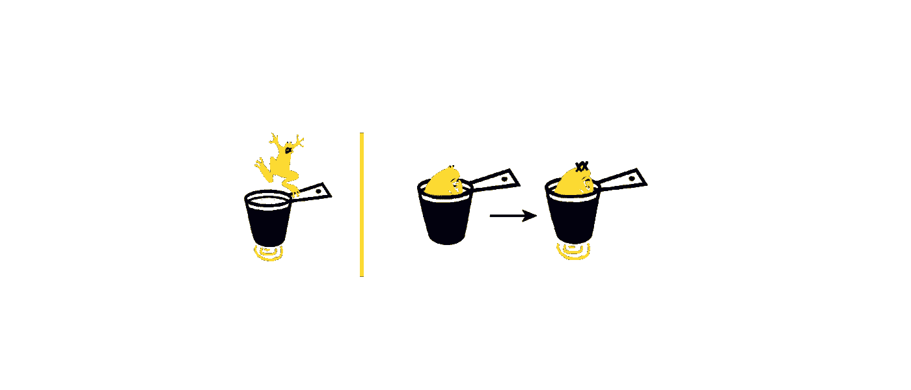

# 人工智能伦理:首先不伤害

> 原文：<https://towardsdatascience.com/ai-ethics-first-do-no-harm-23fbff93017a?source=collection_archive---------53----------------------->

弗兰基·查马基在 [Unsplash](https://unsplash.com?utm_source=medium&utm_medium=referral) 上拍摄的照片

劳拉[*fic*是两个孩子的忙碌妈妈。她疯狂的日程安排与新冠肺炎在家工作不协调。每一天都像是原始生存的练习。为了最大限度地减少精神紧张，每当风险较低时，她都会默认为自动驾驶模式，不需要她全神贯注。有一个老派的男管家不失为一种可取之处。这不是一个经济上的选择，所以劳拉试图依靠任何她能负担得起的虚拟帮手。亚马逊运送她的早餐，网飞在与高管们开会时逗她的孩子开心，Doordash 送来温暖的餐盘，让家人聚在一起。有了这些虚拟助手，她至少可以为陈腐的事情关掉决策肌肉，专注于大局。虚拟助手并不总是做出最好的选择，但谁有时间记分。劳拉偶尔会喝脱脂牛奶，而不是通常的 2%。她有时会发现孩子们正在看一部恐怖电影，尽管这类内容是禁止的。时不时地，Doordash 的厨师会忘记劳拉点的是无麸质的，这就导致了大家再熟悉不过的紧急冷冻晚餐。推荐人 AI 本意是好的。

# 推荐器生成

我们的生活在自动驾驶仪上运行，对我们许多人来说，这是一个急需的喘息。然而，关于算法所提建议的影响和长期后果，还有很多问题没有得到解答。“推荐人”一代大概是患了沸蛙综合症。《沸腾的青蛙》是一则寓言，描述的是一只青蛙被慢慢煮活。前提是，如果你把一只青蛙丢进开水里，青蛙会跳出来。然而，如果你把青蛙放在温水中，慢慢地把它烧开，青蛙不会察觉到危险而被煮死。这则寓言隐喻了我们无力应对逐渐而非突然出现的有害威胁。

本为那些希望优化自身潜能的人主持觉醒研讨会。多年来，本指导了来自世界各地的 500 多人。他最近承认，他对人们愿意将解决问题的任务交给更高的权威感到担忧。如果一个有资质的人提出解决方案，人们似乎会很乐意采用这些方案来解决他们的生活问题。事实上，这个人只知道他们特定的生活环境几个小时，或者有时根本不知道(想想 YouTube 视频)，这是一个可以忽略的细节。为什么我们太快地放弃自主权给一个更高的权威，即使它看起来值得信任？在人工智能助手在我们的社会和私人生活中变得普遍的世界里，这种与生俱来的人类行为意味着什么？

> “我们不能用创造问题时的思维来解决问题。”~阿尔伯特·爱因斯坦

人工智能科学家正在人工智能宇宙中反映人类的缺陷——毕竟，机器人反映了它们的创造者。我们从行为经济学的研究中知道，人类有先天的偏见。[诺贝尔行为经济学奖获得者丹尼尔·卡内曼](https://scholar.princeton.edu/kahneman/home)揭示了人类决策过程中的一些(许多)缺点。例如，锚定是一种认知偏差，即个体在决策过程中过于依赖初始信息——“锚”——来做出后续判断。一旦你确立了这个锚的价值，它就成了以后所有争论的准绳。我们吸收与锚相关的信息，而忽略不太相关的信息。另一种人为偏见是可用性偏见。它是一种思维捷径，依赖于人们在评估具体决策时脑海中出现的即时例子。如果你回忆起某件事，它一定很重要，或者至少比不容易想到的替代解决方案更重要。人们更倾向于最近的信息来衡量他们的判断，形成新的观点，这些观点被最新的消息所偏向。

# 寻找道德准则的灵感

医生有改善所有人健康的道德义务。自古以来，医生必须遵守规则和指导原则。医学界的标准道德誓言是希波克拉底誓言[。它要求新医生宣誓遵守包括医疗保密和无罪在内的道德标准。医疗宣誓经历了几十年的演变，最重要的修订是二战后出现的“日内瓦宣言”。在许多国家，宣誓医疗誓言的修订版仍然是医学毕业生的成人礼。](https://www.nlm.nih.gov/hmd/greek/greek_oath.html)

人工智能科学家应该定义指导原则来解决他们工作的道德、价值观和合规性吗？这样的誓言会让科学家意识到他们的社会和道德责任。为医学以外的职业制定职业道德准则的想法一点也不新奇。类似于希波克拉底医学誓言，阿基米德誓言是工程师的职业道德准则。洛桑联邦理工学院(EPFL)的一群学生在 1990 年提出了这个誓言。随着时间的推移，阿基米德誓言在几所欧洲工程学校得到了温和的采纳。科学家有他们自己的誓言——科学家的希波克拉底誓言[——由约瑟夫·罗特布拉特爵士在 1995 年诺贝尔和平奖接受演讲中提出。](https://science.sciencemag.org/content/286/5444/1475)

# 伦理人工智能指南

就像医学影响人们的福祉一样，人工智能系统也会有选择地影响我们的生活体验。人工智能在现实世界中的应用如此天衣无缝，我们几乎不会注意到。我们是不是患上了沸腾青蛙综合症？陪审团还没有出来。像任何工具一样，人工智能可以用来做好事，也可以造成伤害。例如，在谷歌上快速搜索*人工智能招聘*，会出现像“[使用人工智能消除招聘偏见](https://hbr.org/2019/10/using-ai-to-eliminate-bias-from-hiring#:~:text=AI%20holds%20the%20greatest%20promise,the%20pipeline%20from%20the%20start.)这样的正面标题，但也会出现像“[人工智能辅助招聘有偏见”这样的负面标题。以下是如何让它更公平的方法](https://www.weforum.org/agenda/2019/05/ai-assisted-recruitment-is-biased-heres-how-to-beat-it/)。

人工智能道德准则的提案已经准备就绪。一个有效的计划应该将来自工业界、学术界和政府的不同利益相关者聚集在一起。这样一个跨学科的委员会将使我们能够设计一个值得生活的未来。