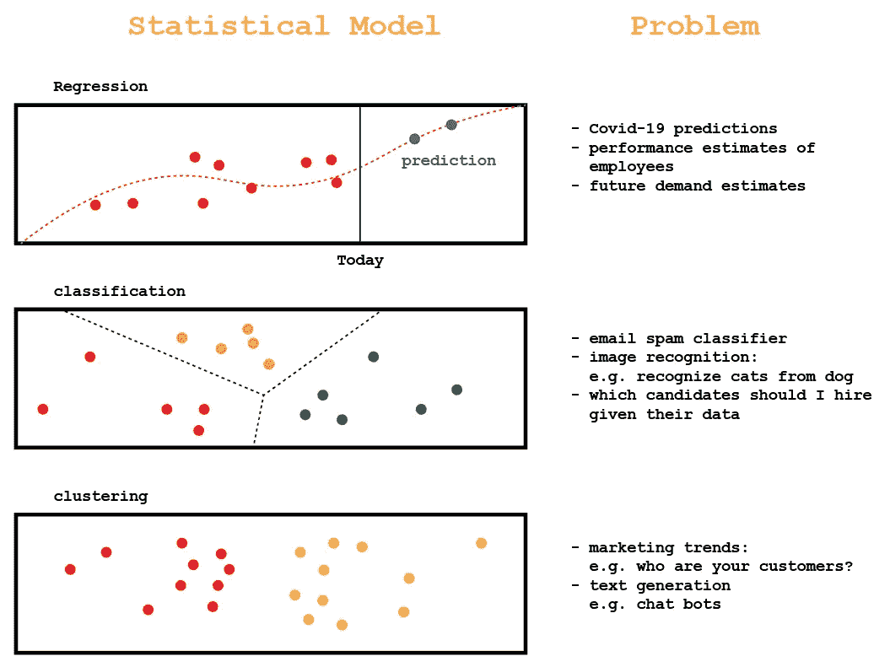
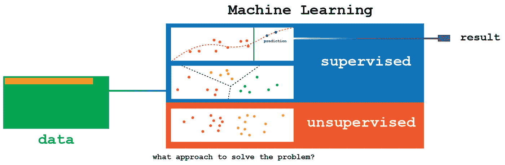
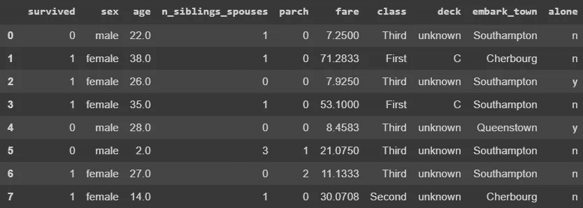
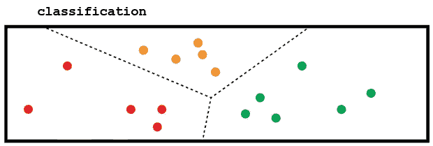
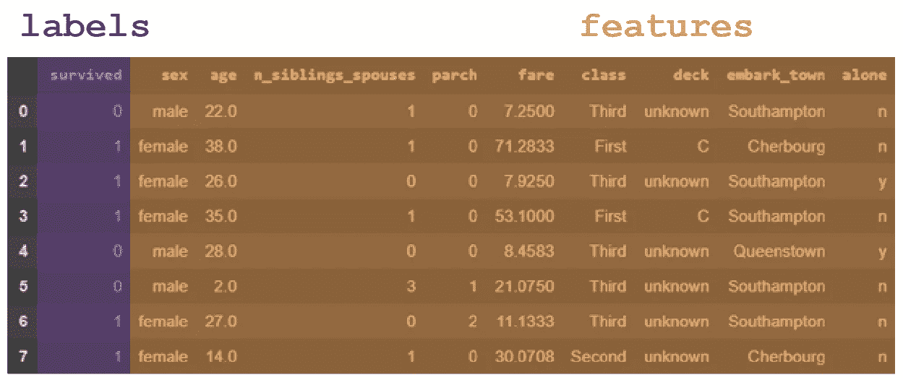
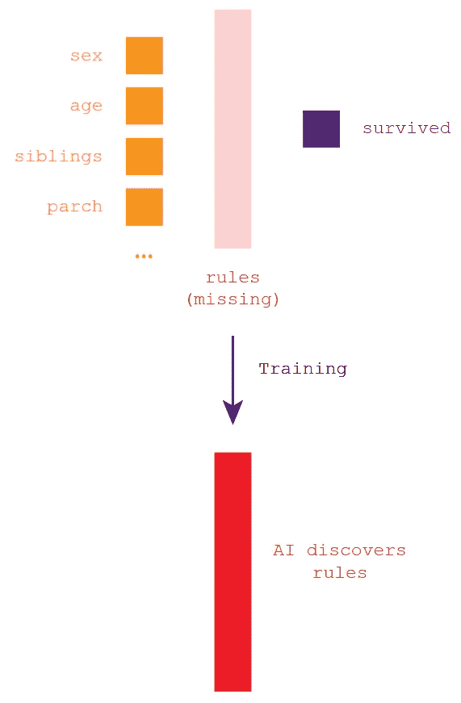
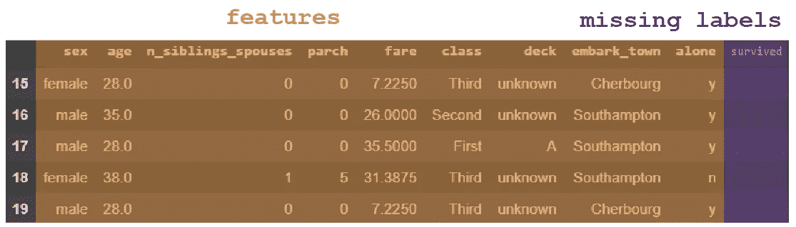
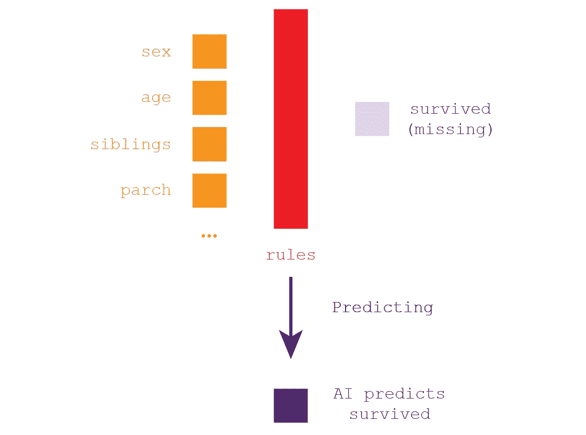
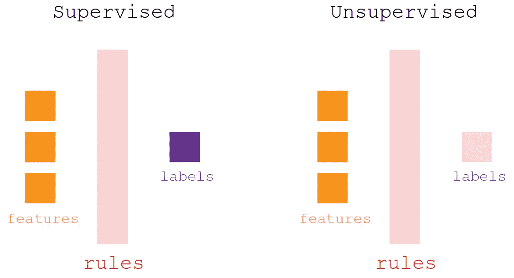
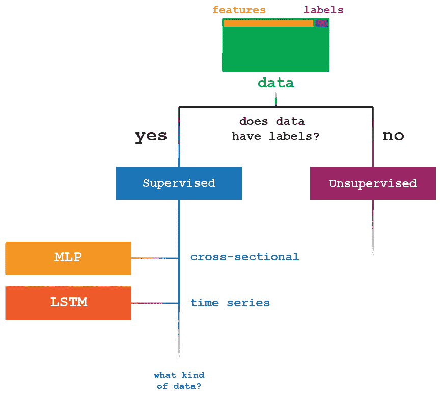

# 艾轻松地解释道

> 原文：<https://towardsdatascience.com/ai-explained-easily-aa6f81574fd6?source=collection_archive---------34----------------------->

## 很容易解释

## 5 分钟看懂 AI

你会如何向一个中世纪的时间旅行者解释汽车是什么？简单地说，他缺少太多的知识:他不知道什么是电、燃料和电池。你可以对他说的是，车是一个工具，可以把你从 A 点带到 b 点，说真的，他还需要知道别的吗？

就像汽车一样，你不需要了解可燃发动机的机械设计和工作原理就能理解它的用途。

一个简单的方案，你可以如何代表一个人工智能的决策过程:特征，标签和规则。稍后，将对此进行详细解释。

# 问题

你想知道人工智能是什么的唯一原因是想知道你能用它解决什么问题。

我说的问题这个术语是什么意思？如果你希望使用人工智能，你需要数据。你想从数据中提取什么，本质上是一个你要解决的数学问题。一些问题的例子是:

例如，如果你有一个关于新冠肺炎的数据集(数据集本质上是一个包含数据的 Excel 表格)，你可能想预测**明天世界上会有多少新病例。**

如果你有一个包含数百万封电子邮件的数据集，你希望**将垃圾邮件与非垃圾邮件区分开来**，如果你有一个路标数据集，你希望计算机**能够通过将它们分成不同的类别来识别它们**。

这里列出了 AI 可以为你解决的常见问题。如果你碰巧有任何包含信息的数据集，并且知道你想要解决什么问题，使用适当的工具**你可以用个人电脑(甚至在 Google Drive 上)免费创建一个人工智能**。这让你对 2020 年这项技术的可用性有所了解。

您可以使用人工智能解决的最常见问题列表

这些是机器学习中最常见的统计模型类别。您可以选择使用哪一个来解决您的问题。(这两个缺失的统计模型被称为关联和降维，但它们并不实用，因此不在本文中讨论)。

# 为什么这么多例子？

当然，你可以用 AI 解决的问题并不仅限于这里列出的问题，但这是一个最实际和最常见的问题的集合。

如果我只列举一个例子，你可能不会理解它的实际用途。有这么多的例子，你可以看到不同领域的实际应用。如果你正在管理一家公司，你希望充分利用它的数据，你有很多选择:预测未来收益，更详细地了解你的目标…

# AI =机器学习

为了最大限度地降低其复杂性，你可以将 AI 视为可以应用于数据的统计模型的集合。这个庞大的集合被称为机器学习。

我们可以从许多统计模型中选择

机器学习也分为两个子类别:有监督的和无监督的。每个类别都包含大量的统计模型。鉴于我们的问题，我们只需选择统计方法。

《出埃及记》

给定一个问题，我们选择最佳的统计模型

我们陈述了我们的问题:我们希望预测明天在我们国家会有多少新的新冠肺炎阳性病例。在众多的统计方法中，我们选择使用第一张图，这是一种回归方法。(数据分析师需要选择具有最佳参数的最佳模型，这就是为什么在本文中您找不到任何关于我们如何从一个模型中选择另一个模型的信息)。

# 数据的作用

因为有两类问题可以用人工智能解决，我们将首先研究监督学习。下面的例子显示了一个表格数据，一个简单的 Excel 文件:一个数据集。

要用 AI，需要数据。数据越多越好。

上面我们有所有 627 名泰坦尼克号乘客的数据。问题:我们能否建立一个能够预测谁能在“下一个泰坦尼克号”中幸存的人工智能？

我们知道问题所在。现在我们必须选择统计模型:

机器学习>监督学习>分类

分类是我们一直选择的统计模型

# 功能和标签

所有人工智能共有的元过程如下:这就是你需要理解的全部。我们将数据分为两部分:

> **特性**

允许我们预测数据的列。在这种情况下:性别，年龄，兄弟姐妹，羊皮纸，票价，阶级，甲板，上船 _ 镇，独自

> **标签**

我们想要预测的列。在这种情况下，该列“幸存”。

问题:考虑到一名新乘客的特征，n. 628(女性，24 岁，有一个兄弟姐妹，parch 0，75.05 美元票价，头等舱，D 舱，从瑟堡出发，不是一个人):她能活下来吗？

现在我们有了特征和标签，人工智能将提出一些规则。

# 训练人工智能:发现规则

通过使用我们选择的算法(我们的统计模型)，发现了规则。我们可以使用相同的规则来解决我们的问题，并根据他的数据(性别、年龄、兄弟姐妹……)找出谁将能够在泰坦尼克号上幸存。

# 预测:第二艘泰坦尼克号

现在，让我们假设有第二艘泰坦尼克号。我们仍然不知道谁幸存了下来(标签“幸存”不见了)；我们有特色，因为我们的 AI 已经训练好了，所以我们也有规则。

我们还不知道谁能从泰坦尼克 2 号中幸存下来

给定特征和规则，我们可以预测标签:谁将在泰坦尼克 2 中幸存。

# 摘要

这是整个过程的概要:

# 就这样吗？

我给你们展示的是人工智能的三个范例之一:监督学习。

当您足够幸运地同时拥有特征和标签时，您可以使用监督学习方法来解决它。如果你只发现自己有特征(例如，猫和狗的图像集合)，那就叫做无监督学习:你会使用不同的统计模型。

* * *第三种范式被称为强化学习，但目前还不知道这是一个实际的东西。

# 为什么这么多算法？

当你增加复杂性时，你可以看到每种人工智能方法都有无数不同的算法。为了解决你的特定问题，你需要一个特定的算法。

# AI 和统计学有什么区别？

你可能很好奇 AI 和统计学在这一点上的实际区别是什么。有了统计，你就可以做预测，人工智能也一样。有区别吗？

简单地说:人工智能是一组用来进行预测的统计工具。

# 我在这篇文章中遗漏了什么

这篇文章的目的是给你一个想法，如果你有数据要分析，你可以如何使用人工智能。深度学习是一种非常强大的人工智能，但出于简化的目的，没有提到它。同时，我省略了 AI 训练的其他详细程序，包括特征选择和测试。

因此，请将本文的内容视为理解人工智能所需的一般原则。