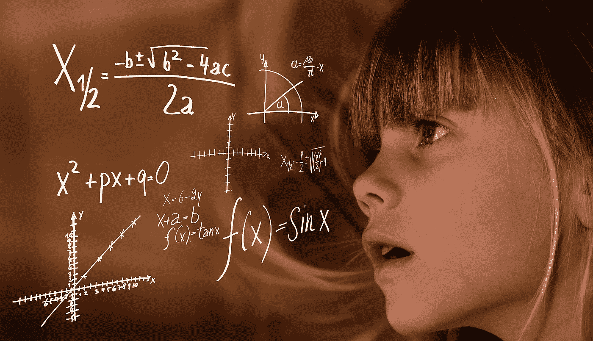
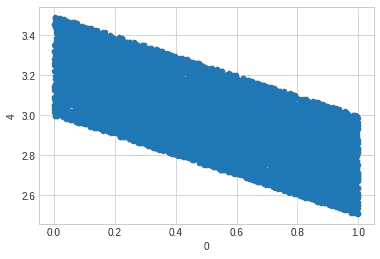
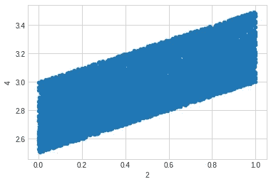
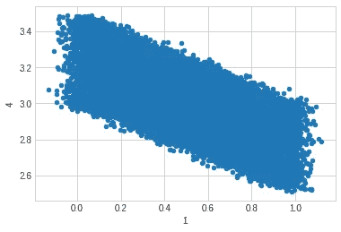
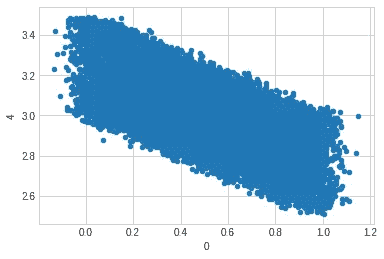
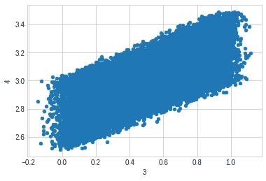
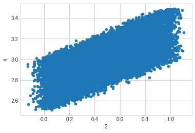
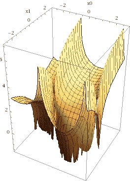

# AI Feynman 2.0:从数据中学习回归方程

> 原文：<https://towardsdatascience.com/ai-feynman-2-0-learning-regression-equations-from-data-3232151bd929?source=collection_archive---------4----------------------->

## 麻省理工学院马克斯·泰格马克实验室的新人工智能库

## 让我们在一个全新的图书馆上踢轮胎



图片来自[皮克斯拜](https://pixabay.com/illustrations/learn-mathematics-child-girl-2300141/) (CC0)

目录

1.[简介](#e5a2)
2。[代码](#96e5)3。[他们的例子](#6195)
4。[我们自己的简单例子](#cbe3)
5。[噪声数据的符号回归](#31d0)

## 1.一个新的符号回归库

我最近在 LinkedIn 上看到麻省理工学院教授 Max Tegmark 关于他的实验室发布的一个新的 ML 库的帖子。我决定尝试一下。论文名称为 [AI Feynman 2.0:利用图模块性的帕累托最优符号回归](https://arxiv.org/abs/2006.10782)，提交于 2020 年 6 月 18 日。第一位作者是席尔武-玛丽安·乌德瑞斯库，她很慷慨地和我通了电话，解释了这个新的机器学习库的背景故事。这个名为 AI Feynman 2.0 的库有助于将回归公式与数据进行拟合。更具体地说，它有助于使公式适合不同复杂程度的数据(按位定义)。用户可以从一组运算符中选择求解器将使用的运算符，求解器将完成它的工作。运算符是指诸如取幂、余弦、反正切等运算。

[**符号回归**](https://en.wikipedia.org/wiki/Symbolic_regression#:~:text=Symbolic%20Regression%20(SR)%20is%20a,starting%20point%20to%20the%20algorithm.) 是一种将用户指定的数学函数串在一起，为输出“y”构建一个最适合所提供数据集的方程的方法。所提供的数据集采用每个输入变量 x0、x1 等的样本点(或观察值)的形式，以及相应的“y”。由于我们不想在数据上过度拟合，我们需要限制方程允许的复杂性，或者至少有能力在复杂性约束下求解。与神经网络不同，学习一个只有几个简短表达式的公式会给你一个高度可解释的模型，并可能导致你从具有数百万权重和偏差的神经网络模型中可能得不到的洞察力。

这为什么有意思？嗯，科学往往会产生大量的观察结果(数据)，科学家们希望将其归纳为潜在的规则。这些规则是“符合”观察结果的方程式。与“通常的”机器学习模型不同，形式为 **y=f(x)** 的方程非常清晰，它们可以省略数据中一些不需要的变量。在实践机器学习工程师的工具箱中，[回归树](https://en.wikipedia.org/wiki/Decision_tree_learning#:~:text=Decision%20trees%20where%20the%20target,numbers)%20are%20called%20regression%20trees.&text=In%20decision%20analysis%2C%20a%20decision,represent%20decisions%20and%20decision%20making.)将是我能想到的最接近的概念，它实现了学习将观察与预测联系起来的可解释模型的想法。有一种新的方法来尝试将回归模型拟合到数据，这是对您可以在数据集上尝试的工具箱的一个很好的补充。

在本文中，我想作为一个用户(如何使用它)来探索这个新库，而不是作为一个科学家(它是如何工作的)。AI-Feynman 2.0 让我想起了 [UMAP](https://umap-learn.readthedocs.io/en/latest/) ，因为它在求解器内部包含了非常奇特的数学，但以一种抽象的方式做了一些对我有用的事情，我可以将其视为一个黑盒。我知道代码将在接下来的几个月里分阶段更新，所以当你阅读这篇文章时，今天代码的界面看起来可能不是它的工作方式。希望还会添加更多的文档，为您提供在数据上尝试这种方法的快速途径。目前，我在这篇文章中包含了一个笔记本，这样你就可以一头扎进去，从一个地方开始工作。

该库使用机器学习来帮助方程发现，递归地将问题分解为子问题，但我们不要太深入。让我们转而关注图书馆的使用。欢迎您阅读该论文，以了解更多关于该库如何解决数据上的符号回归之谜的信息。

## 2.密码

**包含本文所有代码的 Google Collab 笔记本可从这里获得:**

[](https://github.com/dcshapiro/AI-Feynman/blob/master/AI_Feynman_2_0.ipynb) [## 夏皮罗/艾-费曼

### permalink dissolve GitHub 是超过 5000 万开发人员的家园，他们一起工作来托管和审查代码，管理…

github.com](https://github.com/dcshapiro/AI-Feynman/blob/master/AI_Feynman_2_0.ipynb) 

***关于输出*** 的一些注意事项很重要。求解器多次打印出**复杂度**、 **RMSE、**和**表达式**。要知道，RMSE 数实际上并不是均方根误差。这是本文中描述的平均错误描述长度(MEDL ),这一信息将很快改变。此外，表达式打印输出不是数据集的等式，而是求解器当前正在处理的整个问题图中的子问题。这一点很重要，因为你会发现有时打印出来的结果看起来误差很小，但它只适用于某些子问题，而不是你要找的方程。最终结果使用输入文件的名称存储在结果文件夹中。

## **3。尝试来自 AI-Feynman 知识库的第一个例子**

克隆存储库并安装依赖项。接下来，编译 Fortran 代码并运行 AI-Feynman 存储库中的第一个示例数据集(存储库中的 example1.txt)。

下面列出了最初的几个步骤:

接下来，将这个文件放入代码目录，并使用 python3 运行它:

example1.txt 文件的第一行是:

```
1.6821347439986711 1.1786188905177983 4.749225735259924 1.3238356535004034 3.462199507094163
```

示例 1 包含从方程生成的数据，其中最后一列是回归目标，其余列是输入数据。以下示例显示了 example1.txt 文件的第一行与用于生成数据的公式之间的关系。

通过运行上面的代码片段，我们可以看到 example1.txt 中的目标“y”数据点是使用第 3 行的等式生成的，其中输入是除最后一列之外的所有列，等式生成最后一列。

让我们现在运行程序。在文件夹 **AI-Feynman/Code/** 中，运行命令**python 3 AI _ Feynman _ magic . py**以运行我们上面编写的程序，该程序进而将方程拟合到 example1.txt 数据集。

求解器运行很长时间，尝试不同复杂程度的不同类型的方程，并评估每个方程的最佳拟合。当它处理解决方案时，它打印中间结果。如果它遇到一个超低的错误，你可以停止程序，只使用方程。如果你让它跑到最后，那真的是你说了算。对于输入文件 **example1.txt** ，结果显示在**AI-Feynman/Code/results/solution _ example 1 . txt**中。还有其他产生结果的地方，但这是我们现在关心的地方。该文件“**解决方案 _…txt** ”对确定的解决方案进行排序。有趣的是，假设 y 是一个常数是求解者的常用策略。常量没有输入变量，因此就位数而言，它们的复杂性较低。在例 1 的情况下，方程**((x0-x1)* * 2+(x2-x3)* * 2)* * 0.5**拟合最好。

## 4.试试我们自己的简单例子

在 Collab 笔记本中，我现在将存储库和数据移动到 Google Drive，这样它们就可以持久保存。下面的代码从一个等式中生成 10，000 个例子。这个例子有 2 个“x”变量和 2 个重复的“x”变量。当然，y 仍然是输出。

绘制第一个变量与 Y 的关系，我们得到:



在我们的例子中，x0 对 y 的坐标图



在我们的例子中，x2 对 y 的绘图

既然我们已经看了一眼我们的数据，让我们要求求解程序使用我们的数据集找到一个适合我们的数据的简单方程。我们的想法是，我们希望求解器注意到，为了拟合数据，您不需要所有提供的变量。

下面是一个权限问题的示例:

如果您在尝试运行代码时遇到文件权限问题，请像这样打开文件权限:

```
chmod +777 AI-Feynman/Code/*
```

下面是运行求解器的命令。去买咖啡，因为这不会很快…

```
python3 ai_feynman_duplicate_variables.py
```

如果你没有更好的事情要做，就看着求解器走吧。请注意，求解器在混合之前会遍历一系列方程类型。它尝试的初始模型很快映射到 x0 和 x2，因为它“意识到”x1 和 x3 是重复的，因此不需要。后来，求解器找到了方程**3.000000000000+log(sqrt(exp((x2-x1))))**这有点疯狂，但看起来像一个平面。


来源: [WolframAlpha](https://www.wolframalpha.com/input/?i=3.000000000000%2Blog%28sqrt%28exp%28%28x2-x1%29%29%29%29)

我们可以在 WolframAlpha 上看到这个等式的等价形式是:

y=(x2 - x1)/2 + 3.000000000000

这就是我们用来生成数据集的！

求解器确定了 y = log(sqrt(exp(-x1+x3))+3.0，从上面的 wolfram alpha 中，我们知道这是对我们平面的正确描述。求解器最终使用 x1 和 x3，删除 x0，因为它是 x1 的副本，因此不需要；同样，删除 x2，因为使用 x3 时不需要它。

现在，那起作用了，但是它有点像垒球的问题。数据有一个精确的解，所以它不需要拟合噪音数据，这不是一个现实的真实世界的情况。真实数据很乱。现在让我们向数据集添加噪声，看看这个库是如何支持的。我们不需要引入缺失变量和插补。让我们把问题变得稍微难一点，让解算器更难处理。

## 5.噪声数据的符号回归

以下代码在与上一个示例相同的平面上创建点，但这次添加了噪波。

注意:在笔记本代码中，我将数据集大小增加到 100K 个样本(来自当前的 10K 样本),使数据集大小类似于示例 1。你不需要这样做，所以我把这个要点作为 10K 样本。

下图显示了重复列现在如何不再是完全重复的。求解程序会对带有噪声的点进行平均以获得更好的信号吗？我会将 x0 和 x1 平均为一个更清晰的点，然后将 x2 和 x3 平均为一个更清晰的点。让我们看看求解器决定做什么。



绘制 x0、x1、x2 和 x3 与 y 的关系。标签是列号。0 代表 x0，1 代表 x1，依此类推。最后一列，第 4 列，是 y。

我们现在制作另一个跑步者文件如下:

如果你有权限问题，做 chmod 777 的事情，或者 775 或者别的什么。要运行该程序，请执行以下操作:

```
python3 ai_feynman_duplicateVarsWithNoise.py
```

当求解者处理想法时，它会想出一些疯狂的东西。您可以在下图中看到求解器尝试的一个解决方案中类似平面的形状:**1.885417681639+log(((((x1+1)/cos((x0–1))+1))**。不幸的是，它在这里尝试的两个变量是 x0 和 x1，它们是彼此的副本，只添加了少量的噪声。



求解器早期解决方案之一的 [WolframAlpha](https://www.wolframalpha.com/input/?i=1.885417681639%2Blog%28%28%28%28x1%2B1%29%2Fcos%28%28x0-1%29%29%29%2B1%29%29) 3D 图。

不错的尝试求解器。让我们继续运行，看看接下来会发生什么。

求解器找到了方程:

**y = 3.0–0.25 *(x0+x1)-(x2+x3))**

正如我所希望的，求解器计算出平均 x0 和 x1 可以得到更清晰(噪声更小)的 x01，平均 x2 和 x3 同样可以得到噪声更小的 x23。回想一下，在我们向输入中添加噪声之前，用于生成“y”的原始公式是对输入数据进行运算的:

**y = -0.5*x01+0.5*x23+3**

有趣的是，求解者还发现

**y = 3.000000000000+log(sqrt(exp((x2-x0))))**

这是该公式的另一个版本，它使用更少的变量来换取稍微不太完美的数据拟合(因为添加了噪声)。因此，规划求解为用户提供了查看适合不同复杂程度数据的公式的选项。

# 6.结论

本文测试了一个名为 [AI-Feynman 2.0](https://github.com/SJ001/AI-Feynman) 的符号回归解算器，从回购中的例子开始，到我们自己从头制作的例子，最后通过添加一些噪声来挑战解算器。转载本文的笔记本可以在 [**这里**](https://github.com/dcshapiro/AI-Feynman/blob/master/AI_Feynman_2_0.ipynb) 找到。

特别感谢[席尔武·玛丽安·乌德瑞斯库](https://github.com/SJ001)帮助我更好地理解代码，并审阅了这部作品的早期草稿，以确保我没有说傻话。尝试现实世界的问题会很有趣。我已经为[Gravity-ai.com](https://www.gravity-ai.com/)容器化了这个库，以应用于真实世界的数据集。希望您会发现它很有用，并将其用于您自己的工作。

如果你喜欢这篇文章，那么看看我过去最常读的一些文章，比如“[如何给人工智能项目定价](https://medium.com/towards-data-science/how-to-price-an-ai-project-f7270cb630a4)”和“[如何聘请人工智能顾问](https://medium.com/towards-data-science/why-hire-an-ai-consultant-50e155e17b39)”还有嘿，[加入快讯](http://eepurl.com/gdKMVv)！

下次见！

——丹尼尔
[lemay . ai](https://lemay.ai/)
[丹尼尔@lemay.ai](mailto:daniel@lemay.ai)