# 用于 3d 打印的人工智能(第一部分):基于 K-均值聚类的异常熔池检测

> 原文：<https://towardsdatascience.com/ai-for-3-d-printing-anomalous-melt-pools-detection-and-classification-part-1-e84ed6f5a137?source=collection_archive---------48----------------------->

*本文是 3d 打印人工智能系列的第一部分。阅读* [*第二部分*](https://medium.com/@boonyang961005/ai-for-3-d-printing-anomalous-melt-pools-detection-and-classification-part-2-895704203c5a) *和* [*第三部分*](https://medium.com/@boonyang961005/ai-for-3-d-printing-part-3-disentangled-variational-autoencoder-for-anomalous-melt-pools-aaed53b80140) *。*

几个月前，我刚刚完成了机械工程硕士学位的最后一年计算机视觉项目。这是一个有趣的项目，因为它展示了如何使用各种机器学习模型来检测和分类 3d 打印过程中出现的异常。这一系列文章是我在进行项目时试图说明我的一些关键学习点和思维过程。希望它能激励机器学习(或数据科学)以外领域的专家在解决各自领域的新问题时考虑使用机器学习作为工具。

**免责声明** : *这不是一个循序渐进的教程。为了避免冗长的讨论，省略了一些细节。*

# 背景

为了提供背景，增材制造(AM，广义上称为 3-D 打印)指的是以分层和增材方式打印出产品的各种制造技术。与传统的制造方法相比，调幅具有许多优点。首先，由于其逐层印刷方法，在 AM 中可以避免传统制造技术中常见的材料浪费问题。更重要的是，AM 提供了前所未有的设计自由度，因为具有复杂几何形状的制造零件可以轻松打印出来。这也意味着零件设计和制造过程可以优化，以获得更高的结构强度重量比。在应用方面，AM 的优势使其对医疗工程、汽车、航空航天等行业极具吸引力。

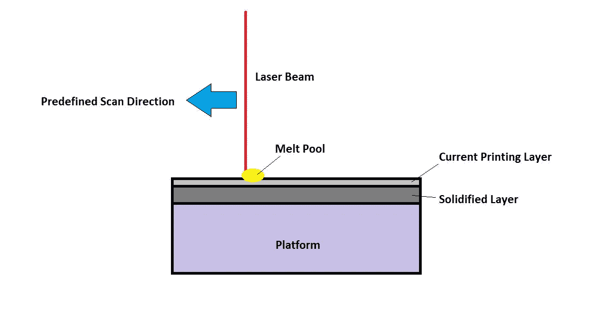

LPBF 扫描的横截面。一旦当前印刷层被固化，更多的金属粉末将被散布在当前层的顶部用于随后的印刷。(图片由作者提供)

在这个项目中，感兴趣的调幅技术被称为激光粉末床融合，LPBF。在 LPBF 中，脉冲激光束扫描预定的路径，并逐层打印出最终零件的横截面。首先，金属粉末将通过印刷平台顶部的辊均匀地散布。在扫描过程中，来自激光束的高能量密度产生局部区域，在该区域中金属粉末主动熔化并熔合在一起，形成被称为熔池的局部区域。一旦该层完成印刷，更多的粉末将被散布在固化的横截面上。在随后的扫描中，新层和固化层将融合在一起，整个过程一直持续到打印完成。

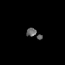

脉动熔池的慢动作同轴记录。注意偶尔的飞溅颗粒喷射和熔池不稳定的尾部。

虽然 AM 提供了很大的好处，但是由于缺陷形成而产生的不一致的零件质量极大地阻碍了它在大规模制造中的广泛采用。类似于其他类型的 AM 技术，LPBF 产品也遭受缺陷形成。这些缺陷的形成主要由对熔池中的局部温度场非常敏感的构造中的微结构发展所控制。很明显，在不利的印刷条件下，会促进缺陷的形成，但即使使用优化的扫描参数，缺陷仍可能意外形成。

# **目标**

这个项目的主要目标是开发用于异常熔池检测和分类的机器学习框架。熔池几何形状的研究至关重要，因为熔池条件会直接影响成型质量。具体来说，正如我们将在后面看到的，熔池成像数据以视频帧的形式出现，我们将建立模型来量化这些熔池的异常程度。对于缺陷研究来说，知道异常何时发生是不够的。研究工程师还对缺陷形成的熔池动力学研究感兴趣，即不同尺寸和形状的熔池是如何形成的，以及它们对成型质量的影响。因此，异常熔池也必须根据其几何形状进行分类。

> 简而言之，给定一个熔池框架，我们希望用某种度量来量化它的异常程度，如果这个度量超过某个阈值，那么我们将基于它的几何形状对熔池进行分类。

如上所述，即使有正确的扫描参数，缺陷的形成仍然是不可避免的。因此，该项目的长期愿景是将经过良好测试的机器学习模型整合到 LPBF 现场监控系统中，以便能够对印刷工艺参数进行实时**控制和监控**，从而最大限度地降低制造过程中形成缺陷的可能性。这也意味着，对于实时检测，我们的模型处理数据的速度很重要。目前，数据采集速度为 100k FPS。同样地，如果我们想要将任何类型的演算法整合到 3d 印表机中，每一个视讯画面的资料处理速度必须少于 10 微秒。

# **数据**

1.  用于分析的主要数据包括印刷过程的同轴熔池视频帧。熔池的温度是同轴解析的(即我们跟随熔池移动，因此它将保持在屏幕的中心)，并在打印的同时记录。
2.  我们还有位置数据集，为熔池视频帧提供位置参考。

用于打印该数据集的预定义扫描路径被称为曲折策略(基本上是之字形路径)。因此，在我们的数据集中，我们有向相反方向移动的熔池。

# **探索性数据分析**

在探索性数据分析(EDA)中，对一些熔池进行了检查，以获得对数据集的早期理解。这对于建立对数据集中潜在异常类型的预期至关重要。给定数据集中的一些熔池视频帧随机显示如下。请注意，给定的数据集由聚焦和失焦的熔池帧组成。

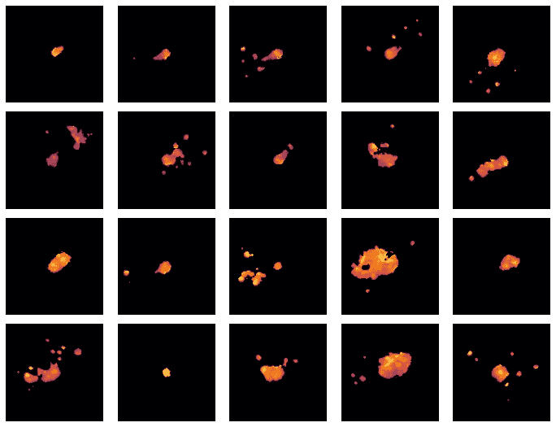

聚焦和失焦印刷的随机取样熔池图像

一些类型的熔池在许多随机观察中一致出现。例如，一些熔池具有不稳定的尾部。带有**不稳定或分离尾部**的熔池可能导致剥蚀，由于熔体流的表面张力，周围的金属粉末被吸向熔池。这改变了局部粉末形态，并可能导致孔隙缺陷。此外，我们还在熔池周围观察到**羽流喷射**。通常，羽流的尺寸较大，形状快速变化且不规则，与普通熔池不同。最后，还观察到**飞溅颗粒**离开熔池的快照。飞溅颗粒是未熔化或部分熔化的粉末颗粒。由熔池周围的涡流循环引起的飞溅颗粒的喷射使熔池周围的金属粉末重新分布，这又会导致气孔问题。

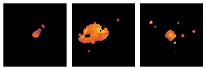

尾部分离、羽流和飞溅粒子喷射

根据观察到的熔池动态，开发了一些粗略的指标来帮助理解数据集。每个指标旨在回答关于熔池动力学的不同问题:

1.  **子区域平均值(SRM)** 是视频帧的外边界中的平均像素强度的量度(定义为在所有 4 个方向上距离视频帧边缘 20%的宽度),并提供关于飞溅颗粒的分散性的见解，
2.  **亮像素比例(PBP)** 测量亮像素的覆盖范围或熔池的大小
3.  **像素值的标准偏差(SD)** 由于像素亮度与解析温度成正比，因此可洞察熔池温度场的分布。

计算出的度量被标准化，并相对于帧数或扫描进度绘制。根据该图，我们意识到，当聚焦高度为 0 和 4 毫米时，指标相对更稳定，幅度更小。

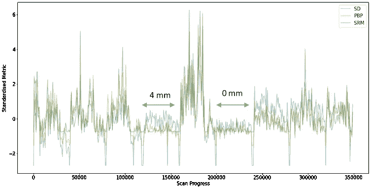

扫描过程中各种标准化指标的时间变化。

不涉及太多细节，该图对应于具有不同聚焦高度的九个圆柱形块的印刷。具有相对稳定度量的区域对应于具有 0 和 4mm 聚焦高度的印刷。

# **特征提取**

记住，这里的目标是识别在一组优化的参数下产生的异常熔池(何时何地发生)。来自 Skimage 模块的 Python 的 Regionprops 函数用于提取几种类型的**熔池**和**飞溅颗粒**特征。这些功能与以下内容相关:

1.  大小
2.  古怪和
3.  数量(仅飞溅颗粒计数)

举例来说，下面是熔池和飞溅颗粒尺寸的分布:

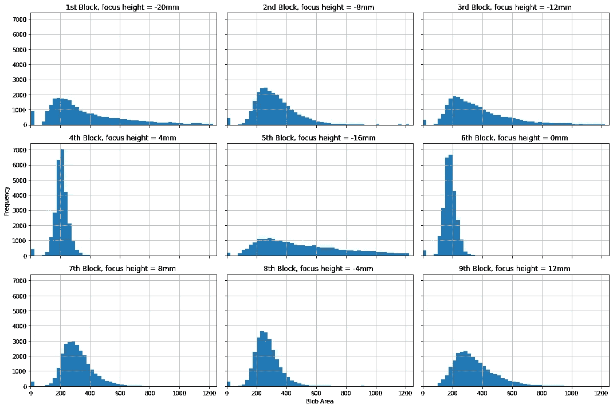

不同聚焦高度下熔池(假定为视频帧中最大的斑点)的面积或大小直方图。

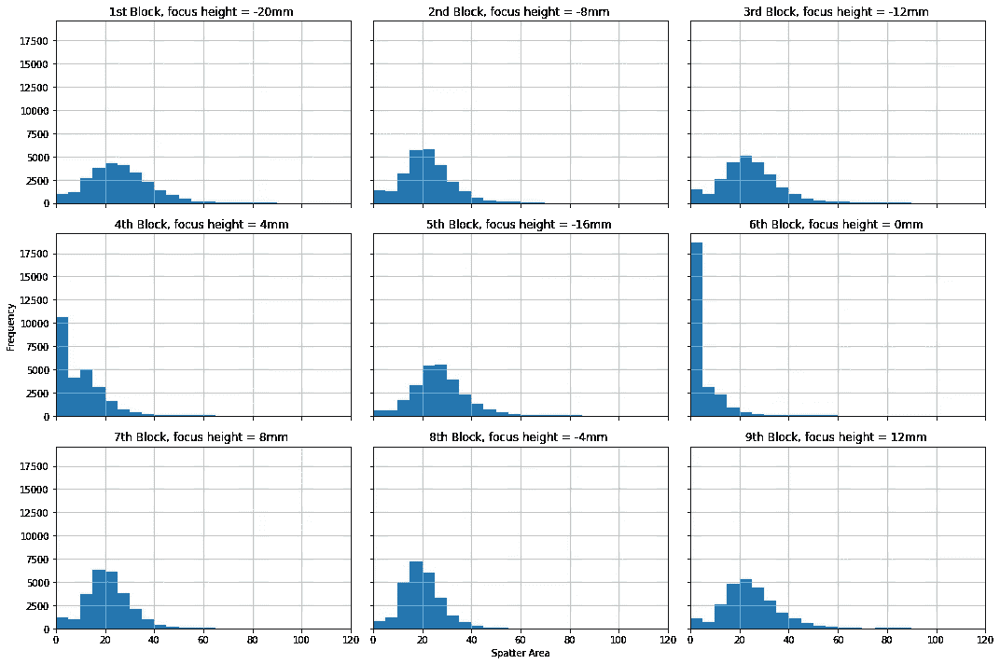

飞溅面积或飞溅颗粒大小的直方图。

同样，这些分布与 EDA 的观察结果一致，即聚焦高度为 0 和 4 mm 的熔池印刷更稳定(具有更一致的尺寸和更少或更小的飞溅颗粒)。

随后，对区域 props 特征进行标准化，并对来自焦点高度= -4 mm、0、4 mm 和 8 mm 的那些熔池帧的标准化特征采用 K 均值聚类。为了方便起见，来自-4 mm 和 8mm 数据集的所有帧被标记为失焦，而来自 0 和 4 mm 数据集的帧被标记为聚焦。区域 props 特征被传递给 k-means 聚类算法，然后标签被用于聚类分析。

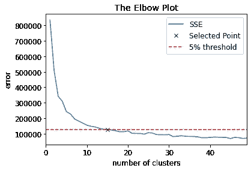

用于确定聚类数的肘形图，k 表示 k 均值聚类。

根据弯管图，选择 k=15。增加聚类的数量，k 将导致误差平方和(SSE)的递减，而降低 k 将导致大的 SSE。

# 聚类分析

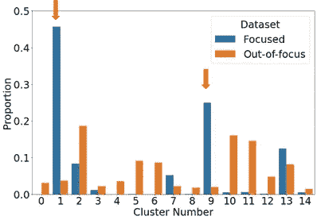

聚类分析:已识别聚类中聚焦(或失焦)熔池的比例。

做了一个重要的假设，即重点数据集中的大多数熔池是正常熔池(非异常)。因此，后续聚类分析的目标是找出最能代表聚焦熔池的聚类。基于聚类分析，聚类 1 和聚类 9 最好地代表了按比例集中的熔体池。此外，分析显示，聚焦熔池彼此更接近，而离焦熔池分散在标准化特征空间的各处。

执行快速健全性检查，聚类的质心坐标(在逆变换回预先标准化的特征空间之后)确实支持我们的假设。簇 1 和簇 9 的形心具有零飞溅特性，同时具有相似的熔池尺寸和偏心率。

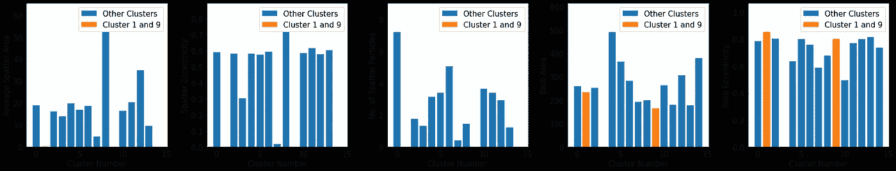

区域属性特征空间中聚类的质心值

> 聚焦熔池更集中，而离焦熔池分散在特征空间的各处。

从集群中可视化聚焦熔池框架:

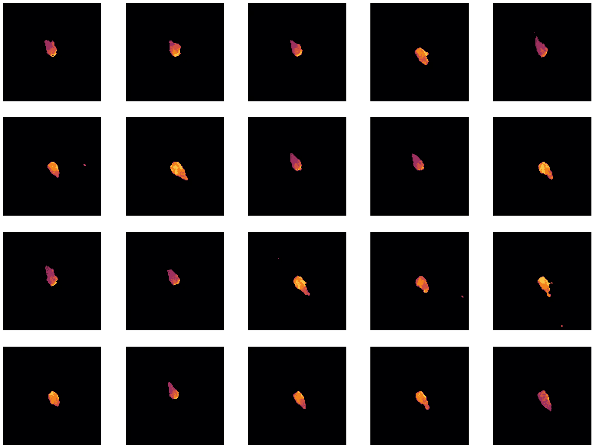

来自簇 1 的熔化池。

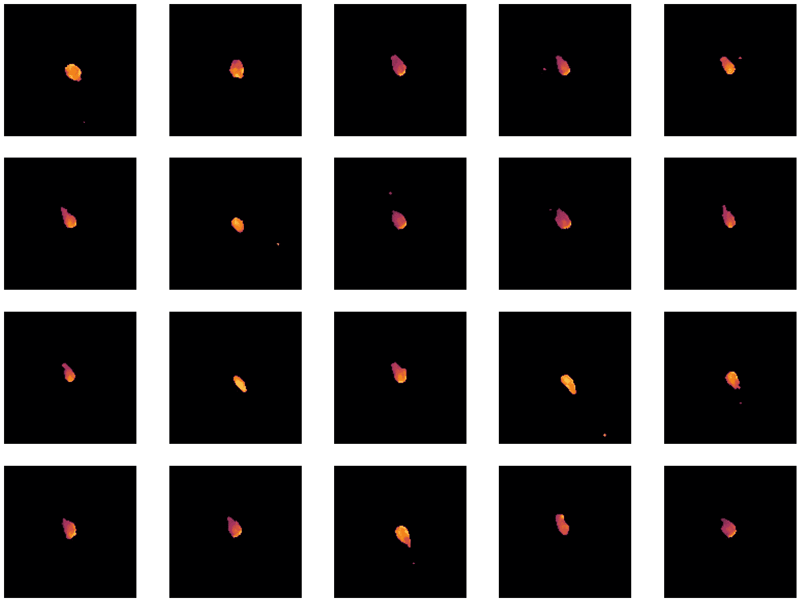

第九组的熔池。

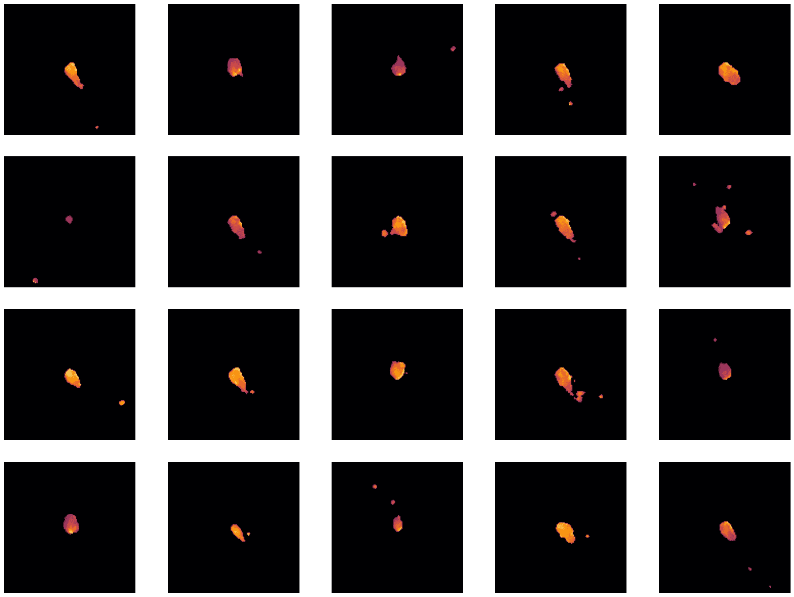

其他星团的熔池。

很快，我们可以看到来自不同团簇的熔池的视觉外观差异。簇 1 和簇 9 中熔池更干净，没有太多的飞溅喷射，且在尺寸和几何形状上更一致。另一方面，来自其它团簇的熔池在尺寸、几何形状和动力学方面不太一致。

# **一些想法**

理论上，我们可以为区域 props 特征确定一些合适的阈值，然后实时提取熔池特征以标出异常。这将允许我们绕过任何机器学习步骤。然而，区域道具提取每个视频帧的特征需要大约 10 毫秒，比视频的每秒帧数慢大约 100 倍。此外，我们最终可能会有太多的指标来跟踪异常检测。对此的补救办法是只提取异常熔池的特征用于缺陷研究。也就是说，在特征提取之前，我们采用异常检测框架来检测异常。由于异常很少发生，我们也许能够显著减少需要区域道具处理的帧数。

通过 K-Means 聚类分析，我们观察到正常熔池在特征空间中倾向于彼此靠近，而异常熔池倾向于分散在正常熔池周围并远离正常熔池。被称为**一类学习**的无监督机器学习概念是这类问题的合适候选，我们将在第 2 部分对此进行更多的探讨。

# 结束语

本文说明了如何使用区域 props 函数和 k-means 聚类等简单技术和工具从熔体池数据集中标记出视频帧异常。在下一篇文章中([3-D 打印系列的 AI 第 2 部分](https://medium.com/@boonyang961005/ai-for-3-d-printing-anomalous-melt-pools-detection-and-classification-part-2-895704203c5a)，我们将展示第一个用于异常检测的机器学习框架。感谢阅读:)