# 人工授精的人工智能——传感器数据的深度拓扑分析

> 原文：<https://towardsdatascience.com/ai-for-ai-artificial-insemination-deep-topological-analysis-for-sensor-data-9fceccb59bf?source=collection_archive---------16----------------------->

## 了解 TDA 和深度学习如何对事件进行分类，并发现物联网活动传感器数据流中的隐藏模式

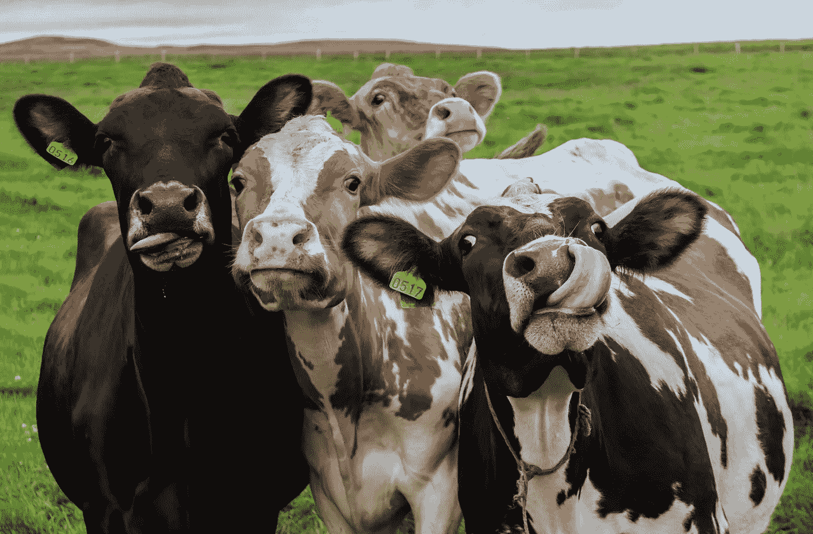

[Shutterstock](https://www.shutterstock.com/image-photo/four-funny-cows-looking-camera-481623085)

假设您有多个传感器数据流，并且您希望能够对事件进行分类。它可以使用飞机引擎上的传感器来检测次优模式或医学诊断来检测疾病。

*   位置(三个方向的罗盘数据)
*   速度(三个方向的陀螺仪)
*   加速度(三个方向的加速度计)

使用 PowerBI 或 Tableau 等流行的商业智能工具无法分析这种类型的数据。这样的系统将无法捕捉数据中的复杂模式，也不允许你去探索它们。

然而，这对于深度拓扑分析(DTA)和复杂模式的视觉理解来说是一个很好的情况。DTA 是无监督机器学习的一个例子，这意味着您不需要在分析之前标记您的数据。输出是忠实于基础数据但对主题专家来说是直观的行为聚类。这种更精炼的方法可以让你发现**你不知道的**你不知道的*。*

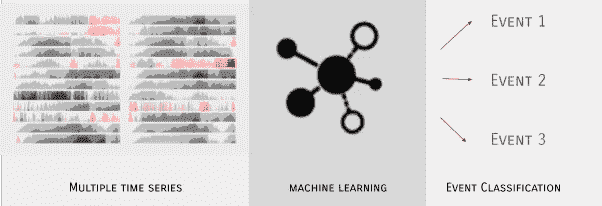

流程的高级表示

**首先，一个人类的例子**

手机是运动数据的典型来源:x、y、z 平面上的位置、速度和加速度。

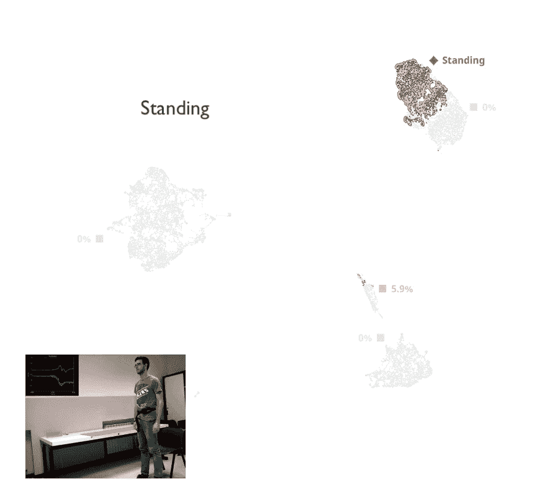

*手机活动集群化，包括 smartlab 提供的视频【1】*

对这些数据运行 DTA 可以让您看到算法是如何工作的(见图片)。每个点都是一个短暂的时间窗口，两个点越靠近，在该窗口中发生的行为越相似。自然的行为集群从算法中出现，这些集群可以很容易地被主题专家识别(在这种情况下，我们都熟悉在房子周围移动)。

广泛的集群——站立、坐着和躺着——立即显现出来。但是放大图像会显示更多有趣的子结构，比如上楼、下楼和其他类型的有趣行为。这种类型的可视化给出了对那些了解该领域的人有意义的集群的广泛分布，并且在许多情况下，子结构增强了对主题专家的理解。

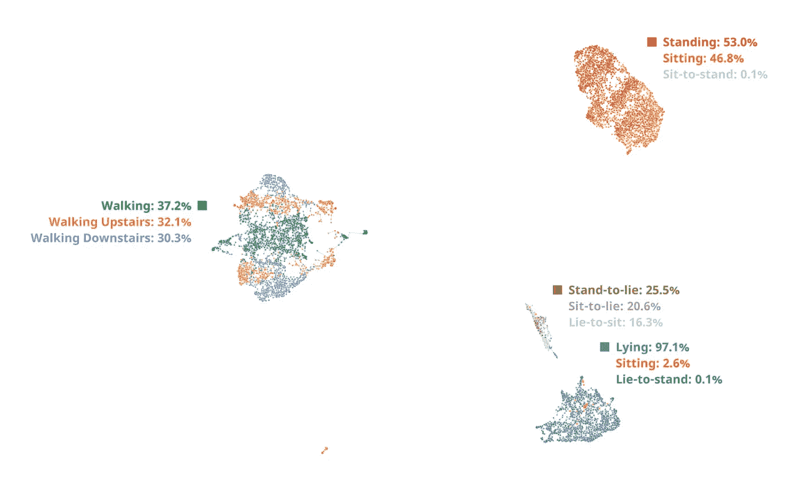

*使用手机拍摄的活动片段*

**艾对一瘸一拐的牛**

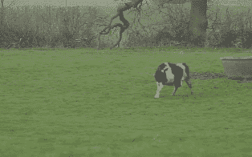

不是一瘸一拐的牛，[跳舞的牛 youtube 视频](https://www.youtube.com/watch?v=5KaltD0Z6ww)

一个好的农民了解他的奶牛，并且知道它们什么时候发情。但是用一个低成本的项圈远程做到这一点是一个数百万美元的数据科学挑战。每个项圈都安装了一组传感器，可以全天候捕捉数据，并每分钟发送一次数据快照。每个传感器产生 9 个数据流:

*   位置(三个方向的罗盘数据)
*   速度(三个方向的陀螺仪)
*   加速度(三个方向的加速度计)

所以每头牛都有很多数据要分析，我们可能在谈论成千上万头牛。

解决这个问题的一个简单方法是测量行走的距离——奶牛发情时会走更多的距离。然而，更精确的分析包括推断所述奶牛的事件和行为。这导致对奶牛正在做什么以及它们处于什么状态有了更完整的了解。重要的是，这种类型的分析可以让你发现你*以前不知道的活动，*比如跛行或疾病*。*

当数据变大时，标准方法很快就会丢失细节或完全失效。一些不起作用的方法有:

1.  主成分分析(PCA) —非常快，但通常不适用于人工分析，因为容易产生斑点
2.  多维扩展(MDS) —无法识别结构，速度太慢，对于大数据量来说内存不足
3.  t-SNE——取得了一些成功，但经常遗漏细节，或者发现太多细节并导致错误的聚类，从而歪曲了数据的实际结构
4.  UMAP——是一种很好的最新算法，它的性能优于 t-SNE，尽管它没有深度学习那样的学习能力来从数据中捕捉复杂的高级模式

使用所讨论的算法处理来自奶牛传感器的数据。所有算法都使用默认的元参数执行。

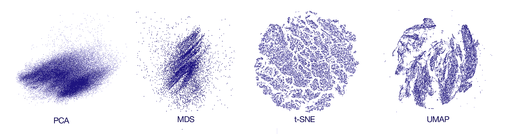

*PCA、MDS、t-SNE 和 UMAP 算法提供的嵌入*

如你所见，主成分分析和 MDS 未能从数据中捕捉到任何结构。另一方面，t-SNE 似乎捕捉到了太多的结构，其中大部分并不存在于数据中。UMAP 显示了有希望的结果，尽管聚类不如 DTA 那样明显，并且结构有些模糊。DTA 结果如下:

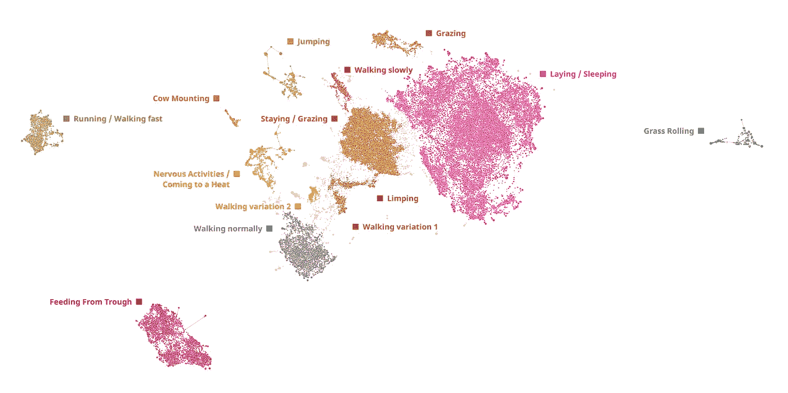

*对 43 头奶牛的活动进行聚类，聚类被自动发现，并由主题专家进行标记*

图上的每个点代表数据集中每头奶牛活动的 10 分钟窗口。点放在一起形成独特活动的集群。

相比之下，DTA 维护许多细粒度的结构。随着时间的推移，我们发展了这种方法，这是我们处理集群问题的首选方法。

在 DataRefiner 以完全无人监管的方式使用 DTA 算法分析了奶牛传感器数据后，我们得到了几个非连续事件期间奶牛活动的地图。每头奶牛的总时间约为 2000 分钟(或 83 小时)；地图上有 43 头奶牛。每个点代表 10 分钟奶牛活动的窗口(按分钟滑动)。独立的聚类代表独特的活动类型，聚类之间的距离越远，活动的差异就越大。我们对活动模式进行了广泛的验证，可以确认细分是准确的。

正如你所见，奶牛大部分时间都在躺着和吃草/喂食，但也有一些其他活动，如跳跃或打滚。

以下是奶牛在活动中的分布情况:

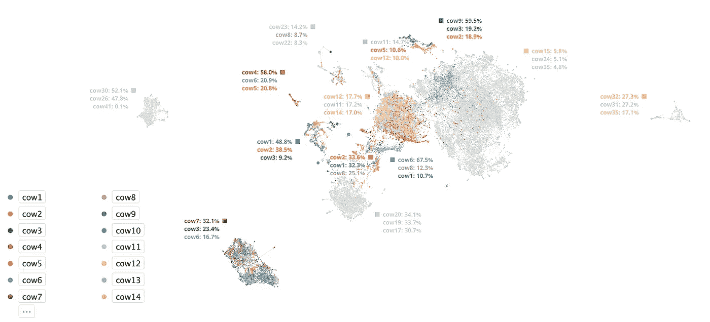

*14 头奶牛群的活动分布*

我们根据奶牛(前 14 头奶牛)给地图上的点着色，剩下的部分为灰色以便于阅读。奶牛在活动中的分布并不均匀，似乎每个奶牛都有自己的偏好。通过选择一只特定的奶牛，我们可以探索这头奶牛做了什么以及她参与了哪些活动模式。

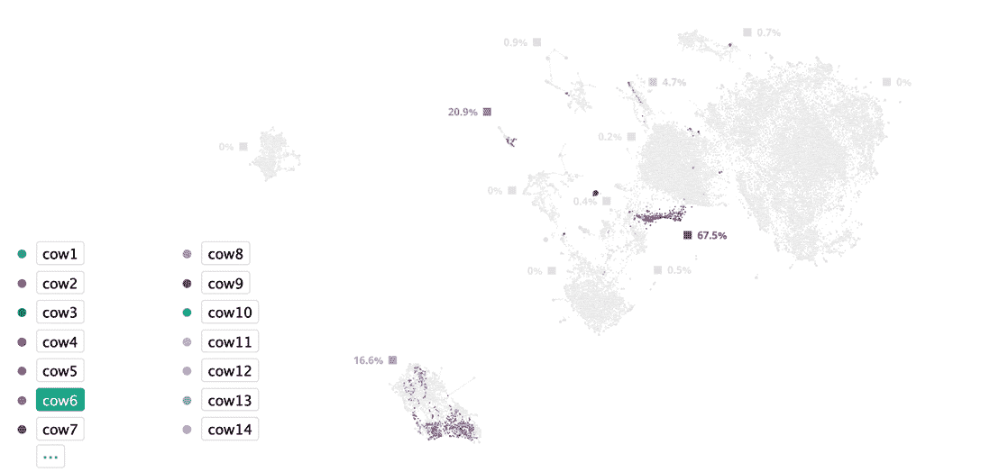

*跛行奶牛模式动画(在集群视图和奶牛活动视图之间切换)*

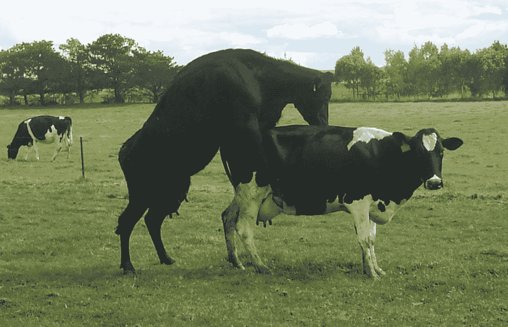

发情的奶牛[2]

Cow6 有不寻常的活动模式——她在从食槽进食和非常接近行走的活动之间花时间。这是一个具有独特模式的独立集群，所以经过一些审查后，我们发现 Cow6 是一瘸一拐的。她不能跑长距离，所以她的行为通常不会被归类为发情。然而，我们可以看到，当它们发情时，她也活跃在“骑牛”群里(见图)。通过这种方式，我们知道我们有一只跛行的母牛发情了——这是一个非常精确的结果，否则可能会被错过。现在到了一种不同类型的人工智能的时候了:人工授精。

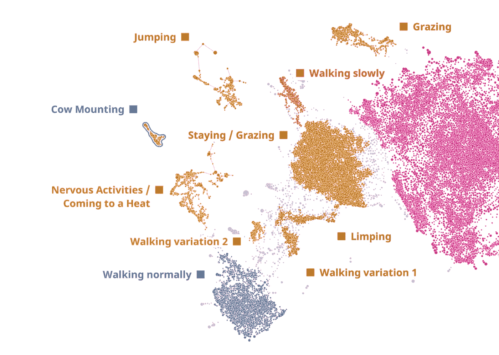

*易于使用的可视化工具有助于快速识别“奶牛饲养”集群，这是农业行业的直接行动号召。*

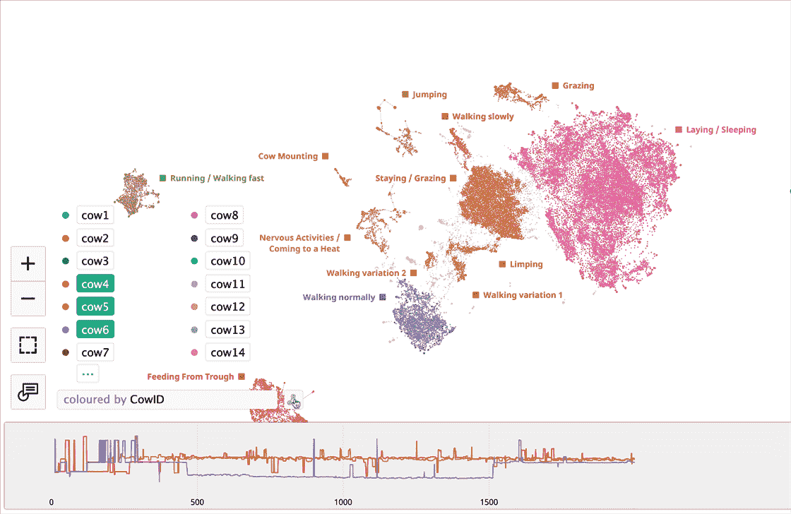

*分析 DataRefiner 平台中跛行 cow6 的“Cow Mounting”集群*

**深度拓扑分析**

深度拓扑分析(DTA)是拓扑数据分析(TDA)和深度生成模型的结合。

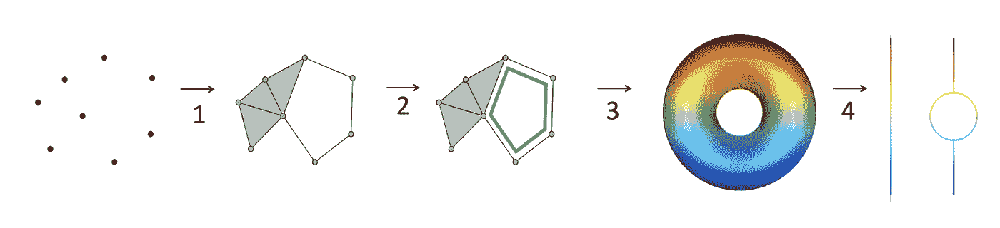

*传统 TDA 计算的四步流程*

计算过程的目的是获得 2D 或 3D 平面上多维结构的近似表示。一般的 DTA 过程如下:

1 取原始维度的点云，计算嵌套的拓扑复合体。在这种情况下，我们将使用 Vietoris-Rips 算法。这是将附近的点连接成拓扑结构的过程。

*Viet oris-Rips 算法动画【3】*

2 使用嵌套复合物计算这种结构的拓扑持久性。使用上一步创建的复合物，我们可以计算结构的条形码。这些条形码将帮助我们识别结构的持久元素。

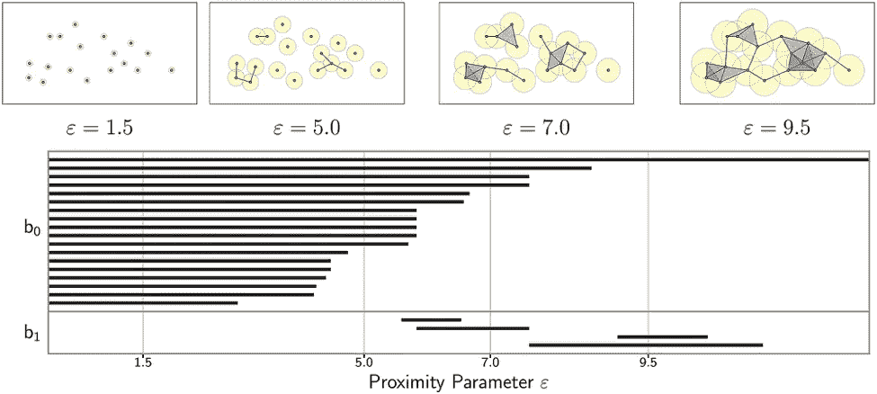

*从嵌套复合体生成条形码【4】*

3 利用莫尔斯理论创建数据结构流形。这一步有助于我们简化原始尺寸的流形，并允许我们转换用户分析的结果。

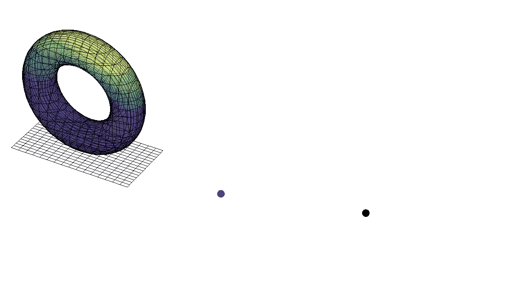

*以高度函数为莫尔斯函数的圆环体。在左边我们看到一个平面表示级别，在中间是子级别集，在右边是相应的复合体[5]*

4 从多维结构中提取 Reeb 图。使用 Reeb 图和 Morse 理论的结果计算 2D 和 3D 表示。

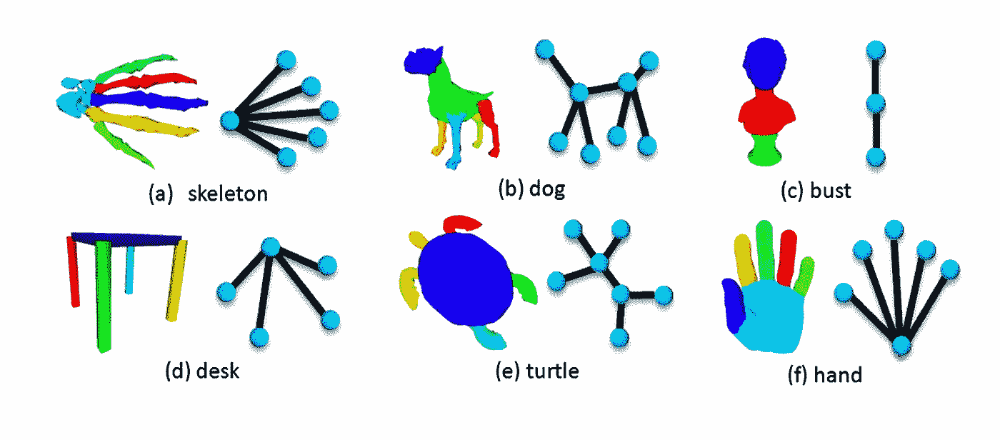

*通过谱聚类的 Reeb 图计算【6】*

第 3 步和第 4 步的计算量非常大，尤其是对于具有大维数的大量数据。为了使这些步骤在实际应用中可行，我们必须进行近似和估计。

在这里，我们不是做一个简单的近似，而是使用生成模型不仅得到一个简单的近似，而且从数据中学习复杂的模式。这有助于获得更好的聚类和模式分离。

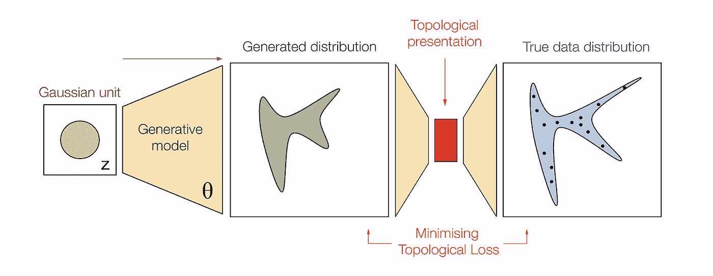

*使用 GAN 进行拓扑计算(OpenAI 的 GAN 图[7]的修改版本)*

**结论**

在 DataRefiner，我们已经在许多公司使用这项技术，不仅用于物联网分析，还用于用户活动和文本分割。如果您想了解更多信息或预订演示，请联系我们。

****

[DataRefiner.com](https://datarefiner.com/)是一家总部位于英国的公司，专注于复杂数据的分析和细分，如用户活动、传感器或文本。DataRefiner 平台是这里讨论的多年提炼方法的结果，但它被广泛应用于各种行业，包括航空、社交网络、欺诈检测等等。如需了解更多关于您所在行业的信息，请通过 ed@datarefiner.com 联系我们

**原文:**[【https://datarefiner.com/feed/ai-for-ai】T21](https://datarefiner.com/feed/ai-for-ai)

参考资料:

[1]基于智能手机的人类活动和姿势转换识别，[https://sites.google.com/view/smartlabunige](https://sites.google.com/view/smartlabunige)

[2]纳迪丝。国家动物疾病信息服务。发情期的奶牛:[https://www . nadis . org . uk/disease-a-z/黄牛/奶牛群的繁殖力/part-2-heat-detection/](https://www.nadis.org.uk/disease-a-z/cattle/fertility-in-dairy-herds/part-2-heat-detection/)

[3] Vietoris-Rips 算法动画:[https://towards data science . com/the-shape-that-survive-the-noise-f0a2a 89018 c 6](/the-shape-that-survives-the-noise-f0a2a89018c6)

[4]拓扑数据分析—持续同源:【http://outlace.com/TDApart1.html】T4

[5]马蒂亚斯·温特拉肯:[https://www-sop.inria.fr/members/Mathijs.wintraecken/Mathematica . html](https://www-sop.inria.fr/members/Mathijs.Wintraecken/Mathematica.html)

[6]马腾；庄智武；裴洛；冯路。通过谱聚类进行 Reeb 图计算，2011 年

[7]原开乃甘图:[图](https://openai.com/blog/generative-models/)