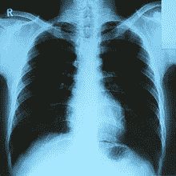

# 人工智能医疗保健:介绍你可能想不到的一切

> 原文：<https://towardsdatascience.com/ai-for-healthcare-an-introduction-f5ae368bc0ef?source=collection_archive---------46----------------------->

## 专注于计算机视觉、工作流程和放射学

乔纳森·博尔巴在 [Unsplash](https://unsplash.com?utm_source=medium&utm_medium=referral) 上的照片

我们的医疗保健系统存在短缺。

美国医学院[协会](https://www.aamc.org/news-insights/press-releases/new-findings-confirm-predictions-physician-shortage)最近的一项调查发现，到 2032 年，仅在美国，我们就将缺少**46，900 到 121，900 名医生**，其他国家的情况也好不到哪里去。

这意味着医生将需要工作**更多的时间**，有**更多的工作**在他们的盘子上，同时试图**为他们的病人保持高质量的护理**。

在最近的疫情事件中，我们已经看到了我们的医疗系统是多么的脆弱，甚至忽略了医生的职业倦怠正在上升。

*研究人员调查了在 119 个门诊诊所工作的 422 名家庭医生和普通内科医生，调查了这些诊所的 1，795 名患者，并审查了他们的医疗记录，以获得关于护理质量和医疗错误的信息。超过一半的医生报告在进行体检时经历了时间压力。* ***近三分之一的人认为他们需要的时间比分配给这项病人护理职能的时间至少多 50%****。此外，近四分之一的人表示，他们需要至少 50%以上的时间进行后续预约。***—**[**医疗保健研究与质量局**](https://www.ahrq.gov/prevention/clinician/ahrq-works/burnout/index.html)

但是我们可以建立系统来帮助减轻医生的负担，通过**简化他们的工作流程**和**让他们使用高质量的工具**来使他们更容易工作。

这篇文章将作为我将要写的人工智能在医疗保健系统中的应用的介绍。在这里，我将重点关注**临床成像和人工智能算法的应用，以帮助临床医生。**

# 用于临床成像的工具

在训练机器学习模型时，对数据集可能包含的图像类型有一个大致的了解非常重要。一些图像可能非常详细，并允许更高的训练精度。其他图像的细节可能较低，但使用频率更高。

例如，您可能开发了一个很好的模型，可以在 CT 扫描中确定骨折的位置，但该模型在 x 射线扫描中可能表现不佳。如果大多数医院和诊所使用 x 射线检查骨折，而你的模型不能很好地处理这类数据，那么它可能就没用了。

这就是为什么知道可用的想象工具的类型很重要，这样你就可以研究如何最好地实现你建立的模型。

我们将重点介绍临床医生使用的三种机器。

## 1.x 射线

x 射线通常用于骨骼，有时也用于像肺或心脏这样的致密器官。

这种机器的工作原理是让放射线(x 射线)穿过身体的某个部位。被高密度物体阻挡的辐射在电影中呈现白色。

它们通常用于诊断:

*   疾病/骨骼退化
*   变色
*   骨折
*   肿瘤
*   感染

这些图像通常不如其他成像解决方案详细，并且需要使用辐射。

来自[维基百科](https://upload.wikimedia.org/wikipedia/commons/thumb/9/9c/Lung_X-ray.jpg/220px-Lung_X-ray.jpg)

x 射线将捕捉到**一个单一的 2D 图像。**

x 射线通常是医疗成像中最便宜的**选择，有时会先做，即使临床医生认为你之后可能需要 CT 或 MRI。**

## 2.CT 扫描

CT 扫描与 x 射线相似，都是利用辐射来捕捉图像。主要区别在于，它能够捕捉身体的多个切片，为医生提供所捕捉切片的 3D 视图。

来自[维基百科](https://upload.wikimedia.org/wikipedia/commons/thumb/2/2b/CT_of_a_normal_abdomen_and_pelvis%2C_thumbnail.png/220px-CT_of_a_normal_abdomen_and_pelvis%2C_thumbnail.png)

CT 非常强大，因为它们允许临床医生创建骨骼、血管、软组织和其他器官的详细图像。

它们通常用于诊断:

*   阑尾炎
*   巨蟹星座
*   创伤
*   心脏病
*   传染病。

重要的是要注意图像本身不是 3D 的**，而是多个 2D 图像**。

CT 扫描比 x 射线更贵，但能提供更多细节。

## **核磁共振扫描**

磁共振成像(或 MRI)通常用于软组织损伤，如肌肉或结缔组织。这是因为他们为这些类型的组织提供了更多的细节。核磁共振成像使用电磁体来产生图像，因此不会受到辐射。

然而，这意味着它们不能被体内有金属的人使用。核磁共振成像可以产生 2D 和三维图像

来自[维基百科](https://upload.wikimedia.org/wikipedia/commons/thumb/4/44/Structural_MRI_animation.ogv/256px--Structural_MRI_animation.ogv.jpg)

核磁共振成像是医生可能拥有的最昂贵的成像工具。

***来源:*** *你可以在这里阅读更多关于差异*

# *医学成像中的工作流程*

*下一个需要理解的重要部分是诊所和医院通常用于成像的**工作流程。***

*这些信息将帮助我们知道，在 ***我们的模型应该部署到哪个阶段。****

*这里我们看到 5 个主要阶段。图像首先通过使用 X 射线、CT 或 MRI 拍摄。这些**图像**然后被存储在一个叫做**图像存档和通信系统(PACS)** 的在线服务器中。该服务器允许不同部门访问医院中的成像信息。然后一名**放射科医师**将按照**先进先出**的顺序阅读并解读图像。他们将识别异常，然后生成患者图像的**解释**。最后，**医生**将根据扫描结果和所有其他可用信息做出诊断。重要的是要知道诊断只能由内科医生而不是放射科医生做出。*

# *执行的成像类型*

## *1.诊断性影像学*

*如果临床医生认为患者有某种问题，需要通过想象来验证，那么我们称之为诊断图像。*

*例如，在医生可能认为脑震荡对大脑造成了严重损害的情况下，他们可能会要求进行 CT 或 MRI 扫描，以诊断是否有任何明显的脑损伤。*

*诊断图像可用于生命可能受到威胁的紧急情况(例如验证脑出血)或非紧急情况。*

## *2.排查*

*这通常用在病人没什么问题，但风险较低的时候。例如，具有肺癌家族史的患者可以接受定期筛查以进行早期检测。*

*这些通常是非紧急情况。*

***来源** : [梅菲尔](https://www.radiology.ca/article/whats-difference-between-screening-and-diagnostic-imaging)*

# *基本 2D 图像算法*

*接下来，我们应该简单了解一下可以应用于医学图像的成像算法的类型。这些算法将帮助我们确定解决特定问题的最佳方法和解决方案。*

## *分类*

*分类用于识别图像属于哪一类。这是通过识别结构或用图像寻找的算法来完成的。这可以是二进制或多类。用外行人的话来说，分类解决了“这是猫还是狗的照片”。在医学上，我们可以用它来检测图像中是否存在肿瘤。*

*例如，如果我将它交给一个图像分类器，它将返回结果“ ***患者患有肿瘤*** ”。它不会提供任何其他信息，如肿瘤的大小或位置。*

**

*[维基百科](https://external-content.duckduckgo.com/iu/?u=https%3A%2F%2Fupload.wikimedia.org%2Fwikipedia%2Fcommons%2Fthumb%2Fe%2Fe4%2FMeningiomaMRISegmentation.png%2F1200px-MeningiomaMRISegmentation.png&f=1&nofb=1)*

## *定位(检测)*

*定位类似于分类，因为它将识别一个结构或发现是否存在。但它走得更远了。*

*本地化不会告诉您存在一个发现，而是将模型已经识别的每个发现的位置装箱。这对于吸引放射科医师的注意力非常有用，放射科医师可以更快地识别潜在的感兴趣点。*

*在上面的例子中，肿瘤非常明显。但在下一个例子中，我们将寻找肺部病变。*

**

*[中值技术](https://mediantechnologies.com/imaging-for-clinical-trials/)*

*这里，该算法能够正确识别肺部病变。有时，还会给出一个置信度来帮助放射科医师了解模型认为它识别了正确区域的可能性有多大。*

## *分割*

*分割类似于定位和分类，因为它将识别结构或发现是否存在，并定位它们在图像上的位置。*

*分割将识别图像中包含结构的像素，并突出显示该结构。这对于获取结构的面积或大小以及跟踪其随时间的增长或收缩非常有用。*

*例如，在这个例子中，这个模型不是仅仅包围肿瘤所在的区域，而是试图勾勒出确切的肿瘤轮廓。这使得从某个切片或图像通过计算确定肿瘤的大小变得更加容易。*

**

*[ingegneriabiomedica.org](https://external-content.duckduckgo.com/iu/?u=https%3A%2F%2Fcdn.ingegneriabiomedica.org%2Fuploads%2F2018%2F06%2FSegmentazione-1024x804.jpg&f=1&nofb=1)*

# *利益相关者*

*如果你想把你的产品推向市场，重要的是要注意哪些利益相关者参与其中，并以对每个利益相关者都有利的方式形成你的产品。*

## *放射科医生(临床利益相关者)*

*   *这通常是算法的最终用户，应该熟悉算法的准确性和可能出现的故障类型。*
*   *在开发您的模型时，他们将扮演重要的顾问角色，提供他们日常面对的重要见解。*
*   *放射科医生最关心的是有低分配到那里已经繁忙的工作流程。拥有一个难以使用的优秀表演模型是行不通的。*

## *临床医生(临床利益相关者)*

*   *临床医生对你的算法的理解会更模糊。*
*   *临床医生也关心对工作流程的低干扰。一个耗时太长或者提供的数据不容易被临床医生理解的算法对他们来说是没有用的。*

## *患者(临床利益相关者)*

*   *病人将是最重要的利益相关者。*
*   *病人可能永远不知道人工智能参与了诊断过程。*
*   *患者最关心的是理解为什么他们的诊断是这样的，获得诊断的时间长度，以及诊断的准确性。*

## *医疗器械公司(行业利益相关方)*

*   *这些公司生产用于医院、实验室和诊所的设备。*
*   *他们通常有自己的随行成像软件，并开发自己的 AI 算法。*
*   *医疗设备公司*
*   *了解这些系统的能力以及您的算法如何改进或增强当前已经使用的软件非常重要*

## *软件公司(行业利益相关者)*

*   *为成像或临床应用开发人工智能算法。*
*   *他们必须明确他们的软件是在哪种类型的医学成像硬件上通过验证的(出于监管目的)。*

## *医院和放射诊所(行业利益相关者)*

*   *必须能够支持部署的任何算法的基础设施(云资源/GPU/其他硬件)*
*   *随着时间的推移，对人工智能的兴趣通常与降低成本联系在一起。*

## *监管机构(监管利益相关方)*

*   *他们主要关心的是病人的安全。这意味着非常严格的监管。*
*   *他们确保该算法被贴上标签，投入市场，并在临床环境中适当使用。*
*   *FDA **等监管机构将医学成像的人工智能算法视为医疗设备。***

# *AI 什么时候最有效？*

*当它使每个相关人员的**工作变得更容易、更高效时**。算法的准确性很重要，但实现算法的方式也同样重要。*

1.  *算法应该让关键研究**更快地解读。***
2.  *它应该有助于减少临床医生的倦怠和疲劳。*
3.  *做出**准确的评估。***
4.  *易于相关人员使用。*

# *案例示例*

## *减少放射科医生的倦怠*

***应用**:乳腺摄影筛查*

***摘要**:美国每年进行数百万次乳房 x 光检查，需要 ***2 名放射科医师*** *解读结果*。超过 85%的乳房 x 光片最终完全正常。*

***问题**:放射科医生正在浪费时间解读正常的乳房 x 光片。*

***潜在解决方案**:使用分类。根据模型的准确性，可以使用算法来确定乳房 x 线照片是阳性还是阴性，然后可以使用单个放射科医生来验证结果。*

## *优化放射科医师在急诊室的工作流程*

***应用**:下垂性脑出血*

***概要**:放射科医生按照先进先出的队列从 PACs 系统中读取图像。*

*问题:如果不及时治疗，脑出血是致命的，需要迅速发现。*

***潜在解决方案**:将图像放入 PACs 之前运行的分类算法。如果它确定存在脑出血，它可以被推到队列的前面，以便放射科医师进行验证。*

*考虑到所有这些因素，并对医疗领域有一个更全面的了解，是确保您的算法能够真正用于医疗环境的最佳方式。*

**

*如果你喜欢这篇文章，可以考虑看看我的其他作品！*

* [## Epic 不是因为 30%的降价起诉苹果，而是因为其他事情起诉他们

### 他们不想只是推翻垄断，他们想要他们的份额

medium.com](https://medium.com/macoclock/epic-isnt-suing-apple-for-the-30-cut-they-re-suing-them-for-something-else-c5a0da2e2118)  [## 数据可视化:动画条形图！

### Excel 和 After Effects 中的数据可视化和动画

towardsdatascience.com](/data-visualization-animate-bar-graphs-df9ca03a09f2)  [## 可共享的 Jupyter 笔记本！

### 最后，团队可以轻松地共享和运行代码

towardsdatascience.com](/sharable-jupyter-notebooks-bf3ec9c2e0be)  [## 使用 Python 制作数据动画

### 仅使用 MatPlotLib 查看实时数据

towardsdatascience.com](/animate-data-using-python-dd558e9103d)*