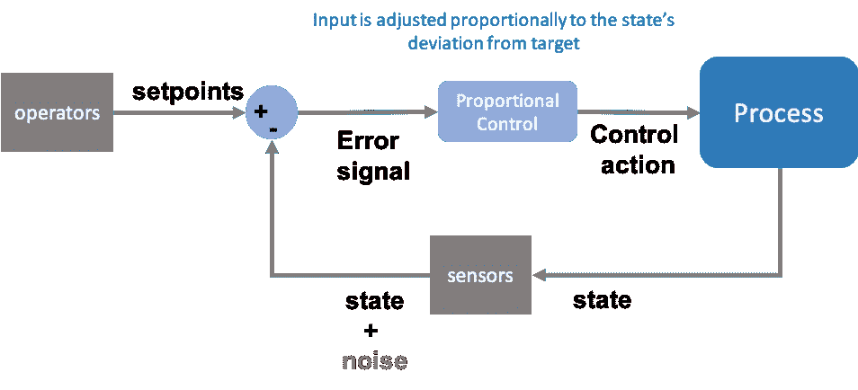
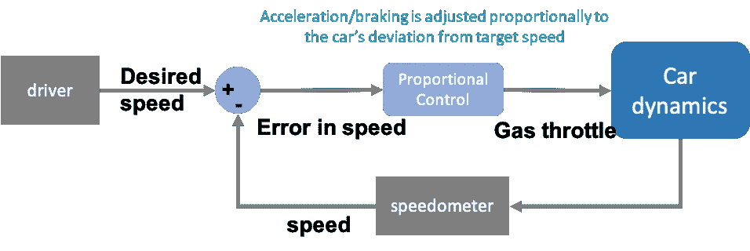
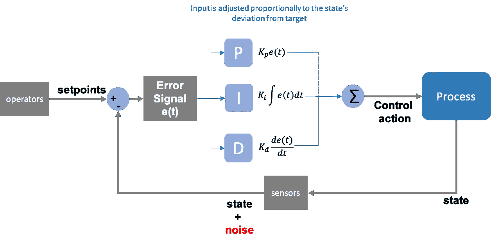
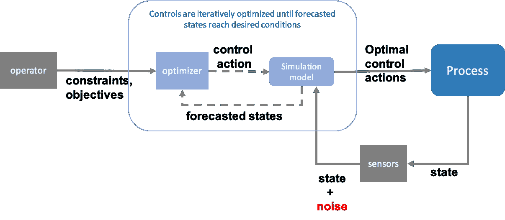

# 工业过程控制的人工智能:控制策略介绍(上)

> 原文：<https://towardsdatascience.com/ai-for-industrial-process-control-intro-to-control-strategies-part-1-b855fb6df61d?source=collection_archive---------22----------------------->

## 工业反应和预测控制器的概念概述

# 介绍

在过去的几十年里，“数字革命”使得制造商和公用事业公司能够为他们的工厂配备分布式监控系统。无论是工业膜还是生物反应器，这些控制系统都是重工业自动化的核心，使公司能够读取、解释和使用自己的机器生成数据来实现生产和合规目标。然而，尽管它们具有普遍性，但这些控制系统只是最近才开始作为人工智能(AI)破坏的潜在候选人而受到关注。

今天，大型工厂控制室中的操作员被期望在很大程度上依靠他们自己的判断和经验。在同时监控数十个过程信号的同时，他们需要调整控制系统设置、排除警报故障、执行质量测试，从而限制了他们的人力。好消息是，这些工厂正在不断捕捉和存储大量数据，这些数据可以很容易地被人工智能系统消耗。使用人工智能进行过程控制，可以显著简化数据处理，并为操作员提供增强的决策支持。

在 [Unsplash](https://unsplash.com/s/photos/operator?utm_source=unsplash&utm_medium=referral&utm_content=creditCopyText) 上[科学高清](https://unsplash.com/@scienceinhd?utm_source=unsplash&utm_medium=referral&utm_content=creditCopyText)拍摄的照片

在这一系列文章中，我们将深入探讨(1)这些工业过程控制系统今天是什么样子，(2)人工智能如何利用现有的工厂数据来增强它们，(3)制造商和公用事业公司今天可以做些什么来释放显著的成本节约和过程合规性机会。

# 控制系统分类

让我们从一些简单的术语开始。过程(即反应器、过滤器)由控制器控制，控制器消耗来自传感器(即流量计、分析仪)的测量值，传感器实时监控关键过程状态(即流量、温度、压力)，如图 1 所示。

**图一。剖析一个原型工业控制系统** *(图片由作者提供)*

这些控制器使用这些测量来实时产生控制动作(即打开/关闭阀门，打开/关闭泵)。根据控制器如何消耗这些传感器测量值并产生控制动作的机制，可以将控制器分为**反应型**或**预测型**。反应控制系统中的控制动作仅基于当前或过去的状态，即过程的当前或最近的传感器测量。相反，预测控制器使用对过程未来状态的预测来产生控制动作，通常采用某种形式的系统数学**优化**和**模拟模型**。

反应式控制器的一些例子包括比例控制器的变体，例如比例积分(PI)和比例积分微分(PID)；而模型预测控制(MPC)是预测控制策略的一个例子。

# 反应控制的标志:比例积分微分(PID)控制

工业和公用事业过程中最常见的反应控制(也称为反馈控制)策略是比例积分微分(PID)控制器。在 PID 控制器中，控制动作是测量状态与所需**设定点**(即目标)偏差的函数，通常称为“误差”，如图 2 所示。该目标设定点通常由操作员指定，以便实现一些生产或符合性目标。

**图二。反应式控制器如何工作** *(图片由作者提供)*

PID 控制器的一个常见例子是简单的汽车巡航控制系统，如图 3 所示。这里，驾驶员(操作者)指定期望速度(设定点),控制器根据当前速度(显示在速度计上)和期望速度之间的差异计算相应的加速度要求。

**图 3。简单的汽车巡航控制系统** *(图片由作者提供)*

PID 首字母缩略词中的每个字母表示一种“校正模式”，控制器使用这种模式来计算控制动作将如何响应当前状态与其目标的偏差，如图 4 所示。“比例”校正意味着控制动作被计算为对误差的即时或线性响应，而“积分”校正意味着控制动作被计算为一段时间内状态的累积误差的函数。它被称为“积分”控制，因为随着时间的累积误差是使用积分计算的。最后，“导数”校正使用状态误差的变化率，如其导数所测量的。因此，任何无功控制器都可以是这些计算(PI、PID 或 P)的任意组合。

**图 4。比例积分微分控制器框图** *(图片由作者提供)*

如图 4 所示，每个校正响应由常数缩放，如 *KP* 和 *KI* ，称为增益系数。这些参数通常由自动化或控制工程师调整。可以调节控制器增益，以使控制器输出变化对设定点和状态变量之间的偏差尽可能敏感；并且可以选择系数的符号，以使控制器输出随着误差信号的增加而增加或减少。

将微分和积分校正模式合并为控制器的一部分取决于被控制的过程的类型。综合校正确保不会出现长期持续的偏差或误差漂移，同时导数校正确保控制器快速响应误差变化，确保控制器在其响应中不会超调(过度补偿)。

虽然反应式控制策略的制定和部署非常简单，但它的致命弱点可能已经显而易见。

> ***反应式控制器的控制响应是对系统当前状态的持续反应，对其未来动态没有预见*。这意味着控制器容易受到不断演变的系统行为或异常的影响。**

对于处于高度竞争的制造环境中的工厂，或者受到气候变化压力的公用事业系统，不断变化的动态可能是每天的现实。例如，如果生物反应器中出现大量营养负荷，该系统将消耗大量能量来驱动溶解氧回到所需的操作范围。可选地，泵可以在给定的控制范围内多次在在线和离线之间转换其状态，以确保下游罐在其操作范围内，从而导致由不期望的压力瞬变引起的潜在故障。

# 模型预测控制

上面列出的缺点正是模型预测控制(MPC)存在的原因。MPC 是一种为复杂、非线性过程的主动控制而设计的方法。基于反应的控制策略，如 PID 控制，其控制动作基于传感器记录的历史和当前系统状态，而 MPC 使用未来状态的预测。因此，MPC 控制器需要过程的精确**仿真模型**，以便产生可靠的预测。

**图 5。MPC 控制器的框图** *(图片由作者提供)*

如图 5 所示，有几个额外的元件构成了传统无功控制器中不存在的 MPC。其中包括:

1.**仿真模型**:过程动态的数学表示，即它可以根据各种控制动作序列预测过程的未来状态

2.**优化器**:一个数学解算器，可以根据仿真模型的输出迭代地确定“最优”控制动作

3.**约束**:指定优化器不能超过的可接受的未来状态的边界*，即氨排放浓度的符合性限制*

4.**目标**:运营商寻求实现的优化目标*，即降低能源成本*

> 预测控制通过执行**动态、实时优化**来产生控制动作，这些控制动作适应干扰并符合用户指定的约束。MPC 允许操作员通过比传统反应式控制器更接近约束条件的操作来更有效地运行他们的过程。

图 5 中的框图提供了 MPC 框架的概念性概述。虽然 MPC 结构比传统的反应式控制器更复杂，但它有几个重要的优点:

1.控制动作被优化以实现期望的结果，例如降低能量成本或提高反应效率

2.控制器对来自干扰的扰乱不太敏感，因为它可以预测它们并更快地响应

3.可以对控制器施加状态和控制的约束，以确保产生顺从的控制动作

4.准确的模型预测可以提供潜在问题的早期预警

5.过程模型捕捉控制、状态和干扰变量之间的动态相互作用

# 下一个？

到目前为止，我们已经讲述了过程控制的基础知识。在本系列的第 2 部分中，我们将更详细地探讨 MPC 控制器如何工作，并提供一些说明它们如何优于传统 PID 控制器的示例。