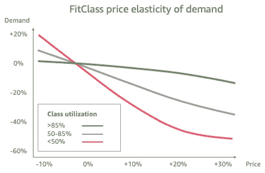
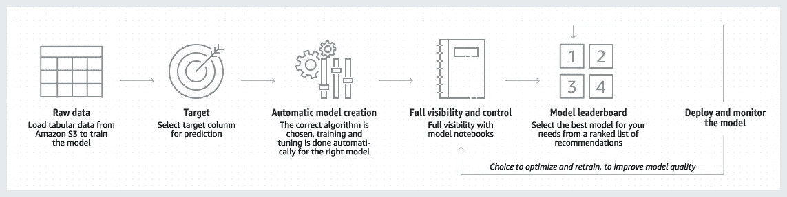
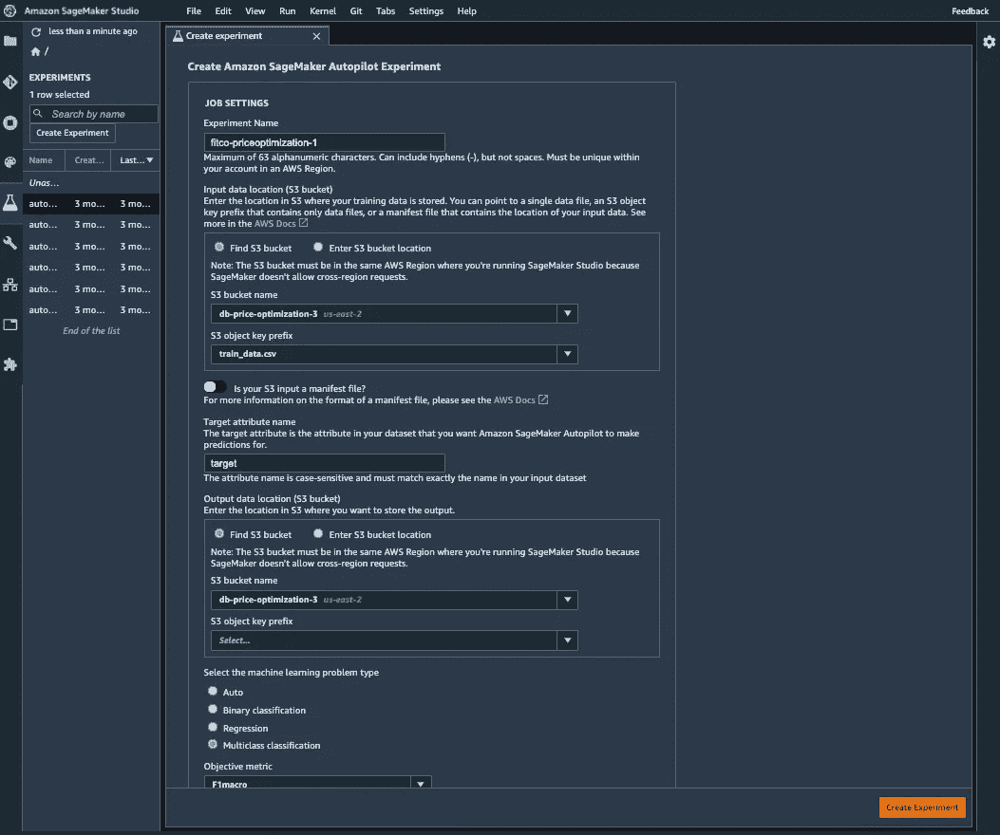
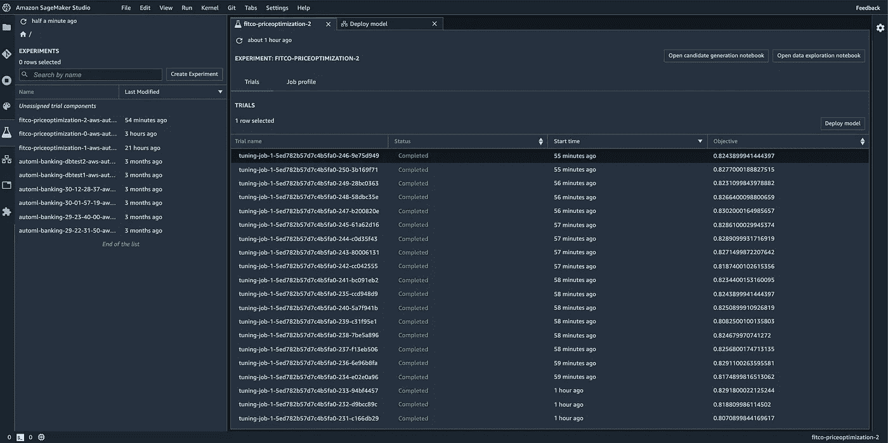
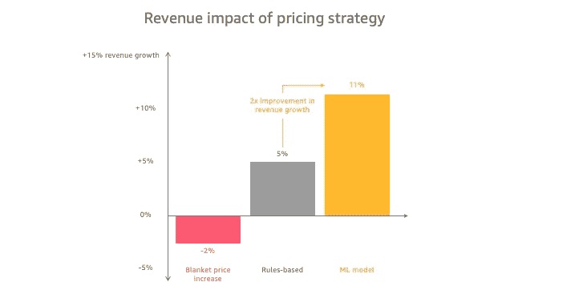
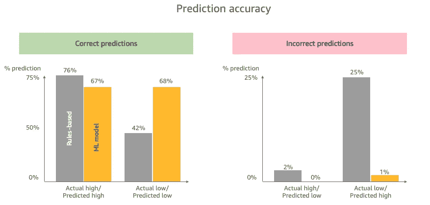
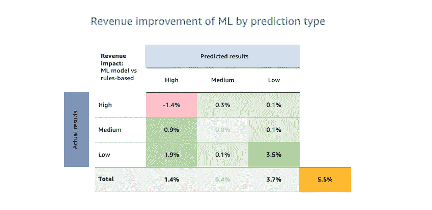

# 人工智能促进收入增长:使用 ML 推动更有价值的定价

> 原文：<https://towardsdatascience.com/ai-for-revenue-growth-using-ml-to-drive-more-valuable-pricing-89e8c790f795?source=collection_archive---------31----------------------->

## 一个国家健身品牌如何使用机器学习来优化定价并使收入增长 11%

米歇尔·汉德森在 [Unsplash](https://unsplash.com/s/photos/growth?utm_source=unsplash&utm_medium=referral&utm_content=creditCopyText) 上的照片

# 介绍

价格优化是收入增长的有力杠杆，但它经常被太多的公司放在太硬的篮子里。

这是因为传统的定价优化方法不仅实施起来复杂，而且在准确捕捉影响定价的所有因素方面能力有限。

机器学习(ML)非常适合于定价优化问题——既因为它处理复杂特征的能力，也因为它概括新情况的能力。此外，托管服务的最新进展使得这些 ML 解决方案几乎可以为任何组织所用。

在这个匿名示例中，我们探索了一家没有数据科学专业知识的公司如何能够使用托管 ML 服务来实施 ML 驱动的定价策略，该策略的性能是传统方法的 2 倍，并使收入增长了 11%。

# 情况

FitCo 是总部位于洛杉矶的优质健身品牌，在美国经营着 600 多家健身房和健身中心。

在过去几年通过收购快速增长后，管理层的注意力现在转向了推动有机收入的增长，这在每个工作室的基础上一直顽固地保持平稳。

FitCo 将 FitClass——其专业健身课程套件——确定为有机增长的主要来源。具体来说，它已确定这些类别的定价是一个主要的潜在改进领域。

照片由[吉尔特·皮特斯](https://unsplash.com/@shotsbywolf?utm_source=unsplash&utm_medium=referral&utm_content=creditCopyText)在 [Unsplash](https://unsplash.com/s/photos/gym-class-stretch?utm_source=unsplash&utm_medium=referral&utm_content=creditCopyText) 上拍摄

FitClasses 是 FitCo 旗下品牌中很受欢迎的产品。它们是迎合利基健身需求的优质体验，在标准会员资格的基础上按等级付费出售。

虽然 FitCo 确保了其产品组合的一致用户体验，但当地运营商仍然能够在他们的工作室中几乎完全独立地为 FitClasses 设定时间表和价格。因此，不同等级和不同地点的价格差异很大。

虽然 FitCo 理解这种差异反映了当地的条件，但他们也怀疑其投资组合的定价方式还有相当大的改进空间。

# 并发症

FitCo 在两年前进行了一次定价活动，之前的管理层选择集中 FitClass 的定价，并制定了 10%至 20%的全面提价。

这种生硬的方法没有成功。它未能考虑到客户需求在各种级别和地点的价格弹性，价格上涨实际上导致总收入*下降*2 %,因为许多级别需求的下降超过了价格的上涨。几个月后，他们被迫取消价格变动。

虽然很痛苦，但这种经历至少给了 FitCo 一个关于 FitClass 客户群价格弹性的非常可靠的数据集。它可以绘制出三个利用率级别(高(> 85%)、中(50–85%)和低(< 50%)的价格增长对等级需求的影响。FitCo 模拟了价格上涨对需求的各种影响，估计更有效的定价将带来 15%的收入潜力。

为了抓住更高的收入潜力，FitCo 现在只需要能够准确预测未来对课程的需求(无论是当前的还是新的)，以准确模拟价格对收入的影响。这将使 FitCo 能够确定每一级别的价格上涨是否有利可图，以及上涨幅度有多大。

FitCo 最初尝试使用传统的基于规则的方法——实际上是一系列 if/then 语句，根据特定条件设置波段。经过大量的反复试验，他们成功地编写了一个函数，估计可以产生大约 5%的额外收入。这并不坏，但这种方法有两个主要限制:(1)它未能充分考虑与每个类别相关的各种因素的相互关系——它错误地预测了错误范围内的太多类别，导致使用率下降——以及(2)它未能推广到任何给定位置的新的课程安排或细节——它不能充分考虑因素或场景的新组合。

为了寻找替代方法，FitCo 求助于 ML。

# 毫升溶液

ML 非常适合这些类型的分类问题，因为它能够处理广泛的因素，并概括出未知或新的情况。

然而，像其规模和行业中的大多数组织一样，FitCo 没有 ML 能力或现成的数据科学家团队来设计、构建和部署 ML 解决方案。这在以前是采用 ML 的主要障碍。然而今天，ML 托管服务的可用性已经在很大程度上使 ML 功能的访问大众化。

对于他们的解决方案，FitCo 选择了 Amazon SageMaker，其中包括一项名为 [*AutoPilot*](https://aws.amazon.com/sagemaker/autopilot/) 的 AutoML 功能，它可以接受一个简单的表格数据集，并自动围绕它构建 ML 工作负载。

AutoPilot 接受一个简单的表格数据集，并围绕它构建一个 ML 工作负载

有了*自动驾驶*，FitCo 不再需要一个数据科学家团队来获得 ML 的好处。相反，他们能够通过一个由 CFO(作为业务所有者)、CTO(作为技术所有者)和一个负责构建和集成解决方案的后端开发人员组成的三人项目团队来推动这项计划。

## 培训用数据

为了建立他们的训练数据集，FitCo 收集了他们每个班级过去两年的历史利用率数据。

每一个班级的利用率以占总名额的百分比来表示。FitCo 根据上述利用率范围将这一栏中的数据转换为“高”、“中”和“低”，并将这一栏命名为“目标”。这将是 ML 模型预测的列。

然后，他们将这些数据与一组他们认为可能表明利用率的内部特征结合起来。他们还添加了一系列他们认为相关的外部数据。结果是一个包含 800，000 个实例的数据集，它包含以下特征:

*   类别类型(分类)
*   位置(分类)
*   星期几(分类)
*   一天中的时间(数字)
*   讲师(分类)
*   工作室品牌(分类)
*   是公共假日(二进制)
*   是学校放假(二进制)
*   外部温度(数值)
*   目标(分类)

FitCo 做了一些基本的[功能工程](/understanding-feature-engineering-part-1-continuous-numeric-data-da4e47099a7b)来更好地组织和格式化这个数据集，将其转换为 csv 格式并保存在 S3 桶中。他们现在有了一个数据集，可以用来训练他们的 ML 模型。

## 亚马逊 SageMaker 自动驾驶仪

FitCo 选择 Autopilot 是因为它能够简化和精简机器学习过程的核心组件。AutoPilot 自动化了探索数据、工程特性、测试不同算法和选择最佳模型的过程。它只需要您提供一个表格数据集。

此外，它会自动呈现它所使用的代码库，从而增加流程的可见性和可重复性。这对 FitCo 的首席技术官来说是一个重要的区别，因为它让 FitCo 有机会探索和学习生成模型所采取的步骤，并为其提供一个代码库，以便在未来对其进行修改和优化。

为了启动自动驾驶程序，FitCo 使用了亚马逊 SageMaker Studio 中的无代码接口。这需要三个关键步骤:

1.  命名他们的实验
2.  将 SageMaker 指向他们的培训文件所在的 s3 存储桶，并且
3.  定义要预测的变量

AutoPilot 的无代码接口使 ML 对任何组织都触手可及

一旦输入这些细节，他们只需点击创建实验，FitCo 的 ML 模型构建正在进行中，运行一系列试验来确定最佳的 ML 方法。

自动驾驶仪进行试验的完整列表，以确定最佳性能模型

这个过程大约需要一个小时才能完成。一旦得出结论，FitCo 就可以简单地对试验列表进行排序，以找到性能最佳的模型。他们能够生成包含该模型代码的笔记本，还能够将该模型部署到 SageMaker 端点，使他们能够进一步测试该模型根据新数据生成的推断(预测)，甚至将其投入生产。

# 结果

当根据 FitCo 的测试数据集建模时，ML 模型的性能比他们基于规则的方法高出 2 倍，总收入估计增加了 11%。

ML 模型的性能是基于规则的方法的 2 倍

这种性能改进主要源于 ML 预测比基于规则的方法更高的精度。在多类分类问题中，挑战不仅在于预测正确的类，还在于最小化不准确的代价。例如，将低需求等级错误地预测为“中等”比预测为“高”成本更低。具体来说，根据 FitCo 的价格弹性曲线，这一特定错误的成本以需求下降的形式增加了约 4 倍。

传统方法和最大似然法之间的这种性能的比较可以在下面看到，并且说明传统方法实际上在准确预测高需求类别方面优于最大似然法。问题是，它无法做到这一点，而*也*准确预测中低需求等级。此外，它在不准确地将低等级预测为高需求等级方面犯了代价高昂的错误。ML 模型能够更好地更全面地映射数据的形状，以考虑这两种情况。

基于规则的方法在 25%的情况下错误地将低级预测为高级

这些错误给基于规则的方法的收入带来了相当大的损失，而 ML 模型可以避免这些错误。例如，不准确地预测低需求类别为高需求导致需求下降近 50%，远远抵消了其余成员支付的 30%的高价格。

下面的矩阵显示了每种类型的预测对收入增长的影响，以传统方法和 ML 方法之间的性能差异表示。

ML 模型能够通过更加一致的整体准确性产生 5.5%的额外收入

尽管传统方法成功地击败了 ML 模型，正确地将较高比例的高级类标记为高(一种称为“召回”的度量)，但它也错误地将更多的“中等”和“低”需求类标记为高(称为“精度”)。

因此，尽管其准确的高预测产生了 1.4%的高收入，但这是以需求下降导致的 2.8%的收入损失为代价的，因为不正确地向弹性更高的中低阶层收取了更高的价格。类似的模式也出现在低预测中；ML 模型更高的准确性意味着它只是降低了人们预期会看到更高需求的类别的价格。

由于这种更高的精度，即更准确地预测高等级和低等级，ML 模型能够产生 5.5%的总收入，是基于规则的方法的两倍多。

# 结论

定价优化是收入增长的有力杠杆，而 ML 的应用提供了一个强有力的解决方案，它往往优于传统方法。

在 FitCo 的案例中，与基于规则的最佳替代方案相比，将 ML 应用于他们的挑战产生了 2 倍的收入增长，并产生了约 11%的收入增长。

FitCo 的例子有助于展示 ML 如何应用于优化定价，以及像 SageMaker AutoPilot 这样的托管服务如何能够将这些强大的 ML 解决方案放在几乎任何组织都可以达到的范围内。

有你想要探索的人工智能机会吗？在 [LinkedIn](https://www.linkedin.com/in/dmhburke/) 上和我联系。