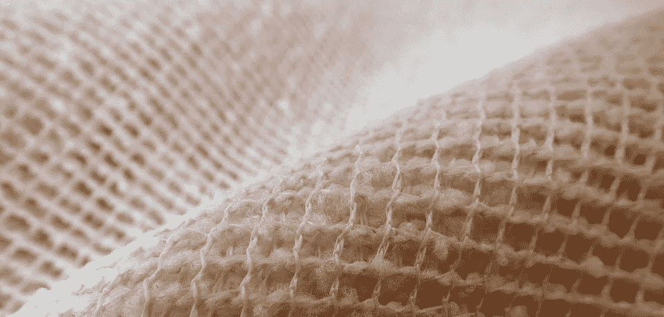
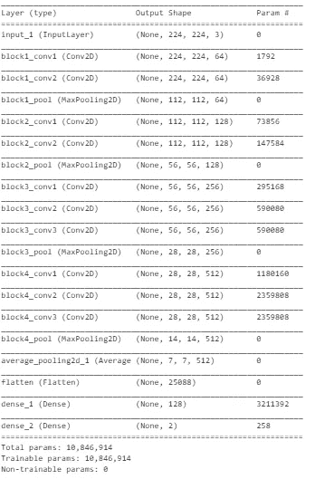
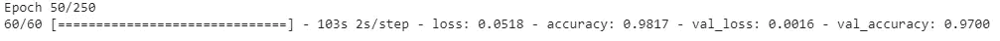
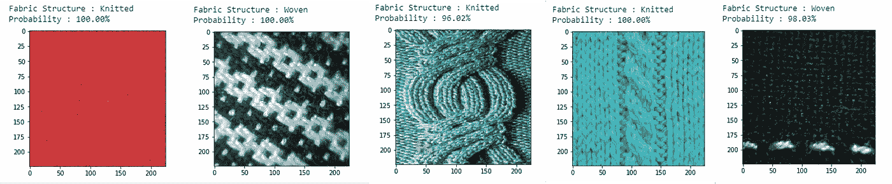
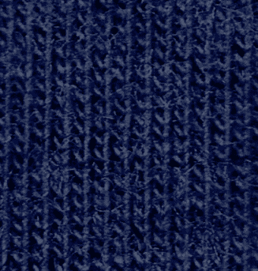
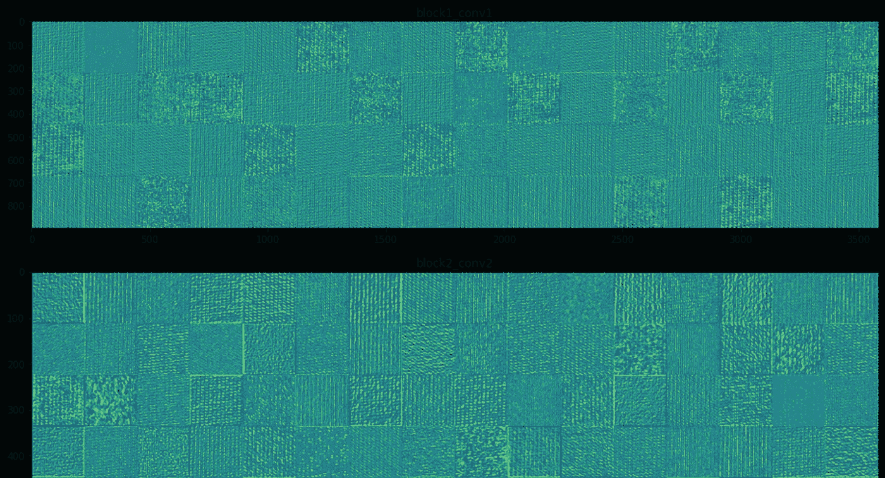
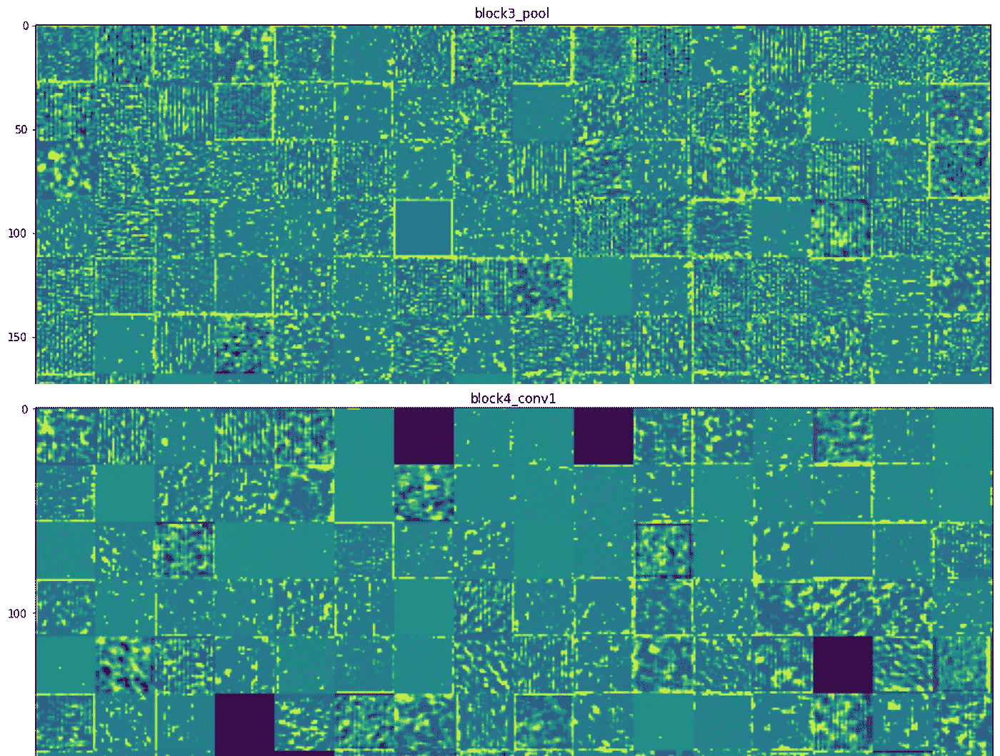
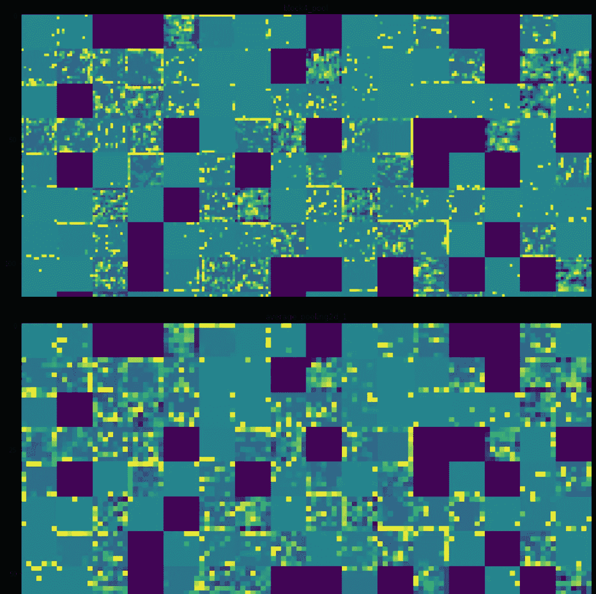

# 纺织品人工智能——基于卷积神经网络的织物结构分类器

> 原文：<https://towardsdatascience.com/ai-for-textiles-convolutional-neural-network-based-fabric-structure-classifier-c0db5433501d?source=collection_archive---------25----------------------->



来源: [AllNikArt](https://pixabay.com/users/AllNikArt-65709/) ，via [pixabay](https://pixabay.com/en/labrador-breed-dogs-animal-animals-805838/)

T 如今，深度学习被广泛用于各种人工智能应用，包括面部识别、自然语言处理等。在纺织工程领域也有可能找到深度学习的许多应用，计算机视觉已经在这种背景下广泛使用。本文描述了开发卷积神经网络用于从织物表面的输入图像识别织物结构的方法。开发的模型能够成功地区分针织物和机织物结构。

由于针织和机织结构的结构差异，它们很容易区分。针织物的线圈结构和机织物上交织的经纱和纬纱使得这两种结构易于识别。如果通过显示一组标记的针织和机织织物图像，可以训练神经网络来学习织物结构固有的这些特征，那么神经网络将能够正确地区分针织和机织织物图像，这是它以前从未见过的。为了实现这一点，决定使用卷积神经网络(CNN)架构，因为 CNN 能够有效地从图像中提取特征。

该模型是使用 python 和 TensorFlow 框架以及 Keras API 开发的。为了获得用于训练神经网络的数据集，使用了在[*【https://ibug.doc.ic.ac.uk/resources/fabrics/】*](https://ibug.doc.ic.ac.uk/resources/fabrics/)上可用的图像的开源数据库，该数据库最初是为一项研究而准备的( *C. Kampouris，S. Zafeiriou，A. Ghosh，S. Malassiotis，* [*使用微观几何和反射率的细粒度材料分类*](https://ibug.doc.ic.ac.uk/media/uploads/documents/1119.pdf) *，第 14 届欧洲计算机视觉会议，阿姆斯特丹，2016 年*)。该原始数据集中的织物图像根据材料类型(即尼龙、聚酯、棉等)进行标记。).因此，在训练之前，从该原始数据集中选择总共 4300 幅图像，并根据织物结构(即，针织和机织)对其进行人工标记。在 4300 幅图像中，4200 幅用作训练数据，而剩余的 100 幅用作验证数据。(尽管验证数据集太小，但大多数图像用于训练以避免过度拟合)。训练和验证数据集都由相同数量的针织和机织织物图像组成。

最初，决定使用迁移学习技术。因此，使用 VGG16 架构([*https://arxiv.org/abs/1409.1556*](https://arxiv.org/abs/1409.1556))和预训练的权重。只有最终输出层被更改为具有两个单元的 softmax 层。使用迁移学习，训练最终输出层，保持其他层的权重不变，经过 100 个历元后，训练和验证准确率分别达到 88%和 83%。

为了改进模型，原始 VGG16 架构的最后三个密集层被移除，并由几个稍微修改的密集层取代。使用迁移学习，这些新增加的层被训练，同时保持其余层的权重不变。该模型最高训练准确率达到 99.81%，验证准确率达到 91%。该模型现在明显过度适合训练数据。

为了克服过拟合问题，再次训练模型的最终密集层，在最后两个密集层之间添加一个丢弃层，并增加数据。然而，在 20 个时期之后，该模型达到了 84.55%的训练准确度和 84%的验证准确度，并且似乎没有进一步改善。过拟合问题被克服了，但是现在模型有很高的偏差。

最后，决定训练整个模型，而不是使用迁移学习。然而，由于可用的训练数据量有限，因此决定降低原始 VGG16 架构的复杂性。因此，移除了原始 VGG16 架构的第五个卷积块，并添加了一个平均池层，之后是两个密集层。为了避免过度拟合，数据增强使用了几种增强技术，如旋转、垂直翻转、缩放和不同的亮度水平([*【https://keras.io/api/preprocessing/image/】*](https://keras.io/api/preprocessing/image/))。输入图像的旋转是重要的，因为它允许模型识别针织物图像的纵行和机织织物图像中的经纱和纬纱，由于捕获图像时发生的变化，它们在不同的方向上取向。放大图像使模型能够清楚地识别针织物的线圈结构和机织物的交织图案。



模型摘要

```
import numpy as np;
import keras;
from keras.layers import AveragePooling2D;
from keras. layers.core import Dense, Flatten;
from keras.optimizers import Adam;
from keras.metrics import binary_crossentropy;
from keras.preprocessing.image import ImageDataGenerator;
from keras.models import Model;
from keras.applications import imagenet_utils;
from keras.callbacks import ModelCheckpoint;train_data_path = '/content/drive/My Drive/fabric_data/Train';
test_data_path = '/content/drive/My Drive/fabric_data/Test';train_data = ImageDataGenerator(rescale = 1.0/255, 
                                rotation_range = 180, 
                                vertical_flip = True, 
                                horizontal_flip = True, 
                                brightness_range = [0.5, 1.5], 
                                zoom_range = [1, 1.5]);train_generator = train_data.flow_from_directory(directory = train_data_path, 
target_size = (224,224), 
classes = ['Woven','Knitted'], 
batch_size = 70, 
shuffle = True);test_data = ImageDataGenerator(rescale = 1.0/255);test_generator = test_data.flow_from_directory(directory = test_data_path, target_size = (224,224), classes = ['Woven', 'Knitted'], batch_size = 50, shuffle = False);vgg16_model = keras.applications.VGG16();
x = vgg16_model.layers[-9].output;x = AveragePooling2D(pool_size = (2,2))(x);
x = Flatten(name="flatten")(x);
x = Dense(128, activation = 'relu')(x);
x = Dense(2, activation = 'softmax')(x);model = Model(inputs = vgg16_model.input, outputs = x);model.compile(optimizer = Adam(lr=0.00001, clipvalue = 0.5, clipnorm = 1), loss = 'binary_crossentropy', metrics = ['accuracy']);print("\nTraining.....");checkpoint = ModelCheckpoint(filepath = '/content/drive/My Drive/new_fab_model.h5', monitor='val_accuracy', verbose=1, save_best_only=True, mode='max');history = model.fit_generator(generator = train_generator, 
                              steps_per_epoch = 60, 
                              validation_data = test_generator, 
                              validation_steps = 2, 
                              epochs = 250, 
                              verbose = 1, 
                              callbacks = [checkpoint]);
```

使用 Adam 优化器以 0.00001 的学习率从头开始训练整个模型。经过 50 个时期的训练，该模型达到了 98%的训练准确率和 97%的验证准确率。



达到培训和验证的准确性

由于使用的验证数据集太小(只有 100 个图像)，为了进一步验证模型在现实世界中的性能，使用训练的模型测试了不同的 100 个织物图像的集合。该模型正确预测了其中的 97 幅图像。这个新测试样本的意义在于，图像是从与原始训练和验证数据完全不同的分布中获取的。一组图像是从互联网上下载的(3D 针织物图像)。使用扫描仪扫描另一组图像，图像被放大 50%，裁剪并调整为 224x224 像素，以输入神经网络。使用光度立体传感器捕获原始训练和验证数据集的织物图像( *C. Kampouris，S. Zafeiriou，A. Ghosh，S. Malassiotis，* [*使用微观几何和反射率的细粒度材料分类*](https://ibug.doc.ic.ac.uk/media/uploads/documents/1119.pdf) *，第 14 届欧洲计算机视觉会议，阿姆斯特丹，2016)* 。



由训练模型预测的织物结构

应该注意的是，模型的训练数据仅由纬编针织物组成。只有单面针织结构的技术正面图像可用，不包括 3D 针织结构。然而，经过训练的模型能够正确预测 3D 缆线编织结构，并且它也正确预测一些单面针织物的技术背面图像。训练集中的大多数织物图像由平纹和斜纹结构组成。

被训练的模型的中间激活被可视化以理解卷积如何从织物图像中学习特征。针织织物图像作为输入输入到模型中，相应的层激活如下所示。请注意，这里只显示了几层的一些卷积。



输入图像(作者提供的照片)



对应于输入图像的模型的层激活(仅示出了来自一组选定层的一些卷积)

模型的初始层似乎在识别图像的最基本特征，例如水平和垂直边缘。一些盘旋已经确定了针织物表面纵行的边缘。在中间层，卷积开始提取更精细的细节，如针织线圈的形状，最大汇集层突出了这些特征。最深层的激活很难从视觉上解释，因为根据模型在训练中所学的，它们正在编码特定于织物结构的信息。

应该注意的是，该模型仅用于学术目的。该模型只能区分两种主要的织物结构(即针织和机织)。区分几种织物结构变化(如单面针织物、罗纹织物和联锁织物)将是一项更有趣的任务，但由于无法获得此类不同类型织物结构的大型数据集，该模型仅限于区分针织和机织织物结构。然而，有了足够的数据，也可以训练一个模型来完成这样的任务。还应该注意，通过使用不同的神经网络结构和更多的数据，有可能进一步改进该模型。