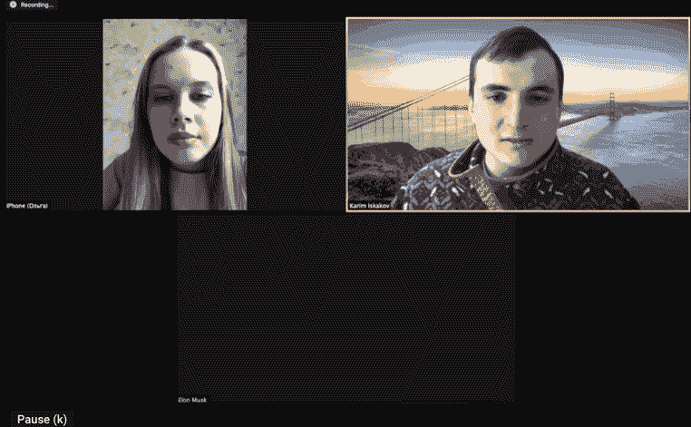
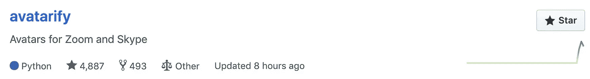
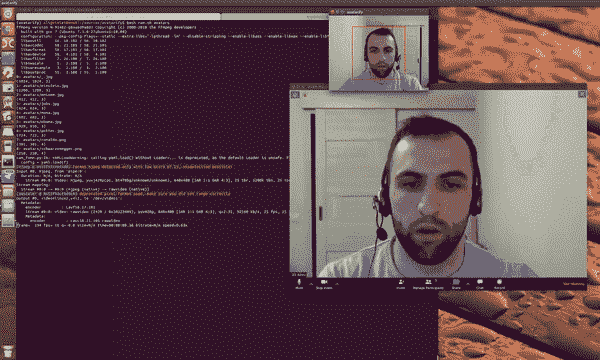
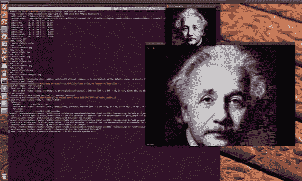
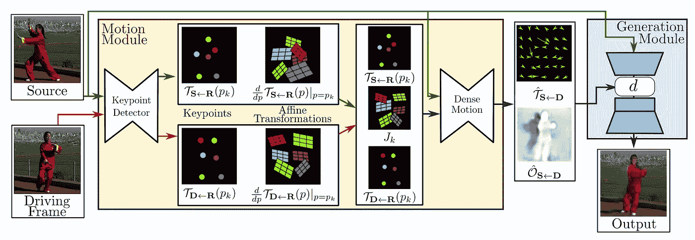
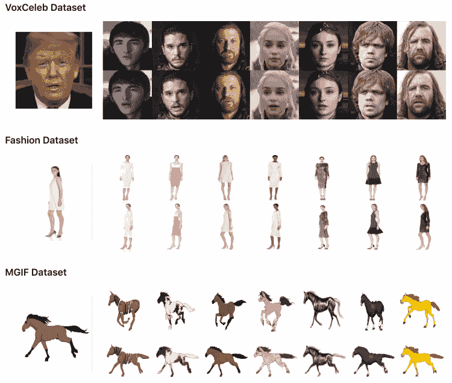

# 人工智能生成的埃隆·马斯克加入变焦电话已经成为病毒

> 原文：<https://towardsdatascience.com/ai-generated-elon-musk-joined-a-zoom-call-has-gone-viral-c0516e99a37c?source=collection_archive---------45----------------------->

## 人们已经被 deepfakes 技术迷住了。现在你可以使用 Avatarify 在流式播放时用别人的脸替换你的脸

人工智能生成的埃隆·马斯克使用 Avatarify 加入了变焦通话

> 埃隆·马斯克和我正在开会讨论一个 2 亿美元的项目！

如果你以这种方式告诉你的朋友，他们可能不会相信，但如果你给他们看一个视频通话，他们更有可能相信。事实上，埃隆·马斯克从来没有和你说过话，而所有这些都是由一个名为“Avatarify”的 deepfake 项目产生的。

Avatarify 是由[阿里·阿利耶夫](https://github.com/alievk)和[卡里姆·伊斯卡科夫](https://github.com/karfly)创造的。与大多数其他 deepfake 项目需要你预先录制视频不同，Avatarify 足够强大，可以在流传输的同时实时工作。阿里·阿利耶夫已经在两周前在 Github 上开源了这个项目。他在不到一周的时间里收获了 4k 星，迅速登上了日趋势榜榜首。

如果你想亲自尝试，请点击 GitHub 上的 Avatarify [查看。](https://github.com/alievk/avatarify)

[Github 上的虚拟化](https://github.com/alievk/avatarify)

# 项目演示

虚拟化演示

如演示中所示，作者导入一张照片，照片中的人根据作者自己在摄像机前移动的动作进行动画制作。在实时电话会议中，扬眉、眨眼和说话都很流畅。

虚拟化演示

当然，你可以尝试一些更有趣的东西。比如爱因斯坦的一个眨眼，阿姆的凝视，史蒂夫·乔布斯扬起的眉毛，蒙娜丽莎的微笑。如果你愿意，你可以把你的脸换成任何人的。你需要做的只是找到一张你想玩的人的照片，放到项目的`avatars`文件夹里。

# 安装并运行虚拟化

你不需要任何编程知识来运行 Avatarify。您所需要的只是一些初级的命令行知识。支持 Linux、Mac 和 Windows，你可以[点击这里](https://github.com/alievk/avatarify#install)查看 Avatarify 安装指南。对于 Windows，作者制作了一个视频[教程](https://www.youtube.com/watch?v=lym9ANVb120)，所以安装起来会很容易。

为了顺利运行 Avatarify，您需要一个支持 CUDA(NVIDIA)的显卡。否则，它将退回到 CPU，运行非常缓慢，性能急剧下降(< 1fps)。

一旦你把它安装到你的机器上，剩下的你需要做的就是找到你想玩的人的照片，并把它放在`avatars`文件夹中。之后，启动一个支持的视频会议应用程序，Zoom，Skype 或 Slack。

# 算法

Avatarify 是基于意大利特伦托大学的研究人员开发的[一阶运动模型](https://arxiv.org/pdf/2003.00196.pdf)开发的。[一阶运动模型](https://github.com/AliaksandrSiarohin/first-order-model)可以生成视频序列，使得源图像中的对象根据行驶视频的运动而被动画化。

一阶运动模型综述

[一阶运动模型](https://github.com/AliaksandrSiarohin/first-order-model)假设源图像 *S* 和一帧驾驶视频帧 *D* 作为输入。无监督关键点检测器提取由稀疏关键点和相对于参考帧 *R* 的局部仿射变换组成的一阶运动表示。密集运动网络使用运动表示生成从 *D* 到 *S* 的密集光流 *Ts←D* 和遮挡贴图 *Os←D* 。生成器使用源图像和密集运动网络的输出来渲染目标图像。

来自[一阶运动模型](https://github.com/AliaksandrSiarohin/first-order-model)的动画示例

以上是来自[一阶运动模型](https://github.com/AliaksandrSiarohin/first-order-model)项目的一些动画示例。左边的视频显示的是驾驶视频。每个数据集右侧的第一行显示了源视频。最下面一行包含动画序列，其中的运动是从驾驶视频和从源图像获取的对象中转换而来的。

# 了解法律

最后，对于 deepfakes 提到法律是非常重要的。

根据《卫报》的报道，deepfakes 本身并不违法，但是生产商和经销商很容易触犯法律。根据内容的不同，deepfake 可能会侵犯版权，违反数据保护法，如果它使受害者受到嘲笑，则可能是诽谤。

# 尽情享受吧！

就是这样。以下是链接

*   归化项目:[https://github.com/alievk/avatarify](https://github.com/alievk/avatarify)
*   一阶运动模型:【https://github.com/AliaksandrSiarohin/first-order-model 
*   一阶运动模型论文:【https://arxiv.org/pdf/2003.00196.pdf 