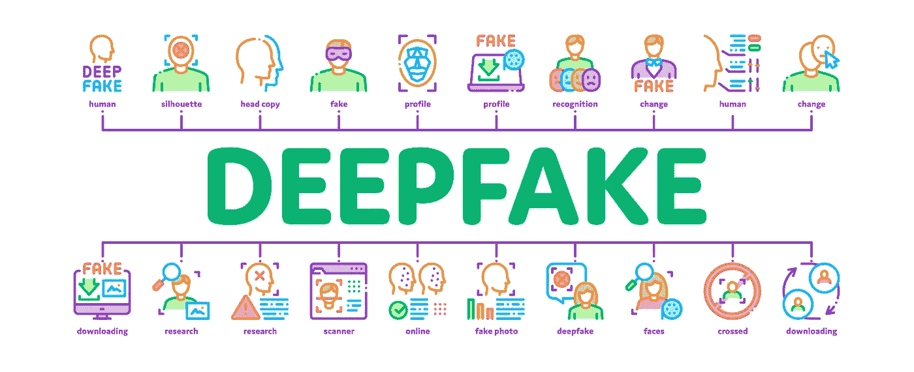

# 人工智能生成的合成媒体，又名 deepfakes

> 原文：<https://towardsdatascience.com/ai-generated-synthetic-media-aka-deepfakes-7c021dea40e1?source=collection_archive---------19----------------------->

从 pike picture-Adobe Stock 获得许可

## 人工智能(AI)和云计算的进步使得音频、视频和图像处理技术变得简单而快速。

> [这本书现在可以在亚马逊上买到——https://www . Amazon . com/deep fakes-aka-Synthetic-Media-Humanity-ebook/DP/b0b 846 ycnj/](https://www.amazon.com/Deepfakes-aka-Synthetic-Media-Humanity-ebook/dp/B0B846YCNJ/)

# 介绍

想象一下，在选举前几天，一个候选人的视频被发布，显示他们使用仇恨言论、种族诽谤和绰号，削弱了他们作为亲少数族裔的形象。想象一下，一名青少年尴尬地看着自己的一段视频在社交媒体上疯传。想象一下，一位首席执行官在筹集资金的路上，一段描述她对产品的恐惧和焦虑的音频剪辑被发送给了投资者，破坏了她的成功机会。

以上所有场景都是假的，是编造的，不是实际的，但可以通过 AI 生成的合成媒体来制造真实，也叫 deepfakes[ [1](https://papers.ssrn.com/abstract_id=3213954) ]。同样的技术可以让一位因患[卢·格里克](https://en.wikipedia.org/wiki/Amyotrophic_lateral_sclerosis)病而失声的母亲用合成声音与家人交谈，这种技术也可以被用来制作政治候选人的虚假演讲，以损害他们的声誉。同样的技术可以让老师使用合成视频有效地与学生互动，也可以用来制作一个青少年的假视频，以损害她的声誉。

人工智能(AI)和云计算技术、GPU VMs(图形处理单元虚拟机)和平台服务的进步，导致音频、视频和图像处理技术的复杂性快速发展。对商用云计算、公共研究人工智能算法和丰富数据的访问，以及多样化和庞大媒体的可用性，创造了一场完美的风暴，使合成媒体的创作民主化。这种人工智能生成的合成媒体被称为 deepfakes。社交平台使得合成媒体的传播大规模民主化。

> Deepfakes 是使用深度( ***深度*** )学习的人工智能技术生成的合成媒体( ***假*** )。

GAN 技术的创新和研究与不断增长的计算可用性相结合，以惊人的速度提高了合成数据的质量。新工具，其中许多是公开可用的，可以以越来越可信的方式操纵媒体，例如创建一个公众人物的声音的副本，或将一个人的脸叠加在另一个人的身体上。GAN 和 deepfakes 已经从研究和学术主题发展到商业创新、娱乐和社会参与的实际应用。

Cheapfakes 是通过简单的常规编辑技术进行的简单操作，如加速、减速和剪切，以及非技术性操作，如重新编排或重新编排现有媒体。一个廉价假货的例子是“喝醉的佩洛西”视频。最近，我们已经看到一些政治广告中使用了重新着色和修饰，这也可以打印出廉价的假货。

> 廉价假货或肤浅假货被定义为通过使用更直接的图像和视频编辑技术来传播错误/虚假信息或改变故事叙述而创建的操纵媒体。

# Deepfakes 的类型

Deepfakes 已经成为面部交换和假唱的同义词。还有许多其他类型的基于人工智能的音频、视频和图像操作可以被称为 deepfakes。

## 换脸

面部交换是指一个人的脸被另一个人的脸或另一张脸的关键特征替换或重建。几乎所有的社交媒体、视频聊天应用都有一个共同的特征，那就是面部交换或使用滤镜。自 2014 年以来，社交媒体应用程序 [Snapchat](https://www.snapchat.com/) 就有了增强人脸的滤镜。使用面部检测镜头技术，你可以让自己变老，添加美容滤镜，或者给自己留猫耳朵和胡须。这些应用和技术的输出将有资格成为人工智能生成的合成媒体或 deepfakes。大量的免费和付费应用程序和在线工具使得面对两个人的交换变得超级简单。开发人员可以使用来自 GitHub 的 [Faceswap](https://github.com/deepfakes/faceswap) 和 [DeepFaceLab](https://github.com/iperov/DeepFaceLab) 的开源代码，通过一些定制代码和训练 AI 模型的努力来创建非常复杂的 deepfakes。

## 木偶表演

操纵木偶是使用人工智能渲染操纵的全身动作和行为。这是一种在视频中创建目标面部和身体的 3D 模型的技术，以充当木偶演员。也被称为全身 deepfakes。2018 年 8 月，加州大学伯克利分校发表了一篇论文，名为《现在人人跳舞[【4】](#_ftn4)。这是关于人工智能如何将专业舞者的动作转移到业余舞者身上的研究。[日本人工智能公司 Data Grid](https://datagrid.co.jp/en/) 创造了一个人工智能引擎，可以自动生成广告和时尚的虚拟模型。

## 假唱

嘴唇同步是一种渲染嘴部动作和面部表情的技术，使目标用他们的声音和正确的音调和音高说话。人工智能算法可以获取一个人说话的现有视频，并改变视频中的嘴唇运动，以匹配新的音频。音频可以是断章取义的旧语音、模仿者说话或合成语音。演员兼导演乔丹·皮尔用这种技术制作了一个关于奥巴马的[病毒视频](https://www.vox.com/2018/4/18/17252410/jordan-peele-obama-deepfake-buzzfeed)。

## 声音克隆

语音锥化是一种深度学习算法，它采用个人的语音记录来生成与原始语音过度相似的合成语音。这是一种创建个人定制语音字体，然后使用该字体生成语音的技术。有许多应用程序和云服务可以开发合成语音，[微软定制语音](https://speech.microsoft.com/customvoice)， [Lyrebird AI](https://www.descript.com/lyrebird) ， [iSpeech](https://www.ispeech.org/) 和 [VOCALiD](https://vocalid.ai/) ，这些应用程序和云服务让个人和企业可以使用这些技术来改善他们的代理机构。

## 图像合成

图像生成或图像合成是一种使用计算机视觉技术、深度学习和生成对抗网络(GANs)来合成新图像的技术。它可以生成计算机生成的非真实的人或任何物体的图像。英伟达的一个团队用从 Flickr 下载的人脸图片训练了一台电脑，创建了网站[ThisPersonDoesnotExist.com](https://thispersondoesnotexist.com/)。现场还有其他例子，[ThisXDoesnotExist.com](https://thisxdoesnotexist.com/)。

## 文本生成

文本生成是一种自动生成文本、编写故事、散文和诗歌、创建长文档摘要以及使用人工智能技术进行文本和深度学习合成的方法。使用 RNN(递归神经网络)和现在的 GANs，有许多文本生成的实际用例。文本生成可以帮助行业内新的自动化新闻业或机器人新闻业。 [OpenAI 的](https://openai.com/) GPT-3 可以生成任何文本，包括吉他标签或计算机代码。

# 积极使用

技术非常强大，是一个伟大的推动者。技术可以给人们声音、目的和能力，以大规模和快速地产生影响。由于数据科学和人工智能的进步，赋权的新想法和能力已经出现。人工智能生成的合成媒体有许多积极的用例。技术可以为所有人创造可能性和机会，无论他们是谁，如何听、说或交流。deepfake 的技术进步在某些领域有明显的好处，如无障碍、教育、电影制作、刑事取证和艺术表达。

> [更多关于 Deepfakes 的正面用例](/positive-use-cases-of-deepfakes-49f510056387)

# 恶意使用

与任何新技术一样，邪恶的行为者将利用创新并利用它为自己谋利。GAN 和 Deepfakes 已经不仅仅是研究课题或工程玩具。开始是作为一个创新的研究概念，现在它们可以被用作一种交流武器。Deepfakes 变得越来越容易制造，甚至更容易在政策和立法真空中传播。

Deepfakes 使人们有可能在未经同意的情况下制造媒体——交换面孔、对口型和木偶——并给心理安全、政治稳定和商业中断带来威胁。Deepfakes 可以用来损害名誉、伪造证据、欺骗公众和破坏对民主制度的信任。在过去的两年里，恶意使用使用生成式人工智能模型创建的合成数据的可能性已经开始引起人们的警惕。这项技术现在已经发展到有可能被武器化，对个人、社会、机构和民主造成破坏和伤害。深度造假不仅会造成伤害，还会进一步侵蚀已经下降的对媒体的信任。还可以帮助公众人物将自己的不道德行为隐藏在 deepfakes 和假新闻的面纱中，称自己的实际有害行为为虚假，也就是所谓的骗子红利。

> Deepfakes 可以促成事实相对论，让威权领导人得以茁壮成长。

非国家行为者，如叛乱团体和恐怖组织，可以使用 Deepfakes 来代表他们的对手发表煽动性言论或从事挑衅性行动，以激起人们的反国家情绪。例如，一个恐怖组织可以很容易地制作一个 deepfake 视频，显示士兵侮辱一个宗教场所，以点燃现有的反政府情绪并引起进一步的不和。国家可以使用类似的策略来传播针对少数群体或另一个国家的计算机宣传，例如，一个假视频显示一名警察大喊反宗教诽谤或一名政治活动家呼吁暴力。

所有这些都可以用更少的资源、互联网的规模和速度来实现，甚至可以通过微目标来获得支持。

> [更多关于恶意使用 Deepfakes 的信息](https://medium.com/@ashishjaiman/deepfakes-harms-and-threat-modeling-c09cbe0b7883)

# 对策

为了捍卫真理和保障言论自由，我们需要一个多利益攸关方和多模式的方法。任何减轻恶意 deepfake 的负面社会影响的对策的主要目标必须是双重的。第一，减少对恶意 deepfakes 的暴露，第二，最小化它可能造成的损害。

针对恶意 deepfakes 的有效对策分为四大类:立法行动和法规、平台政策和治理、技术干预和媒体素养。

> [深度造假的技术对策](/technical-countermeasures-to-deepfakes-564429a642d3) s
> 
> [媒介素养是有效的对策](https://medium.com/@ashishjaiman/media-literacy-an-effective-countermeasure-for-deepfakes-c6844c290857)

[我将在未来的*文章*中探讨政策和监管]

*喜欢？* [*随便给我买本书*](https://www.buymeacoffee.com/ashishjaiman)

# 参考

[【1】](#_ftnref1)[https://papers.ssrn.com/abstract_id=3213954](https://papers.ssrn.com/abstract_id=3213954)

[【2】](#_ftnref2)[https://slate . com/technology/2019/06/druged-Pelosi-deep fakes-cheap fakes-artificial-intelligence-dis formation . html](https://slate.com/technology/2019/06/drunk-pelosi-deepfakes-cheapfakes-artificial-intelligence-disinformation.html)

[【3】](#_ftnref3)[https://www . MSN . com/en-us/news/politics/Lindsey-Graham-campaign-ad-features-image-of-counter-with-digitally-altered-dark-skin-tone/ar-bb 17 itff？ocid=msedgntp](https://www.msn.com/en-us/news/politics/lindsey-graham-campaign-ad-features-image-of-opponent-with-digitally-altered-darker-skin-tone/ar-BB17itff?ocid=msedgntp)

【4】[【https://arxiv.org/pdf/1808.07371.pdf】](https://arxiv.org/pdf/1808.07371.pdf)