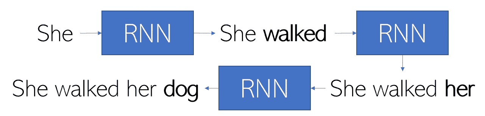
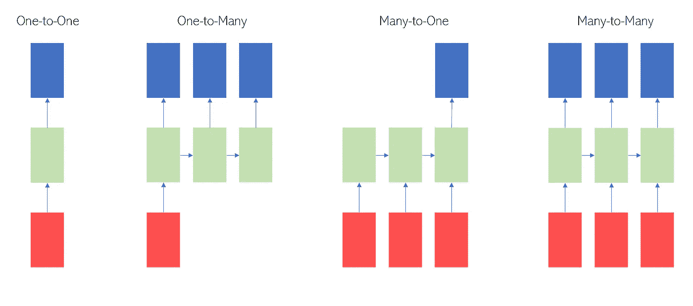
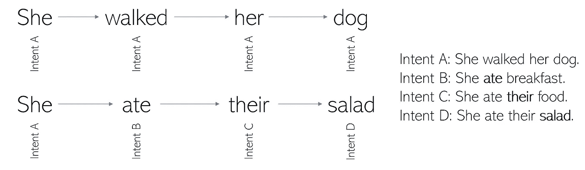
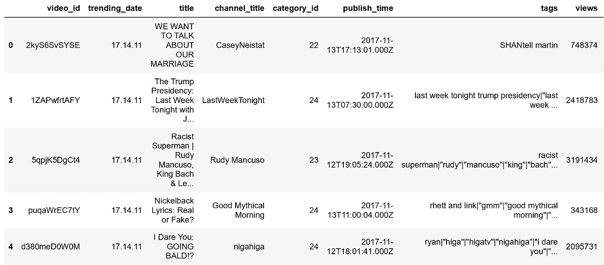
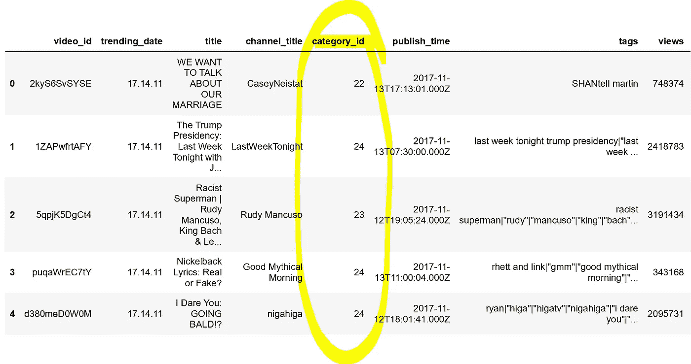
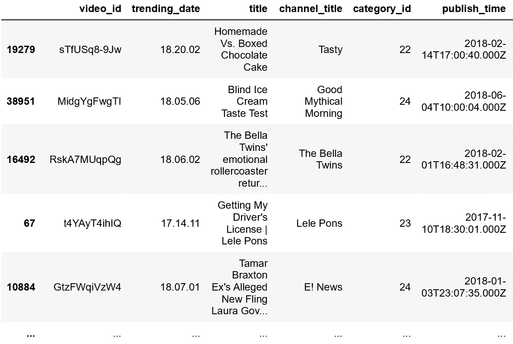
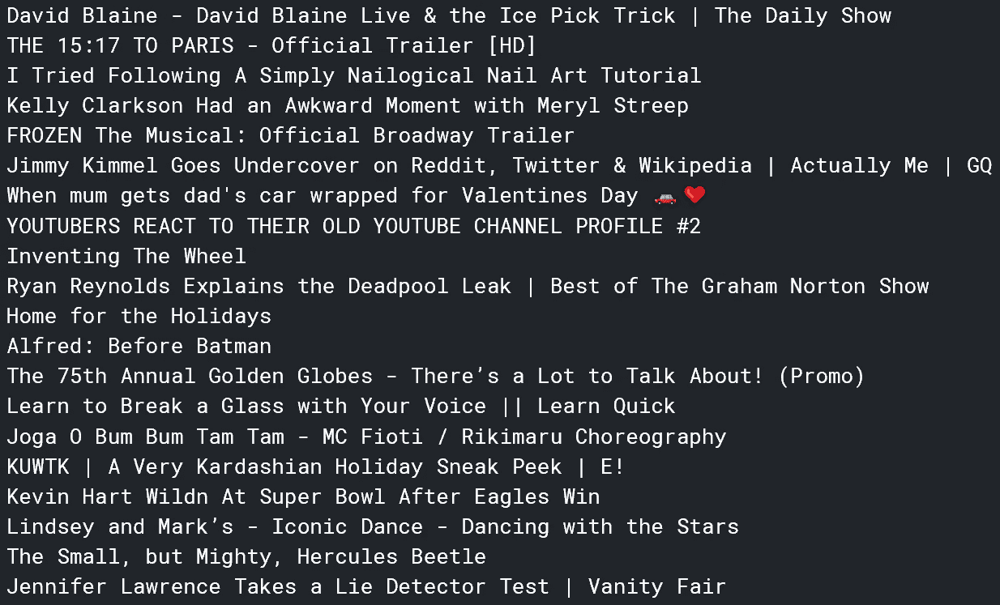
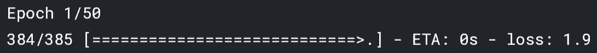

# 人工智能产生流行的视频创意

> 原文：<https://towardsdatascience.com/ai-generates-trending-video-ideas-968f5cba8616?source=collection_archive---------21----------------------->


Kon Karampelas 在 [Unsplash](https://unsplash.com?utm_source=medium&utm_medium=referral) 上拍摄的照片

## 使用递归神经网络激发下一个病毒视频

Y ouTube 是一个庞大的平台——成功获得推荐算法青睐的视频可以获得数亿次观看。当内容创作者试图创造下一个病毒式视频时，人工智能可以产生许多你想要的趋势视频创意！

在这篇文章中，我将展示任何人如何用四行代码创建和训练递归神经网络来生成趋势视频想法！

# 首先，一点轻理论…

如果你对递归神经网络如何工作不感兴趣，可以直接跳到实现上。

递归神经网络(RNN)是一种专门处理序列的神经网络。给定一个种子“她遛了她的 _ _ ”, RNN 可能会预测“狗”。RNNs 在文本生成中的技巧是使用预测作为进一步预测的种子。



给定种子“她”，RNN 如何生成文本。粗体字是 RNN 的输出。

应用于文本生成的标准神经网络的一个问题是它具有固定的输入和输出大小。例如，在 MNIST 数据集上训练的卷积神经网络中，每个训练和测试示例只能有 784 个值，不能多，也不能少。虽然这在像图像识别这样的任务中是可行的，但它肯定不适用于自然语言处理任务，在自然语言处理任务中，输入和输出可能在几个字符到几个句子甚至更多之间变化。

RNNs 允许可变长度的输入和输出。RNN 可以看起来像下面的任何一种，其中红色是输入，绿色是 RNN，蓝色是输出:



标准和卷积神经网络对于每个输入值或像素具有不同的一组权重和偏差，而递归神经网络对于所有输入具有相同的一组权重和偏差。RNN 通常有三组权重和偏差-一组在输入图层和隐藏图层之间(红色到绿色)，一组在隐藏图层和另一个隐藏图层之间(绿色到绿色)，另一组在隐藏图层和输出图层之间(绿色到蓝色)。

因为在每个层到层的链路上使用相同的权重和偏差集，所以可以非常容易地调整层中的像元数量，包括输入和输出。因为参数很少，所以可以确定最佳的权重和偏差。

那么，为什么 RNN 如此擅长生成文本呢？

RNN 文本生成基于一个基本原则，即句子中的下一个单词总是以相同的想法应用。这是有道理的——作为一个作者，你写下的下一个单词和前一个单词的意图是一样的。



在上图中，第一个句子是这样写的，每个单词都有相同的意图。第二句话以同样的意图开始，但因为它不断转换，最终结果与最初的意图相去甚远。

通过在每组单词上应用相同的 RNN，句子的意图(它试图去哪里，它包含什么思想)以及句子的措辞都得到了保持。

如果你想对 RNNs 有更深入的解释，可以看看这些研究论文。

*   [基于递归神经网络的语言模型](http://www.fit.vutbr.cz/research/groups/speech/publi/2010/mikolov_interspeech2010_IS100722.pdf)
*   [基于递归神经网络语言模型的扩展](http://www.fit.vutbr.cz/research/groups/speech/publi/2011/mikolov_icassp2011_5528.pdf)

# 实现病毒式视频标题生成器

所有的机器学习模型都需要数据。我们将使用的数据集是 [Kaggle](https://www.kaggle.com/datasnaek/youtube-new) 上的趋势 YouTube 视频统计数据集。

当加载和查看数据集时，我们可以了解数据的结构:

```
import pandas as pd
data = pd.read_csv('/kaggle/input/youtube-new/USvideos.csv')
data.head()
```



*右边还有更多列，但我们不需要它们

我们对`title`栏感兴趣——这将为训练 RNN 提供数据。该数据有 40，949 行；与一些较大的数据集相比，这并不算多，但是为了保持合理的训练时间，让我们将训练数据减少到 5，000 个实例。

此外，我们应该缩小培训数据的类别:



在查看了不同的类别后，很明显有些类别是新闻、音乐视频、电影预告片等。，这在创意生成器的上下文中没有意义，因为新闻、歌曲标题、音乐视频标题等要么无法生成，要么没有意义。类别 IDs 22、23 和 24 专用于由小型内容创建者创建的喜剧和较短片段。这些更符合我们想要生成的内容。

下面的代码选择`data`中属于类别 22、23 或 24 的行，并将它们放入名为`sub_data`的数据帧中。

```
sub_data = data[(data['category_id']==24) | (data['category_id']==23) | (data['category_id']==22)]
```



右边还有更多未显示的列。

仍然有 16，631 行—为了将其减少到 5，000 行，我们将随机洗牌几次，然后选择前 5，000 行作为训练数据。`sklearn`方便的`shuffle`功能可以帮助:

```
from sklearn.utils import shuffle
sub_data = shuffle(shuffle(sub_data))
```

要将数据输入到模型中，数据必须在文本文件中，每个新的训练实例在单独的一行上。下面的代码就是这样做的:

```
titles = open('title.txt','w+')
for item in sub_data.head(5_000)['title']:
    titles.write(item)
    titles.write('\n')
titles.close()
```

注意，`.head(n)`函数选择数据帧中最上面的`n`行。

要查看`title.txt`，我们可以调用`print(open(‘title.txt’,’r’).read())`。



文件的一部分，实际文件要大得多。

最后，培训文件准备好了。有许多强大的库可以实现 rnn，如 Keras (TensorFlow)和 Pytorch，但我们将使用一个库，它可以跳过选择名为`textgenrnn`的网络架构的复杂性。这个模块可以在 3 行代码中调用、训练和使用(如果从 pip 安装的话是 4 行)，代价是缺乏可定制性。

```
!pip install textgenrnn
```

…在 Kaggle 笔记本电脑环境中安装模块。如果在其他环境中操作，您可以移除`!`。

训练很简单:

```
from textgenrnn import textgenrnn
textgen = textgenrnn()
textgen.train_from_file('title.txt', num_epochs=50)
```

由于 textgenrnn 建立在 Keras RNN 框架上，它将输出一个熟悉的 Keras 进度跟踪打印:



这需要大约 2.5 小时来运行所有 50 个时期。

```
textgen.generate(temperature=0.5)
```

…可用于生成示例。“温度”是对生成的示例有多新颖的度量(越少，越新颖)。这是一种创造性(较小的温度)但又不会偏离任务本质太远的平衡，是适配不足和适配过度之间的平衡。

## 最后是生成的视频片头！

为了显示模型随时间的进展，我将包括(大约)每 10 个时代的三个标题，然后留给您一个由 50 个时代模型生成的标题组成的宝库。

1 个纪元(损失:1.9178) —

*   让我制造更多猫的时刻即将到来的时刻|时刻|时刻
*   Keryn 迷失——Marlari Grace(独立之年)
*   阅读 Omarakhondras | Now Cultu 1010–75

10 个时代(损失:0.9409) —

*   格莱美舞蹈系列帮助一个好的 Teass 形状|威尔·史密斯和第五季官方预告片
*   卡迪图书广告 TBS 上的舞蹈
*   为什么你的男朋友穿手帕

20 个时代(损失:0.5871) —

*   我妈妈给我买衣服！
*   恐龙瑜伽挑战！！
*   电影-全部 Tam | Lele Pons & hule & Jurassic continest for Anime | E！

30 个时代(损失:0.3069) —

*   镜面抛光的日本箔球挑战赛在液压机里粉碎-里面是什么？
*   为什么贾斯汀比伯是最差的 SNL 嘉宾| WWHL
*   你从未见过的最著名的演员

40 个时代(损失:0.1618) —

*   威尔·史密斯和乔尔·埃哲顿回答网上搜索最多的问题
*   亚当和詹娜的陈文静——舞者 Sharisons &揭示你的门 ftta 回答 Saffle 官员
*   Bravon 去首尔 Charman 的 Fabar Things 2 买运动鞋

…最后，前五个 50 时代(损失:0.1561)生成的标题！

*   我儿子帮我化妆
*   24 小时 BOX FORT 监狱越狱
*   利亚姆·佩恩去买运动鞋
*   星球大战:单身汉大结局
*   迪士尼公主推着卡车

# 更进一步…

…这是一个关于 RNNs 能力的幽默例子。你可能已经注意到，随着时代数量的增加，这些想法越来越缺乏原创性——过度适应。这和我们限制训练例子的数量有关。如果您想自己尝试一下(并且有几个小时的计算时间)，您可以尝试只限制 be 类别，而不限制训练示例的数量(或者使用整个数据)，这样生成的标题可能会更有趣。

# 感谢阅读！

如果你喜欢，你可以看看 RNNs 的其他一些有趣的应用:

*   [使用 RNNs 生成仿莎剧](/ai-writes-shakespearean-plays-e0d5f30c16b2)(使用 TensorFlow)
*   [使用 RNNs 在艾·乔·拜登和艾·伯尼·桑德斯](/death-match-ai-bernie-vs-ai-joe-87e80347b0a5)之间创建一场辩论死亡赛(使用`textgenrnn`