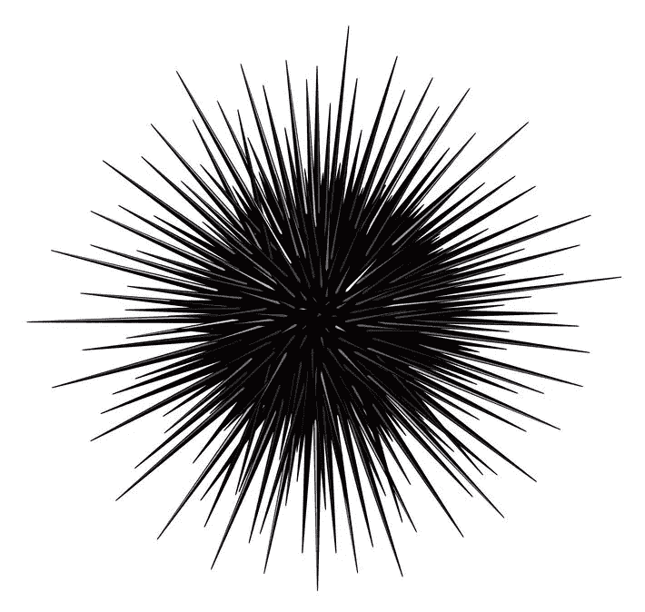
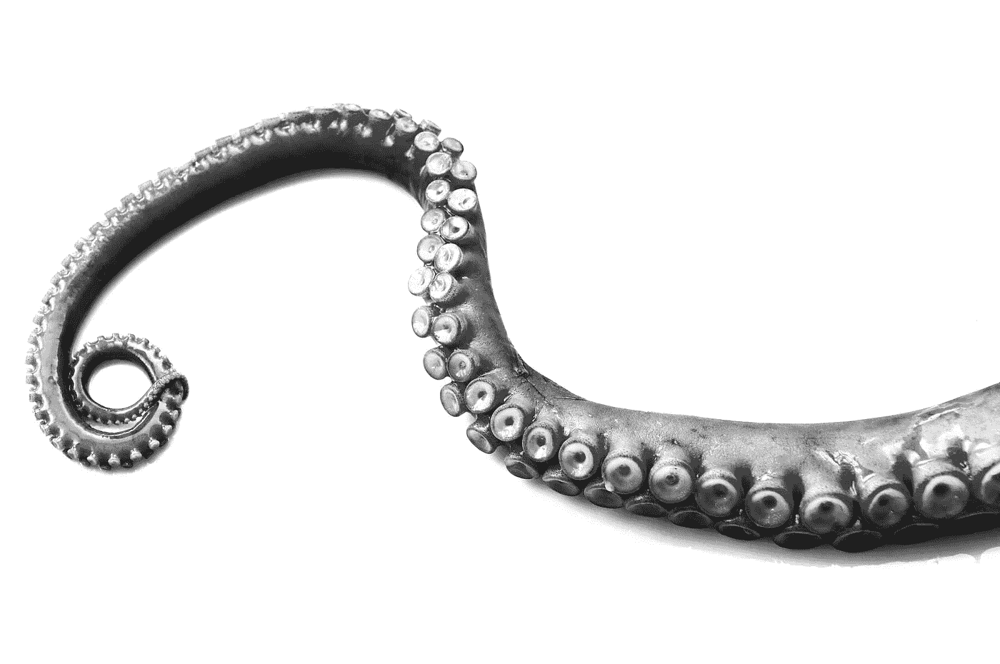
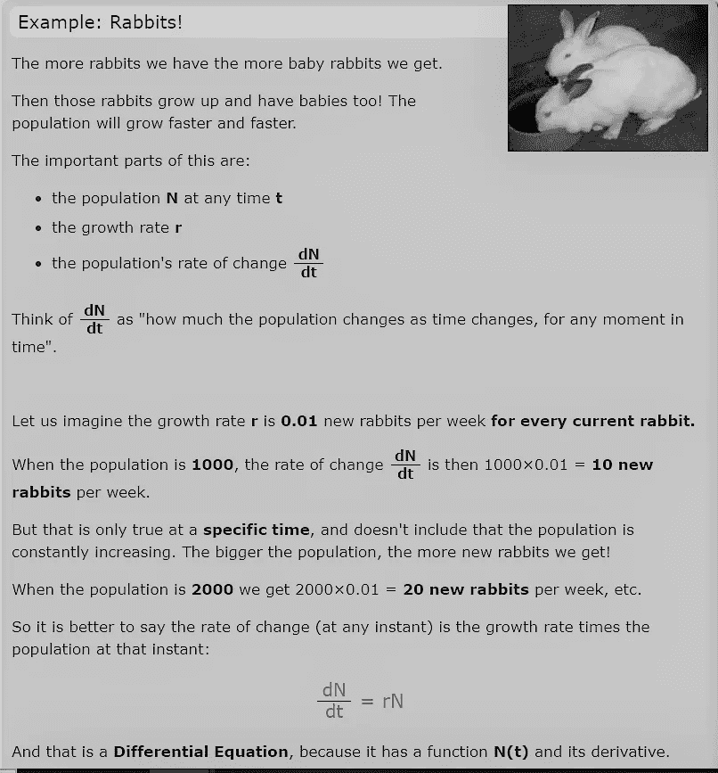
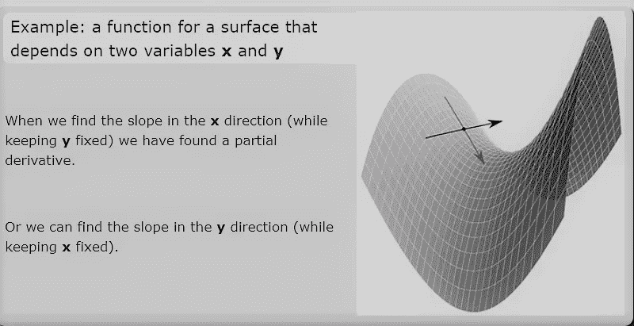
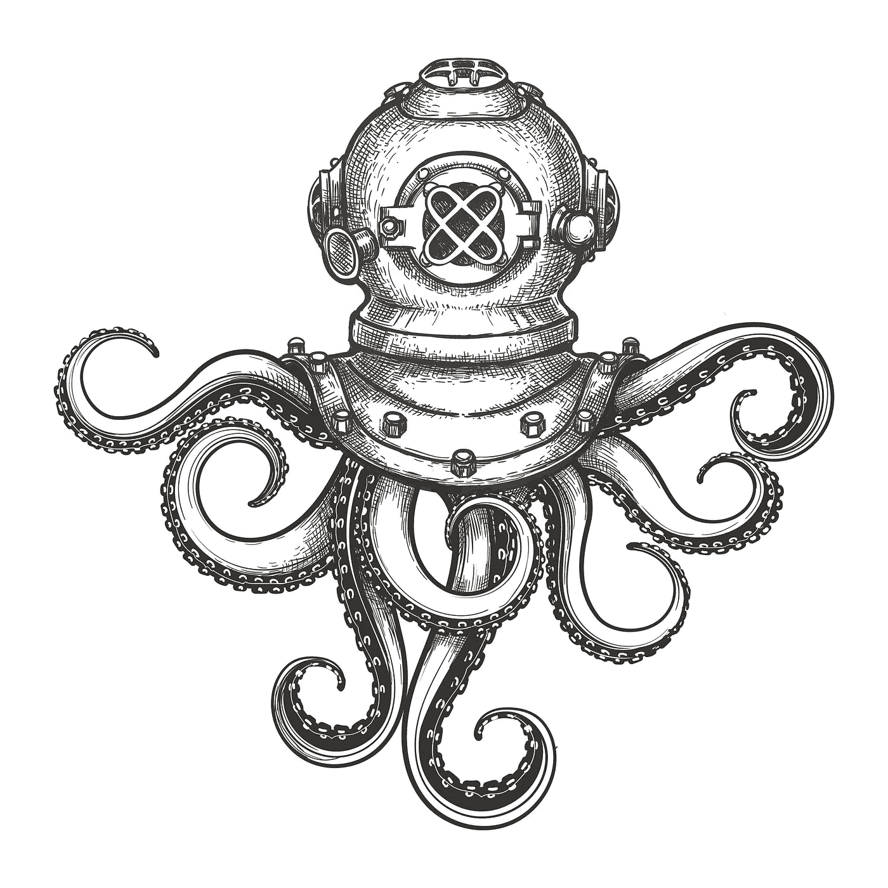
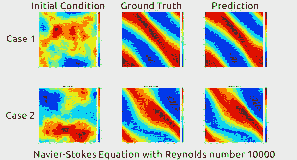
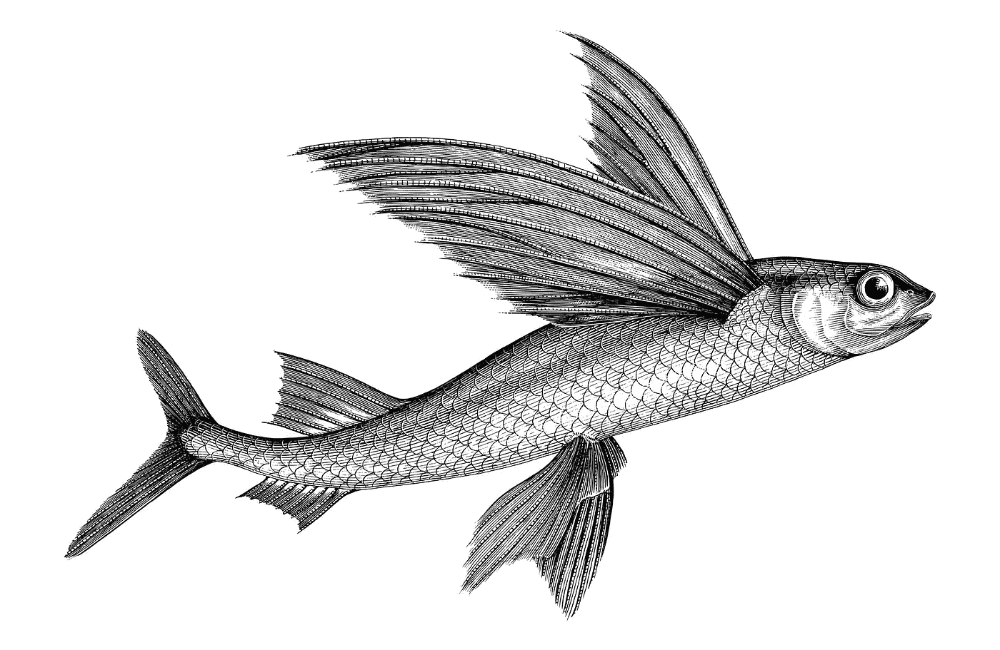
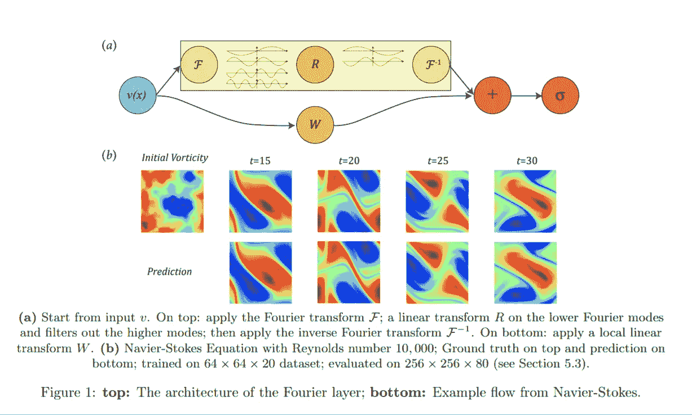

# 人工智能解开了预测我们世界的一个关键科学障碍

> 原文：<https://towardsdatascience.com/ai-has-unlocked-a-key-scientific-hurdle-in-predicting-our-world-5343b4ed136e?source=collection_archive---------33----------------------->

## 偏微分方程是现代科学的基础；他们描述了从天气和洋流到广义相对论和量子力学的物理现象

授权给作者的图像

如果你和我一样，只要一提到偏微分方程(PDEs)，就会想起布满灰尘的黑板、偏头痛和一种普遍的感觉“为什么我们要试图理解这些东西，它们永远不会在现实世界中帮助我们”。(是的我知道，不是一个伟大的态度)。

我不得不辩解说，自从在大学选修工程模块中学习了它们(讽刺的是，嘿)，我们实际上就再也没有重新认识过。至少在我看来，它们仍然是一个非常抽象的概念。

授权给作者的图像

然而，我确实设法了解到关于偏微分方程的一件事是它们很难解决；事实证明，普通科学界也同意这个观点。那么，为什么我们还在投入时间试图解决这些问题呢？

# 偏微分和它们的秘密

部分答案在于这些数学方程能够模拟空间和时间变化的非凡方式。这种独特的性质使它们特别适合描述我们在我们的世界中观察到的许多物理现象，包括声音和热量传递、[扩散、](https://en.wikipedia.org/wiki/Diffusion)、[静电学、](https://en.wikipedia.org/wiki/Electrostatics)、[电动力学、](https://en.wikipedia.org/wiki/Electromagnetism)、[流体动力学、](https://en.wikipedia.org/wiki/Fluid_dynamics)、[弹性、](https://en.wikipedia.org/wiki/Elasticity_(physics))、[广义相对论、](https://en.wikipedia.org/wiki/General_relativity)量子力学。

通过理解这些现象，并解决描述它们的偏微分方程，打开了**能够*预测的大门，在任何给定的时间点，接下来会发生什么，以及之前发生了什么。***

# 听起来熟悉吗？DEVS 科技惊悚片

这种模拟我们的世界并让人工智能“解决”数学方程的能力正是英国广播公司扣人心弦的惊悚片《DEVS》背后的故事。如果你想真正看到的艺术(即时通讯？)有可能，这是一笔值得投资的一盒一套——赊账。

> “宇宙是确定的，并且总是一个先前原因的结果”

 [## BBC 二台- DEVS，系列 1，预告片:DEVS

### 全新的多维科技惊悚片即将登陆 BBC 二台和 BBC iPlayer。

www.bbc.co.uk](https://www.bbc.co.uk/programmes/p088gvvq) 

# 真实世界中的偏微分方程

让我们回到现实，让我们探索 PDEs 的一些真实世界的应用。

一类偏微分是**纳维尔-斯托克斯方程**

一类特别有用的偏微分方程是**纳维尔-斯托克斯方程**。19 世纪初，由法国工程师[克劳德-路易·纳维尔](https://www.britannica.com/biography/Claude-Louis-Marie-Navier)和英国物理学家[乔治·加布里埃尔·斯托克斯爵士](https://www.britannica.com/biography/Sir-George-Gabriel-Stokes-1st-Baronet)独立创建的这组方程描述了运动流体的速度、压力、温度和密度之间的关系。换句话说，它们描述了流体(包括空气)的运动。

纳维尔-斯托克斯方程适用于许多现实应用:

1.  在飞机和汽车设计过程中模拟机翼和其他表面周围的空气运动。
2.  研究医学中的血流。
3.  发电站的有效设计、模拟流速和热传递。
4.  污染、天气和海洋运动的分析。
5.  和许多其他人…

# 微分和偏微分方程解释

在这一点上，它可能帮助读者(它当然帮助了作者)用简单的术语理解 PDEs。随意跳过这一节，但我发现这些例子很有帮助，如果你想看这些和其他的，读一些关于 MathsIsFun.com 的[导数](https://www.mathsisfun.com/calculus/differential-equations.html)和[偏导数](https://www.mathsisfun.com/calculus/derivatives-partial.html)的精彩解释。

先说一个微分方程。这是一个带有[函数](https://www.mathsisfun.com/sets/function.html)及其一个或多个[导数](https://www.mathsisfun.com/calculus/derivatives-introduction.html)的方程:

***y + dy/dx = 5x***

在这个例子中，函数是 **y** ，它的导数是 **dy/dx**

MathsIsFun 有助于理解 dy/dx(导数):

> “把 dN/dt 想象成人口随着时间的变化而变化，在任何时刻”

这个(琐碎的)例子有助于进一步说明这一点。

偏导数是一种导数形式，其中一个变量保持不变，如下例所示:

# 偏微分方程和人工智能

很少有人会预见到偏微分方程和现代人工智能领域之间的任何重叠。然而，数学家开始向现代人工智能寻求帮助，因为解决偏微分的核心是一个高度复杂和计算密集型的问题。

历史上，这需要强大的超级计算机来处理计算。但是，即使拥有强大的计算能力，这些“传统”的数学方法也只能产生有限的结果。

# 深度学习是如何解决这个难题的

人工智能的现代进步，特别是在深度学习领域的进步，第一次使偏微分方程的求解达到了前所未有的准确性和普遍性。加州理工学院 [Caltech](https://www.caltech.edu/about/visit/plan-your-visit) 的突破性研究使这成为可能。

加州理工学院的研究人员应用了一类使用傅立叶神经算子的神经网络，以产生一个高度优化的神经网络来解决偏微分方程。

结果是惊人的:

1.  预测未来/过去动态的精确度达到新的水平
2.  高度概括，并可应用于(无需再培训)解决许多类偏微分方程，包括纳维尔-斯托克斯
3.  比传统(数学)解算器快 1000 倍

Anima Anandkumar 教授也是英伟达的 AI 研究总监。[在推特上关注阿尼玛·阿南德库马尔](https://twitter.com/AnimaAnandkumar)。

# 预测未来(你必须从某处开始)

在这个模拟中，您可以看到他们的模型(右)**预测的流体运动如何与观察到的实际运动(中间)精确匹配。该模型从一个时间点(左)对此进行了预测。**

图片来自加州理工学院的公开推特(上图)

在上述模拟中，使用了 10，000 的(挑战性)**雷诺数**。雷诺数是流体的惯性力与粘性力之比，超过 4000 的数字通常被描述为“湍流”，其中液体分子执行不可预测的运动。因此，10，000 解释了模拟中看到的看似随机的运动(摘自这篇[论文](https://www.jstor.org/stable/26203405?seq=1#metadata_info_tab_contents))。

# 他们是怎么做到的？

> 神经网络的经典发展主要集中在学习有限维欧几里得空间之间的映射。最近，这已经推广到学习函数空间之间映射的神经算子。对于偏微分方程(PDEs)，神经算子直接学习从任何函数参数依赖到解的映射。因此，他们学习了整个偏微分方程族，而传统方法只能解决方程的一个实例。”

这段摘录摘自[加州理工学院于 2020 年 10 月 20 日发布的](https://arxiv.org/pdf/2010.08895.pdf)研究论文。

**卷积神经网络** 在论文中，他们首先讨论了使用深度**卷积神经网络**(CNN)的传统人工智能方法的局限性。这些模型依赖于有限维欧几里得空间，并且需要根据 PDE 和被分析的场景进行大量的调整和修改。

**FEM-神经网络** 他们继续讨论一种改进的，但仍然是次优的方法，使用基于神经网络的**有限元** **方法** ( **FEM** )。这种方法旨在模拟 PDE 的一个特定实例，因此比 CNN 更通用，减少了调整和修改的需要。它也产生了更准确的预测。然而，当问题集中的系数改变时，它需要重新训练，并且基本的偏微分方程必须是已知的。

**神经算子** 2019 年末推出，这些使得神经网络能够拥有无限维算子。神经操作者只需要训练一次，这比以前的方法有明显的优势。获得参数的新实例的解只需要网络的正向传递，减轻了神经-FEM 方法中引起的主要计算问题。最后，神经算子不需要底层 PDE 的知识，只需要数据。

然而，这并不是研究人员希望的银弹:

> 到目前为止，由于评估积分算子的成本，神经算子还没有产生可以在有限维设置中与卷积或递归神经网络的成功相媲美的有效数值算法。通过快速傅立叶变换，我们的工作缓解了这个问题。”
> **加州理工学院的研究人员，加州理工学院**

**傅立叶变换** 傅立叶变换常用于求解微分方程的谱方法中，因为微分相当于傅立叶域中的乘法。

> 我们在这些[研究]工作的基础上，提出了一种直接在傅立叶空间定义的神经算子体系结构，具有准线性时间复杂度和最先进的近似能力。
> **加州理工学院的研究人员**

授权给作者的图像

加州理工学院的神经网络使用了一种新颖的深度学习架构，该架构利用了这些傅立叶变换算子。网络的惊人性能部分源于它能够学习无限维函数空间之间的映射；如图 1 (a)所示，积分算子通过傅立叶域中的线性变换来例示。

图 1(图片来自加州理工学院公共[研究论文](https://arxiv.org/pdf/2010.08895.pdf)

# 结论

这是一个突破性的飞跃。我可以看到它在伦理领域的积极影响，如模拟气候变化和洋流，以帮助海洋生物学和保护。预测空气动力学，例如在飞机、汽车和卡车上，可以提高效率，并帮助我们从燃烧转向电力作为我们的动力选择。

# 后续步骤

1.阅读[加州理工学院的研究论文](https://arxiv.org/pdf/2010.08895.pdf)

2.了解更多关于[安科瑞斯数据，分析&人工智能](https://www.ancoris.com/solutions/data_analytics_ai)

3.与[作者](https://www.linkedin.com/in/google-cloud-platform/)联系