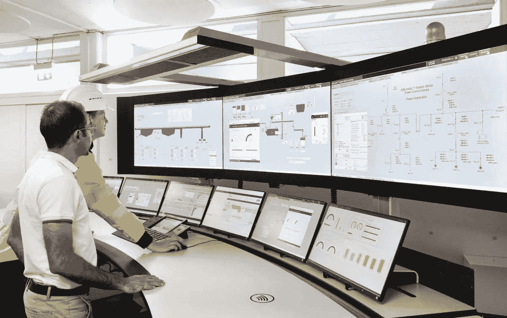
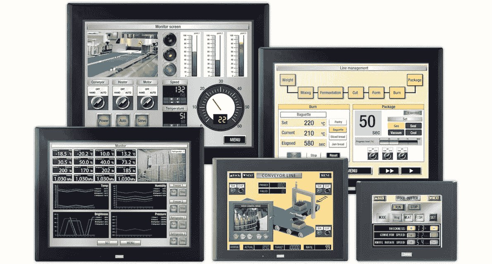
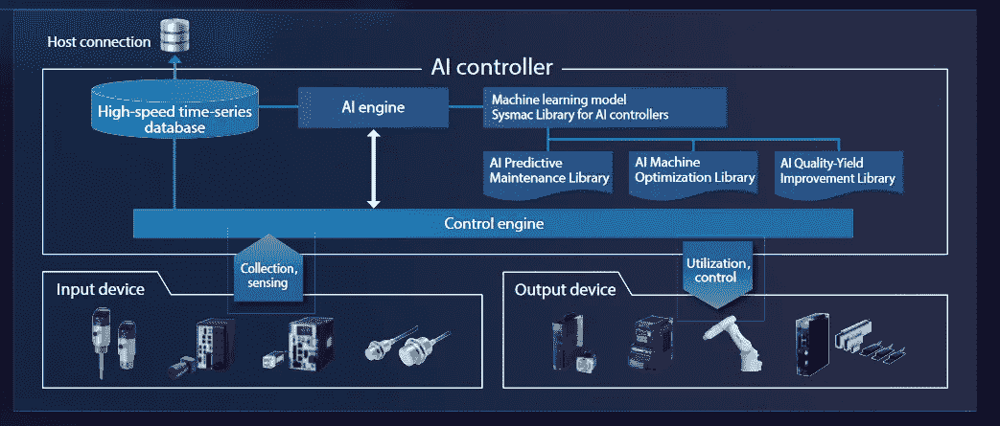

# 人工智能和人机界面:新的商业模式

> 原文：<https://towardsdatascience.com/ai-human-machine-interface-new-business-models-c0611749c8a5?source=collection_archive---------27----------------------->

## 人机界面和人工智能的重要性

[来源](https://www.zkg.de/en/artikel/zkg_ABB_reinvents_process_control_with_new_generation_human-machine_interfaces_3458683.html)

在与一家自动化和电子产品制造商合作实施用于人机界面的智能传感器和人工智能平台后，我意识到这个行业如何从产品过渡到服务…

**的确，机器学习的日益成熟正在影响工业 4.0 的发展，也为某些公司创造了新的商业模式。**事实上，制造企业在工业协议、专有设备/系统的庞大安装基础和陈旧的用户界面方面已经有了数十年的投资。基于这些要素:在这样一个碎片化的环境中，你如何在全球范围内推动创新、灵活性和增长？

# 什么是人机界面？

> **HMI 是关于人和自动化系统如何相互交流和沟通的。**

人机界面是机器和操作人员之间的中介。毫无疑问，HMI 是操作员和经理手中监视车间或工厂生产的最重要的工具。

人机界面早已不再局限于工业中的传统机器，现在还涉及到计算机、数字系统或物联网(IoT)设备。

从操作的角度来看，机器操作员必须能够一眼看到其责任范围内的条件和过程。机器背后发生了什么？发动机和阀门状态是否在设定值内？储罐液位是否足以进行不间断生产？

> HMI 最重要的任务是快速简洁地显示复杂的过程变量，以便于解释生产信息。

构建一个好的人机界面并不容易，因为构建人机界面的基础很大程度上取决于对人类身体、行为和精神能力的理解。**换句话说，人机工程学构成了人机界面背后的原则。**

好的人机界面设计必须让用户理解系统的行为，这反过来又必须让他们看起来可信。软因素，如系统自我解释(可解释的人工智能)不仅在提高交互质量方面发挥着重要作用，还允许机器模仿鼓励接受和使用的情感行为。

## 为什么 HMI 很重要

人机界面也从控制室的按钮和二极管，通过网络可视化，变成了认知解决方案。

在现实中，一台机器或一台设备只能和它与人类的界面一样好。这就是为什么对优化设计的人机界面的每一项投资都是战略性的。数据可视化和文本表示可以使操作员和经理精确地协调和控制工厂的生产过程，但我们可以通过机器学习做更多的事情。

# 新的人工智能商业模式

传统的 HMI 解决方案是由 OEM(原始设备制造商)作为机器的一部分部署的独立、隔离的终端。**基于机器学习的新 HMI 解决方案要么是预先配置好的向云端发送数据，要么是内部部署的解决方案。**

如今，状态是通过一个贴有标签的 led 信号灯、发光按钮和显示面板以及屏幕上的计算机支持的用户界面来显示的。**除了人机界面，我相信开关、LED 指示灯、操纵杆和开关面板制造商将不得不通过使用智能传感器连接到他们自己创造的人工智能人机界面，使他们的产品更加智能……**物联网传感器正在实现商业模式的根本转变:从产品到服务的转变。

除了与 B2B 公司合作，通过更好地利用物联网传感器和为 HMI 或 HMI 产品(如 LED 灯或开关按钮)创建新的应用程序，与 B2C 公司合作将变得更加容易。然而，从物联网传感器收集的数据只有在您可以从中获取有用的情报时才是有用的，并且最好是以自动化的方式…

这种新的转变将鼓励公司从创建 HMI 解决方案过渡到建立传感器网络和管理机器学习项目。

事实上，如今的物联网传感器解决方案大多只负责数据采集。当我们在机器学习方面将传感器与人工智能融合时，这就创造了一个可以出售给其他组织的预测工具。通过物联网传感器，我们可以测量和收集与机器的运动、温度或振动相关的数据。一旦收集了数据，我们需要应用机器学习技术对其进行分类和分析。可用的机器学习选项很多，从逻辑回归到神经网络。

为了理解这些技术如何协同工作，想象一个广泛分布的物联网传感器阵列在整个制造工厂收集数据，并将其快速传输回中央神经系统。

我们还可以想象，通过这些元素生成的数据将通过模块系统集成到独立的预测性维护系统中，或出售给其他公司，以帮助他们创造更好的产品。

例如，交通灯制造商可以制造一种新产品(基于新的 LED，配备智能传感器)，当车辆驶过路面的感应回路时，这种产品可以自行改变颜色。

[来源](https://www.arcweb.com/blog/detecting-anomalies-embedded-ai-technology)

我希望看到原始设备制造商(OEM)和行业之间建立更多的技术合作关系。原始设备制造商必须为他们的产品创造新的附加值，并最终帮助他们的客户创新。我预测原始设备制造商将不再仅仅是供应商，而是更多的创新伙伴。

# 新型人机界面

**我们正处于从高度复杂的方法向更加直观的界面进化的早期阶段。**

随着面部识别功能等“新”技术成为移动设备的标准，HMI 现代化的必要性正处于其生命周期的开始。我意识到，语音控制是最受欢迎的人机界面之一，因为它允许免提控制，因此更少分心。

**人机界面的未来将与人工智能有关。**随着时间的推移，这些系统自然会产生大量数据。事实上，公司将期待配备一些机器学习算法的 HMI，这些算法可以从物联网传感器生成的所有数据中学习，并适应操作员的持续行为。此外，该系统必须足够有效，以便从先前已经进行的计算中学习，从而生成可靠的、可重复的决策和结果，这些决策和结果在所连接设备的活跃计算和操作中是可接受的。

在我个人看来，这是代工企业商业模式的一个大转变。显然，将会有一些赢家，也将会有那些不太正确和半途而废的人。