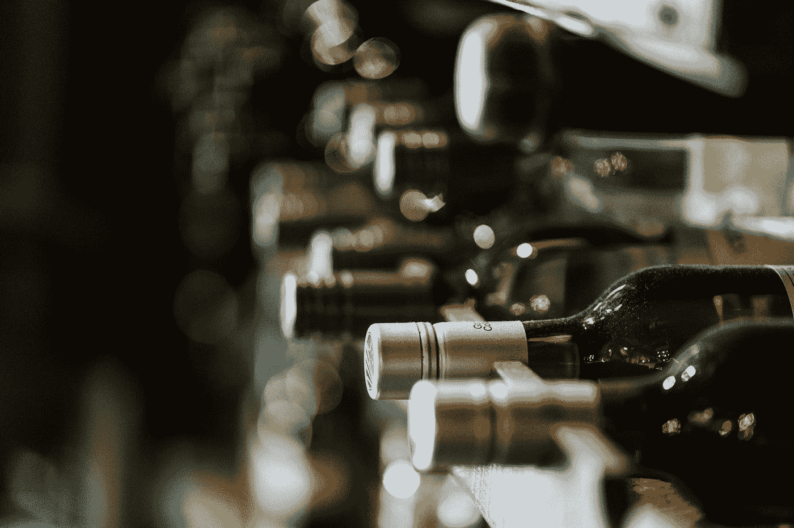
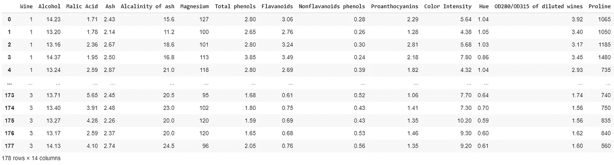
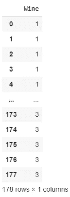

# 人工智能 5 行代码:葡萄酒分类

> 原文：<https://towardsdatascience.com/ai-in-5-lines-of-code-wine-classification-5782c7f8afe7?source=collection_archive---------72----------------------->

## 实用人工智能

## 准确率高达 98%的葡萄酒分类人工智能

谁说人工智能必须复杂才能构建？在本文中，我将使用机器学习创建一个能够在短短 5 行代码中区分不同种类葡萄酒的人工智能。然后我会解释每行代码的含义。

[**我的知识库里有全部代码。**](https://github.com/arditoibryan/Projects/tree/master/20200528_Wine_Classifier)



照片由[赫尔墨斯·里维拉](https://unsplash.com/@hermez777?utm_source=medium&utm_medium=referral)在 [Unsplash](https://unsplash.com/?utm_source=medium&utm_medium=referral) 上拍摄

# 葡萄酒生化数据

我将使用包含三种不同品种葡萄酒的生化数据的数据集。人工智能将从数据中学习如何区分不同的品种。

* * *不幸的是，让大家失望的是，葡萄酒的名字不见了。在数据集中，它们被标记为 1、2 和 3

# 导入模块

我要做的第一件事是从一组预先制作的算法中导入模块。它们将允许我在制造我的人工智能时使用特定的工具(这些代码行不算，因为它们本身不构建任何东西)

```
import pandas as pd
from sklearn.model_selection import train_test_split
from sklearn.ensemble import RandomForestClassifier
from sklearn.model_selection import cross_val_score
```

# 我的整个人工智能

就是这个！通过运行这些代码行，人工智能可以学习如何区分不同种类的葡萄酒。

```
X = pd.read_csv('/content/drive/My Drive/Colab Notebooks/Projects/20200528_Wine_Classifier/wine_data.csv')
y = pd.DataFrame(X.pop('Wine'))
clf = RandomForestClassifier(n_estimators=10)
scores = cross_val_score(clf, X, y, cv=10)
acc = ("Accuracy: %0.2f (+/- %0.2f)" % (scores.mean(), scores.std() * 2))
print(acc, scores)
```

让我解释一下所有这些代码行是如何工作的。

# 导入数据集

正如你以前可能听说过的，为了表现良好，人工智能需要数据。我将使用从 data.world. 下载的不同葡萄酒的生化数据

```
X = pd.read_csv('/content/drive/My Drive/Colab Notebooks/Projects/20200528_Wine_Classifier/wine_data.csv')
```



的示例。我们刚刚下载的 csv 数据集

正如您所看到的，这个数据集包含第一列酒的种类，在所有其他列中是它们的生化数据。我们用来预测葡萄酒种类的所有数据被称为**特征**。

# 隔离标签

我现在将把预测数据(生化数据，**特性**)和我们想要预测的数据(酒列)分开，我们把这个数据**标签**。



标签列的示例

# 创建模型

现在我需要选择我想要建立哪种人工智能。有几种人工智能，每一种专门解决一个不同的问题。在这种特殊情况下，我将使用随机森林分类器，这是一种可以在分类问题上表现良好的机器学习算法。

```
clf = RandomForestClassifier(n_estimators=10)
```

对于这个模型，我也将选择它的参数:10 作为估计器的数量(如果你不了解人工智能算法的细节，这是你无法理解的)

# 训练人工智能

```
scores = cross_val_score(clf, X, y, cv=10)
```

为了获得可靠的准确度分数，我将使用一种叫做交叉验证的工具。本质上，我将把我的数据集分成训练和测试数据。我将使用训练数据集来指导人工智能如何找到标签和要素之间的联系。在学习如何找到这个链接之后，AI 将估计测试特征，我们将把结果与测试标签进行比较。通过交叉验证，数据集将被拆分 10 次，每次测试和训练将包含不同批次的数据。

这样做，算法将被多次测试，如果不同时间之间的分数相差太大，结果将很可能有偏差。

# 估计准确度

该算法已经运行了 10 次。每次我们都达到了几乎 100%的准确率。分数从 94%到 100%不等，平均 98%，成绩惊艳。

```
Accuracy: 0.98 (+/- 0.05) 
[0.94
1.00         
1.00         
0.94
1.00        
1.00  
1.00         
0.94
1.00        
1.00]
```